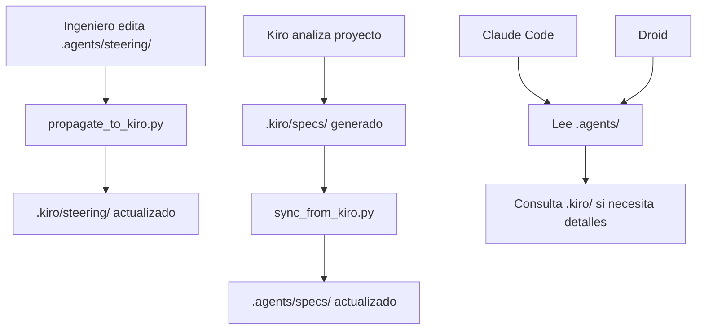

# Análisis de Integridad: Ecosistema de Documentación

**Fecha:** 2026-01-09  
**Objetivo:** Confirmar que `.agents/` es la fuente principal de información y coordinación

---

## 🎯 Conclusión Ejecutiva

**✅ CONFIRMADO: `.agents/` ES la fuente principal de coordinación para agentes AI**

Sin embargo, la arquitectura actual tiene **inconsistencias** que deben corregirse:

1. ❌ **Contradicción en flujo de sincronización**: Los scripts dicen que `.kiro/` es fuente de verdad, pero la documentación dice que `.agents/` es editable
2. ❌ **Dirección de sincronización confusa**: `sync_from_kiro.py` sugiere que `.kiro/` → `.agents/`, pero `.agents/` debería ser la fuente
3. ✅ **Propósito claro**: `.agents/` para agentes AI, `.kiro/` para análisis técnico de Kiro
4. ⚠️ **Falta claridad**: `.claude/` y `.factory/` apuntan a `.agents/`, pero no hay coordinación central

---

## 📊 Análisis por Directorio

### 1. `.agents/` - **FUENTE PRINCIPAL DE COORDINACIÓN** ✅

**Propósito declarado:**
- Reglas operativas para agentes AI
- Arquitectura agnóstica a herramientas
- Coordinación central para Claude Code, Droid, y otros agentes

**Contenido:**
```
.agents/
├── specs/              ← Arquitectura concisa (100-200 líneas)
├── steering/           ← REGLAS OBLIGATORIAS para agentes
├── hooks/              ← Scripts de sincronización
├── workflows/          ← Procedimientos multi-paso
└── [12 archivos .md]   ← Documentación de estrategia
```

**Archivos clave:**
- `GUIA_COMPLETA.md` - Manual completo del sistema
- `ESTRATEGIA_FINAL.md` - Estrategia de 3 niveles
- `PLAN_COEXISTENCIA.md` - Plan de coexistencia .kiro/ ↔ .agents/
- `README.md` - Punto de entrada

**Estado:** ✅ **COMPLETO Y FUNCIONAL**

**Rol confirmado:**
- ✅ Fuente de verdad para **reglas de agentes AI**
- ✅ Coordinación central entre herramientas
- ✅ Arquitectura agnóstica

---

### 2. `.kiro/` - **ANÁLISIS TÉCNICO DE KIRO** 📚

**Propósito declarado:**
- Documentación técnica profunda generada por Kiro
- Análisis completo con código real (600+ líneas por archivo)
- Referencia para ingenieros humanos

**Contenido:**
```
.kiro/
├── specs/
│   ├── requirements.md         ← Especificación de requerimientos
│   ├── design.md               ← Documento de diseño
│   ├── tasks.md                ← Plan de implementación
│   ├── 01-proyecto-overview.md
│   ├── 02-backend-scraper.md
│   ├── 03-frontend-chatbot.md
│   ├── 04-integracion.md
│   ├── 05-data-pipeline.md
│   └── 06-llm-integration.md
├── steering/
│   ├── python-patterns.md
│   ├── typescript-patterns.md
│   ├── error-handling.md
│   ├── performance-optimization.md
│   └── testing-patterns.md
└── hooks/
    ├── data-validation.md
    ├── deployment.md
    └── test-validation.md
```

**Estado:** ✅ **COMPLETO Y DETALLADO**

**Rol confirmado:**
- ✅ Documentación técnica de referencia
- ✅ Análisis profundo para ingenieros
- ⚠️ **PROBLEMA**: Scripts sugieren que es "fuente de verdad" pero debería ser "referencia técnica"

---

### 3. `.claude/` - **CONFIGURACIÓN CLAUDE CODE** 🤖

**Propósito:**
- Instrucciones específicas para Claude Code
- Apunta a `.agents/` como fuente principal

**Contenido:**
```
.claude/
├── CLAUDE.md              ← Instrucciones para Claude
└── settings.local.json    ← Configuración local
```

**Instrucciones clave en CLAUDE.md:**
```markdown
## Antes de Empezar a Trabajar

1. LEER: `.agents/specs/` para entender arquitectura
2. RESPETAR: `.agents/steering/` como reglas OBLIGATORIAS
3. CONSULTAR: `.kiro/specs/` solo si necesitas detalles
```

**Estado:** ✅ **CORRECTO - Apunta a `.agents/` como fuente principal**

**Rol confirmado:**
- ✅ Configuración específica para Claude Code
- ✅ Referencia correcta a `.agents/` como fuente
- ✅ Usa `.kiro/` solo como referencia técnica

---

### 4. `.factory/` - **CONFIGURACIÓN DROID** 🏭

**Propósito:**
- Configuración para Droid (Factory)
- Especialistas en testing y code review

**Contenido:**
```
.factory/
└── droids/
    └── unit-test-and-code-review-specialist.md
```

**Estado:** ⚠️ **INCOMPLETO - Falta configuración que apunte a `.agents/`**

**Problema:**
- ❌ No hay `config.yml` que apunte a `.agents/`
- ❌ El droid no tiene instrucciones de leer `.agents/` primero
- ❌ Falta coordinación con `.agents/`

**Recomendación:**
Crear `.factory/config.yml` que apunte a `.agents/`:

```yaml
agents_context:
  read_first:
    - .agents/specs/
    - .agents/steering/
  reference_for_details:
    - .kiro/specs/
  hard_constraints:
    - .agents/steering/python-patterns.md
    - .agents/steering/typescript-patterns.md
```

---

## 🔄 Análisis de Flujo de Sincronización

### Flujo Actual (según scripts)

```
.kiro/ (fuente de verdad técnica)
  ↓ sync_from_kiro.py
.agents/ (auto-generado)
  ↓ propagate_to_kiro.py
.kiro/ (actualizado con reglas de agentes)
```

### Problema Identificado

**❌ CONTRADICCIÓN:**

1. **Documentación dice:**
   - `.agents/steering/` es EDITABLE
   - `.agents/` es fuente de verdad para reglas de agentes
   - `.kiro/` es READ-ONLY (solo Kiro lo genera)

2. **Scripts dicen:**
   - `sync_from_kiro.py` copia `.kiro/` → `.agents/`
   - `.agents/specs/` son "referencias" auto-generadas
   - `.kiro/` es la "fuente de verdad"

### Flujo Correcto (según arquitectura declarada)

```
.agents/ (fuente de verdad para REGLAS de agentes)
  ↓ edición manual
.agents/steering/ (reglas actualizadas)
  ↓ propagate_to_kiro.py
.kiro/steering/ (actualizado con sección "Agent AI Requirements")

.kiro/ (fuente de verdad para ANÁLISIS TÉCNICO)
  ↓ generado por Kiro
.kiro/specs/ (análisis completo)
  ↓ sync_from_kiro.py (solo para crear referencias)
.agents/specs/ (referencias concisas)
```

---

## 🎯 Arquitectura Correcta (Propuesta)

### Fuentes de Verdad Clarificadas

| Carpeta | Fuente de verdad de... | Editado por | Sincronización |
|---------|------------------------|-------------|----------------|
| `.agents/steering/` | **Reglas para agentes AI** | Humano | → `.kiro/steering/` |
| `.agents/specs/` | Referencias concisas | Auto-generado | ← `.kiro/specs/` |
| `.kiro/specs/` | **Análisis técnico completo** | Kiro | → `.agents/specs/` |
| `.kiro/steering/` | Patrones técnicos + reglas de agentes | Kiro + propagación | ← `.agents/steering/` |

### Flujo de Trabajo Correcto



---

## ✅ Confirmación de Roles

### `.agents/` - **COORDINADOR CENTRAL** ✅

**Responsabilidades:**
1. ✅ Definir reglas obligatorias para agentes AI
2. ✅ Proporcionar arquitectura concisa
3. ✅ Coordinar entre herramientas (Claude, Droid, etc.)
4. ✅ Mantener workflows y procedimientos

**Fuente de verdad para:**
- ✅ Reglas de agentes (`.agents/steering/`)
- ✅ Workflows (`.agents/workflows/`)
- ✅ Hooks de automatización (`.agents/hooks/`)

**NO es fuente de verdad para:**
- ❌ Análisis técnico (eso es `.kiro/specs/`)
- ❌ Arquitectura detallada (eso es `.kiro/specs/`)

### `.kiro/` - **REFERENCIA TÉCNICA** 📚

**Responsabilidades:**
1. ✅ Proporcionar análisis técnico profundo
2. ✅ Documentar patrones con código real
3. ✅ Servir como referencia para ingenieros
4. ✅ Mantener plan de implementación

**Fuente de verdad para:**
- ✅ Análisis técnico (`.kiro/specs/`)
- ✅ Patrones técnicos base (`.kiro/steering/`)
- ✅ Plan de implementación (`.kiro/specs/tasks.md`)

**NO es fuente de verdad para:**
- ❌ Reglas específicas de agentes (eso es `.agents/steering/`)

### `.claude/` - **CONFIGURACIÓN ESPECÍFICA** 🤖

**Responsabilidades:**
1. ✅ Configurar Claude Code para usar `.agents/`
2. ✅ Proporcionar instrucciones específicas
3. ✅ Apuntar a fuentes correctas

**Estado:** ✅ **CORRECTO**

### `.factory/` - **CONFIGURACIÓN ESPECÍFICA** 🏭

**Responsabilidades:**
1. ⚠️ Configurar Droid para usar `.agents/`
2. ⚠️ Proporcionar instrucciones específicas
3. ⚠️ Apuntar a fuentes correctas

**Estado:** ❌ **INCOMPLETO - Falta configuración**

---

## 🔧 Correcciones Necesarias

### 1. Clarificar scripts de sincronización

**Problema:** `sync_from_kiro.py` dice que `.kiro/` es "fuente de verdad"

**Solución:** Actualizar comentarios y mensajes:

```python
# ANTES:
"""
Sincroniza .kiro/ → .agents/

Genera .agents/specs/ como referencias a la documentación técnica completa.
"""

# DESPUÉS:
"""
Sincroniza .kiro/specs/ → .agents/specs/

Genera .agents/specs/ como REFERENCIAS CONCISAS al análisis técnico de .kiro/.
.kiro/ es fuente de verdad para ANÁLISIS TÉCNICO.
.agents/ es fuente de verdad para REGLAS DE AGENTES.
"""
```

### 2. Crear configuración para Droid

**Crear:** `.factory/config.yml`

```yaml
# Configuración Droid - SIBOM Scraper Assistant

agents_context:
  # Leer PRIMERO (reglas obligatorias)
  read_first:
    - .agents/specs/
    - .agents/steering/

  # Consultar para detalles técnicos
  reference_for_details:
    - .kiro/specs/

  # Restricciones DURAS (no negociables)
  hard_constraints:
    - .agents/steering/python-patterns.md
    - .agents/steering/typescript-patterns.md
    - .agents/steering/error-handling.md
    - .agents/steering/testing-patterns.md

# Especialistas disponibles
droids:
  - unit-test-and-code-review-specialist
```

### 3. Actualizar README.md de `.agents/`

**Agregar sección:**

```markdown
## Fuentes de Verdad

### `.agents/` es fuente de verdad para:
- ✅ Reglas obligatorias para agentes AI (`.agents/steering/`)
- ✅ Workflows y procedimientos (`.agents/workflows/`)
- ✅ Hooks de automatización (`.agents/hooks/`)

### `.kiro/` es fuente de verdad para:
- ✅ Análisis técnico profundo (`.kiro/specs/`)
- ✅ Patrones técnicos base (`.kiro/steering/`)
- ✅ Plan de implementación (`.kiro/specs/tasks.md`)

### Sincronización:
- `.agents/steering/` → `.kiro/steering/` (propagación de reglas)
- `.kiro/specs/` → `.agents/specs/` (referencias concisas)
```

---

## 📋 Checklist de Integridad

### Estructura ✅

- [x] `.agents/` existe y está completo
- [x] `.kiro/` existe y está completo
- [x] `.claude/` existe y apunta a `.agents/`
- [x] `.factory/` existe pero falta configuración

### Documentación ✅

- [x] `.agents/GUIA_COMPLETA.md` existe
- [x] `.agents/ESTRATEGIA_FINAL.md` existe
- [x] `.agents/PLAN_COEXISTENCIA.md` existe
- [x] `.agents/README.md` existe
- [x] `.claude/CLAUDE.md` existe

### Scripts ⚠️

- [x] `sync_from_kiro.py` existe
- [x] `propagate_to_kiro.py` existe
- [x] `sync_all.py` existe
- [ ] Scripts tienen comentarios claros sobre fuentes de verdad

### Configuración ⚠️

- [x] `.claude/CLAUDE.md` apunta a `.agents/`
- [ ] `.factory/config.yml` falta (debe crearse)
- [ ] Droid configurado para leer `.agents/` primero

---

## 🎯 Conclusión Final

### ✅ CONFIRMADO:

**`.agents/` ES la fuente principal de coordinación para agentes AI**

**Evidencia:**
1. ✅ `.claude/CLAUDE.md` instruye a Claude Code a leer `.agents/` primero
2. ✅ `.agents/GUIA_COMPLETA.md` establece `.agents/` como coordinador central
3. ✅ `.agents/steering/` contiene reglas editables para agentes
4. ✅ `.agents/` tiene documentación completa de estrategia

### ⚠️ CORRECCIONES NECESARIAS:

1. **Clarificar scripts**: Actualizar comentarios para reflejar que `.agents/` es fuente de verdad para REGLAS
2. **Configurar Droid**: Crear `.factory/config.yml` que apunte a `.agents/`
3. **Actualizar README**: Clarificar qué es fuente de verdad de qué

### 📊 Arquitectura Correcta:

```
.agents/ (COORDINADOR CENTRAL)
  ├── steering/     ← Fuente de verdad para REGLAS de agentes
  ├── specs/        ← Referencias concisas (auto-generado)
  ├── hooks/        ← Scripts de sincronización
  └── workflows/    ← Procedimientos

.kiro/ (REFERENCIA TÉCNICA)
  ├── specs/        ← Fuente de verdad para ANÁLISIS TÉCNICO
  └── steering/     ← Patrones técnicos + reglas propagadas

.claude/ (CONFIGURACIÓN)
  └── CLAUDE.md     ← Apunta a .agents/ ✅

.factory/ (CONFIGURACIÓN)
  └── config.yml    ← Debe apuntar a .agents/ ⚠️
```

---

**Fecha de análisis:** 2026-01-09  
**Estado:** Arquitectura confirmada con correcciones menores necesarias  
**Próximos pasos:** Implementar correcciones listadas arriba
