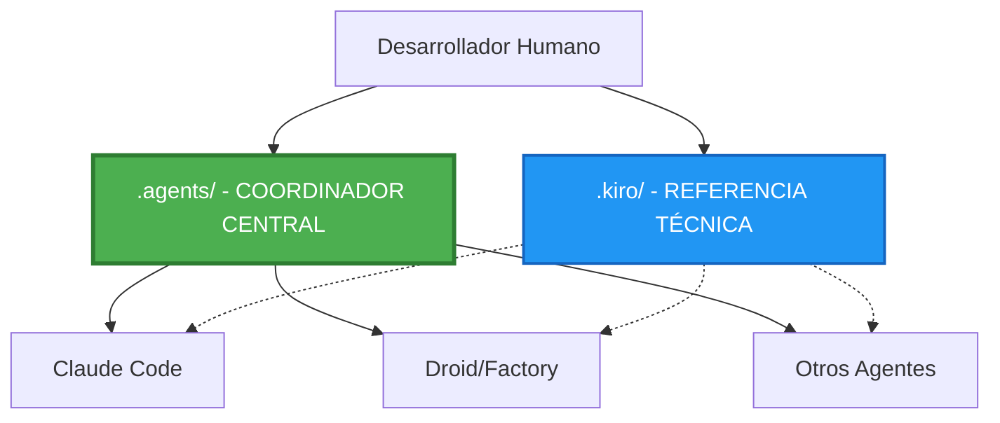

# Coordinación Central - Ecosistema de Agentes AI

**Fecha:** 2026-01-09  
**Propósito:** Documento maestro de coordinación entre herramientas

---

## 🎯 Resumen Ejecutivo

**`.agents/` ES la fuente principal de coordinación para todos los agentes AI en este proyecto.**

Este documento establece cómo diferentes herramientas (Claude Code, Droid, otros agentes) deben coordinarse usando `.agents/` como punto central.

---

## 📊 Arquitectura de Coordinación



### Leyenda:
- **Línea sólida (→)**: Lectura obligatoria primero
- **Línea punteada (-.->)**: Consulta opcional para detalles
- **Verde**: Coordinador central (`.agents/`)
- **Azul**: Referencia técnica (`.kiro/`)

---

## 🔑 Fuentes de Verdad Definitivas

| Aspecto | Fuente de Verdad | Editado por | Sincronización |
|---------|------------------|-------------|----------------|
| **Reglas para agentes AI** | `.agents/steering/` | Humano | → `.kiro/steering/` |
| **Workflows de agentes** | `.agents/workflows/` | Humano | - |
| **Hooks de automatización** | `.agents/hooks/` | Humano | - |
| **Análisis técnico** | `.kiro/specs/` | Kiro | → `.agents/specs/` |
| **Patrones técnicos base** | `.kiro/steering/` | Kiro | ← `.agents/steering/` |
| **Plan de implementación** | `.kiro/specs/tasks.md` | Kiro | - |

---

## 🤖 Configuración por Herramienta

### 1. Claude Code

**Archivo de configuración:** `.claude/CLAUDE.md`

**Flujo de trabajo:**
```
1. LEER: .agents/specs/ (arquitectura concisa)
   ↓
2. RESPETAR: .agents/steering/ (reglas obligatorias)
   ↓
3. CONSULTAR: .kiro/specs/ (solo si necesita detalles)
   ↓
4. IMPLEMENTAR: Siguiendo patrones establecidos
```

**Reglas críticas:**
- ✅ SIEMPRE leer `.agents/specs/` antes de modificar código
- ✅ SIEMPRE seguir patrones en `.agents/steering/`
- ✅ NUNCA ignorar reglas obligatorias
- ✅ CONSULTAR `.kiro/` solo para detalles técnicos profundos

**Estado:** ✅ Configurado correctamente

---

### 2. Droid (Factory)

**Archivo de configuración:** `.factory/config.yml`

**Flujo de trabajo:**
```
1. LEER: .agents/specs/ + .agents/steering/
   ↓
2. APLICAR: Restricciones duras (hard_constraints)
   ↓
3. CONSULTAR: .kiro/specs/ (si necesita detalles)
   ↓
4. EJECUTAR: Especialistas (testing, code review)
```

**Restricciones duras:**
- `.agents/steering/python-patterns.md`
- `.agents/steering/typescript-patterns.md`
- `.agents/steering/error-handling.md`
- `.agents/steering/testing-patterns.md`
- `.agents/steering/performance-optimization.md`

**Estado:** ✅ Configurado correctamente

---

### 3. Otros Agentes (Futuro)

**Patrón estándar para nuevas herramientas:**

```yaml
# Configuración genérica para cualquier agente
agent_config:
  # Paso 1: Leer contexto principal
  read_first:
    - .agents/specs/
    - .agents/steering/
  
  # Paso 2: Aplicar restricciones
  hard_constraints:
    - .agents/steering/*.md
  
  # Paso 3: Consultar detalles (opcional)
  reference:
    - .kiro/specs/
  
  # Paso 4: Ejecutar workflow
  workflow:
    before_action: "Verificar reglas en .agents/steering/"
    after_action: "Validar contra patrones establecidos"
```

---

## 🔄 Flujos de Sincronización

### Flujo 1: Kiro analiza → Actualizar .agents/

```bash
# 1. Kiro genera análisis técnico
kiro analyze ./

# 2. Sincronizar referencias a .agents/
python .agents/hooks/sync_from_kiro.py

# Resultado:
# - .kiro/specs/ → .agents/specs/ (referencias concisas)
# - .kiro/steering/ → .agents/steering/ (base editable)
```

**Frecuencia:** Después de cada análisis de Kiro

---

### Flujo 2: Editar reglas → Propagar a .kiro/

```bash
# 1. Editar reglas para agentes
vim .agents/steering/python-patterns.md

# 2. Propagar a .kiro/
python .agents/hooks/propagate_to_kiro.py

# Resultado:
# - .agents/steering/ → .kiro/steering/ (sección "Agent AI Requirements")
```

**Frecuencia:** Después de editar `.agents/steering/`

---

### Flujo 3: Sincronización completa

```bash
# Ejecutar ambas direcciones
python .agents/hooks/sync_all.py

# Resultado:
# - .kiro/specs/ → .agents/specs/
# - .agents/steering/ → .kiro/steering/
```

**Frecuencia:** Semanalmente o después de cambios grandes

---

## 📋 Checklist de Coordinación

### Para Agentes AI

Antes de modificar código:
- [ ] Leí `.agents/specs/` para entender arquitectura
- [ ] Revisé `.agents/steering/` para reglas obligatorias
- [ ] Identifiqué patrones relevantes
- [ ] Consulté `.kiro/specs/` si necesité detalles

Antes de sugerir commit:
- [ ] Verifiqué que seguí patrones de `.agents/steering/`
- [ ] No rompí reglas obligatorias
- [ ] Código es consistente con arquitectura
- [ ] Tests pasan (si aplica)

### Para Desarrolladores Humanos

Después de análisis de Kiro:
- [ ] Ejecuté `python .agents/hooks/sync_from_kiro.py`
- [ ] Revisé `.agents/specs/` generados
- [ ] Verifiqué que `.agents/steering/` tiene base correcta

Después de editar reglas:
- [ ] Edité `.agents/steering/` con reglas nuevas
- [ ] Ejecuté `python .agents/hooks/propagate_to_kiro.py`
- [ ] Verifiqué que `.kiro/steering/` se actualizó

---

## 🎓 Principios de Coordinación

### 1. Separación de Responsabilidades

- **`.agents/`**: Reglas operativas para agentes (QUÉ hacer)
- **`.kiro/`**: Análisis técnico profundo (CÓMO está hecho)

### 2. Flujo Unidireccional Claro

```
Análisis Técnico:  .kiro/specs/ → .agents/specs/
Reglas de Agentes: .agents/steering/ → .kiro/steering/
```

### 3. Prioridad de Lectura

```
1º .agents/specs/     (arquitectura concisa)
2º .agents/steering/  (reglas obligatorias)
3º .kiro/specs/       (detalles técnicos - opcional)
```

### 4. Edición Controlada

- ✅ **Editable:** `.agents/steering/`, `.agents/workflows/`, `.agents/hooks/`
- ❌ **Auto-generado:** `.agents/specs/`
- ⚠️ **Generado por Kiro:** `.kiro/specs/`, `.kiro/steering/` (base)

---

## 🚨 Problemas Comunes y Soluciones

### Problema 1: "Agente no respeta reglas"

**Diagnóstico:**
```bash
# Verificar que agente lee .agents/ primero
cat .claude/CLAUDE.md  # o .factory/config.yml
```

**Solución:**
- Asegurar que configuración apunta a `.agents/` como fuente principal
- Verificar que `.agents/steering/` tiene reglas claras
- Revisar que agente tiene acceso a `.agents/`

---

### Problema 2: "Sincronización no funciona"

**Diagnóstico:**
```bash
# Verificar que scripts tienen rutas correctas
python .agents/hooks/sync_from_kiro.py --dry-run
```

**Solución:**
- Verificar que `.kiro/` existe
- Verificar que scripts usan rutas absolutas
- Ejecutar desde raíz del proyecto

---

### Problema 3: "Conflicto entre .agents/ y .kiro/"

**Diagnóstico:**
- ¿Qué se editó? ¿`.agents/steering/` o `.kiro/steering/`?
- ¿Se ejecutó sincronización después?

**Solución:**
- **Regla de oro:** Editar `.agents/steering/`, luego sincronizar
- **NUNCA** editar `.kiro/steering/` directamente
- Ejecutar `python .agents/hooks/propagate_to_kiro.py`

---

## 📊 Métricas de Coordinación

### Indicadores de Salud

| Métrica | Objetivo | Cómo medir |
|---------|----------|------------|
| Agentes leen `.agents/` primero | 100% | Revisar configuraciones |
| Sincronización actualizada | < 1 semana | Ver timestamps |
| Reglas respetadas | 100% | Code reviews |
| Conflictos de sincronización | 0 | Logs de sync |

### Auditoría Periódica

```bash
# Ejecutar cada semana
python .agents/hooks/sync_status.py

# Verificar:
# - ¿.agents/specs/ está actualizado?
# - ¿.agents/steering/ tiene cambios sin propagar?
# - ¿Todas las herramientas apuntan a .agents/?
```

---

## 🔮 Evolución Futura

### Próximas Mejoras

1. **Dashboard de coordinación**
   - Visualizar estado de sincronización
   - Métricas de uso por herramienta
   - Alertas de conflictos

2. **Validación automática**
   - Pre-commit hooks que verifican reglas
   - CI/CD que valida coordinación
   - Tests de integración entre herramientas

3. **Más herramientas**
   - Copilot configuration
   - Cursor rules
   - Otros agentes AI

---

## 📞 Contacto y Soporte

### Documentación Relacionada

- **[Análisis de Integridad](docs/ANALISIS_INTEGRIDAD.md)** - Confirmación de arquitectura
- **[Guía Completa](docs/GUIA_COMPLETA.md)** - Manual completo
- **[Plan de Coexistencia](docs/PLAN_COEXISTENCIA.md)** - Estrategia original

### Preguntas Frecuentes

**P: ¿Qué leo primero, `.agents/` o `.kiro/`?**  
R: Siempre `.agents/`. Consulta `.kiro/` solo si necesitas detalles técnicos profundos.

**P: ¿Puedo editar `.agents/specs/`?**  
R: No, es auto-generado. Edita `.kiro/specs/` y sincroniza.

**P: ¿Puedo editar `.agents/steering/`?**  
R: Sí, es la fuente de verdad para reglas de agentes. Luego propaga a `.kiro/`.

**P: ¿Con qué frecuencia sincronizo?**  
R: Después de análisis de Kiro, después de editar steering, o semanalmente.

---

**Última actualización:** 2026-01-09  
**Estado:** Coordinación confirmada y funcional  
**Versión:** 1.0
