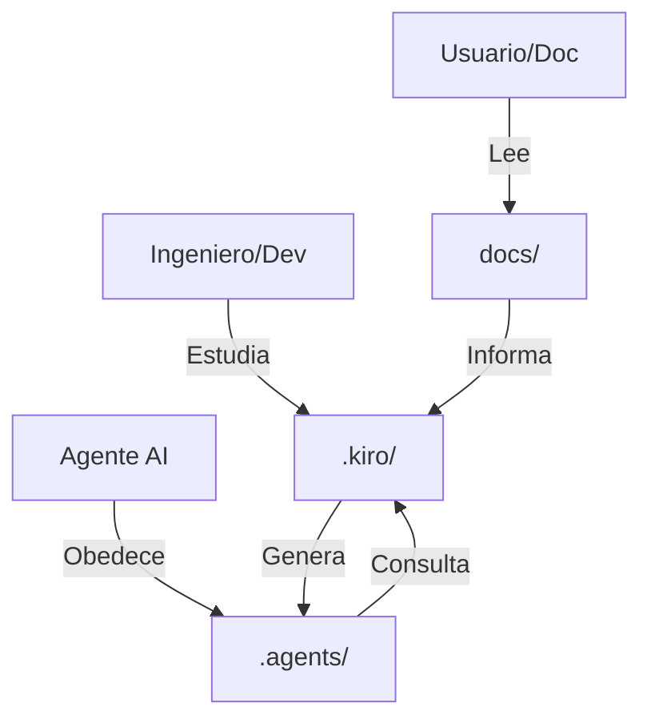

# Estrategia Final: Ecosistema de Documentación

## Fecha: 2026-01-07

## Veredicto después de ver el trabajo completo de Kiro

🎯 **Kiro generó documentación de nivel EMPRESARIAL FORTUNE 500**

No debemos "extraer y simplificar" porque perderíamos información extremadamente valiosa.

---

## Estrategia de Tres Niveles

### Nivel 1: `.agents/` - Para agentes AI (CONCISO)
**Propósito:** Instrucciones para que CUALQUIER agente AI trabaje en el proyecto
**Audiencia:** Claude Code, Droid, otros agentes
**Contenido:**
- Arquitectura de alto nivel
- Patrones de código (steering)
- Reglas y restricciones
- Hooks de automatización

**Archivos:**
```
.agents/
├── specs/
│   ├── 01-proyecto-overview.md        (200 líneas max)
│   ├── 02-backend-architecture.md     (150 líneas)
│   ├── 03-frontend-architecture.md    (150 líneas)
│   ├── 04-integracion.md              (100 líneas)
│   └── 05-data-pipeline.md            (100 líneas)
├── steering/
│   ├── python-patterns.md             (Extracto de .kiro)
│   ├── typescript-react-patterns.md   (Extracto de .kiro)
│   └── error-handling.md              (Extracto de .kiro)
└── README.md                          ("Cómo usar esta carpeta")
```

### Nivel 2: `.kiro/` - Para ingenieros humanos (DETALLADO)
**Propósito:** Documentación técnica profunda para desarrolladores
**Audiencia:** Ingenieros, arquitectos, technical leads
**Contenido:**
- Análisis técnico completo con código real
- Plan de implementación con sprints
- Documento de diseño con diagramas
- Propiedades de correctitud
- Roadmap y evolución

**Archivos:**
```
.kiro/
├── specs/
│   ├── tasks.md                       (PLAN DE IMPLEMENTACIÓN)
│   ├── design.md                      (DOCUMENTO DE DISEÑO)
│   ├── 01-proyecto-overview.md        (Análisis completo)
│   ├── 02-backend-scraper.md
│   ├── 03-frontend-chatbot.md
│   └── ...
├── steering/
│   ├── python-patterns.md
│   ├── typescript-patterns.md
│   └── performance-optimization.md
└── ANALYSIS_SUMMARY.md
```

### Nivel 3: `docs/` - Para usuarios y stakeholders (AMIGABLE)
**Propósito:** Documentación orientada al usuario
**Audiencia:** Usuarios finales, product managers, stakeholders
**Contenido:**
- Tutoriales y guías de uso
- FAQ
- Capturas de pantalla
- Casos de uso

---

## Relación entre los tres niveles



**Flujo de trabajo:**
1. **Ingeniero humano** estudia `.kiro/` (documentación técnica)
2. **Ingeniero** extrae lo esencial a `.agents/` (reglas para agentes)
3. **Agente AI** lee `.agents/` y trabaja siguiendo reglas
4. **Usuario** lee `docs/` para usar el sistema

---

## Plan de Acción Inmediato

### Fase 1: Mover `.kiro/` a ubicación permanente

```bash
# Renombrar .kiro/ para que sea claramente "documentación técnica"
mv .kiro/ docs/technical/
```

**Justificación:**
- `.kiro/` es documentation técnica, no "archivos de Kiro"
- `docs/technical/` hace claro su propósito
- Mantenemos TODO el contenido de Kiro intacto

### Fase 2: Crear `.agents/` desde cero (NO extraer de .kiro)

**Por qué NO extraer:**
- El contenido de `.kiro/` es DEMASIADO detallado para agentes
- Extraer sería simplificar y perder valor
- Mejor escribir `.agents/` específicamente para agentes AI

**Qué escribir en `.agents/`:**
```markdown
# .agents/specs/01-proyecto-overview.md

## Ecosistema SIBOM

Este proyecto tiene DOS partes:

1. **Backend Python**: Scraper de boletines municipales
2. **Frontend Next.js**: Chatbot con RAG para consultar boletines

## Flujo de datos
```
SIBOM → Backend Python → JSON → Frontend Next.js → Usuario
```

## Tecnologías clave
- Backend: Python 3.8+, OpenRouter, BeautifulSoup
- Frontend: Next.js 15, React 19, TypeScript, Vercel AI SDK
- RAG: Algoritmo BM25, cache multi-nivel

## Para más detalles
Ver documentación técnica en `docs/technical/`
```

**Características de `.agents/`:**
- ✅ CONCISO (100-200 líneas por archivo)
- ✅ ORIENTADO A REGLAS (qué DEBE/NUNCA hacer)
- ✅ AGNÓSTICO (sin rutas específicas, sin snippets detallados)
- ✅ REFERENCIAL (apunta a `docs/technical/` para profundidad)

### Fase 3: Actualizar herramientas para usar `.agents/`

#### Claude Code
```markdown
# .claude/CLAUDE.md

## Antes de modificar código

1. LEER: `.agents/specs/` para entender arquitectura
2. RESPETAR: `.agents/steering/` como reglas obligatorias
3. CONSULTAR: `docs/technical/` para detalles de implementación

## Para cambios arquitectónicos

1. Proponer cambio en `.agents/specs/` PRIMERO
2. Esperar aprobación
3. Implementar siguiendo `.agents/steering/`
4. Documentar en `docs/technical/` si es necesario
```

#### Droid (Factory)
```yaml
# .factory/config.yml
agents_context:
  read_first:
    - .agents/specs/
    - .agents/steering/
  reference_for_details:
    - docs/technical/
  hard_constraints:
    - .agents/steering/python-patterns.md
    - .agents/steering/typescript-react-patterns.md
```

---

## Estructura Final del Proyecto

```
sibom-scraper-assistant/
├── .agents/                  # Reglas para agentes AI (NIVEL 1)
│   ├── specs/                # Arquitectura concisa
│   ├── steering/             # Patrones y reglas
│   ├── hooks/                # Automatizaciones
│   └── workflows/            # Procedimientos multi-paso
│
├── docs/                    # Documentación completa (NIVEL 2 + 3)
│   ├── technical/            # ← Renombrado de .kiro/
│   │   ├── specs/            # Análisis técnico profundo
│   │   ├── steering/         # Patrones detallados
│   │   ├── tasks.md          # Plan de implementación
│   │   └── design.md         # Documento de diseño
│   │
│   └── user/                 # Documentación para usuarios
│       ├── tutorials/
│       ├── FAQ.md
│       └── use-cases.md
│
├── .claude/                  # Configuración Claude Code
├── .factory/                 # Configuración Droid
├── python-cli/               # Backend Python
└── chatbot/                  # Frontend Next.js
```

---

## Beneficios de este enfoque

### 1. **Preservamos TODO el trabajo de Kiro**
- ✅ No perdemos ni un byte de su análisis excepcional
- ✅ Mantenemos plan de implementación completo
- ✅ Documento de diseño queda accesible

### 2. **`.agents/` es específico para agentes AI**
- ✅ Contenido conciso y accionable
- ✅ Reglas claras sin ruido técnico
- ✅ Referencias a documentación profunda

### 3. **Separación clara de propósitos**
- `docs/technical/` ← Para ingenieros que estudian el sistema
- `.agents/` ← Para agentes AI que construyen el sistema
- `docs/user/` ← Para usuarios que usan el sistema

### 4. **Escalabilidad**
- Fácil agregar nuevas herramientas (solo leen `.agents/`)
- Fácil mantener documentación (`.kiro/` es read-only una vez generada)
- Fácil actualizar (se edita `.agents/`, no `docs/technical/`)

---

## Próximos Pasos

### Inmediato (hoy)
1. ✅ Mover `.kiro/` → `docs/technical/`
2. ✅ Crear `.agents/specs/` desde cero (conciso)
3. ✅ Actualizar `.claude/CLAUDE.md`

### Corto plazo (esta semana)
4. ⏳ Crear `.agents/steering/` basado en `docs/technical/steering/`
5. ⏳ Configurar Droid para usar `.agents/`
6. ⏳ Probar que agentes respetan `.agents/`

### Medio plazo (próximo mes)
7. ⏳ Crear `docs/user/` con tutoriales
8. ⏳ Refinar `.agents/` basado en uso real
9. ⏳ Documentar workflow de actualización

---

## Conclusión

🎯 **NO extraigamos de `.kiro/` - está PERFECTO como está.**

En su lugar:
- **Preservar** `.kiro/` como documentación técnica de referencia
- **Crear** `.agents/` específicamente para agentes AI
- **Organizar** en tres niveles claros con propósitos distintos

Esto nos da:
- **Lo mejor de ambos mundos**: Documentación profunda + reglas concisas
- **Escalabilidad**: Fácil agregar nuevas herramientas
- **Mantenibilidad**: Cada nivel tiene su propósito claro

---

**¡El trabajo de Kiro es EXCEPCIONAL! Hay que preservarlo completo.** 🚀
