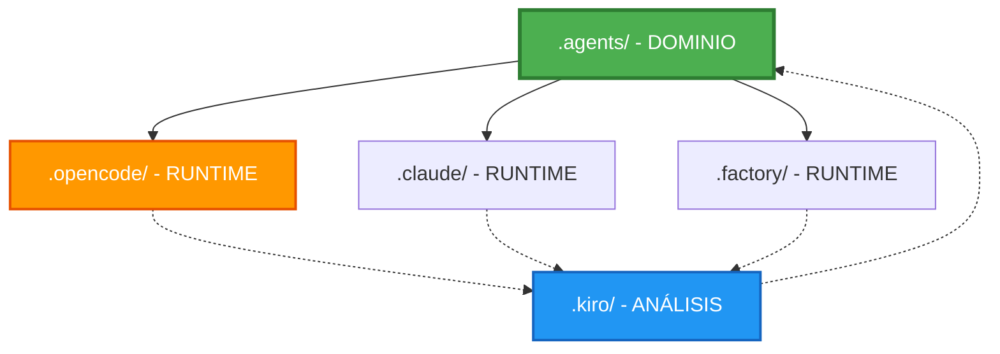

# .agents/ - Arquitectura de Agentes AI

**Última actualización:** 2025-01-17
**Versión:** 2.1
**Estado:** Producción

---

## 🎯 Resumen Ejecutivo (30 segundos)

**`.agents/` es tu capa de dominio agnóstica de herramientas.**

- Define **QUÉ** agentes existen y **QUÉ** hacen
- **NO** define **CÓMO** se ejecutan (eso es `.opencode/`)
- Es **portable**: funciona con OpenCode, Claude, Cursor, Aider, etc.
- Es **versionable**: commit frecuente, evoluciona con el proyecto

```
.agents/ define → .opencode/ ejecuta → .kiro/ referencia
```

---

## 🛠️ Tecnologías del Proyecto

### Backend (python-cli/)

| Tecnología | Versión | Uso |
|------------|---------|-----|
| Python | 3.13 | Backend principal |
| OpenRouter | - | LLM API |
| BeautifulSoup4 | - | Web scraping |
| Cloudflare R2 | - | Object storage |
| Qdrant | - | Vector database |

### Frontend (chatbot/)

| Tecnología | Versión | Uso |
|------------|---------|-----|
| Next.js | 16.1.1 | Framework React |
| React | 19.0.0 | UI library |
| TypeScript | 5.0.0 | Tipado |
| **Bun** | **1.2.8** | **Runtime de desarrollo** |
| Vercel AI SDK | 4.1.0 | Streaming chat |
| Tailwind CSS | 3.4.0 | Estilos |

> **Nota:** Desde v2.1, el proyecto usa **Bun** como runtime de desarrollo para mayor velocidad. Ver [CHANGELOG.md](CHANGELOG.md#-migración-a-bun-2025-01-17) para más detalles.

---

## 📁 Estructura de Carpetas

```
.agents/
├── README.md                   # Este archivo (manual completo)
├── agents/                     # Definiciones de agentes (YAML/JSON)
│   ├── README.md              # Cómo crear agentes
│   ├── rag-indexer.yaml       # Ejemplo: Indexador RAG
│   └── commit-agent.yaml      # Agente de commits automáticos
├── prompts/                    # Prompts reutilizables
│   ├── system-prompts.md      # Prompts de sistema
│   └── task-prompts.md        # Prompts de tareas
├── steering/                   # Reglas de código (obligatorias)
│   ├── python-patterns.md
│   ├── typescript-patterns.md
│   ├── error-handling.md
│   ├── testing-patterns.md
│   ├── performance-optimization.md
│   └── git-workflow.md       # Reglas de commits (Conventional Commits)
├── workflows/                  # Procedimientos multi-paso
│   └── commit-workflow.md    # Guía paso a paso del commit-agent
├── specs/                      # Referencias a .kiro/
│   └── README.md              # Pointer a análisis técnico
├── hooks/                      # Scripts de sincronización
│   ├── sync_from_kiro.py      # .kiro/ → .agents/
│   ├── propagate_to_kiro.py   # .agents/ → .kiro/
│   ├── sync_all.py            # Bidireccional
│   └── sync_to_opencode.py    # .agents/ → .opencode/ (backup)
└── scripts/                    # Scripts de implementación
    └── commit_agent.py       # Implementación del agente de commits
```
.agents/
├── README.md                   # Este archivo (manual completo)
├── agents/                     # Definiciones de agentes (YAML/JSON)
│   ├── README.md              # Cómo crear agentes
│   ├── rag-indexer.yaml       # Ejemplo: Indexador RAG
│   └── scraper-orchestrator.yaml
├── prompts/                    # Prompts reutilizables
│   ├── system-prompts.md      # Prompts de sistema
│   └── task-prompts.md        # Prompts de tareas
├── steering/                   # Reglas de código (obligatorias)
│   ├── python-patterns.md
│   ├── typescript-patterns.md
│   ├── error-handling.md
│   ├── testing-patterns.md
│   └── performance-optimization.md
├── specs/                      # Referencias a .kiro/
│   └── README.md              # Pointer a análisis técnico
└── hooks/                      # Scripts de sincronización
    ├── sync_from_kiro.py      # .kiro/ → .agents/
    ├── propagate_to_kiro.py   # .agents/ → .kiro/
    ├── sync_all.py            # Bidireccional
    └── sync_to_opencode.py    # .agents/ → .opencode/ (backup)
```

---

## 🏗️ Arquitectura del Sistema

### Jerarquía de Dependencias



**Leyenda:**
- **Verde** (`.agents/`): Fuente de verdad de dominio
- **Azul** (`.kiro/`): Referencia técnica
- **Naranja** (`.opencode/`, `.claude/`, etc.): Runtimes específicos
- **Línea sólida**: Dependencia fuerte
- **Línea punteada**: Consulta opcional

### Principios Fundamentales

| Principio | Significado | Ejemplo |
|-----------|-------------|---------|
| **Separation of Concerns** | `.agents/` define, `.opencode/` ejecuta | Agente definido en YAML, ejecutado por OpenCode |
| **Dependency Inversion** | Runtime depende de dominio, no al revés | `.opencode/agents.json` referencia `.agents/agents/*.yaml` |
| **Portabilidad** | Cambias de herramienta sin reescribir agentes | Hoy OpenCode, mañana Cursor, `.agents/` igual |
| **Single Source of Truth** | Una sola definición por agente | `rag-indexer.yaml` es la única fuente |

---

## 🤖 Definición de Agentes

### ¿Qué es un Agente?

Un agente es una **unidad de trabajo autónoma** con:
- **Objetivo claro** (goal)
- **Entradas definidas** (inputs)
- **Restricciones** (constraints)
- **Herramientas** (tools)

### Anatomía de un Agente

```yaml
# .agents/agents/rag-indexer.yaml
name: rag-indexer
version: 1.0.0
description: Indexa documentos JSON desde R2 a Qdrant

goal: |
  Indexar todos los documentos JSON limpios desde Cloudflare R2
  al vector store Qdrant para búsqueda semántica.

inputs:
  - r2://cleaned/*.json
  - config/qdrant-settings.yaml

outputs:
  - qdrant://sibom-collection
  - logs/indexing-{timestamp}.log

constraints:
  - No scraping (solo lectura de R2)
  - No modificar frontend
  - Respetar rate limits de Qdrant
  - Usar embeddings de OpenRouter

tools:
  - qdrant-client
  - boto3  # Para R2
  - openrouter-api

runtime:
  language: python
  version: "3.13"
  entrypoint: python-cli/rag_indexer.py

prompts:
  system: ../prompts/system-prompts.md#rag-indexer
  task: ../prompts/task-prompts.md#indexing

metadata:
  author: mrtn
  created: 2025-01-16
  tags: [rag, indexing, qdrant, r2]
```

### Crear un Nuevo Agente

```bash
# 1. Crear archivo YAML
vim .agents/agents/mi-nuevo-agente.yaml

# 2. Definir estructura (ver ejemplo arriba)

# 3. Commit
git add .agents/agents/mi-nuevo-agente.yaml
git commit -m "agents: agregar mi-nuevo-agente"

# 4. OpenCode lo detecta automáticamente
# (o ejecuta: python .agents/hooks/sync_to_opencode.py)
```

---

## 📝 Sistema de Prompts

### Estructura de Prompts

```
.agents/prompts/
├── system-prompts.md       # Prompts de sistema (personalidad, contexto)
└── task-prompts.md         # Prompts de tareas específicas
```

### Ejemplo: system-prompts.md

```markdown
# System Prompts

## rag-indexer

Eres un experto en indexación de documentos para búsqueda semántica.

**Contexto:**
- Proyecto: SIBOM Scraper Assistant
- Stack: Python 3.13, Qdrant, OpenRouter
- Datos: Boletines oficiales municipales argentinos

**Responsabilidades:**
1. Leer documentos JSON desde Cloudflare R2
2. Generar embeddings usando OpenRouter
3. Indexar en Qdrant con metadata correcta
4. Manejar errores gracefully

**Restricciones:**
- NO modificar documentos originales
- NO hacer scraping
- Respetar rate limits (3 req/s)
- Loggear todo para debugging

## scraper-orchestrator

Eres un orquestador de scraping web para sitios gubernamentales argentinos.

[...]
```

### Ejemplo: task-prompts.md

```markdown
# Task Prompts

## indexing

**Tarea:** Indexar documento JSON a Qdrant

**Input:**
```json
{
  "id": "carlos-tejedor-2025-001",
  "municipality": "Carlos Tejedor",
  "type": "ordenanza",
  "number": "001/2025",
  "title": "Ordenanza de Tránsito",
  "content": "...",
  "date": "2025-01-15"
}
```

**Output esperado:**
- Embedding generado (1536 dims)
- Documento indexado en Qdrant
- Metadata preservada
- Log de éxito/error

**Pasos:**
1. Validar estructura JSON
2. Generar embedding del contenido
3. Preparar payload para Qdrant
4. Indexar con retry logic
5. Verificar indexación exitosa
```

---

## 🤖 Agentes Disponibles

### 1. rag-indexer
**Descripción:** Indexa documentos JSON desde R2 a Qdrant para búsqueda semántica

**Uso:**
```bash
python3 python-cli/rag_indexer.py
```

**Más info:** [`.agents/agents/rag-indexer.yaml`](agents/rag-indexer.yaml)

---

### 2. commit-agent ⭐ NUEVO
**Descripción:** Genera mensajes de commit y alerta sobre cambios pendientes

**Uso:**
```bash
# Analizar cambios
python3 .agents/scripts/commit_agent.py analyze

# Ver sugerencias de mensajes
python3 .agents/scripts/commit_agent.py suggest

# Iniciar monitor (cada 30 min)
python3 .agents/scripts/commit_agent.py monitor --interval 30
```

**Más info:**
- [`.agents/agents/commit-agent.yaml`](agents/commit-agent.yaml)
- [`.agents/steering/git-workflow.md`](steering/git-workflow.md) - Reglas de commits
- [`.agents/workflows/commit-workflow.md`](workflows/commit-workflow.md) - Guía de uso

---

## 🎛️ Reglas de Código (Steering)

### ¿Qué son las Reglas de Steering?

Son **patrones de código obligatorios** que todos los agentes deben seguir.

### Archivos de Steering

| Archivo | Aplica a | Propósito |
|---------|----------|-----------|
| `python-patterns.md` | `**/*.py` | Patrones Python (clases, error handling, LLM) |
| `typescript-patterns.md` | `**/*.{ts,tsx}` | Patrones TypeScript (tipos, React, API) |
| `error-handling.md` | Todos | Estrategias de manejo de errores |
| `testing-patterns.md` | Todos | Patrones de testing (unit, integration, PBT) |
| `performance-optimization.md` | Todos | Optimizaciones de performance |

### Ejemplo de Uso

```python
# python-cli/rag_indexer.py

# ✅ CORRECTO - Sigue python-patterns.md
from dataclasses import dataclass
from typing import List, Optional
import structlog

logger = structlog.get_logger()

@dataclass(frozen=True)
class IndexerConfig:
    """Configuración inmutable del indexador"""
    qdrant_url: str
    r2_bucket: str
    batch_size: int = 100
    
    @classmethod
    def from_env(cls) -> 'IndexerConfig':
        return cls(
            qdrant_url=os.getenv("QDRANT_URL", ""),
            r2_bucket=os.getenv("R2_BUCKET", ""),
        )

class RAGIndexer:
    def __init__(self, config: IndexerConfig):
        self.config = config
        self.qdrant_client = QdrantClient(config.qdrant_url)
    
    @retry(stop=stop_after_attempt(3), wait=wait_exponential(multiplier=1, min=4, max=10))
    def index_document(self, doc: dict) -> bool:
        """Indexa documento con retry automático"""
        try:
            # Lógica de indexación
            logger.info("Document indexed", doc_id=doc["id"])
            return True
        except Exception as e:
            logger.error("Indexing failed", doc_id=doc["id"], error=str(e))
            raise
```

---

## 🔄 Sincronización con Otras Carpetas

### Relación con `.opencode/`

**`.opencode/` ejecuta lo que `.agents/` define**

```json
// .opencode/agents.json
{
  "agents": [
    {
      "name": "rag-indexer",
      "source": "../.agents/agents/rag-indexer.yaml",  // ← Referencia
      "runtime": "python",
      "autoReload": true  // ← Lee cambios automáticamente
    }
  ]
}
```

**Sincronización:**
- **Automática**: OpenCode lee `.agents/` en cada ejecución
- **Manual (backup)**: `python .agents/hooks/sync_to_opencode.py`

### Relación con `.kiro/`

**`.kiro/` es referencia técnica, NO coordinador**

```bash
# Flujo de sincronización

# 1. Kiro analiza proyecto
kiro analyze ./

# 2. Sincronizar referencias a .agents/
python .agents/hooks/sync_from_kiro.py

# 3. (Opcional) Editar .agents/steering/
vim .agents/steering/python-patterns.md

# 4. Propagar reglas a .kiro/
python .agents/hooks/propagate_to_kiro.py
```

**Frecuencia:**
- `sync_from_kiro.py`: Después de análisis de Kiro
- `propagate_to_kiro.py`: Después de editar steering
- `sync_all.py`: Semanalmente o después de cambios grandes

---

## 🚀 Workflows Comunes

### Workflow 1: Crear Nuevo Agente

```bash
# 1. Crear definición
vim .agents/agents/data-validator.yaml

# Contenido:
# name: data-validator
# goal: Validar integridad de datos JSON
# [...]

# 2. Crear prompts (opcional)
vim .agents/prompts/system-prompts.md
# Agregar sección ## data-validator

# 3. Commit
git add .agents/
git commit -m "agents: agregar validador de datos"

# 4. OpenCode detecta automáticamente
# (o ejecuta: python .agents/hooks/sync_to_opencode.py)

# 5. Ejecutar agente
opencode run data-validator
```

### Workflow 2: Actualizar Prompt

```bash
# 1. Editar prompt
vim .agents/prompts/task-prompts.md

# 2. Commit
git commit -am "agents: mejorar prompt de indexación"

# 3. OpenCode usa nuevo prompt automáticamente
# (los prompts se leen en runtime, no se cachean)
```

### Workflow 3: Agregar Regla de Código

```bash
# 1. Editar steering
vim .agents/steering/python-patterns.md

# Agregar:
# ### 11. Patrón de Circuit Breaker
# [...]

# 2. Propagar a .kiro/
python .agents/hooks/propagate_to_kiro.py

# 3. Commit
git add .agents/ .kiro/
git commit -m "agents: agregar patrón de circuit breaker"

# 4. Todos los agentes deben seguir nueva regla
```

### Workflow 4: Sincronización Completa

```bash
# Ejecutar semanalmente o después de cambios grandes
python .agents/hooks/sync_all.py

# Verifica:
# - .kiro/specs/ → .agents/specs/
# - .agents/steering/ → .kiro/steering/
# - .agents/ → .opencode/
```

---

## 🏗️ Infraestructura del Proyecto

### Cloudflare R2 (Object Storage)

**Configuración:**

```yaml
# Buckets
buckets:
  raw: sibom-raw-bulletins        # Datos crudos del scraper
  cleaned: sibom-cleaned-data     # Datos procesados
  embeddings: sibom-embeddings    # Vectores pre-computados

# URLs de acceso
urls:
  public: https://pub-xxx.r2.dev
  api: https://api.cloudflare.com/client/v4/accounts/{account_id}/r2/buckets

# CORS (para Next.js frontend)
cors:
  allowed_origins:
    - https://sibom-assistant.vercel.app
    - http://localhost:3000
  allowed_methods: [GET, HEAD]
  max_age: 3600
```

**Proceso de Upload (Python CLI):**

```python
# python-cli/upload_to_r2.py
import boto3
from botocore.config import Config

# Configurar cliente S3-compatible para R2
s3_client = boto3.client(
    's3',
    endpoint_url='https://{account_id}.r2.cloudflarestorage.com',
    aws_access_key_id=os.getenv('R2_ACCESS_KEY_ID'),
    aws_secret_access_key=os.getenv('R2_SECRET_ACCESS_KEY'),
    config=Config(signature_version='s3v4')
)

# Upload archivo
s3_client.upload_file(
    'boletines/carlos-tejedor-2025-001.json',
    'sibom-cleaned-data',
    'carlos-tejedor/2025/001.json',
    ExtraArgs={'ContentType': 'application/json'}
)
```

**Acceso desde Next.js:**

```typescript
// chatbot/src/lib/rag/retriever.ts
const R2_BASE_URL = process.env.R2_PUBLIC_URL || 'https://pub-xxx.r2.dev';

async function fetchDocumentFromR2(path: string): Promise<any> {
  const url = `${R2_BASE_URL}/${path}`;
  const response = await fetch(url, {
    cache: 'force-cache',
    next: { revalidate: 3600 }  // Cache 1 hora
  });
  
  if (!response.ok) {
    throw new Error(`R2 fetch failed: ${response.status}`);
  }
  
  return response.json();
}
```

**Variables de Entorno:**

```bash
# .env (Python CLI)
R2_ACCESS_KEY_ID=xxx
R2_SECRET_ACCESS_KEY=xxx
R2_ACCOUNT_ID=xxx
R2_BUCKET_RAW=sibom-raw-bulletins
R2_BUCKET_CLEANED=sibom-cleaned-data

# .env.local (Next.js)
R2_PUBLIC_URL=https://pub-xxx.r2.dev
```

### GitHub Setup

**Repositorios:**

```
github.com/mrtn/sibom-scraper-assistant/
├── main                    # Rama principal (producción)
├── develop                 # Rama de desarrollo
└── feature/*              # Ramas de features
```

**Estrategia de Branches:**

```bash
# Feature branch
git checkout -b feature/rag-improvements
# Trabajo...
git commit -m "feat: mejorar indexación RAG"
git push origin feature/rag-improvements
# Pull Request → develop

# Release
git checkout develop
git merge feature/rag-improvements
git checkout main
git merge develop
git tag v1.2.0
git push origin main --tags
```

**CI/CD (GitHub Actions):**

```yaml
# .github/workflows/deploy.yml
name: Deploy to Vercel

on:
  push:
    branches: [main]

jobs:
  deploy:
    runs-on: ubuntu-latest
    steps:
      - uses: actions/checkout@v3
      
      - name: Deploy to Vercel
        uses: amondnet/vercel-action@v20
        with:
          vercel-token: ${{ secrets.VERCEL_TOKEN }}
          vercel-org-id: ${{ secrets.VERCEL_ORG_ID }}
          vercel-project-id: ${{ secrets.VERCEL_PROJECT_ID }}
          working-directory: ./chatbot
```

### Arquitectura de Datos

**Flujo Completo:**


**Puntos de Integración:**

| Componente | Input | Output | Storage |
|------------|-------|--------|---------|
| **Scraper** | SIBOM HTML | JSON raw | R2 raw bucket |
| **LLM Processor** | JSON raw | JSON cleaned | R2 cleaned bucket |
| **RAG Indexer** | JSON cleaned | Vectors | Qdrant |
| **Chatbot** | User query | AI response | - |

---

## 📋 Reglas de Oro

### 1. Jerarquía de Dependencias

```
.agents/ define → .opencode/ ejecuta → .kiro/ referencia
```

**NUNCA al revés**

### 2. Portabilidad

- `.agents/` es agnóstico de herramientas
- Puede vivir en cualquier IDE/runtime
- Cambias de OpenCode a Cursor → `.agents/` no cambia

### 3. Fuentes de Verdad

| Aspecto | Fuente de Verdad | Editable |
|---------|------------------|----------|
| **Definición de agentes** | `.agents/agents/` | ✅ Sí |
| **Prompts** | `.agents/prompts/` | ✅ Sí |
| **Reglas de código** | `.agents/steering/` | ✅ Sí |
| **Ejecución** | `.opencode/` | ✅ Sí |
| **Análisis técnico** | `.kiro/specs/` | ❌ No (Kiro lo genera) |

### 4. Flujo de Trabajo

```bash
1. Diseñas agente en .agents/
2. Lo documentas
3. Lo versionas (git commit)
4. .opencode/ lo referencia (automático)
5. Ejecutas
6. Ajustas dominio
7. Commit
```

### 5. Cuando Cambies de Herramienta

```bash
# Hoy: OpenCode
.agents/ → .opencode/

# Mañana: Cursor
.agents/ → .cursor/

# Pasado: Aider
.agents/ → .aider/

# .agents/ NUNCA cambia
```

---

## 🆘 Troubleshooting

### Problema 1: "OpenCode no detecta mi nuevo agente"

**Diagnóstico:**
```bash
# Verificar que archivo existe
ls -la .agents/agents/mi-agente.yaml

# Verificar sintaxis YAML
python -c "import yaml; yaml.safe_load(open('.agents/agents/mi-agente.yaml'))"
```

**Solución:**
```bash
# Sincronizar manualmente
python .agents/hooks/sync_to_opencode.py

# Verificar .opencode/agents.json
cat .opencode/agents.json
```

### Problema 2: "Cambié un prompt pero no se aplica"

**Causa:** Cache de prompts

**Solución:**
```bash
# Reiniciar OpenCode
# O forzar reload:
opencode reload
```

### Problema 3: "Conflicto entre .agents/ y .kiro/"

**Diagnóstico:**
```bash
# Ver qué cambió
git diff .agents/ .kiro/
```

**Solución:**
```bash
# Regla de oro: .agents/ manda
# Propagar cambios
python .agents/hooks/propagate_to_kiro.py
```

### Problema 4: "Olvidé cómo funciona todo"

**Solución:**
```bash
# Leer este archivo
cat .agents/README.md

# Ver estado de sincronización
python .agents/hooks/sync_status.py
```

---

## 📊 Métricas y Monitoreo

### Frecuencia de Cambios Típica

| Archivo | Frecuencia | Razón |
|---------|-----------|-------|
| `.agents/agents/*.yaml` | **Semanal** | Nuevos agentes, refinamiento |
| `.agents/prompts/*.md` | **Diaria** | Mejora de prompts |
| `.agents/steering/*.md` | **Mensual** | Nuevos patrones de código |
| `.agents/README.md` | **Trimestral** | Cambios de infraestructura |

### Checklist de Mantenimiento

**Semanal:**
- [ ] Ejecutar `python .agents/hooks/sync_status.py`
- [ ] Verificar que `.agents/` esté sincronizado
- [ ] Revisar si hay nuevas reglas para agregar

**Mensual:**
- [ ] Actualizar `.kiro/` ejecutando Kiro
- [ ] Revisar plan de implementación
- [ ] Actualizar reglas de steering si es necesario

**Trimestral:**
- [ ] Revisar toda la estructura de documentación
- [ ] Actualizar este README si hay cambios
- [ ] Archivar versión antigua si es necesario

---

## 🔗 Referencias Rápidas

### Archivos Clave

| Archivo | Para qué sirve | Cuándo leerlo |
|---------|---------------|---------------|
| `.agents/README.md` | Este manual completo | Cuando olvides cómo funciona |
| `.agents/agents/README.md` | Cómo crear agentes | Cuando crees un agente nuevo |
| `.agents/prompts/system-prompts.md` | Prompts de sistema | Cuando definas personalidad |
| `.kiro/specs/` | Análisis técnico profundo | Cuando necesites detalles |

### Scripts Útiles

| Script | Qué hace | Cuándo ejecutarlo |
|--------|---------|------------------|
| `sync_from_kiro.py` | .kiro/ → .agents/ | Después de análisis de Kiro |
| `propagate_to_kiro.py` | .agents/ → .kiro/ | Después de editar steering |
| `sync_to_opencode.py` | .agents/ → .opencode/ | Si OpenCode no auto-reload |
| `sync_all.py` | Sincronización completa | Semanalmente |

### Comandos Comunes

```bash
# Ver estado de sincronización
python .agents/hooks/sync_status.py

# Crear nuevo agente
vim .agents/agents/mi-agente.yaml
git add .agents/agents/mi-agente.yaml
git commit -m "agents: agregar mi-agente"

# Actualizar prompt
vim .agents/prompts/task-prompts.md
git commit -am "agents: mejorar prompt"

# Sincronización completa
python .agents/hooks/sync_all.py
```

---

## 📚 Documentación Adicional

- **[Definición de Agentes](.agents/agents/README.md)** - Cómo crear agentes
- **[Análisis Técnico](.kiro/specs/)** - Detalles técnicos profundos
- **[Configuración OpenCode](.opencode/rules.md)** - Reglas de OpenCode
- **[AGENTS.md](../AGENTS.md)** - Guía general del proyecto

---

## ✅ Resumen de 60 Segundos

1. **`.agents/` es tu capa de dominio** - Define QUÉ hacer
2. **`.opencode/` es tu runtime** - Define CÓMO ejecutar
3. **`.kiro/` es tu referencia** - Análisis técnico profundo
4. **Portabilidad total** - Cambias de herramienta sin reescribir
5. **Sincronización automática** - OpenCode lee `.agents/` en cada ejecución
6. **Commit frecuente** - `.agents/` evoluciona con el proyecto
7. **Este README** - Tu manual para olvidar y recordar

---

**¿Olvidaste algo? Lee este archivo.** 🚀

**Última actualización:** 2025-01-16  
**Versión:** 2.0  
**Autor:** mrtn  
**Estado:** Producción
