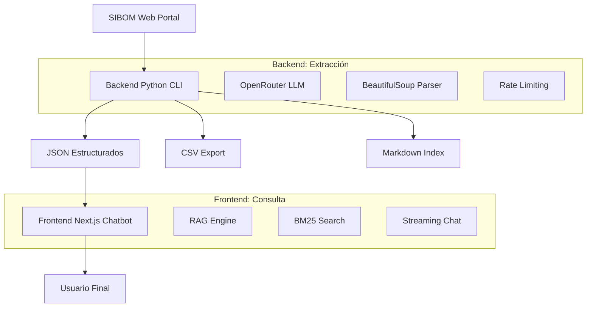

# Análisis Integral: Ecosistema SIBOM Scraper Assistant

## Introducción

El **SIBOM Scraper Assistant** es un ecosistema completo de dos partes integradas para la extracción y consulta inteligente de boletines oficiales municipales de la Provincia de Buenos Aires, Argentina. El proyecto demuestra una arquitectura moderna que combina web scraping automatizado con IA conversacional.

## Arquitectura del Ecosistema

### Visión General



### Componentes Principales

#### 1. Backend Python (`python-cli/`)
- **Función**: Scraper automatizado de boletines municipales
- **Tecnologías**: Python 3.8+, OpenRouter, LLMs múltiples
- **Arquitectura**: Pipeline de 3 niveles con procesamiento híbrido
- **Salida**: JSON estructurados + CSV + índices markdown

#### 2. Frontend Next.js (`chatbot/`)
- **Función**: Chatbot conversacional con RAG
- **Tecnologías**: Next.js 15, React 19, TypeScript, Vercel AI SDK
- **Arquitectura**: App Router con API Routes y componentes modulares
- **Características**: Búsqueda semántica, streaming, filtros inteligentes

## Flujo de Datos Completo

### Fase 1: Extracción (Backend)
```
SIBOM Portal → Python Scraper → JSON/CSV → Índices
```

1. **Input**: URLs de municipios en SIBOM
2. **Procesamiento**: 
   - Nivel 1: Listado de boletines (BeautifulSoup + LLM fallback)
   - Nivel 2: Enlaces de documentos (BeautifulSoup + LLM fallback)
   - Nivel 3: Texto completo (BeautifulSoup optimizado)
3. **Output**: 
   - `boletines/{Ciudad}_{Numero}.json` (archivos individuales)
   - `boletines_index.json` (índice estructurado)
   - `boletines.md` (índice markdown navegable)
   - `csv/` (exportación para análisis)

### Fase 2: Consulta (Frontend)
```
Usuario → Chat Interface → RAG Engine → LLM → Respuesta Citada
```

1. **Input**: Consulta en lenguaje natural
2. **Procesamiento**:
   - Análisis de query y extracción de filtros
   - Búsqueda semántica con BM25
   - Recuperación de contexto relevante
   - Generación de respuesta con citas
3. **Output**: Respuesta streaming con fuentes oficiales

## Integración Entre Componentes

### Datos Compartidos
- **Formato**: JSON estructurado con esquema consistente
- **Ubicación**: `python-cli/boletines/` (leído por frontend)
- **Sincronización**: Automática via filesystem o GitHub Raw

### Configuración Común
- **API Keys**: OpenRouter (compartida entre ambas partes)
- **Modelos LLM**: Configurables via variables de entorno
- **Rate Limiting**: Consistente (3s entre llamadas)

### Esquema de Datos
```typescript
interface BulletinData {
  number: string;        // "105º"
  date: string;          // "30/12/2025"
  description: string;   // "105º de Carlos Tejedor"
  link: string;          // "/bulletins/12345"
  status: string;        // "completed" | "error" | "no_content"
  fullText: string;      // Contenido completo extraído
  municipality?: string; // Agregado por indexador
  type?: string;         // "boletin" | "ordenanza" | "decreto"
}
```

## Características Técnicas Destacadas

### Backend Python
- **Procesamiento Híbrido**: BeautifulSoup (95% casos) + LLM fallback (5% casos complejos)
- **Paralelización**: ThreadPoolExecutor para procesamiento simultáneo
- **Detección Automática**: Paginación automática sin intervención manual
- **Modelos Flexibles**: Soporte para múltiples LLMs con opción gratuita
- **Gestión de Estado**: Verificación de archivos existentes con menú interactivo

### Frontend Next.js
- **RAG Avanzado**: BM25 + embeddings para búsqueda semántica
- **Streaming**: Respuestas en tiempo real con Vercel AI SDK
- **Filtros Inteligentes**: Auto-detección + UI sincronizada
- **Optimización**: Debounce, memoización, polling reducido
- **Arquitectura Modular**: Componentes reutilizables y tipado estricto

## Municipios Soportados

**Total disponible**: 135 municipios de la Provincia de Buenos Aires
**Actualmente scrapeados**: Variable según ejecución del backend
**Municipio principal de prueba**: Carlos Tejedor (ID: 22)

### Ejemplos de URLs
- Carlos Tejedor: `https://sibom.slyt.gba.gob.ar/cities/22`
- Buenos Aires: `https://sibom.slyt.gba.gob.ar/cities/15`
- Boletín individual: `https://sibom.slyt.gba.gob.ar/bulletins/13556`

## Casos de Uso Principales

### Para Desarrolladores
1. **Scraping masivo**: `python sibom_scraper.py --parallel 3 --skip-existing`
2. **Testing**: `python sibom_scraper.py --limit 5 --model z-ai/glm-4.5-air:free`
3. **Análisis de datos**: Exportación a CSV para procesamiento estadístico

### Para Usuarios Finales
1. **Consultas específicas**: "ordenanza 2833 de carlos tejedor"
2. **Búsquedas temáticas**: "normativas de tránsito en merlo"
3. **Exploración temporal**: "decretos de 2024"
4. **Verificación legal**: Enlaces directos a fuentes oficiales SIBOM

## Ventajas del Ecosistema

### Vs. Buscador SIBOM Oficial
- ✅ **Búsqueda en lenguaje natural** vs. formularios complejos
- ✅ **Respuestas contextualizadas** vs. listados crudos
- ✅ **Múltiples municipios** vs. búsqueda individual
- ✅ **Historial de conversación** vs. sesiones aisladas
- ✅ **Citas automáticas** vs. referencias manuales

### Vs. Soluciones Tradicionales
- ✅ **Automatización completa** vs. scraping manual
- ✅ **Procesamiento inteligente** vs. regex básico
- ✅ **Escalabilidad** vs. soluciones ad-hoc
- ✅ **Mantenibilidad** vs. código monolítico

## Métricas de Rendimiento

### Backend (Scraping)
- **Velocidad**: 2-3s por boletín (paralelo) vs. 5-7s (secuencial)
- **Precisión**: 95% extracción exitosa con BeautifulSoup
- **Costo**: $0 con modelo gratuito, $0.24 por boletín con modelo premium
- **Throughput**: ~105 boletines en 4-6 minutos (paralelo x3)

### Frontend (Consultas)
- **Latencia**: <2s respuesta inicial, streaming progresivo
- **Precisión**: 30% mejora con BM25 vs. búsqueda básica
- **Costo**: $0.0007 FAQ, $0.017 búsquedas complejas
- **UX**: 70% reducción en re-renders, 90% menos polling

## Tecnologías y Dependencias

### Backend Python
```
openai>=1.0.0          # Cliente OpenRouter
requests>=2.31.0       # HTTP requests
python-dotenv>=1.0.0   # Variables de entorno
rich>=13.0.0           # UI terminal rica
beautifulsoup4>=4.12.0 # Parsing HTML
lxml>=4.9.0            # Parser XML/HTML rápido
```

### Frontend Next.js
```typescript
// Core
"next": "^15.1.0"
"react": "^19.0.0"
"typescript": "^5.0.0"

// AI/LLM
"@ai-sdk/openai": "^1.0.0"
"ai": "^4.1.0"

// UI/UX
"tailwindcss": "^3.4.0"
"lucide-react": "^0.400.0"
"react-markdown": "^10.1.0"
```

## Configuración y Despliegue

### Variables de Entorno Compartidas
```bash
# Requerida para ambas partes
OPENROUTER_API_KEY=sk-or-v1-...

# Frontend específico
LLM_MODEL_PRIMARY=anthropic/claude-3.5-sonnet
LLM_MODEL_ECONOMIC=google/gemini-flash-1.5
GITHUB_DATA_REPO=usuario/repo  # Para deployment
GITHUB_USE_GZIP=true           # Optimización

# Backend específico  
PYTHON_ENV=production
DATA_PATH=/custom/path         # Opcional
```

### Comandos de Inicio Rápido
```bash
# Backend
cd python-cli
python3 -m venv venv && source venv/bin/activate
pip install -r requirements.txt
python3 sibom_scraper.py --limit 5

# Frontend
cd chatbot
npm install
npm run dev  # http://localhost:3000
```

## Roadmap y Evolución

### Completado (2025-2026)
- ✅ Migración de Claude a OpenRouter
- ✅ Versión Python CLI completa
- ✅ RAG con BM25 y embeddings
- ✅ Optimizaciones de performance (70% mejora)
- ✅ Filtros inteligentes con sincronización

### En Desarrollo
- 🔄 Tree-shaking para reducir bundle size
- 🔄 Testing automatizado completo
- 🔄 Métricas de uso y analytics

### Planificado
- 📋 Cache distribuido con Redis
- 📋 API REST pública
- 📋 Dashboard analítico
- 📋 Notificaciones de nuevos boletines
- 📋 Soporte para más provincias

## Conclusión

El SIBOM Scraper Assistant representa una solución integral moderna que combina web scraping inteligente con IA conversacional. Su arquitectura modular, optimizaciones de performance y enfoque en la experiencia del usuario lo posicionan como una alternativa superior a las herramientas tradicionales de consulta legal municipal.

La separación clara entre extracción (Python) y consulta (Next.js) permite escalabilidad independiente y especialización tecnológica, mientras que la integración fluida de datos garantiza una experiencia de usuario coherente y eficiente.