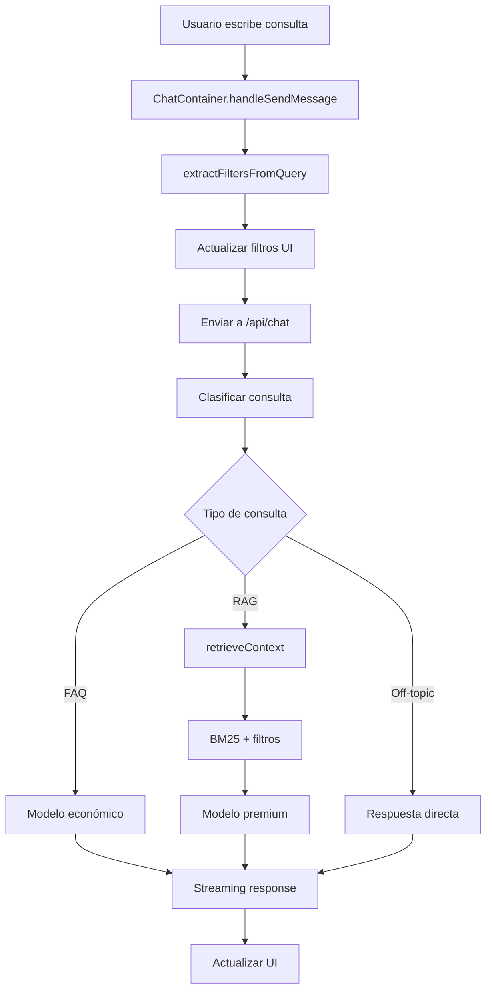
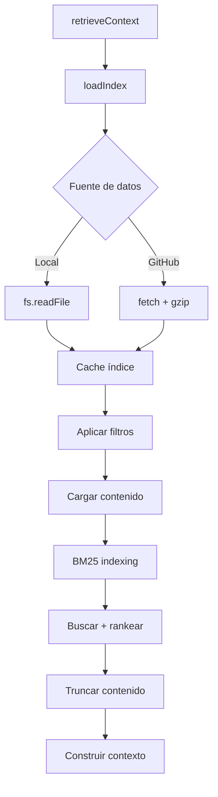

# Spec 03: Arquitectura Frontend - Chatbot Next.js

## Información General

**Proyecto:** SIBOM Scraper Assistant - Frontend Chatbot  
**Tecnología:** Next.js 15.1.0 + React 19 + TypeScript  
**Ubicación:** `chatbot/`  
**Propósito:** Interfaz web para consultar legislación municipal mediante chat conversacional  
**Integración:** Consume datos JSON generados por el backend Python CLI  

## Arquitectura General

### Stack Tecnológico

```typescript
// chatbot/package.json - Dependencias principales
{
  "dependencies": {
    "@ai-sdk/openai": "^1.0.0",        // Cliente OpenRouter
    "@ai-sdk/react": "^1.0.0",         // Hooks React para AI
    "ai": "^4.1.0",                    // Vercel AI SDK
    "next": "^15.1.0",                 // Framework React
    "react": "^19.0.0",                // UI Library
    "react-markdown": "^10.1.0",       // Renderizado Markdown
    "tailwindcss": "^3.4.0",          // Styling
    "zod": "^3.25.76"                  // Validación de tipos
  }
}
```

### Estructura de Directorios

```
chatbot/
├── src/
│   ├── app/                    # App Router (Next.js 13+)
│   │   ├── api/chat/route.ts   # API endpoint principal
│   │   ├── page.tsx            # Página principal del chat
│   │   └── layout.tsx          # Layout global
│   ├── components/             # Componentes React
│   │   ├── chat/               # Componentes específicos del chat
│   │   ├── layout/             # Componentes de layout
│   │   └── ui/                 # Componentes base (shadcn/ui)
│   ├── lib/                    # Lógica de negocio
│   │   ├── rag/                # Sistema RAG (Retrieval)
│   │   ├── config.ts           # Configuración centralizada
│   │   ├── types.ts            # Tipos TypeScript
│   │   └── constants.ts        # Constantes del sistema
│   └── prompts/                # Prompts del sistema
│       └── system.md           # Prompt principal del LLM
├── public/                     # Assets estáticos
├── components.json             # Configuración shadcn/ui
└── tailwind.config.ts          # Configuración Tailwind
```

## Componentes Principales

### 1. API Route - Chat Endpoint

**Archivo:** `src/app/api/chat/route.ts`  
**Función:** Endpoint principal que procesa consultas del usuario

```typescript
// Flujo principal del endpoint
export async function POST(req: Request) {
  // 1. Extraer mensajes y filtros del request
  const { messages, municipality, filters = {} } = body;
  
  // 2. Configurar cliente OpenRouter
  const openrouter = createOpenAI({
    apiKey: process.env.OPENROUTER_API_KEY,
    baseURL: 'https://openrouter.ai/api/v1'
  });
  
  // 3. Analizar tipo de consulta
  const isFAQ = isFAQQuestion(query);
  const shouldSearch = !isFAQ && needsRAGSearch(query);
  
  // 4. Recuperar contexto RAG si es necesario
  const retrievedContext = shouldSearch 
    ? await retrieveContext(query, searchOptions)
    : { context: '', sources: [] };
  
  // 5. Seleccionar modelo según tipo de consulta
  const modelId = isFAQ 
    ? 'google/gemini-flash-1.5'      // Económico para FAQ
    : 'anthropic/claude-3.5-sonnet'; // Premium para búsquedas
  
  // 6. Generar respuesta con streaming
  return streamText({
    model: openrouter(modelId),
    system: systemPrompt,
    messages: coreMessages,
    temperature: 0.3,
    maxTokens: 4000
  });
}
```

**Características clave:**
- **Streaming de respuestas** usando Vercel AI SDK
- **Selección automática de modelo** (económico vs premium)
- **Integración con sistema RAG** para recuperar contexto
- **Manejo de metadatos** (fuentes, tokens, modelo usado)

### 2. Sistema RAG - Retriever

**Archivo:** `src/lib/rag/retriever.ts`  
**Función:** Motor de recuperación de información híbrido

```typescript
// Configuración híbrida: Local + GitHub Raw
function useGitHub(): boolean {
  return !!process.env.GITHUB_DATA_REPO;
}

// Cache multi-nivel
let indexCache: IndexEntry[] = [];
const fileCache = new Map<string, FileCacheEntry>();
const CACHE_DURATION = 300000; // 5 minutos

// Función principal de búsqueda
export async function retrieveContext(
  query: string,
  options: SearchOptions = {}
): Promise<SearchResult> {
  // 1. Cargar índice (con cache)
  const index = await loadIndex();
  
  // 2. Aplicar filtros (municipio, tipo, fechas)
  let filteredIndex = applyFilters(index, options);
  
  // 3. Cargar contenido completo para BM25
  const docsWithContent = await loadDocuments(filteredIndex);
  
  // 4. Construir índice BM25
  const bm25 = new BM25Index(tokenizedDocs, 1.5, 0.75);
  
  // 5. Buscar y rankear resultados
  const bm25Results = bm25.search(query, options.limit || 5);
  
  // 6. Construir contexto con truncamiento dinámico
  const contentLimit = calculateContentLimit(query);
  const context = buildContext(documents, contentLimit);
  
  return { context, sources };
}
```

**Características clave:**
- **Fuente híbrida:** Archivos locales o GitHub Raw (para Vercel)
- **Cache multi-nivel:** Índice (5min) + archivos (30min)
- **Soporte gzip:** Para reducir bandwidth en GitHub
- **BM25 ranking:** Algoritmo de relevancia avanzado
- **Truncamiento dinámico:** Optimiza tokens según tipo de consulta

### 3. Clasificador de Consultas

**Archivo:** `src/lib/query-classifier.ts`  
**Función:** Determina el tipo de consulta y optimiza el procesamiento

```typescript
// Detecta preguntas FAQ del sistema
export function isFAQQuestion(query: string): boolean {
  const faqPatterns = [
    /qué.*municipios.*disponibles/i,
    /cómo.*busco|cómo.*buscar/i,
    /cómo.*citar.*norma/i,
    /qué.*tipos.*normativas/i
  ];
  return faqPatterns.some(p => p.test(query));
}

// Detecta si necesita búsqueda RAG
export function needsRAGSearch(query: string): boolean {
  // 1. Saludos básicos → NO RAG
  if (/^hola|buenos días|ayuda/i.test(query)) return false;
  
  // 2. FAQ del sistema → NO RAG
  if (isFAQQuestion(query)) return false;
  
  // 3. Menciona términos legales → SÍ RAG
  const ordinanceKeywords = [
    /ordenanza/i, /decreto/i, /normativa/i, /municipal/i
  ];
  return ordinanceKeywords.some(p => p.test(query));
}

// Calcula límite de contenido según consulta
export function calculateContentLimit(query: string): number {
  // Metadata-only: 200 chars (90% ahorro)
  if (/cuántas|listar|existe/i.test(query)) return 200;
  
  // Contenido específico: 1000 chars
  if (/qué.*dice|contenido|texto/i.test(query)) return 1000;
  
  // Default: 500 chars (75% ahorro)
  return 500;
}
```

### 4. Extractor de Filtros

**Archivo:** `src/lib/query-filter-extractor.ts`  
**Función:** Extrae filtros automáticamente de la consulta

```typescript
// Extrae año de la consulta
export function extractYear(query: string): string | null {
  const yearPatterns = [
    /\ben\s+el\s+(\d{4})\b/i,  // "en el 2025"
    /\bdel\s+(\d{4})\b/i,      // "del 2024"
    /\baño\s+(\d{4})\b/i       // "año 2022"
  ];
  
  for (const pattern of yearPatterns) {
    const match = query.match(pattern);
    if (match && isValidYear(match[1])) {
      return match[1];
    }
  }
  return null;
}

// Función principal de extracción
export function extractFiltersFromQuery(
  query: string,
  availableMunicipalities: string[],
  existingFilters: Partial<SearchOptions> = {}
): Partial<SearchOptions> {
  return {
    municipality: existingFilters.municipality || extractMunicipality(query, availableMunicipalities),
    type: existingFilters.type || extractOrdinanceType(query),
    dateFrom: existingFilters.dateFrom || extractYear(query) && yearToDateRange(extractYear(query)).dateFrom,
    dateTo: existingFilters.dateTo || extractYear(query) && yearToDateRange(extractYear(query)).dateTo
  };
}
```

### 5. Componentes de UI

#### ChatContainer (Principal)

**Archivo:** `src/components/chat/ChatContainer.tsx`

```typescript
export default function ChatContainer({ 
  municipality, 
  filters, 
  onFiltersChange 
}: ChatContainerProps) {
  // Estado del chat
  const [messages, setMessages] = useState<Message[]>([]);
  const [isLoading, setIsLoading] = useState(false);
  
  // Hooks de Vercel AI SDK
  const { messages: aiMessages, handleSubmit, isLoading: aiLoading } = useChat({
    api: '/api/chat',
    body: { municipality, filters },
    onFinish: handleStreamFinish
  });
  
  // Sincronización bidireccional de filtros
  const handleSendMessage = async (content: string) => {
    const analysis = await analyzeQuery(content);
    
    if (onFiltersChange && analysis.extractedFilters) {
      onFiltersChange({
        municipality: analysis.extractedFilters.municipality || filters.municipality,
        ordinanceType: analysis.extractedFilters.type || filters.ordinanceType,
        dateFrom: analysis.extractedFilters.dateFrom || filters.dateFrom,
        dateTo: analysis.extractedFilters.dateTo || filters.dateTo
      });
    }
  };
  
  return (
    <div className="flex flex-col h-full">
      {/* Mensajes del chat */}
      <div className="flex-1 overflow-y-auto">
        {messages.map(message => (
          <MessageBubble key={message.id} message={message} />
        ))}
      </div>
      
      {/* Input del usuario */}
      <ChatInput onSendMessage={handleSendMessage} />
    </div>
  );
}
```

#### ActiveFilters (Nuevo - Refactor 2026-01-05)

**Archivo:** `src/components/chat/ActiveFilters.tsx`

```typescript
interface ActiveFiltersProps {
  municipality: string | null;
  ordinanceType: DocumentType | 'all';
  dateFrom: string | null;
  dateTo: string | null;
  onRemoveFilter: (filterKey: keyof ChatFilters) => void;
  onShowAdvancedFilters: () => void;
}

export default function ActiveFilters({
  municipality,
  ordinanceType,
  dateFrom,
  dateTo,
  onRemoveFilter,
  onShowAdvancedFilters
}: ActiveFiltersProps) {
  const hasFilters = municipality || ordinanceType !== 'all' || dateFrom || dateTo;
  
  return (
    <div className="flex flex-wrap gap-2 p-3 bg-gray-50 border-b">
      {/* Badge de municipio */}
      {municipality && (
        <FilterBadge
          label={municipality}
          onRemove={() => onRemoveFilter('municipality')}
        />
      )}
      
      {/* Badge de tipo */}
      {ordinanceType !== 'all' && (
        <FilterBadge
          label={ordinanceType.toUpperCase()}
          onRemove={() => onRemoveFilter('ordinanceType')}
        />
      )}
      
      {/* Badge de fecha */}
      {(dateFrom || dateTo) && (
        <FilterBadge
          label={formatDateRange(dateFrom, dateTo)}
          onRemove={() => {
            onRemoveFilter('dateFrom');
            onRemoveFilter('dateTo');
          }}
        />
      )}
      
      {/* Botón de filtros avanzados */}
      <button
        onClick={onShowAdvancedFilters}
        className="px-3 py-1 text-sm bg-blue-100 text-blue-700 rounded-full"
      >
        {hasFilters ? 'Editar filtros ⚙️' : 'Filtros avanzados ⚙️'}
      </button>
    </div>
  );
}
```

## Flujo de Datos

### 1. Consulta del Usuario



### 2. Sistema RAG



## Optimizaciones Implementadas

### Fase 1: Optimización de Tokens (2026-01-04)

1. **Historial limitado:** Solo últimos 10 mensajes (ahorro: 2,000-4,000 tokens)
2. **Off-topic sin LLM:** Respuestas directas sin llamar al modelo (ahorro: 100%)
3. **System prompt comprimido:** De 640 a ~400 tokens (ahorro: 38%)
4. **Modelo económico para FAQ:** Gemini Flash vs Claude Sonnet (ahorro: 95% costo)

### Fase 2: Optimización de Performance (2026-01-04)

1. **Debounce localStorage:** De 200 a 10 escrituras por respuesta (ahorro: 95%)
2. **Memoización ReactMarkdown:** Componentes y plugins memoizados (mejora: 70%)
3. **Polling reducido:** De 30s a 5min (ahorro: 90% requests)

### Refactor de Filtros (2026-01-05)

1. **ActiveFilters component:** Badges compactos mostrando filtros activos
2. **Tipos centralizados:** `types.ts` elimina duplicación y `any` types
3. **Constantes centralizadas:** `constants.ts` elimina números mágicos
4. **Sincronización bidireccional:** UI ↔ auto-detección de filtros

## Configuración y Variables de Entorno

### Variables Principales

```bash
# .env.local
OPENROUTER_API_KEY=sk-or-v1-...           # API key de OpenRouter
LLM_MODEL_PRIMARY=anthropic/claude-3.5-sonnet  # Modelo premium
LLM_MODEL_ECONOMIC=google/gemini-flash-1.5      # Modelo económico

# Configuración de datos (opcional - para Vercel)
GITHUB_DATA_REPO=usuario/repo             # Repo con datos JSON
GITHUB_DATA_BRANCH=main                   # Branch del repo
GITHUB_USE_GZIP=true                      # Usar compresión gzip
DATA_PATH=/path/to/python-cli             # Path local alternativo

# Cache (opcional)
INDEX_CACHE_DURATION=300000               # 5 minutos
```

### Configuración shadcn/ui

```json
// components.json
{
  "style": "default",
  "rsc": true,
  "tsx": true,
  "tailwind": {
    "config": "tailwind.config.ts",
    "css": "src/app/globals.css",
    "baseColor": "slate",
    "cssVariables": true
  },
  "aliases": {
    "components": "@/components",
    "utils": "@/lib/utils"
  }
}
```

## Patrones de Código

### 1. Manejo de Estados

```typescript
// Uso de hooks de Vercel AI SDK
const { messages, handleSubmit, isLoading } = useChat({
  api: '/api/chat',
  body: { municipality, filters },
  onFinish: (message) => {
    // Procesar metadatos (fuentes, tokens)
    if (message.data) {
      setLastSources(message.data.sources);
      setTokenUsage(message.data.usage);
    }
  }
});
```

### 2. Optimización de Re-renders

```typescript
// Memoización de componentes pesados
const markdownComponents = useMemo(() => ({
  a: ({ node, ...props }: any) => (
    <a {...props} className="text-blue-600 hover:underline" />
  ),
  table: ({ node, ...props }: any) => (
    <table {...props} className="border-collapse border" />
  )
}), []);

// Debounce para operaciones costosas
const debouncedSaveHistory = useMemo(
  () => debounce((msgs: any[]) => {
    localStorage.setItem('chat-history', JSON.stringify(msgs));
  }, 500),
  []
);
```

### 3. Manejo de Errores

```typescript
// Error boundaries y fallbacks
try {
  const response = await fetch(url);
  if (!response.ok) {
    throw new Error(`HTTP ${response.status}`);
  }
  return await response.json();
} catch (error) {
  console.error('[RAG] Error:', error);
  // Fallback a cache si existe
  if (cachedData) {
    console.warn('[RAG] Usando cache como fallback');
    return cachedData;
  }
  return [];
}
```

## Integración con Backend

### Consumo de Datos JSON

El frontend consume los archivos JSON generados por el backend Python:

```typescript
// Estructura esperada del índice
interface IndexEntry {
  id: string;
  municipality: string;
  type: 'ordenanza' | 'decreto' | 'boletin';
  number: string;
  title: string;
  date: string;        // Formato: DD/MM/YYYY
  url: string;         // Path relativo a SIBOM
  status: string;
  filename: string;    // Archivo JSON con contenido completo
  documentTypes?: DocumentType[];  // Tipos dentro del boletín
}

// Estructura del archivo de contenido
interface DocumentContent {
  fullText: string;    // Texto completo extraído
  metadata?: any;      // Metadatos adicionales
}
```

### URLs de SIBOM

```typescript
// src/lib/config.ts
export const SIBOM_BASE_URL = 'https://sibom.slyt.gba.gob.ar';

export function buildBulletinUrl(relativePath: string): string {
  if (relativePath.startsWith('http')) return relativePath;
  const path = relativePath.startsWith('/') ? relativePath : `/${relativePath}`;
  return `${SIBOM_BASE_URL}${path}`;
}
```

## Métricas y Monitoreo

### Componente TokenUsage

```typescript
// src/components/chat/TokenUsage.tsx
export default function TokenUsage({ usage, model }: TokenUsageProps) {
  const costs = {
    'anthropic/claude-3.5-sonnet': { input: 3, output: 15 },
    'google/gemini-flash-1.5': { input: 0.075, output: 0.30 }
  };
  
  const cost = calculateCost(usage, costs[model]);
  
  return (
    <div className="text-xs text-gray-500">
      Tokens: {usage.totalTokens} | Costo: ${cost.toFixed(4)} | Modelo: {model}
    </div>
  );
}
```

### Estadísticas de Base de Datos

```typescript
// Endpoint para estadísticas
export async function getDatabaseStats() {
  const index = await loadIndex();
  return {
    totalDocuments: index.length,
    municipalities: new Set(index.map(d => d.municipality)).size,
    municipalityList: Array.from(new Set(index.map(d => d.municipality))).sort(),
    lastUpdated: getLastUpdateTime(),
    source: useGitHub() ? 'GitHub' : 'Local'
  };
}
```

## Próximas Mejoras

### Pendientes de Implementación

1. **Tree-shaking de Lucide React:** Reducir bundle en ~450KB
2. **Scroll inteligente:** No interrumpir lectura del usuario
3. **BM25 avanzado:** Implementar algoritmo de ranking propio
4. **Cache de consultas:** Evitar re-búsquedas idénticas
5. **Métricas de uso:** Analytics de patrones de consulta

### Arquitectura Futura

1. **API REST independiente:** Separar lógica RAG del frontend
2. **Base de datos:** PostgreSQL con full-text search
3. **Webhooks:** Actualización automática desde scraper
4. **Multi-tenant:** Soporte para múltiples provincias
5. **PWA:** Funcionalidad offline básica

---

**Última actualización:** 2026-01-07  
**Estado:** Producción estable con optimizaciones implementadas  
**Próximo milestone:** Implementación de mejoras UX pendientes