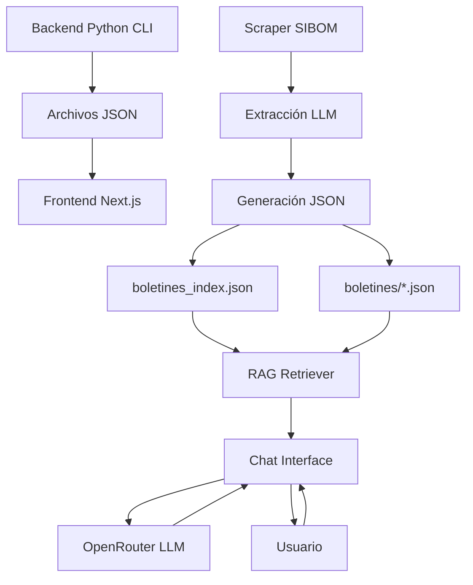
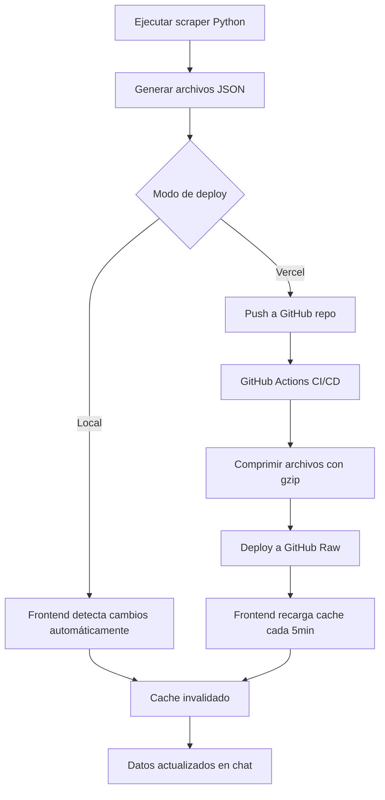
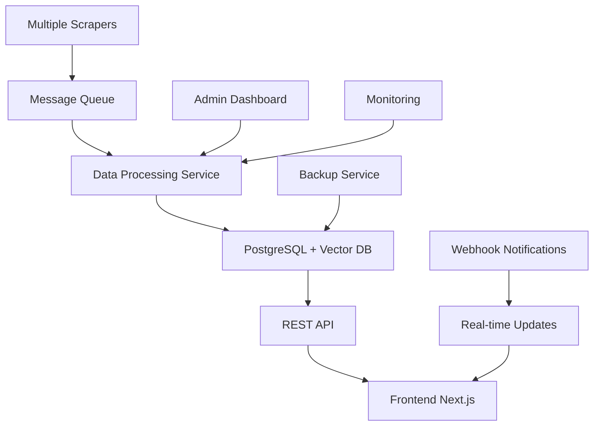

# Spec 04: Integración Backend-Frontend

## Información General

**Proyecto:** SIBOM Scraper Assistant - Integración de Sistemas  
**Componentes:** Backend Python CLI + Frontend Next.js  
**Propósito:** Análisis de la comunicación, flujo de datos y arquitectura híbrida  
**Patrón:** Producer-Consumer con almacenamiento JSON intermedio  

## Arquitectura de Integración

### Modelo de Comunicación



### Patrón Arquitectónico

**Tipo:** Desacoplado por archivos (File-based Integration)  
**Ventajas:**
- ✅ Independencia total entre backend y frontend
- ✅ Escalabilidad horizontal (múltiples scrapers → mismo frontend)
- ✅ Tolerancia a fallos (frontend funciona aunque backend esté offline)
- ✅ Versionado de datos (archivos JSON como snapshots)
- ✅ Deploy independiente (backend en cron, frontend en Vercel)

**Desventajas:**
- ❌ No hay comunicación en tiempo real
- ❌ Sincronización manual requerida
- ❌ Duplicación de datos (JSON + posible DB futura)

## Flujo de Datos Completo

### 1. Fase de Scraping (Backend Python)

```python
# python-cli/sibom_scraper.py - Flujo principal
def main():
    # 1. Configuración inicial
    scraper = SibomScraper(
        base_url="https://sibom.slyt.gba.gob.ar/cities/15",  # Carlos Tejedor
        output_dir="boletines",
        openrouter_api_key=os.getenv("OPENROUTER_API_KEY")
    )
    
    # 2. Scraping de listado principal
    bulletins = scraper.extract_bulletin_list()
    # Resultado: [{"number": "358", "date": "31/12/2024", "description": "...", "link": "/bulletins/358"}]
    
    # 3. Procesamiento paralelo de boletines
    for bulletin in bulletins:
        # 3.1. Extraer enlaces de documentos
        document_links = scraper.extract_document_links(bulletin["link"])
        
        # 3.2. Extraer texto completo de cada documento
        full_texts = []
        for link in document_links:
            text = scraper.extract_full_text(link)
            full_texts.append(text)
        
        # 3.3. Generar archivo JSON individual
        output_file = f"boletines/boletin_{bulletin['number']}.json"
        save_json({
            "bulletin_info": bulletin,
            "documents": document_links,
            "fullText": "\n\n".join(full_texts)
        }, output_file)
    
    # 4. Generar índice consolidado
    generate_index(bulletins)
```

### 2. Estructura de Archivos Generados

```
python-cli/
├── boletines_index.json          # Índice principal
├── boletines/                    # Contenido completo
│   ├── boletin_358.json         # Boletín individual
│   ├── boletin_357.json
│   └── ...
└── logs/                        # Logs de scraping
    └── scraping_2025-01-07.log
```

#### Formato del Índice Principal

```json
// boletines_index.json
[
  {
    "id": "carlos-tejedor-ordenanza-2929-2025",
    "municipality": "Carlos Tejedor",
    "type": "ordenanza",
    "number": "2929",
    "title": "Ordenanza Fiscal N° 2929/2025",
    "date": "31/12/2024",
    "url": "/bulletins/358",
    "status": "vigente",
    "filename": "boletin_358.json",
    "documentTypes": ["ordenanza", "decreto", "resolucion"]
  }
]
```

#### Formato de Archivo Individual

```json
// boletines/boletin_358.json
{
  "bulletin_info": {
    "number": "358",
    "date": "31/12/2024",
    "description": "Boletín Oficial Municipal",
    "link": "/bulletins/358"
  },
  "documents": [
    "https://sibom.slyt.gba.gob.ar/documents/12345",
    "https://sibom.slyt.gba.gob.ar/documents/12346"
  ],
  "fullText": "ORDENANZA N° 2929/2025\n\nVISTO: El presupuesto municipal...\n\nCONSIDERANDO: Que es necesario...\n\nEL HONORABLE CONCEJO DELIBERANTE ORDENA:\n\nArtículo 1°: ..."
}
```

### 3. Fase de Consumo (Frontend Next.js)

```typescript
// chatbot/src/lib/rag/retriever.ts - Carga de datos
export async function loadIndex(): Promise<IndexEntry[]> {
  // 1. Determinar fuente de datos
  const useGitHub = !!process.env.GITHUB_DATA_REPO;
  
  if (useGitHub) {
    // Modo Vercel: GitHub Raw
    const url = `https://raw.githubusercontent.com/${process.env.GITHUB_DATA_REPO}/main/boletines_index.json`;
    const response = await fetch(url, { cache: 'force-cache' });
    return await response.json();
  } else {
    // Modo local: filesystem
    const indexPath = path.join(process.cwd(), '..', 'python-cli', 'boletines_index.json');
    const content = await fs.readFile(indexPath, 'utf-8');
    return JSON.parse(content);
  }
}

// Carga de contenido individual
async function readFileContent(filename: string): Promise<any> {
  if (useGitHub()) {
    const url = `https://raw.githubusercontent.com/${process.env.GITHUB_DATA_REPO}/main/boletines/${filename}`;
    const response = await fetch(url);
    return await response.json();
  } else {
    const filePath = path.join(process.cwd(), '..', 'python-cli', 'boletines', filename);
    const content = await fs.readFile(filePath, 'utf-8');
    return JSON.parse(content);
  }
}
```

## Configuraciones de Integración

### Variables de Entorno Compartidas

```bash
# Backend Python (.env)
OPENROUTER_API_KEY=sk-or-v1-...
BASE_URL=https://sibom.slyt.gba.gob.ar/cities/15
OUTPUT_DIR=boletines
PARALLEL_WORKERS=3
RATE_LIMIT_DELAY=3

# Frontend Next.js (.env.local)
OPENROUTER_API_KEY=sk-or-v1-...
LLM_MODEL_PRIMARY=anthropic/claude-3.5-sonnet
LLM_MODEL_ECONOMIC=google/gemini-flash-1.5

# Configuración híbrida (para Vercel)
GITHUB_DATA_REPO=usuario/sibom-data
GITHUB_DATA_BRANCH=main
GITHUB_USE_GZIP=true
DATA_PATH=/path/to/python-cli
```

### Dependencias Compartidas

#### Backend Python
```txt
# python-cli/requirements.txt
openai>=1.0.0          # Cliente OpenRouter
requests>=2.31.0       # HTTP requests
python-dotenv>=1.0.0   # Variables de entorno
rich>=13.0.0           # UI de terminal
beautifulsoup4>=4.12.0 # Parsing HTML
lxml>=4.9.0            # Parser XML/HTML rápido
```

#### Frontend Next.js
```json
// chatbot/package.json - Dependencias clave para integración
{
  "@ai-sdk/openai": "^1.0.0",    // Cliente OpenRouter (mismo que Python)
  "ai": "^4.1.0",                // Vercel AI SDK
  "zod": "^3.25.76"              // Validación de tipos (JSON schema)
}
```

## Sincronización de Datos

### Estrategias de Actualización

#### 1. Modo Local (Desarrollo)

```typescript
// Detección automática de cambios
async function hasIndexFileChanged(): Promise<boolean> {
  const indexPath = path.join(process.cwd(), '..', 'python-cli', 'boletines_index.json');
  
  try {
    const stats = await fs.stat(indexPath);
    const fileModTime = stats.mtimeMs;
    
    if (lastFileModTime === 0 || fileModTime > lastFileModTime) {
      lastFileModTime = fileModTime;
      return true;
    }
    return false;
  } catch (error) {
    return false;
  }
}
```

#### 2. Modo GitHub (Producción)

```typescript
// Cache con TTL fijo
const CACHE_DURATION = 5 * 60 * 1000; // 5 minutos

if (indexCache.length > 0 && Date.now() - cacheTimestamp < CACHE_DURATION) {
  return indexCache; // Usar cache
}

// Recargar desde GitHub
const data = await fetchGitHubIndex();
indexCache = data;
cacheTimestamp = Date.now();
```

### Workflow de Actualización



## Optimizaciones de Integración

### 1. Compresión de Datos

```bash
# Comprimir archivos para GitHub (reduce bandwidth 70-80%)
gzip -9 boletines_index.json
gzip -9 boletines/*.json

# Frontend descomprime automáticamente
const decompressed = await gunzipAsync(uint8Array);
```

### 2. Cache Multi-nivel

```typescript
// Nivel 1: Cache de índice (5 minutos)
let indexCache: IndexEntry[] = [];
let cacheTimestamp: number = 0;

// Nivel 2: Cache de archivos individuales (30 minutos)
const fileCache = new Map<string, FileCacheEntry>();
const FILE_CACHE_DURATION = 30 * 60 * 1000;

// Nivel 3: Cache HTTP del navegador
const response = await fetch(url, {
  cache: 'force-cache',
  next: { revalidate: 3600 } // 1 hora
});
```

### 3. Carga Lazy de Contenido

```typescript
// Solo cargar contenido completo cuando se necesita para BM25
const docsWithContent: Array<{ entry: IndexEntry; content: string }> = [];

await Promise.all(filteredIndex.map(async (entry) => {
  try {
    const data = await readFileContent(entry.filename); // Cache hit probable
    docsWithContent.push({
      entry,
      content: data.fullText || ''
    });
  } catch (err) {
    // Fallar silenciosamente, continuar con otros documentos
    console.warn(`[RAG] Error cargando ${entry.filename}`);
  }
}));
```

## Testing de Integración

### Scripts de Prueba

#### Backend Testing
```python
# python-cli/test_integration.py
def test_json_output():
    """Verifica que el JSON generado sea válido para el frontend"""
    with open('boletines_index.json', 'r') as f:
        index = json.load(f)
    
    # Validar estructura
    assert isinstance(index, list)
    for entry in index:
        assert 'id' in entry
        assert 'municipality' in entry
        assert 'filename' in entry
        
        # Verificar que el archivo referenciado existe
        filepath = f"boletines/{entry['filename']}"
        assert os.path.exists(filepath)
```

#### Frontend Testing
```typescript
// chatbot/test-retriever.ts
async function testIntegration() {
  // 1. Verificar carga de índice
  const stats = await getDatabaseStats();
  console.log('Documentos disponibles:', stats.totalDocuments);
  
  // 2. Probar búsqueda básica
  const result = await retrieveContext('ordenanza fiscal 2025', {
    municipality: 'Carlos Tejedor',
    limit: 3
  });
  
  // 3. Verificar estructura de respuesta
  assert(result.context.length > 0);
  assert(result.sources.length > 0);
  assert(result.sources[0].url.includes('sibom.slyt.gba.gob.ar'));
}
```

### Validación de Esquemas

```typescript
// Validación con Zod
import { z } from 'zod';

const IndexEntrySchema = z.object({
  id: z.string(),
  municipality: z.string(),
  type: z.enum(['ordenanza', 'decreto', 'boletin']),
  number: z.string(),
  title: z.string(),
  date: z.string().regex(/^\d{2}\/\d{2}\/\d{4}$/), // DD/MM/YYYY
  url: z.string(),
  status: z.string(),
  filename: z.string(),
  documentTypes: z.array(z.string()).optional()
});

const DocumentContentSchema = z.object({
  bulletin_info: z.object({
    number: z.string(),
    date: z.string(),
    description: z.string(),
    link: z.string()
  }),
  documents: z.array(z.string()),
  fullText: z.string()
});
```

## Monitoreo y Observabilidad

### Métricas de Integración

```typescript
// Estadísticas de cache
export function getCacheStats() {
  return {
    indexCacheHits: indexCacheHits,
    indexCacheMisses: indexCacheMisses,
    fileCacheSize: fileCache.size,
    fileCacheHitRate: fileCacheHits / (fileCacheHits + fileCacheMisses),
    lastIndexUpdate: new Date(cacheTimestamp).toISOString(),
    dataSource: useGitHub() ? 'GitHub' : 'Local'
  };
}

// Logs estructurados
console.log(`[RAG] Índice cargado: ${indexCache.length} documentos (fuente: ${useGitHub() ? 'GitHub' : 'local'})`);
console.log(`[RAG] Cache: ${fileCache.size} archivos en memoria`);
console.log(`[RAG] Query "${query}" completada en ${duration}ms`);
```

### Health Checks

```typescript
// Endpoint de salud
export async function GET() {
  try {
    const stats = await getDatabaseStats();
    const cacheStats = getCacheStats();
    
    return Response.json({
      status: 'healthy',
      timestamp: new Date().toISOString(),
      database: {
        totalDocuments: stats.totalDocuments,
        municipalities: stats.municipalities,
        lastUpdated: stats.lastUpdated
      },
      cache: cacheStats,
      integration: {
        dataSource: useGitHub() ? 'GitHub' : 'Local',
        githubRepo: process.env.GITHUB_DATA_REPO || null
      }
    });
  } catch (error) {
    return Response.json({
      status: 'unhealthy',
      error: error.message
    }, { status: 500 });
  }
}
```

## Evolución Futura

### Limitaciones Actuales

1. **No hay tiempo real:** Cambios en backend no se reflejan inmediatamente
2. **Sincronización manual:** Requiere ejecutar scraper + push a GitHub
3. **Sin versionado:** No hay historial de cambios en los datos
4. **Escalabilidad limitada:** Un repo por municipio no escala a 135 municipios

### Arquitectura Futura Propuesta



### Migración Gradual

**Fase 1 (Actual):** File-based integration  
**Fase 2:** Hybrid (Files + API endpoints)  
**Fase 3:** Full API-based architecture  
**Fase 4:** Real-time with WebSockets  

---

**Última actualización:** 2026-01-07  
**Estado:** Integración estable con optimizaciones implementadas  
**Próximo milestone:** Evaluación de migración a arquitectura API-based