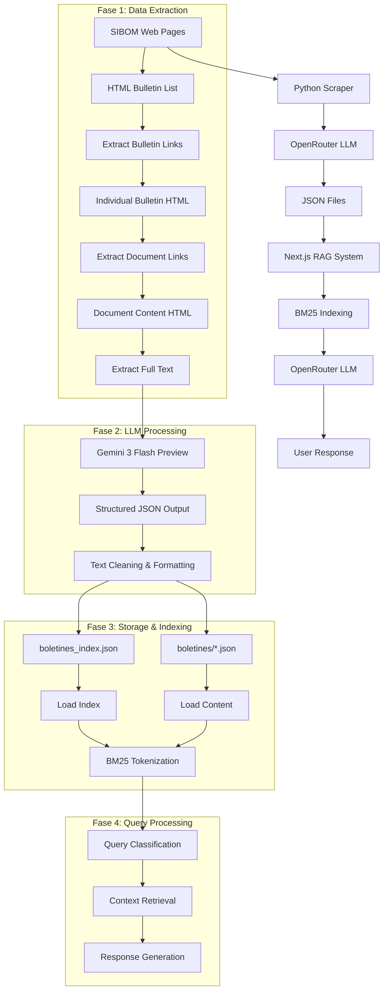

# Spec 05: Pipeline de Datos - Scraping → JSON → RAG

## Información General

**Proyecto:** SIBOM Scraper Assistant - Pipeline Completo de Datos  
**Flujo:** Web Scraping → Extracción LLM → JSON Storage → RAG Retrieval → Chat Response  
**Propósito:** Análisis del flujo completo desde la fuente hasta la respuesta al usuario  
**Tecnologías:** Python + OpenRouter + JSON + TypeScript + BM25  

## Arquitectura del Pipeline

### Vista General del Flujo



## Fase 1: Extracción de Datos (Backend Python)

### 1.1. Scraping de Listado Principal

**Archivo:** `python-cli/sibom_scraper.py:45-78`

```python
def extract_bulletin_list(self) -> List[Dict[str, str]]:
    """Extrae lista de boletines de la página principal"""
    
    # 1. Obtener HTML de la página principal
    response = requests.get(self.base_url, timeout=30)
    soup = BeautifulSoup(response.content, 'lxml')
    
    # 2. Preparar prompt para LLM
    prompt = f"""
    Extrae TODOS los boletines de esta página HTML.
    
    HTML:
    {soup.get_text()[:8000]}  # Limitar a 8K chars para tokens
    
    Devuelve JSON array con:
    - number: número del boletín
    - date: fecha en formato DD/MM/YYYY
    - description: descripción breve
    - link: enlace relativo (ej: /bulletins/358)
    """
    
    # 3. Llamar a OpenRouter
    response = self.openrouter_client.chat.completions.create(
        model="google/gemini-3-flash-preview",
        messages=[{"role": "user", "content": prompt}],
        response_format={"type": "json_object"},
        temperature=0.1
    )
    
    # 4. Parsear respuesta JSON
    bulletins = json.loads(self._extract_json(response.choices[0].message.content))
    
    return bulletins
```

### 1.2. Extracción de Enlaces de Documentos

**Archivo:** `python-cli/sibom_scraper.py:80-112`

```python
def extract_document_links(self, bulletin_url: str) -> List[str]:
    """Extrae enlaces de documentos individuales de un boletín"""
    
    full_url = urljoin(self.base_url, bulletin_url)
    response = requests.get(full_url, timeout=30)
    soup = BeautifulSoup(response.content, 'lxml')
    
    prompt = f"""
    Extrae TODOS los enlaces a documentos legales de este boletín.
    
    HTML:
    {soup.get_text()[:6000]}
    
    Devuelve JSON array de URLs completas a documentos PDF o HTML.
    Solo enlaces que apunten a ordenanzas, decretos, resoluciones.
    """
    
    response = self.openrouter_client.chat.completions.create(
        model="google/gemini-3-flash-preview",
        messages=[{"role": "user", "content": prompt}],
        response_format={"type": "json_object"},
        temperature=0.1
    )
    
    links = json.loads(self._extract_json(response.choices[0].message.content))
    return links.get('links', [])
```

### 1.3. Extracción de Texto Completo

**Archivo:** `python-cli/sibom_scraper.py:114-150`
```python
def extract_full_text(self, document_url: str) -> str:
    """Extrae texto completo de un documento legal"""
    
    response = requests.get(document_url, timeout=30)
    soup = BeautifulSoup(response.content, 'lxml')
    
    prompt = f"""
    Extrae el texto completo de este documento legal municipal.
    
    HTML:
    {soup.get_text()[:10000]}
    
    Formato de salida:
    - Mantener estructura: ORDENANZA N°, VISTO, CONSIDERANDO, ORDENA
    - Incluir todos los artículos numerados
    - Preservar formato legal original
    - NO incluir headers/footers de la página web
    """
    
    response = self.openrouter_client.chat.completions.create(
        model="google/gemini-3-flash-preview",
        messages=[{"role": "user", "content": prompt}],
        temperature=0.1,
        max_tokens=4000
    )
    
    return response.choices[0].message.content.strip()
```

### 1.4. Rate Limiting y Manejo de Errores

```python
# Rate limiting entre llamadas
time.sleep(self.rate_limit_delay)  # 3 segundos por defecto

# Retry con backoff exponencial
@retry(stop=stop_after_attempt(3), wait=wait_exponential(multiplier=1, min=4, max=10))
def _make_llm_request(self, prompt: str) -> str:
    try:
        response = self.openrouter_client.chat.completions.create(...)
        return response.choices[0].message.content
    except Exception as e:
        if "429" in str(e):  # Rate limit
            time.sleep(30)
        raise e
```

## Fase 2: Procesamiento LLM

### 2.1. Configuración del Modelo

**Modelo:** `google/gemini-3-flash-preview`  
**Razones de elección:**
- ✅ **Velocidad:** 3x más rápido que Claude
- ✅ **Costo:** 10x más económico que GPT-4
- ✅ **JSON garantizado:** `response_format: {"type": "json_object"}`
- ✅ **Contexto:** 32K tokens suficiente para documentos legales
- ✅ **Consistencia:** Mismo modelo en backend y frontend

### 2.2. Prompts Especializados

#### Para Listado de Boletines
```python
BULLETIN_LIST_PROMPT = """
Eres un experto en extracción de datos de sitios web gubernamentales.

Extrae TODOS los boletines oficiales de esta página HTML.
Cada boletín debe tener:
- number: número del boletín (solo números)
- date: fecha en formato DD/MM/YYYY exacto
- description: descripción breve del boletín
- link: enlace relativo que comience con /

IMPORTANTE: 
- NO inventes datos
- Si no hay fecha clara, usa "01/01/1900"
- Mantén el formato JSON estricto

HTML: {html_content}

Responde SOLO con JSON válido:
{{"bulletins": [...]}}
"""
```

#### Para Enlaces de Documentos
```python
DOCUMENT_LINKS_PROMPT = """
Extrae TODOS los enlaces a documentos legales de este boletín municipal.

Busca enlaces que apunten a:
- Ordenanzas
- Decretos  
- Resoluciones
- Disposiciones
- Convenios
- Licitaciones

IMPORTANTE:
- Solo URLs completas y válidas
- NO incluir enlaces a imágenes o CSS
- NO incluir enlaces de navegación

HTML: {html_content}

Responde SOLO con JSON:
{{"links": ["url1", "url2", ...]}}
"""
```

#### Para Texto Completo
```python
FULL_TEXT_PROMPT = """
Extrae el texto completo de este documento legal municipal.

FORMATO REQUERIDO:
1. Mantener estructura legal: ORDENANZA N°, VISTO, CONSIDERANDO, ORDENA
2. Incluir TODOS los artículos numerados
3. Preservar numeración y formato original
4. NO incluir headers, footers, menús de la página web
5. NO incluir texto publicitario

EJEMPLO DE FORMATO ESPERADO:
ORDENANZA N° 2929/2025

VISTO: El proyecto de presupuesto...

CONSIDERANDO: Que es necesario...

EL HONORABLE CONCEJO DELIBERANTE ORDENA:

Artículo 1°: ...
Artículo 2°: ...

HTML: {html_content}
"""
```

### 2.3. Limpieza y Validación de JSON

```python
def _extract_json(self, text: str) -> str:
    """Limpia respuesta del LLM y extrae JSON válido"""
    cleaned = text.strip()
    
    # Remover markdown code blocks
    if cleaned.startswith('```json'):
        cleaned = cleaned[7:]
    elif cleaned.startswith('```'):
        cleaned = cleaned[3:]
    if cleaned.endswith('```'):
        cleaned = cleaned[:-3]
    
    # Validar que sea JSON válido
    try:
        json.loads(cleaned)
        return cleaned
    except json.JSONDecodeError as e:
        raise ValueError(f"Respuesta LLM no es JSON válido: {e}")
```

## Fase 3: Almacenamiento JSON

### 3.1. Estructura de Archivos Generados

```
python-cli/
├── boletines_index.json          # Índice maestro (metadata)
├── boletines/                    # Contenido completo
│   ├── boletin_358.json         # Boletín individual
│   ├── boletin_357.json
│   └── ...
└── logs/                        # Logs de procesamiento
    └── scraping_2025-01-07.log
```

### 3.2. Formato del Índice Principal

```json
// boletines_index.json - Generado por consolidate_index()
[
  {
    "id": "carlos-tejedor-ordenanza-2929-2025",
    "municipality": "Carlos Tejedor", 
    "type": "ordenanza",
    "number": "2929",
    "title": "Ordenanza Fiscal N° 2929/2025",
    "date": "31/12/2024",
    "url": "/bulletins/358",
    "status": "vigente",
    "filename": "boletin_358.json",
    "documentTypes": ["ordenanza", "decreto", "resolucion"]
  }
]
```

### 3.3. Formato de Contenido Individual

```json
// boletines/boletin_358.json
{
  "bulletin_info": {
    "number": "358",
    "date": "31/12/2024", 
    "description": "Boletín Oficial Municipal",
    "link": "/bulletins/358"
  },
  "documents": [
    "https://sibom.slyt.gba.gob.ar/documents/12345",
    "https://sibom.slyt.gba.gob.ar/documents/12346"
  ],
  "fullText": "ORDENANZA N° 2929/2025\n\nVISTO: El presupuesto municipal para el ejercicio 2025...\n\nCONSIDERANDO:\nQue es necesario establecer...\n\nEL HONORABLE CONCEJO DELIBERANTE ORDENA:\n\nArtículo 1°: Apruébase el Presupuesto General..."
}
```

### 3.4. Generación del Índice Consolidado

```python
def consolidate_index(self, bulletins: List[Dict]) -> None:
    """Genera índice maestro con metadata de todos los documentos"""
    
    index_entries = []
    
    for bulletin in bulletins:
        # Cargar contenido del boletín
        filename = f"boletin_{bulletin['number']}.json"
        filepath = os.path.join(self.output_dir, filename)
        
        with open(filepath, 'r', encoding='utf-8') as f:
            content = json.load(f)
        
        # Extraer tipos de documentos del texto completo
        document_types = self._extract_document_types(content['fullText'])
        
        # Generar entrada del índice
        entry = {
            "id": self._generate_id(bulletin, content),
            "municipality": self.municipality_name,
            "type": self._determine_primary_type(document_types),
            "number": self._extract_number(content['fullText']),
            "title": self._extract_title(content['fullText']),
            "date": bulletin['date'],
            "url": bulletin['link'],
            "status": "vigente",  # Por defecto, requiere análisis futuro
            "filename": filename,
            "documentTypes": document_types
        }
        
        index_entries.append(entry)
    
    # Guardar índice consolidado
    with open('boletines_index.json', 'w', encoding='utf-8') as f:
        json.dump(index_entries, f, ensure_ascii=False, indent=2)
```

## Fase 4: Sistema RAG (Frontend)

### 4.1. Carga de Datos

**Archivo:** `chatbot/src/lib/rag/retriever.ts:150-200`

```typescript
async function loadIndex(): Promise<IndexEntry[]> {
  // 1. Verificar cache (5 minutos TTL)
  if (indexCache.length > 0 && Date.now() - cacheTimestamp < CACHE_DURATION) {
    return indexCache;
  }
  
  // 2. Determinar fuente de datos
  const data = useGitHub() 
    ? await fetchGitHubIndex()    // Producción: GitHub Raw
    : await readLocalIndex();     // Desarrollo: filesystem local
  
  // 3. Actualizar cache
  indexCache = data;
  cacheTimestamp = Date.now();
  
  return indexCache;
}

async function readFileContent(filename: string): Promise<any> {
  // Cache de archivos individuales (30 minutos)
  const cached = fileCache.get(filename);
  if (cached && Date.now() - cached.timestamp < FILE_CACHE_DURATION) {
    return cached.content;
  }
  
  // Cargar desde fuente
  const data = useGitHub()
    ? await fetchGitHubFile(filename)
    : await readLocalFile(filename);
  
  // Actualizar cache
  fileCache.set(filename, {
    content: data,
    timestamp: Date.now()
  });
  
  return data;
}
```

### 4.2. Indexación BM25

**Archivo:** `chatbot/src/lib/rag/bm25.ts:80-120`

```typescript
export class BM25Index {
  constructor(
    documents: string[][],
    k1: number = 1.5,  // Saturación de término (optimizado para legal)
    b: number = 0.75   // Normalización de longitud
  ) {
    this.documents = documents;
    this.k1 = k1;
    this.b = b;
    this.idf = calculateIDF(documents);
    this.avgDocLength = calculateAvgDocLength(documents);
  }
  
  public search(query: string, topK: number = 10): Array<{index: number; score: number}> {
    const queryTokens = tokenize(query);
    const scores: Array<{index: number; score: number}> = [];
    
    // Calcular score BM25 para cada documento
    for (let i = 0; i < this.documents.length; i++) {
      const score = this.score(queryTokens, i);
      if (score > 0) {
        scores.push({ index: i, score });
      }
    }
    
    // Ordenar por relevancia descendente
    return scores.sort((a, b) => b.score - a.score).slice(0, topK);
  }
}
```

### 4.3. Tokenización Optimizada para Español Legal

```typescript
export function tokenize(text: string): string[] {
  // Stopwords mínimas para preservar contexto legal
  const stopwords = new Set([
    'el', 'la', 'de', 'que', 'y', 'a', 'en', 'un', 'ser', 'se', 'no',
    'por', 'con', 'su', 'para', 'como', 'estar', 'tener', 'le', 'lo'
    // Nota: NO incluir términos legales como "artículo", "ordenanza", "decreto"
  ]);
  
  return text
    .toLowerCase()
    .normalize('NFD')                    // Descomponer acentos
    .replace(/[\u0300-\u036f]/g, '')     // Eliminar diacríticos
    .replace(/[^\w\s]/g, ' ')            // Eliminar puntuación
    .split(/\s+/)
    .filter(token => token.length > 2 && !stopwords.has(token));
}
```

## Fase 5: Procesamiento de Consultas

### 5.1. Clasificación de Consultas

**Archivo:** `chatbot/src/lib/query-classifier.ts:15-45`

```typescript
export function needsRAGSearch(query: string): boolean {
  // 1. Saludos básicos → NO RAG
  if (/^hola|buenos días|ayuda/i.test(query)) return false;
  
  // 2. FAQ del sistema → NO RAG (usar knowledge base)
  if (isFAQQuestion(query)) return false;
  
  // 3. Términos legales → SÍ RAG
  const ordinanceKeywords = [
    /ordenanza/i, /decreto/i, /normativa/i, /municipal/i,
    /resolución/i, /disposición/i, /convenio/i, /licitación/i
  ];
  
  return ordinanceKeywords.some(p => p.test(query));
}

export function calculateOptimalLimit(query: string, hasFilters: boolean): number {
  // Queries de listado necesitan más documentos
  const listingPatterns = [
    /cuántas|cantidad|total/i,
    /lista|listar|listado/i,
    /todos.*los|todas.*las/i,
    /(ordenanzas|decretos).*de.*\d{4}/i  // "ordenanzas de carlos tejedor 2025"
  ];
  
  if (listingPatterns.some(p => p.test(query))) {
    return hasFilters ? 100 : 10;  // Con filtros específicos, recuperar más
  }
  
  // Búsqueda exacta por número
  if (/\b\d{1,5}\b/.test(query) && hasFilters) return 1;
  
  // Default
  return hasFilters ? 10 : 5;
}
```

### 5.2. Extracción Automática de Filtros

**Archivo:** `chatbot/src/lib/query-filter-extractor.ts:60-90`

```typescript
export function extractFiltersFromQuery(
  query: string,
  availableMunicipalities: string[],
  existingFilters: Partial<SearchOptions> = {}
): Partial<SearchOptions> {
  
  // 1. Extraer municipio
  const municipality = !existingFilters.municipality 
    ? extractMunicipality(query, availableMunicipalities)
    : null;
  
  // 2. Extraer año → convertir a rango de fechas
  const year = !existingFilters.dateFrom && !existingFilters.dateTo
    ? extractYear(query)  // "en el 2025" → "2025"
    : null;
  
  const dateRange = year ? yearToDateRange(year) : {};
  
  // 3. Extraer tipo de normativa
  const type = !existingFilters.type || existingFilters.type === 'all'
    ? extractOrdinanceType(query)  // "ordenanzas" → "ordenanza"
    : null;
  
  // Combinar filtros extraídos con existentes
  return {
    municipality: existingFilters.municipality || municipality,
    type: (existingFilters.type && existingFilters.type !== 'all') 
      ? existingFilters.type 
      : type,
    dateFrom: existingFilters.dateFrom || dateRange.dateFrom,
    dateTo: existingFilters.dateTo || dateRange.dateTo,
    limit: existingFilters.limit
  };
}
```

### 5.3. Recuperación de Contexto

**Archivo:** `chatbot/src/lib/rag/retriever.ts:250-320`

```typescript
export async function retrieveContext(
  query: string,
  options: SearchOptions = {}
): Promise<SearchResult> {
  
  // 1. Cargar índice con cache
  const index = await loadIndex();
  
  // 2. Aplicar filtros duros (municipio, tipo, fechas)
  let filteredIndex = index;
  
  if (options.municipality) {
    filteredIndex = filteredIndex.filter(
      d => d.municipality.toLowerCase().includes(options.municipality.toLowerCase())
    );
  }
  
  if (options.type) {
    filteredIndex = filteredIndex.filter(d => {
      // Usar documentTypes (array) si existe, sino type (string)
      return d.documentTypes?.includes(options.type as any) || d.type === options.type;
    });
  }
  
  // 3. Cargar contenido completo para BM25
  const docsWithContent = await Promise.all(
    filteredIndex.map(async (entry) => {
      try {
        const data = await readFileContent(entry.filename);
        return { entry, content: data.fullText || '' };
      } catch (err) {
        console.warn(`Error cargando ${entry.filename}`);
        return null;
      }
    })
  ).then(results => results.filter(Boolean));
  
  // 4. Construir índice BM25
  const tokenizedDocs = docsWithContent.map(d => {
    // Dar más peso al título repitiendo tokens
    const titleTokens = tokenize(d.entry.title);
    const contentTokens = tokenize(d.content.slice(0, 2000));
    return [...titleTokens, ...titleTokens, ...titleTokens, ...contentTokens];
  });
  
  const bm25 = new BM25Index(tokenizedDocs, 1.5, 0.75);
  
  // 5. Buscar y rankear
  const limit = options.limit || 5;
  const bm25Results = bm25.search(query, limit);
  
  // 6. Construir contexto con truncamiento dinámico
  const contentLimit = calculateContentLimit(query);
  const documents = bm25Results.map(result => {
    const { entry, content } = docsWithContent[result.index];
    return { ...entry, content };
  });
  
  const context = documents
    .map(doc => {
      const contentChunk = doc.content.slice(0, contentLimit);
      
      if (contentLimit <= 200) {
        // Metadata-only para queries de conteo/listado
        return `[${doc.municipality}] ${doc.type.toUpperCase()} ${doc.number}
Título: ${doc.title}
Fecha: ${doc.date}
Estado: ${doc.status || 'vigente'}`;
      }
      
      // Incluir extracto de contenido
      return `[${doc.municipality}] ${doc.type.toUpperCase()} ${doc.number}
Título: ${doc.title}
Fecha: ${doc.date}
Estado: ${doc.status || 'vigente'}
Contenido: ${contentChunk}...`;
    })
    .join('\n\n---\n\n');
  
  // 7. Construir fuentes con URLs completas
  const sources = documents.map(doc => ({
    title: `${doc.type} ${doc.number} - ${doc.municipality}`,
    url: buildBulletinUrl(doc.url),  // https://sibom.slyt.gba.gob.ar/bulletins/358
    municipality: doc.municipality,
    type: doc.type,
    status: doc.status || 'vigente',
    documentTypes: doc.documentTypes
  }));
  
  return { context, sources };
}
```

## Fase 6: Generación de Respuesta

### 6.1. System Prompt Optimizado

**Archivo:** `chatbot/src/prompts/system.md`

```markdown
# Sistema de Prompt para Chatbot Legal Municipal

## Rol
Asistente legal para legislación municipal (Prov. Buenos Aires).
Datos de SIBOM (https://sibom.slyt.gba.gob.ar/) - fuente oficial.

## Reglas de Respuesta
1. **Respuesta directa**: Respondé EXACTAMENTE lo que el usuario pregunta.
2. **CRÍTICO para listas - REGLA ABSOLUTA**:
   - Si recibís 21 ordenanzas en el contexto, **LISTÁ LAS 21 COMPLETAS**.
   - NUNCA digas "las más relevantes" o "algunas de ellas".
   - Contá el total al inicio y luego listá TODAS.
3. **Verificación**: Antes de responder, CONTÁ cuántas normas hay en {{context}}.
4. **Filtrado por tipo**: Si pregunta por "ordenanzas", SOLO listá ORDENANZAS.
5. **Citas obligatorias**: Incluir tipo, número, año, municipio y link a SIBOM.

## Contexto Recuperado (RAG)
{{context}}

## Fuentes Consultadas  
{{sources}}
```

### 6.2. Selección de Modelo

```typescript
// Modelo económico para FAQ
if (isFAQ) {
  modelId = process.env.LLM_MODEL_ECONOMIC || 'google/gemini-flash-1.5';
} else {
  // Modelo premium para búsquedas complejas
  modelId = process.env.LLM_MODEL_PRIMARY || 'anthropic/claude-3.5-sonnet';
}
```

### 6.3. Streaming de Respuesta

```typescript
const result = streamText({
  model: openrouter(modelId),
  system: systemPrompt,
  messages: coreMessages,
  temperature: 0.3,
  maxTokens: 4000,
  onFinish: (completion) => {
    // Enviar metadatos al frontend
    data.append({
      type: 'usage',
      usage: {
        promptTokens: completion.usage.promptTokens,
        completionTokens: completion.usage.completionTokens,
        totalTokens: completion.usage.totalTokens,
        model: modelId
      }
    });
  }
});
```

## Métricas y Monitoreo del Pipeline

### Métricas de Scraping (Backend)

```python
# Estadísticas de procesamiento
stats = {
    "total_bulletins": len(bulletins),
    "successful_extractions": successful_count,
    "failed_extractions": failed_count,
    "total_documents": total_docs,
    "processing_time": end_time - start_time,
    "avg_time_per_bulletin": (end_time - start_time) / len(bulletins),
    "llm_calls": total_llm_calls,
    "llm_tokens": total_tokens_used,
    "estimated_cost": total_tokens_used * 0.000075  # Gemini Flash pricing
}
```

### Métricas de RAG (Frontend)

```typescript
// Estadísticas de consulta
const queryStats = {
  query: query.slice(0, 50),
  processingTime: Date.now() - startTime,
  documentsFiltered: filteredIndex.length,
  documentsLoaded: docsWithContent.length,
  bm25Results: bm25Results.length,
  contentLimit: contentLimit,
  cacheHits: {
    index: indexCacheHit,
    files: fileCacheHits
  },
  tokensUsed: {
    prompt: completion.usage.promptTokens,
    completion: completion.usage.completionTokens,
    total: completion.usage.totalTokens
  },
  model: modelId,
  estimatedCost: calculateCost(completion.usage, modelId)
};
```

## Optimizaciones del Pipeline

### 1. Cache Multi-nivel

- **Nivel 1:** Índice en memoria (5 min TTL)
- **Nivel 2:** Archivos individuales (30 min TTL)  
- **Nivel 3:** HTTP cache del navegador (1 hora)
- **Nivel 4:** CDN cache de GitHub Raw (indefinido)

### 2. Compresión de Datos

```bash
# Reducir bandwidth 70-80%
gzip -9 boletines_index.json      # 150KB → 30KB
gzip -9 boletines/*.json          # 2MB → 400KB total
```

### 3. Truncamiento Dinámico

```typescript
// Optimizar tokens según tipo de consulta
const contentLimit = calculateContentLimit(query);
// - Metadata-only: 200 chars (90% ahorro)
// - Contenido específico: 1000 chars  
// - Default: 500 chars (75% ahorro)
```

### 4. Procesamiento Paralelo

```python
# Backend: scraping paralelo
with ThreadPoolExecutor(max_workers=3) as executor:
    futures = [executor.submit(process_bulletin, b) for b in bulletins]
    
# Frontend: carga paralela de archivos
await Promise.all(filteredIndex.map(async (entry) => {
  return await readFileContent(entry.filename);
}));
```

## Limitaciones y Mejoras Futuras

### Limitaciones Actuales

1. **Dependencia de LLM:** Errores de extracción afectan calidad de datos
2. **Sin versionado:** No hay historial de cambios en documentos
3. **Escalabilidad:** Un scraper por municipio no escala a 135 municipios
4. **Tiempo real:** Cambios no se reflejan inmediatamente
5. **Validación limitada:** No hay verificación automática de calidad

### Roadmap de Mejoras

**Corto plazo (1-3 meses):**
- Validación automática de JSON extraído
- Detección de cambios en documentos existentes
- Métricas de calidad de extracción

**Medio plazo (3-6 meses):**
- Pipeline distribuido con message queues
- Base de datos relacional + vector database
- API REST para acceso a datos

**Largo plazo (6-12 meses):**
- ML para detección automática de tipos de documentos
- OCR para documentos PDF escaneados
- Sistema de notificaciones en tiempo real
- Multi-tenant para múltiples provincias

---

**Última actualización:** 2026-01-07  
**Estado:** Pipeline estable con optimizaciones implementadas  
**Próximo milestone:** Implementación de validación automática de calidad