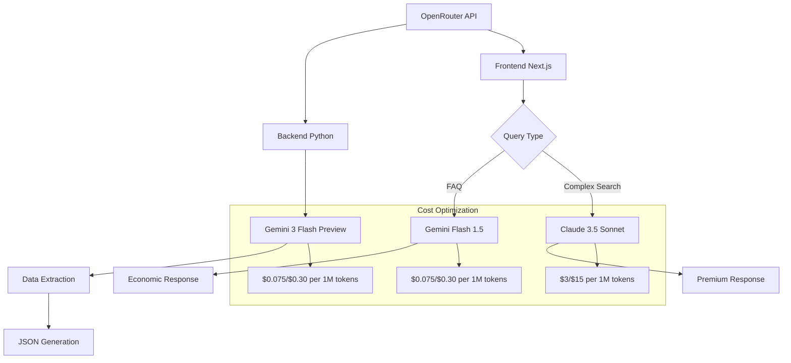

# Spec 06: Integración LLM - OpenRouter en Backend y Frontend

## Información General

**Proyecto:** SIBOM Scraper Assistant - Integración LLM Unificada  
**Proveedor:** OpenRouter (https://openrouter.ai)  
**Modelos:** Google Gemini + Anthropic Claude  
**Propósito:** Análisis de la estrategia LLM unificada entre backend Python y frontend Next.js  
**Patrón:** Dual-model strategy (económico + premium)  

## Arquitectura LLM

### Vista General de Modelos



### Estrategia de Modelos

| Componente | Modelo | Uso | Costo/1M tokens | Razón |
|------------|--------|-----|-----------------|-------|
| **Backend Python** | `google/gemini-3-flash-preview` | Data extraction | $0.075/$0.30 | JSON garantizado, velocidad |
| **Frontend FAQ** | `google/gemini-flash-1.5` | Preguntas simples | $0.075/$0.30 | 40x más económico |
| **Frontend Search** | `anthropic/claude-3.5-sonnet` | Búsquedas complejas | $3/$15 | Mejor razonamiento |

## Backend Python - Extracción de Datos

### Configuración del Cliente

**Archivo:** `python-cli/sibom_scraper.py:25-40`

```python
import openai
from openai import OpenAI

class SibomScraper:
    def __init__(self, base_url: str, output_dir: str, openrouter_api_key: str):
        # Configurar cliente OpenRouter
        self.openrouter_client = OpenAI(
            api_key=openrouter_api_key,
            base_url="https://openrouter.ai/api/v1",
            default_headers={
                "HTTP-Referer": "https://github.com/sibom-scraper-assistant",
                "X-Title": "SIBOM Scraper Assistant"
            }
        )
        
        # Configuración de modelo
        self.model = "google/gemini-3-flash-preview"
        self.rate_limit_delay = 3  # segundos entre llamadas
        self.max_retries = 3
```

### Prompts de Extracción Especializados

#### 1. Extracción de Lista de Boletines

```python
def extract_bulletin_list(self) -> List[Dict[str, str]]:
    """Extrae lista completa de boletines de la página principal"""
    
    prompt = f"""
    Eres un experto en extracción de datos de sitios web gubernamentales argentinos.
    
    TAREA: Extraer TODOS los boletines oficiales municipales de esta página HTML.
    
    FORMATO DE SALIDA REQUERIDO:
    {{
      "bulletins": [
        {{
          "number": "358",
          "date": "31/12/2024", 
          "description": "Boletín Oficial Municipal N° 358",
          "link": "/bulletins/358"
        }}
      ]
    }}
    
    REGLAS CRÍTICAS:
    1. Formato de fecha: DD/MM/YYYY exacto
    2. Links relativos que comiencen con /
    3. NO inventar datos - solo extraer lo que está visible
    4. Si no hay fecha clara, usar "01/01/1900"
    5. Incluir TODOS los boletines encontrados
    
    HTML DE LA PÁGINA:
    {html_content[:8000]}
    
    Responde ÚNICAMENTE con JSON válido:
    """
    
    response = self.openrouter_client.chat.completions.create(
        model=self.model,
        messages=[{"role": "user", "content": prompt}],
        response_format={"type": "json_object"},  # ✅ JSON garantizado
        temperature=0.1,  # Muy determinístico para extracción
        max_tokens=2000
    )
    
    return json.loads(self._extract_json(response.choices[0].message.content))
```

#### 2. Extracción de Enlaces de Documentos

```python
def extract_document_links(self, bulletin_url: str) -> List[str]:
    """Extrae todos los enlaces a documentos legales de un boletín"""
    
    prompt = f"""
    Eres un especialista en documentos legales municipales argentinos.
    
    TAREA: Extraer TODOS los enlaces a documentos legales de este boletín municipal.
    
    TIPOS DE DOCUMENTOS A BUSCAR:
    - Ordenanzas
    - Decretos
    - Resoluciones  
    - Disposiciones
    - Convenios
    - Licitaciones
    - Concursos
    
    FORMATO DE SALIDA:
    {{
      "links": [
        "https://sibom.slyt.gba.gob.ar/documents/12345",
        "https://sibom.slyt.gba.gob.ar/documents/12346"
      ]
    }}
    
    REGLAS:
    1. Solo URLs completas y válidas
    2. NO incluir enlaces a imágenes, CSS, JS
    3. NO incluir enlaces de navegación del sitio
    4. Verificar que apunten a documentos legales reales
    
    HTML DEL BOLETÍN:
    {html_content[:6000]}
    
    Responde ÚNICAMENTE con JSON válido:
    """
    
    response = self.openrouter_client.chat.completions.create(
        model=self.model,
        messages=[{"role": "user", "content": prompt}],
        response_format={"type": "json_object"},
        temperature=0.1,
        max_tokens=1500
    )
    
    result = json.loads(self._extract_json(response.choices[0].message.content))
    return result.get('links', [])
```

#### 3. Extracción de Texto Completo

```python
def extract_full_text(self, document_url: str) -> str:
    """Extrae texto completo preservando estructura legal"""
    
    prompt = f"""
    Eres un experto en documentos legales municipales argentinos.
    
    TAREA: Extraer el texto completo de este documento legal, preservando su estructura formal.
    
    ESTRUCTURA LEGAL ARGENTINA TÍPICA:
    - ORDENANZA N° XXXX/YYYY
    - VISTO: [fundamentos fácticos]
    - CONSIDERANDO: [fundamentos jurídicos]
    - EL HONORABLE CONCEJO DELIBERANTE ORDENA:
    - Artículo 1°: [disposición]
    - Artículo 2°: [disposición]
    - [etc.]
    
    REGLAS DE EXTRACCIÓN:
    1. Mantener TODA la numeración de artículos
    2. Preservar estructura: VISTO, CONSIDERANDO, ORDENA
    3. Incluir título completo con número y año
    4. NO incluir headers, footers, menús del sitio web
    5. NO incluir texto publicitario o de navegación
    6. Mantener saltos de línea para legibilidad
    7. Si hay tablas o anexos, incluirlos en formato texto
    
    EJEMPLO DE FORMATO ESPERADO:
    ORDENANZA N° 2929/2025
    
    VISTO: El proyecto de Presupuesto General...
    
    CONSIDERANDO:
    Que es necesario establecer...
    
    EL HONORABLE CONCEJO DELIBERANTE ORDENA:
    
    Artículo 1°: Apruébase el Presupuesto General...
    Artículo 2°: El presente Presupuesto...
    
    HTML DEL DOCUMENTO:
    {html_content[:10000]}
    
    Extrae ÚNICAMENTE el texto legal, sin comentarios adicionales:
    """
    
    response = self.openrouter_client.chat.completions.create(
        model=self.model,
        messages=[{"role": "user", "content": prompt}],
        temperature=0.1,  # Muy determinístico
        max_tokens=4000   # Documentos largos
    )
    
    return response.choices[0].message.content.strip()
```

### Manejo de Rate Limiting y Errores

```python
import time
from tenacity import retry, stop_after_attempt, wait_exponential

@retry(
    stop=stop_after_attempt(3),
    wait=wait_exponential(multiplier=1, min=4, max=10)
)
def _make_llm_request(self, prompt: str, **kwargs) -> str:
    """Realiza llamada a LLM con retry automático"""
    
    try:
        # Rate limiting
        time.sleep(self.rate_limit_delay)
        
        response = self.openrouter_client.chat.completions.create(
            model=self.model,
            messages=[{"role": "user", "content": prompt}],
            **kwargs
        )
        
        return response.choices[0].message.content
        
    except Exception as e:
        error_msg = str(e).lower()
        
        # Rate limit específico
        if "429" in error_msg or "rate limit" in error_msg:
            print(f"⚠️ Rate limit alcanzado. Esperando 30 segundos...")
            time.sleep(30)
            raise e
        
        # Errores de modelo
        if "model" in error_msg or "invalid" in error_msg:
            print(f"❌ Error de modelo: {e}")
            raise e
        
        # Otros errores
        print(f"⚠️ Error LLM (reintentando): {e}")
        raise e

def _extract_json(self, text: str) -> str:
    """Limpia respuesta del LLM y extrae JSON válido"""
    cleaned = text.strip()
    
    # Remover markdown code blocks comunes
    if cleaned.startswith('```json'):
        cleaned = cleaned[7:]
    elif cleaned.startswith('```'):
        cleaned = cleaned[3:]
    if cleaned.endswith('```'):
        cleaned = cleaned[:-3]
    
    cleaned = cleaned.strip()
    
    # Validar JSON antes de retornar
    try:
        json.loads(cleaned)
        return cleaned
    except json.JSONDecodeError as e:
        raise ValueError(f"Respuesta LLM no es JSON válido: {e}\nTexto: {cleaned[:200]}...")
```

## Frontend Next.js - Generación de Respuestas

### Configuración del Cliente

**Archivo:** `chatbot/src/app/api/chat/route.ts:25-45`

```typescript
import { createOpenAI } from '@ai-sdk/openai';

export async function POST(req: Request) {
  // Configurar OpenRouter dentro del request para acceso a env vars
  const openrouter = createOpenAI({
    apiKey: process.env.OPENROUTER_API_KEY,
    baseURL: 'https://openrouter.ai/api/v1',
    headers: {
      'HTTP-Referer': 'https://github.com/sibom-scraper-assistant',
      'X-Title': 'SIBOM Scraper Assistant',
    }
  });
  
  // Validar API key
  if (!process.env.OPENROUTER_API_KEY) {
    return new Response(
      JSON.stringify({ error: 'Configuración incompleta: Falta API Key' }), 
      { status: 500 }
    );
  }
}
```

### Estrategia Dual de Modelos

```typescript
// Determinar modelo según tipo de consulta
let modelId: string;

if (isFAQ) {
  // Modelo económico para FAQ: 40x más barato
  modelId = process.env.LLM_MODEL_ECONOMIC || 'google/gemini-flash-1.5';
  console.log(`[ChatAPI] Usando modelo económico para FAQ: ${modelId}`);
} else {
  // Modelo premium para búsquedas complejas
  modelId = process.env.LLM_MODEL_PRIMARY || 'anthropic/claude-3.5-sonnet';
  
  // Asegurar formato correcto para OpenRouter
  if (modelId.startsWith('claude-') && !modelId.includes('/')) {
    modelId = `anthropic/${modelId}`;
  }
  
  console.log(`[ChatAPI] Usando modelo premium para búsqueda: ${modelId}`);
}
```

### System Prompt Optimizado

**Archivo:** `chatbot/src/prompts/system.md`

```markdown
# Sistema de Prompt para Chatbot Legal Municipal

## Rol
Asistente legal para legislación municipal (Prov. Buenos Aires).
Datos de SIBOM (https://sibom.slyt.gba.gob.ar/) - fuente oficial.

**CRÍTICO**: Este chat es la alternativa superior al buscador de SIBOM.
- NO envíes usuarios a sibom.slyt.gba.gob.ar para buscar
- Citá SIBOM solo como fuente en enlaces de verificación

## Reglas de Respuesta
1. **Respuesta directa**: Respondé EXACTAMENTE lo que el usuario pregunta.
2. **CRÍTICO para listas - REGLA ABSOLUTA**:
   - Si recibís 21 ordenanzas en el contexto, **LISTÁ LAS 21 COMPLETAS**.
   - NUNCA digas "las más relevantes" o "algunas de ellas".
   - Contá el total al inicio: "Encontré X ordenanzas:" y luego listá TODAS.
3. **Verificación**: Antes de responder, CONTÁ cuántas normas hay en {{context}}.
4. **Filtrado por tipo**: Si pregunta por "ordenanzas", SOLO listá ORDENANZAS.
5. **Citas obligatorias**: Incluir tipo, número, año, municipio y link a SIBOM.
6. **Solo legislación**: No inventes. Si no encontrás info, decilo claramente.
7. **Municipios limitados**: SOLO respondé sobre municipios en {{stats}}.

## Contexto de la Base de Datos
{{stats}}

## Contexto Recuperado (RAG)
{{context}}

## Fuentes Consultadas
{{sources}}
```

### Streaming con Metadatos

```typescript
// Crear StreamData para enviar metadatos al frontend
const data = new StreamData();

// Enviar fuentes como metadatos
data.append({
  type: 'sources',
  sources: retrievedContext.sources
});

// Generar respuesta con streaming
const result = streamText({
  model: openrouter(modelId),
  system: systemPrompt,
  messages: coreMessages,
  temperature: 0.3,
  maxTokens: 4000,
  onFinish: (completion) => {
    const duration = Date.now() - startTime;
    
    // Enviar estadísticas de uso
    if (completion.usage) {
      data.append({
        type: 'usage',
        usage: {
          promptTokens: completion.usage.promptTokens,
          completionTokens: completion.usage.completionTokens,
          totalTokens: completion.usage.totalTokens,
          model: modelId,
          estimatedCost: calculateCost(completion.usage, modelId),
          processingTime: duration
        }
      });
    }
    
    data.close();
  }
});

return result.toDataStreamResponse({ data });
```

## Optimizaciones LLM

### 1. Clasificación Inteligente de Consultas

**Archivo:** `chatbot/src/lib/query-classifier.ts`

```typescript
export function isFAQQuestion(query: string): boolean {
  const faqPatterns = [
    /qué.*municipios.*disponibles/i,
    /cómo.*busco|cómo.*buscar/i,
    /cómo.*citar.*norma/i,
    /qué.*tipos.*normativas/i,
    /para.*qué.*sirve/i
  ];
  
  return faqPatterns.some(p => p.test(query));
}

export function needsRAGSearch(query: string): boolean {
  // FAQ del sistema → NO RAG (usar knowledge base)
  if (isFAQQuestion(query)) return false;
  
  // Términos legales → SÍ RAG
  const ordinanceKeywords = [
    /ordenanza/i, /decreto/i, /normativa/i, /municipal/i
  ];
  
  return ordinanceKeywords.some(p => p.test(query));
}
```

### 2. Truncamiento Dinámico de Contexto

```typescript
export function calculateContentLimit(query: string): number {
  // Queries metadata-only (90% ahorro de tokens)
  if (/cuántas|listar|existe/i.test(query)) {
    return 200;  // Solo título + fecha + número
  }
  
  // Queries de contenido específico
  if (/qué.*dice|contenido|texto/i.test(query)) {
    return 1000;  // Extracto mediano
  }
  
  // Default: extracto corto (75% ahorro)
  return 500;
}
```

### 3. Límite Dinámico de Documentos

```typescript
export function calculateOptimalLimit(query: string, hasFilters: boolean): number {
  // Queries de listado necesitan más documentos
  const listingPatterns = [
    /cuántas|cantidad|total/i,
    /lista|listar|listado/i,
    /(ordenanzas|decretos).*de.*\d{4}/i  // "ordenanzas de carlos tejedor 2025"
  ];
  
  if (listingPatterns.some(p => p.test(query))) {
    return hasFilters ? 100 : 10;  // Más docs para listados completos
  }
  
  // Búsqueda exacta por número
  if (/\b\d{1,5}\b/.test(query) && hasFilters) return 1;
  
  // Default
  return hasFilters ? 10 : 5;
}
```

## Configuración y Variables de Entorno

### Variables Compartidas

```bash
# Backend Python (.env)
OPENROUTER_API_KEY=sk-or-v1-...
LLM_MODEL_EXTRACTION=google/gemini-3-flash-preview
RATE_LIMIT_DELAY=3
MAX_RETRIES=3

# Frontend Next.js (.env.local)  
OPENROUTER_API_KEY=sk-or-v1-...
LLM_MODEL_PRIMARY=anthropic/claude-3.5-sonnet
LLM_MODEL_ECONOMIC=google/gemini-flash-1.5
```

### Configuración de Modelos

```typescript
// Configuración centralizada de modelos
export const MODEL_CONFIG = {
  // Backend: Data extraction
  extraction: {
    model: 'google/gemini-3-flash-preview',
    temperature: 0.1,
    maxTokens: 4000,
    responseFormat: { type: 'json_object' }
  },
  
  // Frontend: FAQ responses  
  economic: {
    model: 'google/gemini-flash-1.5',
    temperature: 0.3,
    maxTokens: 2000,
    cost: { input: 0.075, output: 0.30 } // per 1M tokens
  },
  
  // Frontend: Complex searches
  premium: {
    model: 'anthropic/claude-3.5-sonnet',
    temperature: 0.3,
    maxTokens: 4000,
    cost: { input: 3, output: 15 } // per 1M tokens
  }
} as const;
```

## Monitoreo y Métricas LLM

### Tracking de Costos

```typescript
function calculateCost(usage: TokenUsage, modelId: string): number {
  const costs = {
    'anthropic/claude-3.5-sonnet': { input: 3, output: 15 },
    'google/gemini-flash-1.5': { input: 0.075, output: 0.30 },
    'google/gemini-3-flash-preview': { input: 0.075, output: 0.30 }
  };
  
  const modelCost = costs[modelId] || costs['anthropic/claude-3.5-sonnet'];
  
  const inputCost = (usage.promptTokens / 1_000_000) * modelCost.input;
  const outputCost = (usage.completionTokens / 1_000_000) * modelCost.output;
  
  return inputCost + outputCost;
}

// Componente de UI para mostrar métricas
export default function TokenUsage({ usage, model }: TokenUsageProps) {
  const cost = calculateCost(usage, model);
  const isEconomic = model.includes('gemini');
  
  return (
    <div className={`text-xs ${isEconomic ? 'text-green-600' : 'text-blue-600'}`}>
      <span>Tokens: {usage.totalTokens.toLocaleString()}</span>
      <span className="mx-2">•</span>
      <span>Costo: ${cost.toFixed(4)}</span>
      <span className="mx-2">•</span>
      <span>Modelo: {model.split('/')[1]}</span>
      {isEconomic && <span className="ml-1">💰</span>}
    </div>
  );
}
```

### Logs Estructurados

```python
# Backend: Logging de extracción
def log_extraction_stats(self, bulletin_number: str, stats: Dict):
    log_entry = {
        "timestamp": datetime.now().isoformat(),
        "bulletin": bulletin_number,
        "model": self.model,
        "llm_calls": stats["llm_calls"],
        "tokens_used": stats["tokens_used"],
        "processing_time": stats["processing_time"],
        "success": stats["success"],
        "documents_extracted": stats["documents_count"],
        "estimated_cost": stats["tokens_used"] * 0.000075
    }
    
    with open(f"logs/extraction_{datetime.now().strftime('%Y-%m-%d')}.jsonl", "a") as f:
        f.write(json.dumps(log_entry) + "\n")
```

```typescript
// Frontend: Logging de consultas
console.log(`[ChatAPI] Query completada:`, {
  query: query.slice(0, 50),
  model: modelId,
  tokens: completion.usage?.totalTokens,
  cost: calculateCost(completion.usage, modelId),
  processingTime: Date.now() - startTime,
  documentsRetrieved: retrievedContext.sources.length,
  cacheHits: getCacheStats()
});
```

## Comparación de Rendimiento

### Métricas por Modelo

| Modelo | Uso | Velocidad | Costo/1M | Calidad | JSON | Contexto |
|--------|-----|-----------|----------|---------|------|----------|
| **Gemini 3 Flash Preview** | Backend extraction | ⚡⚡⚡ | $0.075/$0.30 | ⭐⭐⭐⭐ | ✅ Garantizado | 32K |
| **Gemini Flash 1.5** | Frontend FAQ | ⚡⚡⚡ | $0.075/$0.30 | ⭐⭐⭐ | ❌ | 32K |
| **Claude 3.5 Sonnet** | Frontend complex | ⚡⚡ | $3/$15 | ⭐⭐⭐⭐⭐ | ❌ | 200K |

### Ahorro de Costos Implementado

```typescript
// Ejemplo de consulta típica
const exampleQuery = "¿Cuáles municipios tienen información disponible?";

// ANTES (todo con Claude Sonnet)
const oldCost = {
  promptTokens: 800,
  completionTokens: 200,
  totalCost: (800/1_000_000 * 3) + (200/1_000_000 * 15) // $0.0054
};

// DESPUÉS (FAQ con Gemini Flash)
const newCost = {
  promptTokens: 400,  // Prompt más corto para FAQ
  completionTokens: 150,
  totalCost: (400/1_000_000 * 0.075) + (150/1_000_000 * 0.30) // $0.000075
};

// Ahorro: 98.6% en consultas FAQ
const savings = ((oldCost.totalCost - newCost.totalCost) / oldCost.totalCost) * 100;
console.log(`Ahorro en FAQ: ${savings.toFixed(1)}%`);
```

## Limitaciones y Mejoras Futuras

### Limitaciones Actuales

1. **Dependencia de OpenRouter:** Single point of failure
2. **Sin fallback:** Si OpenRouter falla, todo el sistema se detiene
3. **Rate limiting manual:** No hay queue automático
4. **Sin fine-tuning:** Modelos genéricos para dominio específico
5. **Validación limitada:** No hay verificación automática de calidad de extracción

### Roadmap de Mejoras

**Corto plazo (1-3 meses):**
- Implementar fallback a múltiples proveedores (OpenAI, Anthropic directo)
- Queue de requests con retry automático
- Validación automática de JSON extraído

**Medio plazo (3-6 meses):**
- Fine-tuning de modelo específico para documentos legales argentinos
- Cache inteligente de respuestas similares
- A/B testing de prompts

**Largo plazo (6-12 meses):**
- Modelo local especializado (Llama fine-tuned)
- Embedding-based retrieval híbrido
- Evaluación automática de calidad de respuestas

---

**Última actualización:** 2026-01-07  
**Estado:** Integración LLM estable con optimizaciones de costo implementadas  
**Próximo milestone:** Implementación de sistema de fallback multi-proveedor