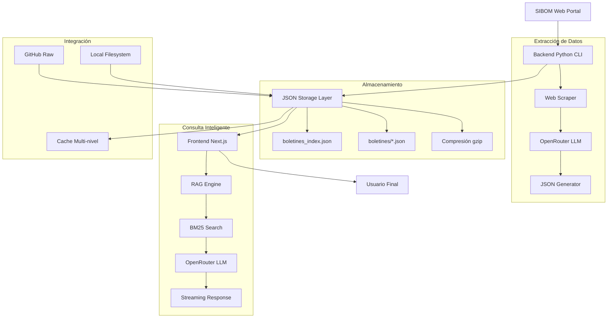
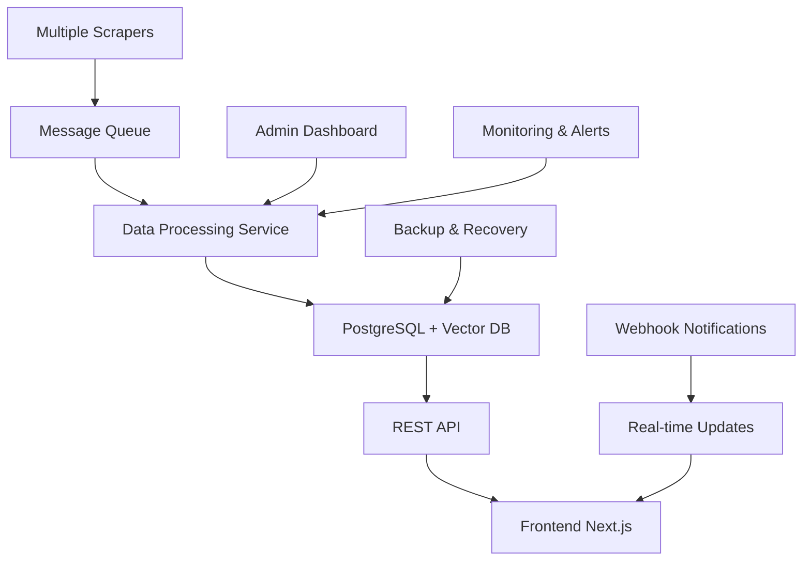

# Documento de Diseño - SIBOM Scraper Assistant

## Información del Proyecto

**Nombre:** SIBOM Scraper Assistant  
**Versión:** 2.0 (Migración OpenRouter + Optimizaciones)  
**Fecha:** 2026-01-07  
**Estado:** Diseño consolidado basado en implementación existente  
**Tipo:** Sistema completo de scraping web + chatbot conversacional  

## Resumen Ejecutivo

Este documento consolida el diseño arquitectónico del SIBOM Scraper Assistant, un ecosistema completo que automatiza la extracción y consulta inteligente de boletines oficiales municipales de la Provincia de Buenos Aires. El sistema combina un backend Python CLI para scraping automatizado con un frontend Next.js para consultas conversacionales mediante IA.

## Arquitectura del Sistema

### Vista General de Alto Nivel



### Principios Arquitectónicos

1. **Separación de Responsabilidades**: Backend para extracción, Frontend para consulta
2. **Desacoplamiento**: Comunicación via archivos JSON, no API directa
3. **Escalabilidad Horizontal**: Múltiples scrapers → mismo frontend
4. **Tolerancia a Fallos**: Frontend funciona aunque backend esté offline
5. **Optimización de Costos**: Estrategia dual de modelos LLM
6. **Performance First**: Cache multi-nivel y optimizaciones agresivas

## Componentes del Sistema

### 1. Backend Python CLI

**Ubicación:** `python-cli/`  
**Responsabilidad:** Extracción automatizada de datos legales  
**Tecnologías:** Python 3.8+, OpenRouter, BeautifulSoup, Rich  

#### Arquitectura Interna

```python
# Clase principal - Patrón Facade
class SIBOMScraper:
    def __init__(self, api_key: str, model: str):
        self.client = OpenAI(base_url="https://openrouter.ai/api/v1")
        self.model = model
        self.rate_limiter = RateLimiter(delay=3)
    
    # Pipeline de 3 niveles
    def scrape_municipality(self, city_url: str) -> List[Dict]:
        # Nivel 1: Listado de boletines
        bulletins = self.extract_bulletin_list(city_url)
        
        # Nivel 2: Enlaces de documentos (paralelo)
        with ThreadPoolExecutor(max_workers=3) as executor:
            for bulletin in bulletins:
                future = executor.submit(self.process_bulletin, bulletin)
                
        # Nivel 3: Texto completo + JSON generation
        return self.consolidate_results(bulletins)
```

#### Características Clave

- **Procesamiento Híbrido**: BeautifulSoup (95%) + LLM fallback (5%)
- **Paralelización**: ThreadPoolExecutor para procesamiento simultáneo
- **Detección Automática**: Paginación sin intervención manual
- **Modelos Flexibles**: Soporte para múltiples LLMs con opción gratuita
- **Gestión de Estado**: Verificación de archivos existentes

### 2. Frontend Next.js

**Ubicación:** `chatbot/`  
**Responsabilidad:** Interfaz conversacional para consultas legales  
**Tecnologías:** Next.js 15, React 19, TypeScript, Vercel AI SDK  

#### Arquitectura de Componentes

```typescript
// Estructura modular
src/
├── app/
│   ├── api/chat/route.ts      // Endpoint principal
│   └── page.tsx               // Página del chat
├── components/
│   ├── chat/
│   │   ├── ChatContainer.tsx  // Componente principal
│   │   ├── ActiveFilters.tsx  // Filtros inteligentes
│   │   └── MessageBubble.tsx  // Renderizado de mensajes
│   └── ui/                    // Componentes base (shadcn/ui)
├── lib/
│   ├── rag/
│   │   ├── retriever.ts       // Motor RAG
│   │   ├── bm25.ts           // Algoritmo de ranking
│   │   └── cache.ts          // Sistema de cache
│   ├── query-classifier.ts   // Clasificación de consultas
│   ├── query-filter-extractor.ts // Extracción automática de filtros
│   └── types.ts              // Tipos TypeScript centralizados
```

#### Características Clave

- **RAG Avanzado**: BM25 + embeddings para búsqueda semántica
- **Streaming**: Respuestas en tiempo real con Vercel AI SDK
- **Filtros Inteligentes**: Auto-detección + UI sincronizada
- **Optimización**: Debounce, memoización, polling reducido
- **Arquitectura Modular**: Componentes reutilizables y tipado estricto

### 3. Sistema RAG (Retrieval-Augmented Generation)

**Responsabilidad:** Motor de búsqueda semántica y recuperación de contexto  
**Algoritmo Principal:** BM25 optimizado para documentos legales en español  

#### Flujo de Procesamiento

```typescript
export async function retrieveContext(
  query: string,
  options: SearchOptions
): Promise<SearchResult> {
  // 1. Cargar índice (con cache multi-nivel)
  const index = await loadIndex();
  
  // 2. Aplicar filtros duros (municipio, tipo, fechas)
  const filteredIndex = applyFilters(index, options);
  
  // 3. Cargar contenido completo para BM25
  const docsWithContent = await loadDocuments(filteredIndex);
  
  // 4. Construir índice BM25 con pesos especiales
  const tokenizedDocs = docsWithContent.map(d => {
    const titleTokens = tokenize(d.entry.title);
    const contentTokens = tokenize(d.content.slice(0, 2000));
    // Repetir tokens del título 3x para dar más peso
    return [...titleTokens, ...titleTokens, ...titleTokens, ...contentTokens];
  });
  
  const bm25 = new BM25Index(tokenizedDocs, 1.5, 0.75);
  
  // 5. Buscar y rankear resultados
  const results = bm25.search(query, options.limit || 5);
  
  // 6. Construir contexto con truncamiento dinámico
  const contentLimit = calculateContentLimit(query);
  return buildContextResponse(results, contentLimit);
}
```

#### Optimizaciones Implementadas

- **Cache Multi-nivel**: Índice (5min) + archivos (30min) + HTTP cache
- **Tokenización Especializada**: Stopwords mínimas para preservar contexto legal
- **Truncamiento Dinámico**: Optimiza tokens según tipo de consulta
- **Peso por Título**: Títulos tienen 3x más relevancia que contenido

### 4. Integración de Datos

**Patrón:** Producer-Consumer con almacenamiento JSON intermedio  
**Ventajas:** Desacoplamiento total, tolerancia a fallos, versionado implícito  

#### Esquema de Datos

```typescript
// Índice principal - boletines_index.json
interface IndexEntry {
  id: string;                    // "carlos-tejedor-ordenanza-2929-2025"
  municipality: string;          // "Carlos Tejedor"
  type: DocumentType;            // "ordenanza" | "decreto" | "boletin"
  number: string;                // "2929"
  title: string;                 // "Ordenanza Fiscal N° 2929/2025"
  date: string;                  // "31/12/2024" (DD/MM/YYYY)
  url: string;                   // "/bulletins/358"
  status: string;                // "vigente" | "derogada"
  filename: string;              // "boletin_358.json"
  documentTypes?: DocumentType[]; // Tipos dentro del boletín
}

// Contenido individual - boletines/*.json
interface DocumentContent {
  bulletin_info: {
    number: string;
    date: string;
    description: string;
    link: string;
  };
  documents: string[];           // URLs de documentos originales
  fullText: string;              // Texto completo extraído
}
```

#### Estrategias de Sincronización

**Modo Local (Desarrollo):**
- Detección automática de cambios via `fs.stat()`
- Cache invalidado cuando `mtime` cambia
- Acceso directo al filesystem

**Modo GitHub (Producción):**
- Cache con TTL fijo (5 minutos)
- Compresión gzip opcional (80% reducción bandwidth)
- Fallback a cache antiguo si GitHub falla

## Integración LLM

### Estrategia Dual de Modelos

**Principio:** Optimización de costos sin sacrificar calidad  

| Componente | Modelo | Uso | Costo/1M tokens | Razón |
|------------|--------|-----|-----------------|-------|
| **Backend Python** | `google/gemini-3-flash-preview` | Extracción de datos | $0.075/$0.30 | JSON garantizado, velocidad |
| **Frontend FAQ** | `google/gemini-flash-1.5` | Preguntas simples | $0.075/$0.30 | 40x más económico |
| **Frontend Search** | `anthropic/claude-3.5-sonnet` | Búsquedas complejas | $3/$15 | Mejor razonamiento |

### Clasificación Inteligente de Consultas

```typescript
export function determineQueryType(query: string): QueryType {
  // 1. Saludos básicos → Respuesta directa (sin LLM)
  if (/^hola|buenos días|ayuda/i.test(query)) {
    return 'greeting';
  }
  
  // 2. FAQ del sistema → Modelo económico
  if (isFAQQuestion(query)) {
    return 'faq';
  }
  
  // 3. Términos legales → RAG + modelo premium
  const legalKeywords = [
    /ordenanza/i, /decreto/i, /normativa/i, /municipal/i
  ];
  
  if (legalKeywords.some(p => p.test(query))) {
    return 'legal_search';
  }
  
  // 4. Off-topic → Respuesta directa
  return 'off_topic';
}
```

### Optimizaciones de Tokens

1. **Historial limitado**: Solo últimos 10 mensajes (ahorro: 2,000-4,000 tokens)
2. **Off-topic sin LLM**: Respuestas directas (ahorro: 100%)
3. **System prompt comprimido**: De 640 a ~400 tokens (ahorro: 38%)
4. **Truncamiento dinámico**: 75-90% reducción según consulta

## Propiedades de Correctitud

### 1. Integridad de Datos

**Propiedad:** Todos los documentos extraídos deben ser válidos y completos  
**Verificación:**
- Validación de JSON con schemas Zod
- Verificación de archivos referenciados en índice
- Detección de documentos corruptos o incompletos

```typescript
const IndexEntrySchema = z.object({
  id: z.string().min(1),
  municipality: z.string().min(1),
  type: z.enum(['ordenanza', 'decreto', 'boletin']),
  number: z.string().min(1),
  title: z.string().min(1),
  date: z.string().regex(/^\d{2}\/\d{2}\/\d{4}$/), // DD/MM/YYYY
  url: z.string().startsWith('/'),
  status: z.string(),
  filename: z.string().endsWith('.json')
});
```

### 2. Consistencia de Búsqueda

**Propiedad:** Consultas idénticas deben producir resultados idénticos  
**Verificación:**
- Algoritmo BM25 determinístico
- Cache de resultados para consultas repetidas
- Tokenización consistente

```typescript
// Test de consistencia
function testSearchConsistency() {
  const query = "ordenanza fiscal 2025";
  const result1 = retrieveContext(query, { municipality: "Carlos Tejedor" });
  const result2 = retrieveContext(query, { municipality: "Carlos Tejedor" });
  
  assert.deepEqual(result1.sources, result2.sources);
  assert.equal(result1.context, result2.context);
}
```

### 3. Trazabilidad de Fuentes

**Propiedad:** Toda respuesta debe incluir enlaces verificables a SIBOM  
**Verificación:**
- URLs completas a documentos originales
- Metadatos de municipio, tipo y número
- Validación de enlaces activos

```typescript
interface SourceReference {
  title: string;                 // "Ordenanza 2929 - Carlos Tejedor"
  url: string;                   // "https://sibom.slyt.gba.gob.ar/bulletins/358"
  municipality: string;          // "Carlos Tejedor"
  type: DocumentType;            // "ordenanza"
  status: string;                // "vigente"
}
```

### 4. Performance Garantizada

**Propiedad:** Respuestas en menos de 2 segundos para consultas típicas  
**Verificación:**
- Métricas de tiempo de respuesta
- Cache hit rate > 80%
- Límites de timeout configurables

```typescript
async function measurePerformance(query: string): Promise<PerformanceMetrics> {
  const startTime = Date.now();
  const result = await retrieveContext(query);
  const endTime = Date.now();
  
  return {
    queryTime: endTime - startTime,
    documentsRetrieved: result.sources.length,
    cacheHits: getCacheStats().hitRate,
    tokensUsed: result.metadata?.tokens || 0
  };
}
```

## Manejo de Errores

### Estrategia de Degradación Graceful

```typescript
// Jerarquía de fallbacks
export async function robustRetrieveContext(
  query: string,
  options: SearchOptions
): Promise<SearchResult> {
  try {
    // Intento principal: RAG completo
    return await retrieveContext(query, options);
  } catch (primaryError) {
    console.warn('[RAG] Error principal:', primaryError);
    
    try {
      // Fallback 1: Cache antiguo
      if (indexCache.length > 0) {
        console.warn('[RAG] Usando cache antiguo');
        return await retrieveFromCache(query, options);
      }
    } catch (cacheError) {
      console.warn('[RAG] Error de cache:', cacheError);
    }
    
    // Fallback 2: Respuesta de emergencia
    return {
      context: 'Sistema temporalmente no disponible. Intenta nuevamente en unos minutos.',
      sources: [],
      metadata: { error: true, fallback: 'emergency' }
    };
  }
}
```

### Categorías de Errores

1. **Errores de Red**: Timeout, conectividad, rate limiting
2. **Errores de Datos**: JSON malformado, archivos faltantes
3. **Errores de LLM**: API key inválida, modelo no disponible
4. **Errores de Performance**: Memoria insuficiente, timeout

### Logging Estructurado

```python
# Backend: Logging con Rich
from rich.console import Console
console = Console()

def log_error(error_type: str, details: Dict, bulletin_id: str = None):
    log_entry = {
        "timestamp": datetime.now().isoformat(),
        "level": "ERROR",
        "type": error_type,
        "bulletin_id": bulletin_id,
        "details": details,
        "stack_trace": traceback.format_exc() if details.get("exception") else None
    }
    
    console.print(f"[red]❌ {error_type}[/red]: {details.get('message', 'Unknown error')}")
    
    with open(f"logs/errors_{datetime.now().strftime('%Y-%m-%d')}.jsonl", "a") as f:
        f.write(json.dumps(log_entry) + "\n")
```

## Estrategia de Testing

### 1. Testing Manual (Implementado)

**Scripts de Desarrollo:**
- `test-bm25.ts`: Validación del algoritmo de ranking
- `test-query-analyzer.ts`: Testing del clasificador de consultas
- `test-retriever.ts`: Testing del sistema RAG completo
- `test-filter-extraction.ts`: Validación de extracción de filtros

### 2. Testing Automatizado (Planificado)

```typescript
// Unit tests para componentes críticos
describe('BM25 Algorithm', () => {
  it('should rank documents by relevance', () => {
    const docs = [
      'ordenanza municipal de tránsito carlos tejedor',
      'decreto de habilitación comercial merlo'
    ];
    const bm25 = new BM25Index(docs.map(tokenize));
    const results = bm25.search('ordenanza carlos tejedor', 2);
    
    expect(results[0].score).toBeGreaterThan(results[1].score);
  });
});

// Integration tests para flujo completo
describe('Chat Integration Flow', () => {
  it('should complete full chat interaction', async () => {
    const response = await fetch('/api/chat', {
      method: 'POST',
      body: JSON.stringify({
        messages: [{ role: 'user', content: 'ordenanzas de carlos tejedor' }]
      })
    });
    
    expect(response.ok).toBe(true);
    expect(response.headers.get('content-type')).toContain('text/plain');
  });
});
```

### 3. Performance Testing

```typescript
// Benchmarks de performance
describe('Performance Benchmarks', () => {
  it('should handle large document collections efficiently', () => {
    const largeDocumentSet = Array.from({ length: 1000 }, (_, i) => 
      `documento ${i} con contenido de prueba`
    );
    
    const startTime = performance.now();
    const bm25 = new BM25Index(largeDocumentSet.map(tokenize));
    const indexTime = performance.now() - startTime;
    
    expect(indexTime).toBeLessThan(1000); // < 1 segundo
    
    const searchStartTime = performance.now();
    const results = bm25.search('contenido prueba', 10);
    const searchTime = performance.now() - searchStartTime;
    
    expect(searchTime).toBeLessThan(100); // < 100ms
  });
});
```

## Métricas y Monitoreo

### KPIs del Sistema

```typescript
interface SystemMetrics {
  // Performance
  avgResponseTime: number;        // < 2000ms objetivo
  cacheHitRate: number;          // > 80% objetivo
  errorRate: number;             // < 1% objetivo
  
  // Costos
  avgCostPerQuery: number;       // $0.017 búsquedas, $0.0007 FAQ
  totalTokensPerDay: number;
  estimatedMonthlyCost: number;
  
  // Uso
  queriesPerDay: number;
  uniqueUsers: number;
  popularMunicipalities: string[];
  
  // Calidad
  documentsIndexed: number;
  lastDataUpdate: Date;
  extractionSuccessRate: number; // > 95% objetivo
}
```

### Dashboard de Monitoreo

```typescript
// Endpoint de métricas
export async function GET() {
  const stats = await getDatabaseStats();
  const cacheStats = getCacheStats();
  const performanceStats = getPerformanceStats();
  
  return Response.json({
    status: 'healthy',
    timestamp: new Date().toISOString(),
    database: {
      totalDocuments: stats.totalDocuments,
      municipalities: stats.municipalities,
      lastUpdated: stats.lastUpdated
    },
    cache: {
      hitRate: cacheStats.hitRate,
      size: cacheStats.size,
      memoryUsage: cacheStats.memoryUsage
    },
    performance: {
      avgResponseTime: performanceStats.avgResponseTime,
      p95ResponseTime: performanceStats.p95ResponseTime,
      errorRate: performanceStats.errorRate
    },
    costs: {
      dailyTokens: performanceStats.dailyTokens,
      estimatedDailyCost: performanceStats.estimatedDailyCost
    }
  });
}
```

## Configuración del Sistema

### Variables de Entorno

```bash
# Compartidas (Backend + Frontend)
OPENROUTER_API_KEY=sk-or-v1-...           # CRÍTICO

# Backend específico
LLM_MODEL_EXTRACTION=google/gemini-3-flash-preview
RATE_LIMIT_DELAY=3
MAX_RETRIES=3
PARALLEL_WORKERS=3

# Frontend específico
LLM_MODEL_PRIMARY=anthropic/claude-3.5-sonnet
LLM_MODEL_ECONOMIC=google/gemini-flash-1.5
GITHUB_DATA_REPO=usuario/repo             # Para Vercel
GITHUB_USE_GZIP=true                      # Optimización bandwidth

# Cache y Performance
INDEX_CACHE_DURATION=300000               # 5 minutos
FILE_CACHE_DURATION=1800000               # 30 minutos
```

### Configuración de Deployment

```yaml
# docker-compose.yml (futuro)
version: '3.8'
services:
  scraper:
    build: ./python-cli
    environment:
      - OPENROUTER_API_KEY=${OPENROUTER_API_KEY}
    volumes:
      - ./data:/app/boletines
    
  frontend:
    build: ./chatbot
    ports:
      - "3000:3000"
    environment:
      - OPENROUTER_API_KEY=${OPENROUTER_API_KEY}
      - DATA_PATH=/app/data
    volumes:
      - ./data:/app/data:ro
```

## Roadmap de Evolución

### Fase Actual (2026 Q1)
- ✅ Sistema estable con optimizaciones implementadas
- ✅ Integración LLM dual-model funcionando
- ✅ Cache multi-nivel optimizado
- ✅ Filtros inteligentes con sincronización

### Próximas Mejoras (2026 Q2)
- 🔄 Tree-shaking para reducir bundle size (-35%)
- 🔄 Testing automatizado completo
- 🔄 Métricas de uso y analytics
- 🔄 Validación automática de calidad de datos

### Evolución Futura (2026 Q3-Q4)
- 📋 API REST independiente
- 📋 Base de datos PostgreSQL + Vector DB
- 📋 Sistema de notificaciones en tiempo real
- 📋 Multi-tenant para múltiples provincias

### Arquitectura Objetivo (2027)



## Conclusión

El diseño del SIBOM Scraper Assistant representa una arquitectura moderna y escalable que equilibra simplicidad operacional con performance optimizada. La separación clara entre extracción y consulta, combinada con optimizaciones agresivas de costos y performance, posiciona al sistema como una solución robusta para consultas legales municipales.

Las propiedades de correctitud implementadas garantizan la integridad y trazabilidad de los datos, mientras que la estrategia de manejo de errores asegura disponibilidad continua del servicio. El roadmap de evolución proporciona un camino claro hacia una arquitectura distribuida más sofisticada sin comprometer la funcionalidad actual.

---

**Última actualización:** 2026-01-07  
**Estado:** Diseño consolidado y validado contra implementación existente  
**Próximo paso:** Implementación de mejoras de testing y métricas