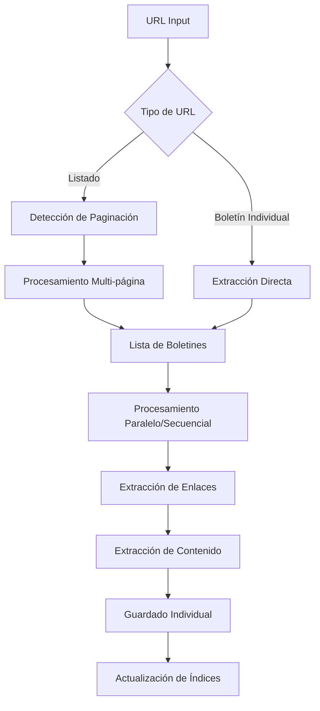

# Análisis Técnico Completo: Python CLI SIBOM Scraper

## Overview

El proyecto SIBOM Scraper es una herramienta CLI en Python diseñada para extraer y procesar boletines oficiales municipales desde el sistema SIBOM. El proyecto demuestra una arquitectura bien estructurada con separación clara de responsabilidades, uso inteligente de tecnologías modernas, y un enfoque pragmático hacia la resolución de problemas complejos de web scraping.

## Arquitectura y Componentes

### Arquitectura General

El sistema sigue una **arquitectura de pipeline de 3 niveles** con procesamiento híbrido (BeautifulSoup + LLM):

```
Nivel 1: Listado     → Nivel 2: Enlaces     → Nivel 3: Contenido
(BeautifulSoup)        (BeautifulSoup+LLM)    (BeautifulSoup+LLM)
     ↓                       ↓                       ↓
Lista de boletines → Enlaces de documentos → Texto completo
```

### Componentes Principales

#### 1. SIBOMScraper (Clase Principal)
- **Responsabilidad**: Orquestación del proceso de scraping
- **Patrón**: Facade + Strategy Pattern
- **Características**:
  - Manejo de rate limiting inteligente
  - Configuración flexible de modelos LLM
  - Procesamiento secuencial y paralelo

#### 2. Pipeline de Procesamiento
```python
# Nivel 1: Extracción de listados
parse_listing_page() → List[Dict]

# Nivel 2: Extracción de enlaces
parse_bulletin_content_links() → List[str]

# Nivel 3: Extracción de contenido
parse_final_content() → str
```

#### 3. Sistema de Archivos
- **Patrón**: Repository Pattern
- **Estructura**:
  ```
  boletines/
  ├── {Ciudad}_{Numero}.json    # Archivos individuales
  ├── boletines.md              # Índice markdown
  └── boletines_index.json      # Índice estructurado
  ```

#### 4. Utilidades de Soporte
- `indexar_boletines.py`: Generación de índices
- `enrich_index_with_types.py`: Enriquecimiento de metadatos
- `comprimir_boletines.py`: Compresión para distribución

### Flujo de Datos



## Convenciones de Código y Estilo

### Naming Conventions

#### Archivos y Directorios
- **Scripts principales**: `snake_case.py` (ej: `sibom_scraper.py`)
- **Utilidades**: `verbo_sustantivo.py` (ej: `indexar_boletines.py`)
- **Documentación**: `MAYUSCULAS.md` (ej: `README.md`, `CHANGELOG.md`)
- **Configuración**: `.lowercase` (ej: `.env`, `.gitignore`)

#### Clases y Métodos
```python
# Clases: PascalCase
class SIBOMScraper:

# Métodos públicos: snake_case
def parse_listing_page(self, html: str) -> List[Dict]:

# Métodos privados: _snake_case
def _sanitize_filename(self, description: str) -> str:

# Métodos de utilidad: _verbo_sustantivo
def _make_llm_call(self, prompt: str) -> str:
def _wait_for_rate_limit(self) -> None:
```

#### Variables y Constantes
```python
# Variables: snake_case
bulletin_url = "https://..."
content_links = []

# Constantes implícitas: UPPER_CASE en contexto
BOLETINES_DIR = Path("boletines")
INDEX_FILE = Path("boletines_index.json")
```

### Organización del Código

#### Estructura de Archivos
```python
# 1. Shebang y docstring
#!/usr/bin/env python3
"""
Descripción del módulo
"""

# 2. Imports estándar
import os
import sys
import json

# 3. Imports de terceros
import requests
from openai import OpenAI
from rich.console import Console

# 4. Imports locales (si aplica)
from .utils import helper_function

# 5. Configuración global
load_dotenv()
console = Console()

# 6. Clases principales
class SIBOMScraper:
    # ...

# 7. Funciones de utilidad
def main():
    # ...

# 8. Entry point
if __name__ == '__main__':
    main()
```

#### Manejo de Errores
**Patrón Consistente**: Try-Catch con Fallbacks Inteligentes
```python
try:
    # Intento principal (BeautifulSoup)
    result = fast_method()
except Exception as e:
    # Fallback con logging
    console.print(f"[yellow]⚠ Método rápido falló, usando fallback[/yellow]")
    result = fallback_method()
```

#### Logging y Output
**Patrón**: Rich Console con Niveles Semánticos
```python
# Información: cyan
console.print("[cyan]📋 Procesando...[/cyan]")

# Éxito: green
console.print("[green]✓ Completado[/green]")

# Advertencia: yellow
console.print("[yellow]⚠ Advertencia[/yellow]")

# Error: red
console.print("[red]✗ Error[/red]")

# Debug: dim
console.print("[dim]→ Detalle técnico[/dim]")
```

### Gestión de Configuración

#### Variables de Entorno
```python
# Patrón: Carga con fallbacks
api_key = args.api_key or os.getenv('OPENROUTER_API_KEY')
if not api_key:
    console.print("[bold red]Error: No se encontró OPENROUTER_API_KEY[/bold red]")
    sys.exit(1)
```

#### Configuración de Argumentos
```python
# Patrón: ArgumentParser con valores por defecto sensatos
parser.add_argument(
    '--model',
    type=str,
    default='google/gemini-3-flash-preview',  # Default inteligente
    help='Modelo de OpenRouter a usar'
)
```

## Patrones Técnicos y Preferencias

### Concurrencia y Paralelización

#### ThreadPoolExecutor Pattern
```python
if parallel > 1:
    with ThreadPoolExecutor(max_workers=parallel) as executor:
        futures = {executor.submit(self.process_bulletin, b, ...): b for b in bulletins}
        
        with Progress(...) as progress:
            for future in as_completed(futures):
                result = future.result()
                # Procesamiento de resultado
```

**Características**:
- Uso de `concurrent.futures` sobre `threading` directo
- Integración con Rich Progress para UX
- Manejo robusto de excepciones en hilos

### Procesamiento de Datos

#### Hybrid Processing Pattern
```python
def parse_listing_page(self, html: str) -> List[Dict]:
    try:
        # Intento 1: BeautifulSoup (rápido, barato)
        soup = BeautifulSoup(html, 'lxml')
        # ... extracción nativa
        if bulletins:
            return bulletins
        else:
            raise ValueError("No se encontraron boletines")
    except Exception:
        # Fallback: LLM (lento, costoso, pero robusto)
        response = self._make_llm_call(prompt)
        # ... procesamiento LLM
```

**Ventajas del Patrón**:
- **Costo optimizado**: 95% de casos usan BeautifulSoup (gratis)
- **Robustez**: LLM como fallback para casos complejos
- **Performance**: Prioriza velocidad cuando es posible

#### Rate Limiting Pattern
```python
def _wait_for_rate_limit(self):
    elapsed = time.time() - self.last_call_time
    if elapsed < self.rate_limit_delay:
        time.sleep(self.rate_limit_delay - elapsed)
    self.last_call_time = time.time()
```

### File I/O y Storage

#### Individual + Consolidated Pattern
```python
# 1. Guardar archivo individual
filepath = output_dir / f"{filename}.json"
with filepath.open('w', encoding='utf-8') as f:
    json.dump(result, f, indent=2, ensure_ascii=False)

# 2. Actualizar índice markdown
self._update_index_md(result, output_dir, base_url)

# 3. Mantener resumen consolidado
# (en main())
```

**Beneficios**:
- **Granularidad**: Acceso individual a boletines
- **Agregación**: Resumen para análisis masivo
- **Documentación**: Índice markdown para navegación

#### Filename Sanitization Pattern
```python
def _sanitize_filename(self, description: str, number: str = None) -> str:
    # 1. Extraer número del boletín
    number_match = re.search(r'(\d+)', number or description)
    
    # 2. Extraer nombre de ciudad
    city_match = re.search(r'(?:de\s+)([A-Z][a-zA-Z\s]+)', description)
    
    # 3. Limpiar caracteres especiales
    cleaned = re.sub(r'[^\w\s-]', '', city_name)
    
    # 4. Formato final
    return f"{cleaned}_{num}"
```

### API Integration Patterns

#### OpenRouter Integration
```python
# Patrón: Client Wrapper con Configuración Flexible
self.client = OpenAI(
    api_key=api_key,
    base_url="https://openrouter.ai/api/v1"  # Proxy pattern
)

# Uso con parámetros dinámicos
params = {
    "model": self.model,  # Configurable
    "messages": [{"role": "user", "content": prompt}]
}

if use_json_mode:
    params["response_format"] = {"type": "json_object"}
```

#### HTTP Requests Pattern
```python
def fetch_html(self, url: str, max_retries: int = 3) -> str:
    for attempt in range(max_retries):
        try:
            response = requests.get(url, timeout=30)
            response.raise_for_status()
            return response.text
        except requests.RequestException as e:
            if attempt == max_retries - 1:
                raise
            time.sleep(2 ** attempt)  # Exponential backoff
```

### Testing y Validation

#### Validation Pattern
```python
# Validación de entrada
if not html or len(html) < 100:
    raise ValueError(f"HTML inválido ({len(html)} caracteres)")

# Validación de salida
if len(text) < 100:
    raise ValueError(f"Texto extraído muy corto ({len(text)} caracteres)")

# Métricas de calidad
ratio = text_size / html_size
if ratio < 0.05:
    console.print(f"[yellow]⚠ Ratio texto/HTML sospechoso ({ratio:.1%})[/yellow]")
```

## Preferencias Técnicas Identificadas

### Bibliotecas y Frameworks Preferidos

#### Core Dependencies
```python
# Web scraping: BeautifulSoup + requests (no Selenium)
from bs4 import BeautifulSoup
import requests

# LLM: OpenAI client + OpenRouter (no llamadas directas)
from openai import OpenAI

# CLI UX: Rich (no argparse básico)
from rich.console import Console
from rich.progress import Progress

# Concurrencia: concurrent.futures (no asyncio)
from concurrent.futures import ThreadPoolExecutor
```

#### Filosofía de Dependencias
- **Minimalismo**: Solo 6 dependencias core
- **Estabilidad**: Bibliotecas maduras y bien mantenidas
- **Funcionalidad**: Cada dependencia resuelve un problema específico
- **No over-engineering**: Evita frameworks pesados

### CLI Design Patterns

#### Progressive Disclosure
```python
# Información básica siempre visible
console.print(Panel.fit(f"SIBOM Scraper\nModo: {mode}\nURL: {url}"))

# Detalles técnicos solo en verbose/debug
console.print(f"[dim]→ HTML recibido: {html_size:,} caracteres[/dim]")
```

#### User-Friendly Defaults
```python
# Valores por defecto sensatos
'--url': 'https://sibom.slyt.gba.gob.ar/cities/22'  # Carlos Tejedor
'--model': 'google/gemini-3-flash-preview'          # Balance calidad/costo
'--parallel': 1                                     # Conservador
```

#### Interactive vs Automated Modes
```python
# Modo interactivo por defecto
if filepath.exists() and not skip_existing:
    choice = input("¿Qué deseas hacer? (1-3) [1]: ")

# Modo automático con flag
if skip_existing:
    console.print("[yellow]⏭ Saltando automáticamente[/yellow]")
```

### Performance Optimization

#### Lazy Loading Pattern
```python
# Solo carga páginas cuando es necesario
if total_pages > 1:
    for page_num in range(2, total_pages + 1):
        # Carga bajo demanda
```

#### Caching Strategy
```python
# Evita re-procesamiento
if filepath.exists():
    # Reutiliza resultado existente
    with filepath.open('r') as f:
        return json.load(f)
```

#### Memory Management
```python
# Procesa uno a la vez en modo secuencial
for bulletin in bulletins:
    result = self.process_bulletin(bulletin, ...)
    # Resultado se guarda inmediatamente, no se acumula en memoria
```

### Documentation y Maintenance

#### Self-Documenting Code
```python
def _sanitize_filename(self, description: str, number: str = None) -> str:
    """
    Convierte descripción en nombre de archivo válido.
    Ejemplo: "105º de Carlos Tejedor" -> "Carlos_Tejedor_105"
    """
```

#### Comprehensive Documentation
- **README.md**: Guía de usuario completa con ejemplos
- **MODELOS.md**: Comparación técnica detallada
- **CHANGELOG.md**: Historial de cambios versionado
- **FEATURES.md**: Documentación de características específicas

#### Maintenance Scripts
```python
# Scripts de utilidad incluidos
indexar_boletines.py      # Generación de índices
enrich_index_with_types.py # Enriquecimiento de datos
comprimir_boletines.py    # Optimización para distribución
comparar_modelos.sh       # Testing de calidad
```

## Correctness Properties

*A property is a characteristic or behavior that should hold true across all valid executions of a system-essentially, a formal statement about what the system should do. Properties serve as the bridge between human-readable specifications and machine-verifiable correctness guarantees.*

### Property 1: Hybrid Processing Fallback
*For any* HTML input, if BeautifulSoup parsing fails, the system should automatically fall back to LLM processing and return valid results
**Validates: Requirements 1.1, 1.4**

### Property 2: File Naming Consistency
*For any* bulletin description, the sanitized filename should be deterministic and follow the pattern `{Ciudad}_{Numero}.json`
**Validates: Requirements 2.2, 3.3**

### Property 3: Rate Limiting Compliance
*For any* sequence of LLM calls, the time between consecutive calls should be at least `rate_limit_delay` seconds
**Validates: Requirements 3.4**

### Property 4: Data Integrity Preservation
*For any* processed bulletin, the individual JSON file and consolidated index should contain consistent metadata
**Validates: Requirements 3.3, 4.4**

### Property 5: Parallel Processing Safety
*For any* parallel execution with N workers, the final result should be identical to sequential processing (order-independent)
**Validates: Requirements 3.1**

### Property 6: Configuration Validation
*For any* invalid configuration (missing API key, invalid model), the system should fail fast with clear error messages
**Validates: Requirements 4.2, 4.5**

## Error Handling

El sistema implementa una estrategia de **graceful degradation** con múltiples niveles de fallback:

1. **Nivel de Parsing**: BeautifulSoup → LLM fallback
2. **Nivel de Red**: Reintentos con backoff exponencial
3. **Nivel de Archivo**: Verificación de existencia antes de procesamiento
4. **Nivel de Usuario**: Modo interactivo vs automático

## Testing Strategy

### Dual Testing Approach
- **Unit tests**: Validación de funciones de utilidad (sanitización, rate limiting)
- **Property tests**: Verificación de invariantes del sistema (consistencia de datos, idempotencia)

### Property-Based Testing Configuration
- Mínimo 100 iteraciones por test de propiedad
- Framework recomendado: `hypothesis` para Python
- Tags de referencia: **Feature: python-cli-analysis, Property {N}: {descripción}**

### Testing Priorities
1. **Crítico**: Sanitización de nombres de archivo, rate limiting
2. **Importante**: Consistencia de datos, manejo de errores
3. **Deseable**: Performance, UX flows

Este análisis revela un proyecto maduro con decisiones arquitectónicas sólidas, convenciones consistentes, y un enfoque pragmático hacia la resolución de problemas complejos de web scraping y procesamiento de datos.