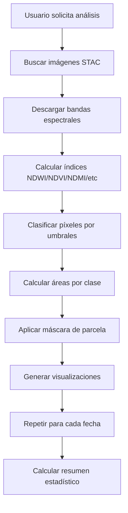

# 📊 Cómo funciona el analizador satelital

El analizador satelital utiliza **imágenes Sentinel-2** para clasificar el uso de suelo en una parcela catastral. A continuación se explica detalladamente cómo funciona.

---

## 🔄 Flujo del análisis



---

## 🎯 1. Búsqueda de imágenes ([`stac.py`](../sat-analysis/src/sat_analysis/services/stac.py:134-270))

El sistema busca imágenes Sentinel-2 L2A con **muestreo temporal uniforme**.

### Parámetros de búsqueda:

- **`bbox`**: Área de la parcela (min_lon, min_lat, max_lon, max_lat)
- **`date_range`**: Rango de fechas (ej: "2023-02-08/2025-02-08")
- **`samples_per_year`**: Imágenes por año (default: 4)
- **`max_clouds`**: Máximo % de nubes (default: 20)

### Algoritmo de muestreo:

1. Divide el período en intervalos uniformes
2. Para cada intervalo, busca la imagen con **menos nubes**
3. Selecciona la mejor imagen de cada intervalo

### Ejemplo:

Para 2 años con `samples_per_year=4`:
- Total de intervalos: 8 (4 por año)
- Selecciona 8 imágenes distribuidas uniformemente
- Intervalos de ~3 meses cada uno

### Código de referencia:

```python
# Calcular total de muestras objetivo
total_days = (end_date - start_date).days
target_count = samples_per_year * (total_days / 365.25)
target_count = int(round(target_count))

# Crear intervalos de tiempo
interval_days = total_days / target_count
intervals = []
for i in range(target_count):
    interval_start = start_date + timedelta(days=i * interval_days)
    interval_end = start_date + timedelta(days=(i + 1) * interval_days)
    intervals.append((interval_start, interval_end))

# Buscar la mejor imagen en cada intervalo
for interval_start, interval_end in intervals:
    # Buscar imágenes en este intervalo
    search = catalog.search(
        collections=[self.collection],
        bbox=bbox,
        datetime=f"{interval_start}/{interval_end}",
        query={"eo:cloud_cover": {"lt": max_clouds}},
        max_items=50,
    )
    
    # Seleccionar la imagen con menos nubes
    best_item = min(items, key=lambda x: x.properties.get("eo:cloud_cover", 100))
```

---

## 📡 2. Descarga y procesamiento de imágenes ([`tasks.py`](../sat-analysis/api/tasks.py:188-255))

Para cada imagen seleccionada:

### Descarga de bandas:

| Banda   | Longitud de onda | Resolución | Uso                |
| ------- | ---------------- | ---------- | ------------------ |
| **B02** | 490 nm (Blue)    | 10m        | Cálculo de índices |
| **B03** | 560 nm (Green)   | 10m        | NDWI, MNDWI, NDSI  |
| **B04** | 665 nm (Red)     | 10m        | NDVI               |
| **B08** | 842 nm (NIR)     | 10m        | Todos los índices  |
| **B11** | 1610 nm (SWIR1)  | 20m → 10m  | NDMI, MNDWI        |
| **B12** | 2190 nm (SWIR2)  | 20m → 10m  | NDSI, Salinidad    |

**Nota**: B11 y B12 tienen resolución 20m, se remuestrean a 10m usando interpolación bilineal.

### Cálculo de índices espectrales ([`classifier.py`](../sat-analysis/src/sat_analysis/services/classifier.py:93-167))

| Índice             | Fórmula                           | Rango  | Uso                   |
| ------------------ | --------------------------------- | ------ | --------------------- |
| **NDWI**           | (Green - NIR) / (Green + NIR)     | -1 a 1 | Detección de agua     |
| **MNDWI**          | (Green - SWIR1) / (Green + SWIR1) | -1 a 1 | Agua turbia           |
| **NDVI**           | (NIR - Red) / (NIR + Red)         | -1 a 1 | Vegetación            |
| **NDMI**           | (NIR - SWIR1) / (NIR + SWIR1)     | -1 a 1 | Humedad en vegetación |
| **NDSI**           | (Green - SWIR2) / (Green + SWIR2) | -1 a 1 | Suelos salinos        |
| **Salinity Index** | SWIR2 / (SWIR2 + NIR)             | 0 a 1  | Salinización          |

### Código de referencia:

```python
def calculate_indices(self, b02, b03, b04, b08, b11, b12=None):
    """Calcula índices espectrales desde bandas Sentinel-2."""
    eps = 1e-8  # Para evitar división por cero
    
    # NDWI - McFeeters (1996) para agua
    ndwi = (b03 - b08) / (b03 + b08 + eps)
    
    # MNDWI - Modified NDWI (Xu 2006) para agua turbia
    mndwi = (b03 - b11) / (b03 + b11 + eps)
    
    # NDVI - Vegetación
    ndvi = (b08 - b04) / (b08 + b04 + eps)
    
    # NDMI - Humedad en vegetación
    ndmi = (b08 - b11) / (b08 + b11 + eps)
    
    # Índices de salinidad (requieren SWIR2 / B12)
    if b12 is not None:
        # NDSI - Normalized Difference Salinity Index
        ndsi = (b03 - b12) / (b03 + b12 + eps)
        
        # SI - Salinity Index
        salinity_index = b12 / (b12 + b08 + eps)
    else:
        ndsi = np.zeros_like(ndwi)
        salinity_index = np.zeros_like(ndwi)
    
    return SpectralIndices(
        ndwi=ndwi,
        mndwi=mndwi,
        ndvi=ndvi,
        ndmi=ndmi,
        ndsi=ndsi,
        salinity_index=salinity_index,
    )
```

---

## 🎨 3. Clasificación de píxeles ([`classifier.py`](../sat-analysis/src/sat_analysis/services/classifier.py:169-219))

El clasificador usa **umbrales fijos** para clasificar cada píxel en 4 categorías.

### Umbrales de clasificación (ajustados para humedales de Argentina):

```python
# 1. Agua (prioridad alta)
water_mask = (NDWI > 0.15) OR (MNDWI > 0.25)

# 2. Humedal (vegetación húmeda, no agua)
wetland_mask = (
    NDVI > 0.35 AND
    NDMI > 0.10 AND
    NDWI > -0.6 AND
    NOT water_mask
)

# 3. Vegetación seca/sana
veg_mask = (
    NDVI > 0.5 AND
    NDMI < 0.2 AND
    NOT water_mask AND
    NOT wetland_mask
)

# 4. Otros (resto)
# Suelo desnudo, construcciones, etc.
```

### Categorías resultantes:

| Clase          | Valor | Color                  | Descripción                             |
| -------------- | ----- | ---------------------- | --------------------------------------- |
| **Otros**      | 0     | Gris (#9E9E9E)         | Suelo desnudo, construcciones, etc.     |
| **Agua**       | 1     | Azul (#2196F3)         | Agua abierta o agua turbia              |
| **Humedal**    | 2     | Verde oscuro (#2E7D32) | Vegetación húmeda, pastizales inundados |
| **Vegetación** | 3     | Verde claro (#8BC34A)  | Vegetación seca/sana                    |

### Código de referencia:

```python
def classify(self, indices: SpectralIndices) -> ClassificationResult:
    """Clasifica píxeles basado en índices espectrales."""
    shape = indices.ndwi.shape
    classification = np.zeros(shape, dtype=np.uint8)
    
    # Máscara de agua (prioridad alta)
    water_mask = (indices.ndwi > self.water_ndwi_threshold) | \
                (indices.mndwi > self.water_mndwi_threshold)
    classification[water_mask] = 1
    
    # Máscara de humedal (vegetación húmeda, no agua)
    wetland_mask = (
        (indices.ndvi > self.wetland_ndvi_threshold) &
        (indices.ndmi > self.wetland_ndmi_threshold) &
        (indices.ndwi > self.wetland_ndwi_threshold) &
        (~water_mask)
    )
    classification[wetland_mask] = 2
    
    # Máscara de vegetación seca/sana
    veg_mask = (
        (indices.ndvi > self.vegetation_ndvi_threshold) &
        (indices.ndmi < self.vegetation_ndmi_threshold) &
        (~water_mask) &
        (~wetland_mask)
    )
    classification[veg_mask] = 3
    
    # El resto queda como 0 (Otros)
    
    return ClassificationResult(
        classification=classification,
        areas_hectares={},  # Se calcula con pixel_area
        pixel_count={},
    )
```

---

## 📐 4. Cálculo de áreas ([`classifier.py`](../sat-analysis/src/sat_analysis/services/classifier.py:221-243))

Para cada imagen clasificada:

### Cálculo de áreas por clase:

```python
def calculate_areas(self, classification: np.ndarray, pixel_area_m2: float = 100.0):
    """Calcula el área por clase en hectáreas."""
    unique, counts = np.unique(classification, return_counts=True)
    
    areas = {}
    for label, count in zip(unique, counts):
        # m² a hectáreas (dividir por 10000)
        areas[label] = (count * pixel_area_m2) / 10000
    
    return areas
```

**Nota**: 
- **Área por píxel**: 100 m² (10m × 10m de Sentinel-2)
- **Conversión**: `count × 100 m² ÷ 10,000 = hectáreas`

### Aplicación de máscara de parcela ([`classifier.py`](../sat-analysis/src/sat_analysis/services/classifier.py:273-323))

```python
def apply_mask(self, classification, areas_hectares, mask, pixel_area_m2=100.0):
    """Aplica máscara de parcela al resultado de clasificación."""
    # Crear una copia y marcar píxeles fuera como clase 255 (excluido)
    masked_classification = classification.copy()
    masked_classification[~mask] = 255  # Valor especial para "excluido"
    
    # Calcular áreas solo con píxeles dentro de la máscara
    unique, counts = np.unique(masked_classification, return_counts=True)
    new_areas = {}
    
    for label, count in zip(unique, counts):
        if label == 255:  # Excluido, no contar
            continue
        # m² a hectáreas (dividir por 10000)
        new_areas[label] = (count * pixel_area_m2) / 10000
    
    return ClassificationResult(
        classification=masked_classification,
        areas_hectares=new_areas,
        pixel_count=new_counts,
    )
```

**Importante**: Píxeles fuera de la máscara se excluyen del análisis. Esto asegura que las mediciones sean **exactas para la parcela**.

---

## 📈 5. Resumen estadístico ([`tasks.py`](../sat-analysis/api/tasks.py:304-363))

El sistema calcula estadísticas **agregadas** de todas las imágenes.

### Métricas calculadas:

```python
def _calculate_summary(results, total_area_ha, date_range, partida, years, samples_per_year):
    """Calcula el resumen estadístico del análisis."""
    
    # Máximos
    max_water = max(r.water_ha for r in results)
    max_wetland = max(r.wetland_ha for r in results)
    
    # Promedios (NO ponderados)
    avg_water = sum(r.water_ha for r in results) / len(results)
    avg_wetland = sum(r.wetland_ha for r in results) / len(results)
    
    # Pico de anegamiento
    max_affected_result = max(results, key=lambda r: r.water_ha + r.wetland_ha)
    max_affected_date = max_affected_result.date[:10]
    max_affected_area = max_affected_result.water_ha + max_affected_result.wetland_ha
    
    # Calcular tendencias
    if len(results) >= 2:
        first = results[0]  # Imagen más reciente
        last = results[-1]   # Imagen más antigua
        water_diff = last.water_ha - first.water_ha
        wetland_diff = last.wetland_ha - first.wetland_ha
        
        trend_water = "up" if water_diff > 1 else \
                     "down" if water_diff < -1 else "stable"
        trend_wetland = "up" if wetland_diff > 1 else \
                        "down" if wetland_diff < -1 else "stable"
    
    return AnalysisSummary(
        partida=partida,
        total_area_ha=round(total_area_ha, 2) if total_area_ha else None,
        date_range=date_range,
        images_analyzed=len(results),
        max_water_ha=round(max_water, 2),
        max_wetland_ha=round(max_wetland, 2),
        avg_water_ha=round(avg_water, 2),
        avg_wetland_ha=round(avg_wetland, 2),
        max_affected_date=max_affected_date,
        max_affected_area_ha=round(max_affected_area, 2),
        trend_water=trend_water,
        trend_wetland=trend_wetland,
    )
```

### Estadísticas calculadas:

| Métrica               | Descripción                           | Fórmula                        |
| --------------------- | ------------------------------------- | ------------------------------ |
| **Máx. Agua**         | Área máxima de agua registrada        | `max(water_ha)`                |
| **Máx. Humedal**      | Área máxima de humedal registrada     | `max(wetland_ha)`              |
| **Prom. Agua**        | Promedio aritmético de agua           | `sum(water_ha) / n`            |
| **Prom. Humedal**     | Promedio aritmético de humedal        | `sum(wetland_ha) / n`          |
| **Pico Anegamiento**  | Fecha y área máxima afectada          | `max(water_ha + wetland_ha)`   |
| **Tendencia Agua**    | Cambio en agua (primera vs última)    | Comparación con umbral de 1 ha |
| **Tendencia Humedal** | Cambio en humedal (primera vs última) | Comparación con umbral de 1 ha |

---

## ❓ Preguntas frecuentes

### ¿Más imágenes mejoran la accuracy?

**Respuesta: PARCIALMENTE**

#### Beneficios de más imágenes:

1. **Mejor cobertura temporal**:
   - Con 4 imágenes/año, tienes una imagen cada ~3 meses
   - Con 12 imágenes/año, tienes una imagen cada ~1 mes
   - Más imágenes = más probabilidad de capturar eventos extremos

2. **Mayor precisión en tendencias**:
   - La tendencia se calcula comparando la primera y última imagen
   - Más imágenes = intervalos más pequeños = tendencias más precisas

3. **Reducción de ruido**:
   - Si una imagen tiene nubes o sombras, no afecta mucho el promedio
   - Más imágenes = mayor robustez estadística

#### Limitaciones:

1. **NO hace promedios temporales**:
   - Cada imagen se analiza **independientemente**
   - No hay interpolación entre fechas
   - No hay suavizado temporal

2. **NO mejora la accuracy de clasificación**:
   - La accuracy de clasificación depende de los **umbrales fijos**
   - Más imágenes no cambian los umbrales
   - La accuracy es la misma para 1 imagen que para 100 imágenes

3. **NO hace promedios ponderados**:
   - El promedio es **aritmético simple**: `sum / count`
   - No hay ponderación por calidad de imagen
   - No hay ponderación por nubosidad

### ¿Hace un promedio?

**Respuesta: SÍ**

El sistema calcula promedios aritméticos simples:

```python
avg_water = sum(r.water_ha for r in results) / len(results)
avg_wetland = sum(r.wetland_ha for r in results) / len(results)
```

**Características**:
- Promedio aritmético simple (no ponderado)
- Todas las imágenes tienen el mismo peso
- No hay filtrado de outliers
- No hay ponderación por calidad de imagen

### ¿Es ponderado?

**Respuesta: NO**

El sistema NO hace ponderación de ninguna clase:
- Todas las imágenes tienen el mismo peso en el promedio
- No hay ponderación por calidad de imagen
- No hay ponderación por nubosidad
- No hay ponderación por resolución

### ¿Cómo calcula los resultados?

**Para cada fecha (imagen individual)**:

1. **Clasificación píxel a píxel**:
   - Cada píxel de 10m × 10m se clasifica en 1 de 4 categorías
   - Basado en umbrales de índices espectrales
   - Sin aprendizaje automático, sin ML

2. **Cálculo de áreas**:
   - Cuenta píxeles de cada clase dentro de la parcela
   - Multiplica por 100 m² (área por píxel)
   - Divide por 10,000 para obtener hectáreas

**Para el resumen (todas las imágenes)**:

1. **Promedios aritméticos simples**:
   ```python
   avg_water = (water_1 + water_2 + ... + water_n) / n
   ```
   - No hay ponderación
   - No hay filtrado de outliers
   - Todas las imágenes tienen el mismo peso

2. **Tendencias**:
   - Compara primera vs última imagen
   - Clasifica como "up", "down", o "stable"
   - Umbral de cambio: 1 hectárea

---

## 💡 Recomendaciones para mejorar la accuracy

### 1. Ajustar umbrales ([`config.py`](../sat-analysis/src/sat_analysis/config.py:29-36))

Los umbrales actuales están ajustados para humedales de Argentina. Pueden no ser óptimos para otros tipos de suelo.

**Umbrales actuales**:
```python
water_ndwi_threshold = 0.15      # NDWI > agua
water_mndwi_threshold = 0.25     # MNDWI > agua turbia
wetland_ndvi_threshold = 0.35    # NDVI > vegetación húmeda
wetland_ndmi_threshold = 0.10    # NDMI > humedad
wetland_ndwi_threshold = -0.6    # NDWI > (permite vegetación húmeda)
vegetation_ndvi_threshold = 0.5  # NDVI > vegetación seca
vegetation_ndmi_threshold = 0.2  # NDMI < límite superior
```

**Cómo ajustar**:
1. Calibrar con datos de campo
2. Usar validación cruzada
3. Ajustar por tipo de suelo
4. Considerar estacionalidad

### 2. Aumentar `samples_per_year`

De 4 a 8 o 12 para mejor cobertura temporal:

```python
# Ejemplo: 8 imágenes por año
samples_per_year = 8  # Una imagen cada ~1.5 meses
```

**Beneficios**:
- Mayor probabilidad de capturar eventos extremos
- Tendencias más precisas
- Mejor cobertura temporal

### 3. Reducir `max_clouds`

De 20% a 10% o 5% para mejor calidad de imágenes:

```python
# Ejemplo: 10% máximo de nubes
max_clouds = 10
```

**Beneficios**:
- Mejor calidad de imágenes
- Menor interferencia de nubes
- Clasificación más precisa

**Trade-off**:
- Menos imágenes disponibles
- Mayor tiempo de procesamiento

### 4. Validación con datos de campo

Comparar mediciones satelitales con mediciones in situ:

**Métricas de validación**:
- **RMSE** (Root Mean Square Error)
- **MAE** (Mean Absolute Error)
- **R²** (Coeficiente de determinación)
- **Accuracy** (Porcentaje de píxeles correctamente clasificados)

**Proceso**:
1. Recolección de datos de campo
2. Comparación con clasificación satelital
3. Cálculo de métricas de error
4. Ajuste de umbrales basado en validación

---

## 📚 Referencias

### Índices espectrales:

- **NDWI**: McFeeters, S. K. (1996). "The use of the Normalized Difference Water Index (NDWI) in the delineation of open water features."
- **MNDWI**: Xu, H. (2006). "Modification of Normalised Difference Water Index (MNDWI) to enhance open water features in remotely sensed imagery."
- **NDVI**: Rouse, J. W. et al. (1973). "Monitoring vegetation systems in the Great Plains with ERTS."
- **NDMI**: Wilson, E. H. & Sader, S. A. (2002). "Detection of forest harvest type using remote sensing."
- **NDSI**: Normalized Difference Salinity Index para detección de suelos salinos.

### Sentinel-2:

- **Resolución espacial**: 10m (bandas visibles y NIR)
- **Resolución temporal**: 5 días (revisita)
- **Ancho de franja**: 290 km
- **Longitud de franja**: 100-150 km

---

## 🎯 Resumen de respuestas

| Pregunta                               | Respuesta                                                                                                                                                  |
| -------------------------------------- | ---------------------------------------------------------------------------------------------------------------------------------------------------------- |
| **¿Más imágenes mejoran la accuracy?** | **Parcialmente**: Mejoran la cobertura temporal y la precisión de tendencias, pero NO mejoran la accuracy de clasificación (que depende de umbrales fijos) |
| **¿Hace un promedio?**                 | **SÍ**: Promedio aritmético simple de todas las imágenes                                                                                                   |
| **¿Es ponderado?**                     | **NO**: Todas las imágenes tienen el mismo peso                                                                                                            |
| **¿Cómo calcula los resultados?**      | Clasificación píxel a píxel usando umbrales de índices espectrales, luego conteo de píxeles por clase y conversión a hectáreas                             |

---

## 📝 Notas finales

1. **El sistema NO usa Machine Learning**: La clasificación se basa en umbrales fijos, no en modelos entrenados.

2. **La accuracy depende de los umbrales**: Mejorar la accuracy requiere ajustar los umbrales, no aumentar el número de imágenes.

3. **Más imágenes = mejor cobertura temporal**: Pero NO mejoran la accuracy de clasificación individual.

4. **El promedio es aritmético simple**: No hay ponderación por calidad, nubosidad, u otros factores.

5. **Las tendencias son simples**: Comparan primera vs última imagen con un umbral fijo de 1 hectárea.
