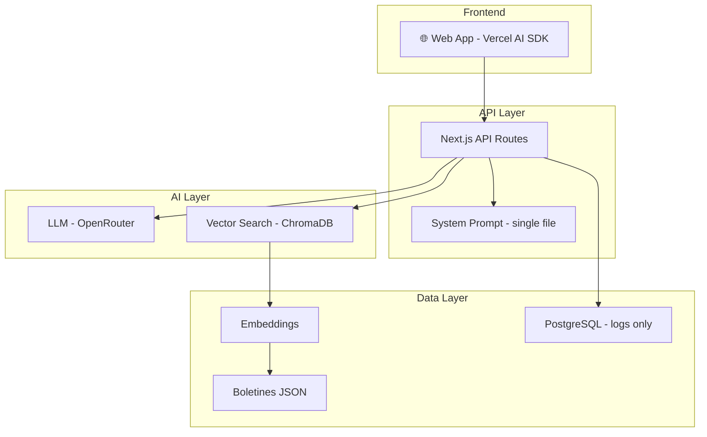

# 📋 Plan MVP Simplificado - Chatbot Legal Municipal

> **Fecha**: 2025-12-31  
> **Versión**: 2.0 (Simplificada según feedback)

---

## 🎯 Concepto

> Chatbot tipo ChatGPT/Claude/Z.ai para consultar boletines oficiales de municipios de Buenos Aires. Solo web, enfoque en calidad del RAG y el LLM.

---

## 📐 Alcance MVP (2-3 meses)

### Funcionalidades Core

| # | Funcionalidad | Descripción |
|---|---------------|-------------|
| 1 | **One-page con chat central** | Interfaz minimalista tipo ChatGPT |
| 2 | **RAG Engine** | Búsqueda semántica en boletines |
| 3 | **Sistema de prompts** | Instrucciones claras en un archivo |
| 4 | **Citations legales** | Citas con fuente y link al Boletín |
| 5 | **Indicador de vigencia** | Muestra si la norma está vigente |
| 6 | **Web responsive** | Desktop + mobile |

### Excluido del MVP

- WhatsApp / Telegram / Voice / Email / SMS
- Panel Personal del Ciudadano
- Gamificación
- Modo Adultos Mayores
- Alertas proactivas
- FAQs cacheadas (se evalúa post-MVP)

---

## 🏗️ Arquitectura Simplificada



---

## 💰 Stack Tecnológico (según preferencia)

| Componente | Tecnología | Costo |
|------------|------------|-------|
| **Frontend + API** | Next.js + Vercel AI SDK | $0 |
| **LLM** | OpenRouter (google/gemini-3-flash) | ~$50/mes |
| **Vector DB** | ChromaDB (self-hosted en Vercel/Railway) | $0-15/mes |
| **Embeddings** | sentence-transformers (local) | $0 |
| **DB logs** | PostgreSQL (Supabase free) | $0 |
| **Hosting** | Vercel | $0 |
| **Dominio** | A determinar | ~$5/año |
| **Total** | | **~$60/mes** |

---

## 📋 Flujo de Usuario

```
┌─────────────────────────────────────────────────────────────┐
│ 🏛️ CHATBOT LEGAL - MUNICIPIOS BS AS                        │
├─────────────────────────────────────────────────────────────┤
│                                                             │
│  ┌─────────────────────────────────────────────────────┐    │
│  │ 💬 Área de chat                                      │    │
│  │                                                     │    │
│  │ ┌─────────────────────────────────────────────────┐ │    │
│  │ │ 🤖 Buenos Aires Legal                            │ │    │
│  │ │                                                     │ │    │
│  │ │ ¿Sobre qué norma municipal querés consultar?     │ │    │
│  │ └─────────────────────────────────────────────────┘ │    │
│  │                                                     │    │
│  │ ┌─────────────────────────────────────────────────┐ │    │
│  │ │ 👤 Usuario                                        │ │    │
│  │ │                                                     │ │    │
│  │ │ ¿Qué requisitos hay para abrir un comercio        │ │    │
│  │ │ en Avellaneda?                                    │ │    │
│  │ └─────────────────────────────────────────────────┘ │    │
│  │                                                     │    │
│  │ ┌─────────────────────────────────────────────────┐ │    │
│  │ │ 🤖 Respuesta...                                   │ │    │
│  │ │                                                     │ │    │
│  │ │ Para la habilitación comercial en Avellaneda      │ │    │
│  │ │ (Ordenanza 1.234/2020), necesitás:                │ │    │
│  │ │                                                     │ │    │
│  │ │ • Formulario de solicitud                         │ │    │
│  │ │ • Documentación del local                         │ │    │
│  │ │ • Habilitación de Bromatología                    │ │    │
│  │ │ • Pago de tasa                                    │ │    │
│  │ │                                                     │ │    │
│  │ │ 📄 Fuentes:                                        │ │    │
│  │ │ • Ordenanza 1.234/2020 (Art. 15-20)               │ │    │
│  │ │   📅 Boletín 105º - 17/01/2025                    │ │    │
│  │ │   🔗 [Ver fuente]                                 │ │    │
│  │ │                                                     │ │    │
│  │ │ ⚠️ Nota: La norma existe pero la implementación   │ │    │
│  │ │    de algunos requisitos puede variar.            │ │    │
│  │ │    Consultá en la muni para confirmar.            │ │    │
│  │ └─────────────────────────────────────────────────┘ │    │
│  └─────────────────────────────────────────────────────┘    │
│                                                             │
│  ┌─────────────────────────────────────────────────────┐    │
│  │ 📝 Input: [Escribí tu pregunta...]  [Enviar]        │    │
│  └─────────────────────────────────────────────────────┘    │
│                                                             │
└─────────────────────────────────────────────────────────────┘
```

---

## 📊 Features Priorizados

| Prioridad | Feature | Complejidad |
|-----------|---------|-------------|
| 🔴 Alta | Interfaz chat tipo ChatGPT | Media |
| 🔴 Alta | RAG con ChromaDB | Alta |
| 🔴 Alta | System Prompt único y claro | Media |
| 🔴 Alta | Citations con links | Baja |
| 🟡 Media | Indicador de vigencia | Baja |
| 🟡 Media | Web responsive | Baja |
| 🟢 Baja | Historial de sesión | Baja |

---

## 🗓️ Roadmap

### Sprint 1 (2 semanas)
- Setup Next.js con Vercel AI SDK
- Conexión con API de boletines existentes
- Pipeline de indexación a ChromaDB

### Sprint 2 (2 semanas)
- Frontend chat minimalista
- System Prompt optimizado
- Integración LLM con OpenRouter

### Sprint 3 (2 semanas)
- Sistema de citations
- Indicador de vigencia
- Mejora de respuestas

### Sprint 4 (2 semanas)
- Testing de calidad
- Documentación JSDoc
- Deploy y métricas

---

## 💰 Costos MVP

| Item | Costo mensual |
|------|---------------|
| OpenRouter (LLM) | $50-100 |
| ChromaDB cloud | $0-15 |
| Vercel | $0 |
| Supabase | $0 |
| **Total** | **$50-115** |

---

## 📝 Notas Importantes

1. **Solo web** - No canales messaging
2. **Calidad RAG > Features** - El foco es la calidad de respuesta
3. **Legislación ≠ Servicios** - Las normas pueden existir sin implementación
4. **Documentación estricta** - JSDoc en todo + CHANGELOG.md
5. **Español argentino** - Todo el proyecto en español local

---

*Plan MVP v2.0 - Simplificado*
*Generado: 2025-12-31*
