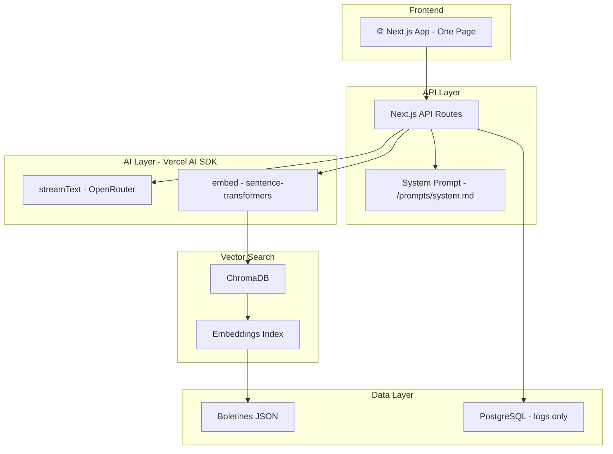
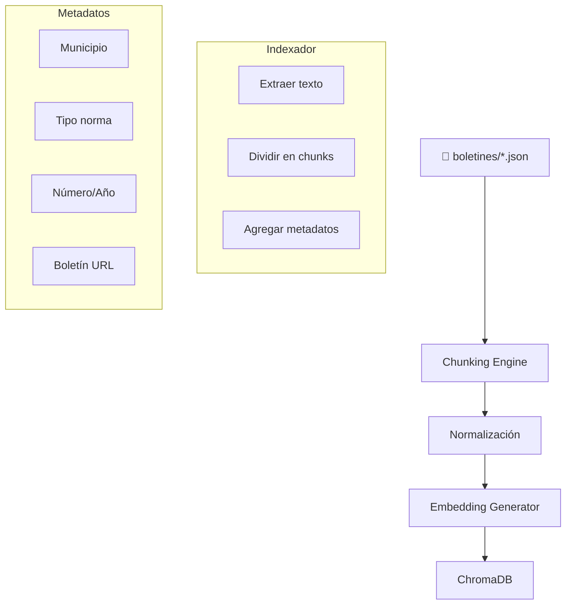

# 📐 Especificación Técnica - Chatbot Legal Municipal

> **Versión**: 2.0 (Simplificada)  
> **Fecha**: 2025-12-31  
> **Estado**: Borrador

---

## 1. Arquitectura General



---

## 2. Estructura del Proyecto

```
chatbot-legal/
├── src/
│   ├── app/
│   │   ├── page.tsx          # One-page chat interface
│   │   ├── api/
│   │   │   └── chat/
│   │   │       └── route.ts  # Vercel AI SDK endpoint
│   │   └── layout.tsx
│   ├── components/
│   │   ├── ChatContainer.tsx
│   │   ├── ChatMessage.tsx
│   │   ├── ChatInput.tsx
│   │   └── Citations.tsx
│   ├── lib/
│   │   ├── rag.ts            # RAG engine
│   │   ├── chroma.ts         # ChromaDB client
│   │   ├── embeddings.ts     # Embeddings generator
│   │   └── citations.ts      # Citation extractor
│   ├── prompts/
│   │   └── system.md         # UNICO system prompt
│   └── types/
│       └── index.ts
├── data/
│   └── boletines/            # JSON files from scraper
├── docs/
│   └── CHANGELOG.md
├── public/
├── package.json
├── next.config.js
└── README.md
```

---

## 3. System Prompt (Único y Claro)

Archivo: `src/prompts/system.md`

```markdown
# Sistema de Prompt para Chatbot Legal Municipal

## Rol
Eres un asistente legal especializado en legislación municipal de la provincia de Buenos Aires, Argentina.

## Objetivo
Ayudar a ciudadanos a consultar y entender ordenanzas, decretos y boletines oficiales de los municipios.

## Reglas Fundamentales

1. **Responde solo sobre legislación**
   - No inventes información
   - Si no encontrás info relevante, decilo claramente
   - No sugieras servicios que no están en las normas

2. **Citas obligatorias**
   - Toda afirmación debe tener fuente
   - Incluir: tipo de norma, número, año, municipio
   - Link al Boletín Oficial

3. **Vigencia de normas**
   - Verificá si la norma está vigente
   - Si fue modificada o derogada, informalo
   - Si existe pero no está implementada, advertilo

4. **Lenguaje claro**
   - Evitá jerga legal innecesaria
   - Explicá en términos simples
   - Estructurá con bullets

5. **Honestidad**
   - Si no estás seguro, dilo
   - Si la información está incompleta, señalalo
   - Sugerí consultar un profesional para casos específicos

## Formato de Respuesta

```
[RESPUENSTA en 2-3 oraciones]

**Puntos clave:**
- Bullet 1
- Bullet 2

**Fuentes:**
- [Tipo] [Número]/[Año] - [Municipio] ([Artículo])
  📅 [Fecha] | 🔗 [Link]

**Nota:** [Si la norma existe pero puede no estar implementada]
```

## Contexto que recibís
- Normas encontradas en la búsqueda
- Metadatos (municipio, tipo, fecha)
- Estado de vigencia

## Ejemplo de Respuesta

> Para la habilitación comercial en Avellaneda necesitás formulario de solicitud, documentación del local, habilitación de Bromatología y pago de tasa.
>
> **Fuentes:**
> - Ordenanza 1.234/2020, Arts. 15-20 (Avellaneda)
>   📅 Boletín 105º - 17/01/2025 | 🔗 [Link]
>
> **Nota:** Esta norma existe pero verificá en la muni si los requisitos están actualizados.
```

---

## 4. API Routes

### Chat Endpoint (Vercel AI SDK)

```typescript
// src/app/api/chat/route.ts

import { openRouter } from '@ai-sdk/openrouter';
import { streamText } from 'ai';
import { retrieveContext } from '@/lib/rag';

export const maxDuration = 30;

export async function POST(req: Request) {
  const { messages, municipality } = await req.json();

  const lastMessage = messages[messages.length - 1];
  const query = lastMessage.content;

  // 1. Buscar contexto en RAG
  const context = await retrieveContext(query, municipality);

  // 2. Armar prompt con system + contexto
  const systemPrompt = await readFile('src/prompts/system.md', 'utf-8');
  const fullPrompt = `${systemPrompt}\n\n---\n\nCONTEXTO ENCONTRADO:\n${context}`;

  // 3. Generar respuesta con streaming
  const result = await streamText({
    model: openRouter('google/gemini-3-flash-preview'),
    messages: [
      { role: 'system', content: fullPrompt },
      ...messages,
    ],
    maxTokens: 2000,
  });

  return result.toDataStreamResponse();
}
```

---

## 5. RAG Engine

```typescript
// src/lib/rag.ts

import { ChromaClient } from 'chromadb';
import { embed } from './embeddings';

/**
 * Recupera contexto relevante para una consulta
 * @param query - Texto de la consulta del usuario
 * @param municipality - Municipio opcional para filtrar
 * @returns Contexto formateado para el LLM
 */
export async function retrieveContext(
  query: string,
  municipality?: string
): Promise<string> {
  const client = new ChromaClient({ path: process.env.CHROMA_URL });
  const collection = await client.getCollection({ name: 'boletines' });

  // 1. Generar embedding de la query
  const embedding = await embed(query);

  // 2. Búsqueda semántica
  const results = await collection.query({
    queryEmbeddings: [embedding],
    nResults: 5,
    where: municipality ? { municipality } : undefined,
  });

  // 3. Formatear contexto
  const context = results.documents[0]
    ?.map((doc, i) => {
      const metadata = results.metadatas[0][i];
      return `
=== NORMA ${i + 1} ===
Tipo: ${metadata.type}
Municipio: ${metadata.municipality}
Número: ${metadata.number}
Año: ${metadata.year}
Título: ${metadata.title}
Contenido: ${doc.substring(0, 1000)}
`;
    })
    .join('\n---\n');

  return context || 'No se encontraron normas relevantes.';
}
```

---

## 6. Tipos TypeScript

```typescript
// src/types/index.ts

/**
 * Mensaje de chat
 */
export interface ChatMessage {
  id: string;
  role: 'user' | 'assistant';
  content: string;
  citations?: Citation[];
  timestamp: Date;
}

/**
 * Citación legal
 */
export interface Citation {
  type: 'ORDENANZA' | 'DECRETO' | 'EDICTO';
  number: string;
  year: string;
  article?: string;
  title: string;
  municipality: string;
  bulletinNumber: string;
  bulletinUrl: string;
  publicationDate: string;
  status: 'VIGENTE' | 'MODIFICADO' | 'DEROGADO';
  confidence: number;
}

/**
 * Configuración del sistema
 */
export interface SystemConfig {
  model: string;
  maxTokens: number;
  temperature: number;
  topK: number;
}
```

---

## 7. Componente Chat (React)

```typescript
// src/components/ChatContainer.tsx

'use client';

import { useState } from 'react';
import { useChat } from 'ai/react';
import ChatMessage from './ChatMessage';
import ChatInput from './ChatInput';

const SYSTEM_PROMPT = `... (load from file)`;

export default function ChatContainer() {
  const { messages, input, handleInputChange, handleSubmit, isLoading } =
    useChat({
      api: '/api/chat',
      body: { municipality: 'Avellaneda' },
    });

  return (
    <div className="chat-container">
      {/* Header */}
      <header className="chat-header">
        <h1>🏛️ Chatbot Legal Municipal</h1>
        <p>Consultá ordenanzas y decretos de tu municipio</p>
      </header>

      {/* Messages */}
      <div className="messages-area">
        {messages.map((m) => (
          <ChatMessage key={m.id} message={m} />
        ))}
        {isLoading && (
          <div className="loading-indicator">Pensando...</div>
        )}
      </div>

      {/* Input */}
      <ChatInput
        value={input}
        onChange={handleInputChange}
        onSubmit={handleSubmit}
        disabled={isLoading}
      />
    </div>
  );
}
```

---

## 8. Base de Datos (Solo Logs)

```sql
-- PostgreSQL - Solo para métricas y logs

CREATE TABLE conversation_logs (
    id UUID PRIMARY KEY DEFAULT gen_random_uuid(),
    user_session VARCHAR(100),
    query_text TEXT,
    response_text TEXT,
    municipalities_mentioned TEXT[],
    citations_found INTEGER,
    response_time_ms INTEGER,
    model_used VARCHAR(100),
    tokens_used INTEGER,
    created_at TIMESTAMP DEFAULT NOW()
);

CREATE TABLE daily_metrics (
    date DATE PRIMARY KEY,
    total_queries INTEGER DEFAULT 0,
    avg_response_time_ms DECIMAL(10,2),
    avg_citations_per_query DECIMAL(5,2),
    top_municipalities JSONB
);
```

---

## 9. Pipeline de Indexación



---

## 10. Comandos de Desarrollo

```bash
# Instalar dependencias
npm install

# Levantar ChromaDB local
docker run -p 8000:8000 chromadb/chroma

# Indexar boletines
npm run index

# Desarrollo
npm run dev

# Deploy
vercel deploy
```

---

## 11. Variables de Entorno

```bash
# .env.local

# OpenRouter
OPENROUTER_API_KEY=sk-or-v1-...

# ChromaDB
CHROMA_URL=http://localhost:8000

# PostgreSQL (Supabase)
DATABASE_URL=postgresql://...

# App
NEXT_PUBLIC_APP_URL=http://localhost:3000
```

---

## 12. Documentación Requerida

### Cada archivo debe tener:

```typescript
/**
 * nombre-del-archivo.ts
 * 
 * Descripción breve del archivo
 * 
 * @version 1.0.0
 * @created 2025-12-31
 * @modified 2025-12-31
 * @author Tu Nombre
 * @see ./ruta/relativa.md para documentación extendida
 * 
 * @dependencies
 *   - dependencia1: version
 *   - dependencia2: version
 * 
 * @notes
 *   Notas importantes sobre el archivo
 */
```

### CHANGELOG.md (obligatorio)

```markdown
# Changelog

## [1.0.0] - 2025-12-31

### Agregado
- Chat interface básico
- RAG engine
- Sistema de citations

### Modificado
- ...

### Corregido
- ...
```

---

*Especificación Técnica v2.0*
*Generada: 2025-12-31*
*Basada en feedback del usuario*
