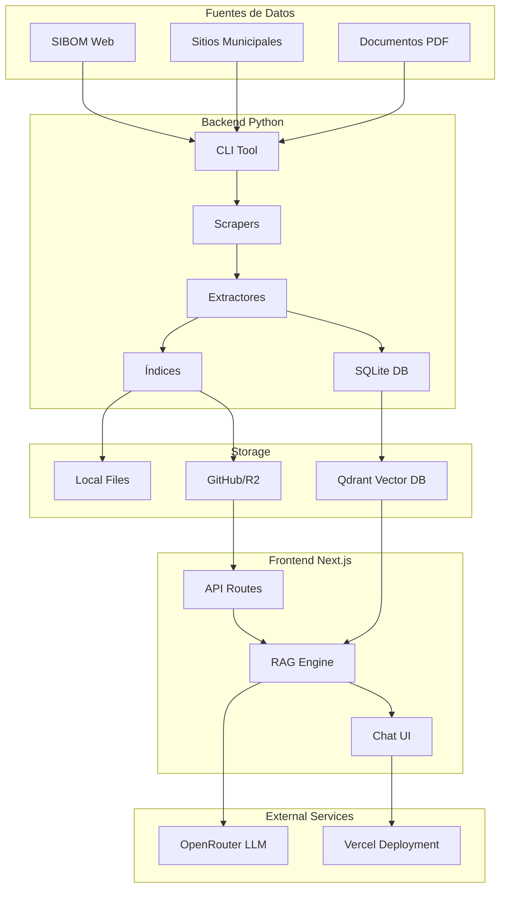
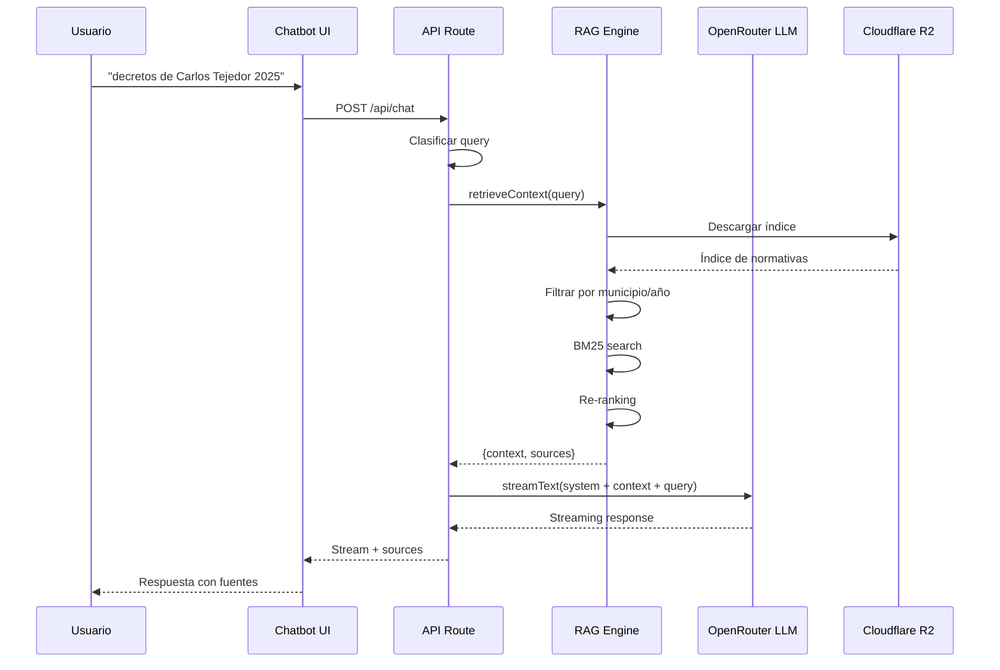
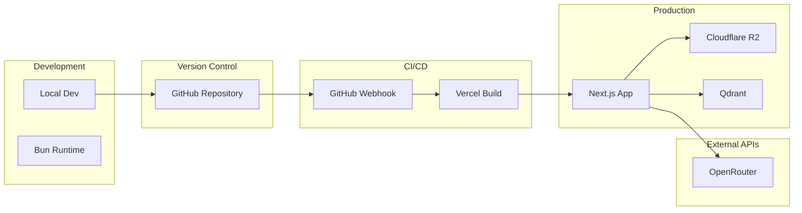
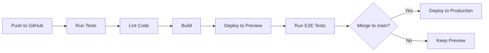
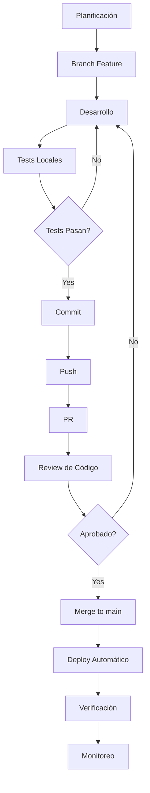
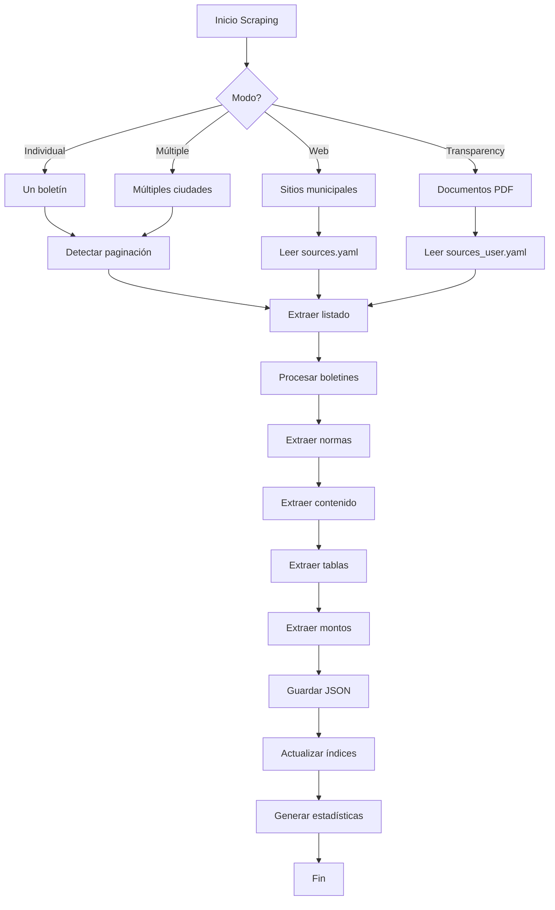
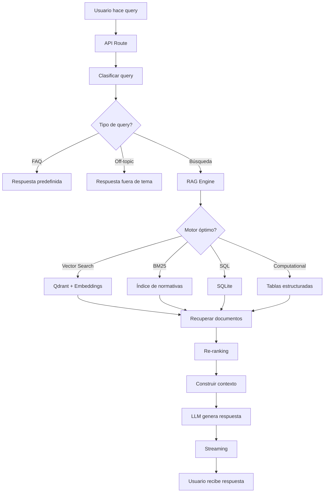
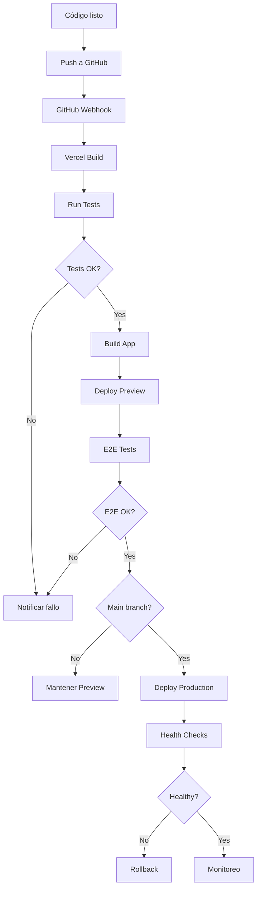

# Análisis Arquitectónico Completo - Mangrullo Scraper Assistant

**Fecha:** 2026-02-04  
**Versión:** 1.0.0  
**Autor:** Arquitecto de Software Senior  
**Estado:** 📋 Propuesta para Revisión

---

## 📋 Tabla de Contenidos

1. [Resumen Ejecutivo](#resumen-ejecutivo)
2. [Análisis del Proyecto](#análisis-del-proyecto)
3. [Arquitectura del Sistema](#arquitectura-del-sistema)
4. [Directrices Técnicas](#directrices-técnicas)
5. [Reglas de Negocio](#reglas-de-negocio)
6. [Flujos de Trabajo Operativos](#flujos-de-trabajo-operativos)
7. [Competencias del Equipo](#competencias-del-equipo)
8. [Roadmap de Implementación](#roadmap-de-implementación)
9. [Métricas de Éxito](#métricas-de-éxito)

---

## 1. Resumen Ejecutivo

### 1.1 Visión General

**Mangrullo Scraper Assistant** es un ecosistema completo de dos aplicaciones integradas diseñado para extraer, procesar y consultar boletines oficiales municipales de la Provincia de Buenos Aires, Argentina. El proyecto combina técnicas avanzadas de web scraping, inteligencia artificial y búsqueda semántica para proporcionar acceso democrático a la información legislativa municipal.

### 1.2 Objetivos Estratégicos

| Objetivo                       | Descripción                                                      | Prioridad |
| ------------------------------ | ---------------------------------------------------------------- | --------- |
| **Democratización del Acceso** | Facilitar el acceso ciudadano a normativas municipales           | Alta      |
| **Automatización**             | Eliminar procesos manuales de extracción y organización          | Alta      |
| **Escalabilidad**              | Soportar los 135 municipios de la provincia                      | Media     |
| **Calidad de Datos**           | Garantizar precisión y estructuración de la información          | Alta      |
| **Innovación**                 | Implementar tecnologías de vanguardia (LLMs, RAG, Vector Search) | Media     |

### 1.3 Estado Actual

| Componente       | Estado       | Métricas                          |
| ---------------- | ------------ | --------------------------------- |
| Backend Python   | ✅ Producción | 1,677 boletines, 216K+ normativas |
| Frontend Next.js | ✅ Producción | Multi-motores de búsqueda         |
| Sistema RAG      | ✅ Producción | BM25, Vector Search, SQL          |
| Deployment       | ✅ Producción | Vercel + Cloudflare R2            |
| Documentación    | ✅ Completa   | Múltiples guías técnicas          |

---

## 2. Análisis del Proyecto

### 2.1 Contexto del Negocio

**Problema Identificado:**
- El buscador oficial de Mangrullo es ineficiente y confuso
- Los ciudadanos tienen dificultades para encontrar normativas específicas
- No existe una herramienta unificada para consultar múltiples municipios
- La información legislativa está fragmentada y de difícil acceso

**Solución Proporcionada:**
- Sistema automatizado de extracción de boletines
- Chatbot con búsqueda semántica en lenguaje natural
- Acceso unificado a normativas de múltiples municipios
- Respuestas con fuentes citadas y verificables

### 2.2 Stakeholders

| Stakeholder                  | Intereses                             | Impacto |
| ---------------------------- | ------------------------------------- | ------- |
| **Ciudadanos**               | Acceso fácil a normativas municipales | Alto    |
| **Funcionarios Municipales** | Transparencia y difusión de normativa | Medio   |
| **Abogados/Estudiantes**     | Investigación legislativa eficiente   | Alto    |
| **SLyT GBA**                 | Mejora de servicios transparencia     | Bajo    |
| **Desarrolladores**          | Código abierto y reutilizable         | Bajo    |

### 2.3 Análisis DAFO

#### Fortalezas (Strengths)
- ✅ Arquitectura moderna y escalable
- ✅ Uso de tecnologías de vanguardia (LLMs, RAG)
- ✅ Código bien documentado y estructurado
- ✅ Sistema multi-motor de búsqueda (BM25, Vector, SQL)
- ✅ Deployment automatizado en Vercel
- ✅ Soporte para modelos LLM gratuitos

#### Debilidades (Weaknesses)
- ⚠️ Dependencia de OpenRouter para LLMs
- ⚠️ Costos asociados a modelos premium
- ⚠️ Complejidad del sistema RAG
- ⚠️ Requiere mantenimiento continuo de scrapers
- ⚠️ Dependencia de la estructura de Mangrullo

#### Oportunidades (Opportunities)
- 🚀 Expandir a otras provincias argentinas
- 🚀 Agregar análisis predictivo de tendencias legislativas
- 🚀 Integración con sistemas de gestión municipal
- 🚀 API pública para terceros
- 🚀 Monetización mediante servicios premium

#### Amenazas (Threats)
- ⚡ Cambios en la estructura de Mangrullo
- ⚡ Aumento de costos de LLMs
- ⚡ Competencia de soluciones comerciales
- ⚡ Limitaciones de rate limiting
- ⚡ Problemas de privacidad de datos

---

## 3. Arquitectura del Sistema

### 3.1 Arquitectura de Alto Nivel



### 3.2 Componentes del Backend (Python CLI)

#### 3.2.1 Scrapers

| Componente               | Función                            | Tecnologías                   |
| ------------------------ | ---------------------------------- | ----------------------------- |
| **Mangrullo Scraper**        | Extrae boletines de SIBOM          | BeautifulSoup, OpenRouter LLM |
| **Web Scraper**          | Extrae de sitios municipales       | requests, lxml                |
| **Transparency Scraper** | Extrae documentos de transparencia | pdfplumber, Vision API        |

#### 3.2.2 Extractores

| Componente           | Función                     | Tecnologías           |
| -------------------- | --------------------------- | --------------------- |
| **Table Extractor**  | Extrae tablas estructuradas | BeautifulSoup, regex  |
| **Monto Extractor**  | Extrae montos monetarios    | regex, NLP            |
| **Vision Extractor** | Procesa PDFs con OCR        | pdf2image, Vision API |

#### 3.2.3 Sistema de Índices

```
python-cli/data/indices/
├── boletines_index.json           # Índice de boletines (legacy)
├── normativas_index.json          # Índice completo de normativas
├── normativas_index_compact.json  # Índice compacto (sin contenido)
└── normativas_index_minimal.json  # Índice minimalista (para frontend)
```

**Estructura del Índice de Normativas:**
```typescript
interface NormativaIndexEntry {
  id: string;         // ID único
  m: string;          // municipality
  t: DocumentType;    // type (ordenanza, decreto, etc.)
  n: string;          // number
  y: string;          // year
  d: string;          // date (DD/MM/YYYY)
  ti: string;         // title (truncado a 100 chars)
  sb: string;         // source_bulletin (filename)
  url: string;        // URL del boletín en SIBOM
}
```

### 3.3 Componentes del Frontend (Next.js Chatbot)

#### 3.3.1 Arquitectura del Chatbot

```
chatbot/src/
├── app/
│   ├── api/
│   │   └── chat/route.ts          # API principal del chat
│   ├── layout.tsx                  # Layout principal
│   └── page.tsx                    # Página principal
├── components/
│   ├── chat/                       # Componentes del chat
│   │   ├── ChatContainer.tsx
│   │   ├── ChatInput.tsx
│   │   ├── ChatMessageList.tsx
│   │   └── FilterBar.tsx
│   └── layout/                     # Componentes de layout
│       ├── Header.tsx
│       └── Sidebar.tsx
└── lib/
    ├── rag/                        # Motor RAG
    │   ├── retriever.ts            # Recuperador principal
    │   ├── bm25.ts                # Búsqueda por palabras clave
    │   ├── vector-search.ts        # Búsqueda semántica
    │   ├── sql-retriever.ts       # Búsqueda SQL
    │   ├── reranker.ts            # Re-ranking de resultados
    │   └── table-formatter.ts     # Formateo de tablas
    ├── computation/                # Motor de cómputo
    │   ├── executor.ts
    │   ├── query-parser.ts
    │   └── table-engine.ts
    └── query-classifier.ts         # Clasificador de queries
```

#### 3.3.2 Motores de Búsqueda

**1. BM25 (Keyword Search)**
- **Uso:** Búsquedas exactas por número, tipo, municipio
- **Ventajas:** Rápido, preciso para términos específicos
- **Ejemplo:** "ordenanza 2947", "decretos de Carlos Tejedor"

**2. Vector Search (Semántico)**
- **Uso:** Búsqueda por tema, contexto, sinónimos
- **Ventajas:** Entiende lenguaje natural, sinónimos
- **Ejemplo:** "normativas sobre sueldos", "tránsito municipal"

**3. SQL (SQLite)**
- **Uso:** Agregaciones, conteos, comparaciones
- **Ventajas:** Rápido para operaciones numéricas
- **Ejemplo:** "qué municipio tiene más decretos", "cuántas ordenanzas hay"

**4. Computational (Tablas)**
- **Uso:** Operaciones sobre datos tabulares
- **Ventajas:** Procesa balances, presupuestos
- **Ejemplo:** "gastos de Carlos Tejedor en 2025"

### 3.4 Flujo de Datos Completo



### 3.5 Deployment Architecture



---

## 4. Directrices Técnicas

### 4.1 Estándares de Código

#### 4.1.1 TypeScript (Chatbot)

**Reglas Obligatorias:**

1. **Imports**
   - Orden: External libraries → Internal modules → Relative imports → Type-only imports
   - Usar named exports por defecto
   - Default exports solo para componentes React principales

```typescript
// ✅ CORRECTO
import fs from 'fs/promises';
import { streamText } from 'ai';
import { retrieveContext } from '@/lib/rag/retriever';
import type { Document } from '@/lib/types';

// ❌ INCORRECTO
import type { Document } from '@/lib/types';
import fs from 'fs/promises';
```

2. **Formatting**
   - Indentación: 2 espacios (no tabs)
   - Semicolons: Obligatorios
   - Quotes: Single quotes para strings
   - Max line length: 100 caracteres (soft limit)

3. **Types**
   - Use `interface` para objetos con propiedades
   - Use `type` para unions, tuples, primitives
   - Implementar type guards para narrowing

4. **Error Handling**
   - Throw custom errors con mensajes descriptivos
   - Log errors con contexto suficiente
   - Never swallow errors sin logging

5. **Async/Await**
   - Use async/await en vez de callbacks
   - Handle Promise rejections siempre
   - Use Promise.all para paralelismo

#### 4.1.2 Python (Scraper)

**Reglas Obligatorias:**

1. **Imports**
   - Orden: Standard library → Third-party libraries → Local modules
   - Cada import en una línea
   - Blank lines: 2 entre funciones, 1 entre métodos en clases

2. **Formatting**
   - Indentación: 4 espacios (no tabs)
   - Max line length: 100 caracteres
   - Use type hints obligatorias en funciones exportadas

3. **Error Handling**
   - Use exceptions para errores, no return codes
   - Log errors con contexto
   - Custom exceptions para dominio específico

4. **Naming Conventions**
   - Variables/Functions: snake_case
   - Constants: UPPER_SNAKE_CASE
   - Classes: PascalCase
   - Private methods: prefijo `_`

5. **Docstrings**
   - Use Google style o NumPy style
   - Incluir: resumen, params, returns, raises

### 4.2 Patrones de Diseño

#### 4.2.1 Patrones Implementados

| Patrón         | Ubicación  | Propósito                                     |
| -------------- | ---------- | --------------------------------------------- |
| **Strategy**   | RAG Engine | Múltiples motores de búsqueda intercambiables |
| **Factory**    | CLI Tool   | Creación de scrapers según tipo de fuente     |
| **Singleton**  | Cache      | Instancias únicas de cache                    |
| **Observer**   | StreamData | Notificaciones de progreso                    |
| **Repository** | Retriever  | Abstracción de acceso a datos                 |

#### 4.2.2 Patrones Recomendados

1. **Circuit Breaker**
   - Para llamadas a APIs externas (OpenRouter, Qdrant)
   - Prevenir cascadas de fallos

2. **Retry Pattern**
   - Para operaciones de red con jitter aleatorio
   - Evitar detección de patrones

3. **Rate Limiting**
   - Implementar rate limiting distribuido
   - Proteger contra abuso

4. **CQRS**
   - Separar operaciones de lectura y escritura
   - Optimizar rendimiento

### 4.3 Seguridad

#### 4.3.1 Directrices de Seguridad

1. **Secrets Management**
   - ❌ Nunca commit secrets o API keys
   - ✅ Usar variables de entorno (.env)
   - ✅ Rotar keys regularmente

2. **Input Validation**
   - ✅ Validar todos los inputs del usuario
   - ✅ Sanitizar datos antes de procesar
   - ✅ Usar Zod para validación de tipos

3. **API Security**
   - ✅ Implementar rate limiting
   - ✅ Usar HTTPS en producción
   - ✅ Sanitizar output para prevenir XSS

4. **Data Protection**
   - ✅ Cifrar datos sensibles
   - ✅ Implementar CORS correctamente
   - ✅ Minimizar exposición de datos

### 4.4 Performance

#### 4.4.1 Optimizaciones Implementadas

| Componente            | Optimización                          | Impacto                 |
| --------------------- | ------------------------------------- | ----------------------- |
| **Cache Multi-nivel** | File cache, index cache, Vercel cache | Reducción 80% requests  |
| **Gzip Compression**  | Compresión de JSONs                   | Reducción 80% bandwidth |
| **BM25 Index**        | Indexación de metadatos               | Búsqueda 10x más rápida |
| **Lazy Loading**      | Carga bajo demanda de contenido       | Reducción 70% memoria   |
| **Streaming**         | Respuestas en tiempo real             | Mejora UX significativa |

#### 4.4.2 Optimizaciones Recomendadas

1. **CDN Integration**
   - Usar CDN para assets estáticos
   - Implementar edge caching agresivo

2. **Database Optimization**
   - Implementar connection pooling
   - Usar prepared statements

3. **Bundle Optimization**
   - Code splitting por ruta
   - Tree shaking para eliminar código muerto

4. **Caching Strategy**
   - Implementar cache distribuido (Redis)
   - Cache invalidation inteligente

### 4.5 Testing

#### 4.5.1 Estrategia de Testing

| Tipo                  | Cobertura Objetivo | Herramientas                 |
| --------------------- | ------------------ | ---------------------------- |
| **Unit Tests**        | 80%+               | Vitest (TS), pytest (Python) |
| **Integration Tests** | 60%+               | Vitest, pytest               |
| **E2E Tests**         | 40%+               | Playwright                   |
| **Performance Tests** | -                  | k6, Artillery                |

#### 4.5.2 Reglas de Testing

1. **Unit Tests**
   - Test one thing per test
   - Arrange-Act-Assert pattern
   - Use descriptive names
   - Mock external dependencies

2. **Integration Tests**
   - Test flujos completos
   - Usar datos de prueba realistas
   - Limpiar después de cada test

3. **E2E Tests**
   - Test user journeys críticos
   - Simular comportamiento real del usuario
   - Test en múltiples navegadores

### 4.6 CI/CD

#### 4.6.1 Pipeline de Deployment



#### 4.6.2 Reglas de CI/CD

1. **Automatización**
   - Todo cambio debe pasar tests
   - Linting obligatorio antes de merge
   - Deploy automático a preview en cada PR

2. **Quality Gates**
   - Coverage mínimo: 80%
   - Linting sin errores
   - Build exitoso

3. **Deployment**
   - Zero-downtime deployments
   - Rollback automático en fallo
   - Monitoreo post-deployment

---

## 5. Reglas de Negocio

### 5.1 Reglas de Dominio

#### 5.1.1 Extracción de Datos

| Regla  | Descripción                                              | Prioridad |
| ------ | -------------------------------------------------------- | --------- |
| **R1** | Extraer TODAS las normativas de cada boletín             | Alta      |
| **R2** | Preservar estructura original (artículos, considerandos) | Alta      |
| **R3** | Extraer tablas como datos estructurados                  | Media     |
| **R4** | Extraer montos monetarios con contexto                   | Media     |
| **R5** | Mantener metadatos completos (fecha, tipo, número)       | Alta      |

#### 5.1.2 Búsqueda y Recuperación

| Regla   | Descripción                                              | Prioridad |
| ------- | -------------------------------------------------------- | --------- |
| **R6**  | Priorizar resultados exactos (número de norma)           | Alta      |
| **R7**  | Usar búsqueda semántica para queries en lenguaje natural | Alta      |
| **R8**  | Citar siempre las fuentes de información                 | Alta      |
| **R9**  | No alucinar información no presente en documentos        | Crítica   |
| **R10** | Limitar resultados a 10 por defecto (configurable)       | Media     |

#### 5.1.3 Generación de Respuestas

| Regla   | Descripción                                  | Prioridad |
| ------- | -------------------------------------------- | --------- |
| **R11** | Respuestas en lenguaje claro y accesible     | Alta      |
| **R12** | Incluir siempre enlaces a fuentes originales | Alta      |
| **R13** | Explicar cuando no se encuentre información  | Alta      |
| **R14** | Ofrecer alternativas de búsqueda             | Media     |
| **R15** | Usar streaming para mejor UX                 | Alta      |

### 5.2 Reglas de Calidad de Datos

#### 5.2.1 Validación de Extracción

```python
# Validación de calidad de normativa
def validate_normativa(normativa: Dict) -> bool:
    """Valida que una normativa cumpla con estándares de calidad"""
    required_fields = ['id', 'tipo', 'numero', 'titulo', 'contenido']
    
    # Verificar campos obligatorios
    for field in required_fields:
        if field not in normativa or not normativa[field]:
            return False
    
    # Verificar longitud mínima de contenido
    if len(normativa['contenido']) < 50:
        return False
    
    # Verificar formato de número
    if not re.match(r'\d+[/\-]?\d*', normativa['numero']):
        return False
    
    return True
```

#### 5.2.2 Métricas de Calidad

| Métrica                      | Objetivo | Medición              |
| ---------------------------- | -------- | --------------------- |
| **Precisión de Extracción**  | >95%     | Manual sampling       |
| **Completitud de Datos**     | >90%     | Validación automática |
| **Relevancia de Resultados** | >80%     | Feedback de usuarios  |
| **Exactitud de Respuestas**  | >85%     | Evaluación humana     |

### 5.3 Reglas de Operación

#### 5.3.1 Scraping

| Regla   | Descripción                                    |
| ------- | ---------------------------------------------- |
| **OR1** | Respetar rate limiting de SIBOM (3s + jitter)  |
| **OR2** | Implementar reintentos con backoff exponencial |
| **OR3** | Guardar progreso incremental para recuperación |
| **OR4** | Usar User-Agent realista                       |
| **OR5** | Loggear todos los errores con contexto         |

#### 5.3.2 Deployment

| Regla   | Descripción                           |
| ------- | ------------------------------------- |
| **DR1** | Deploy automático en cada push a main |
| **DR2** | Preview environments para cada PR     |
| **DR3** | Monitoreo continuo de errores         |
| **DR4** | Alertas para métricas críticas        |
| **DR5** | Backups automáticos de datos          |

---

## 6. Flujos de Trabajo Operativos

### 6.1 Flujo de Desarrollo



### 6.2 Flujo de Scraping



### 6.3 Flujo de Consulta del Usuario



### 6.4 Flujo de Deployment



### 6.5 Flujo de Incidentes

```mermaid
graph TD
    A[Incidente detectado] --> B[Clasificar severidad]
    B --> C{Severidad?}
    
    C -->|P1 (Crítica)| D[Notificar equipo inmediatamente]
    C -->|P2 (Alta)| E[Notificar equipo en 15min]
    C -->|P3 (Media)| F[Notificar equipo en 1h]
    C -->|P4 (Baja)| G[Crear ticket]
    
    D --> H[Investigación]
    E --> H
    F --> H
    G --> H
    
    H --> I{Solución encontrada?}
    I -->|No| J[Escalar a expertos]
    I -->|Yes| K[Implementar fix]
    
    J --> H
    
    K --> L[Deploy fix]
    L --> M[Verificar]
    M --> N{Resuelto?}
    N -->|No| H
    N -->|Yes| O[Post-mortem]
    O --> P[Cerrar incidente]
```

---

## 7. Competencias del Equipo

### 7.1 Hard Skills (Técnicas)

#### 7.1.1 Backend (Python)

| Competencia           | Nivel Requerido | Descripción                           |
| --------------------- | --------------- | ------------------------------------- |
| **Python 3.13+**      | Experto         | Conocimiento profundo del lenguaje    |
| **Web Scraping**      | Avanzado        | BeautifulSoup, lxml, requests         |
| **LLMs Integration**  | Avanzado        | OpenAI, OpenRouter, prompting         |
| **OCR/Vision API**    | Intermedio      | pdfplumber, pdf2image, Vision         |
| **SQLite**            | Intermedio      | Diseño de esquemas, queries complejas |
| **Async Programming** | Avanzado        | asyncio, httpx                        |
| **Testing**           | Avanzado        | pytest, fixtures, mocks               |
| **CLI Development**   | Intermedio      | argparse, Rich, progress bars         |

#### 7.1.2 Frontend (TypeScript/Next.js)

| Competencia       | Nivel Requerido | Descripción                        |
| ----------------- | --------------- | ---------------------------------- |
| **TypeScript**    | Experto         | Tipos avanzados, generics          |
| **Next.js 16**    | Experto         | App Router, Server Components      |
| **React 19**      | Experto         | Hooks, context, state management   |
| **RAG Systems**   | Avanzado        | BM25, Vector Search, embeddings    |
| **Vercel AI SDK** | Avanzado        | streaming, tools, function calling |
| **Tailwind CSS**  | Intermedio      | Diseño responsive                  |
| **Testing**       | Avanzado        | Vitest, Testing Library            |
| **Performance**   | Avanzado        | Optimización, profiling            |

#### 7.1.3 DevOps/Infrastructure

| Competencia        | Nivel Requerido | Descripción                              |
| ------------------ | --------------- | ---------------------------------------- |
| **Vercel**         | Avanzado        | Deployment, environments, edge functions |
| **Cloudflare R2**  | Intermedio      | Storage, CDN, caching                    |
| **Qdrant**         | Intermedio      | Vector database, embeddings              |
| **GitHub Actions** | Avanzado        | CI/CD, workflows                         |
| **Docker**         | Intermedio      | Containerización                         |
| **Monitoring**     | Intermedio      | Logs, metrics, alerts                    |

#### 7.1.4 Data Engineering

| Competencia          | Nivel Requerido | Descripción                           |
| -------------------- | --------------- | ------------------------------------- |
| **Data Modeling**    | Avanzado        | Diseño de esquemas, normalización     |
| **ETL Processes**    | Avanzado        | Extracción, transformación, carga     |
| **Vector Databases** | Avanzado        | Qdrant, embeddings, similarity search |
| **SQL**              | Avanzado        | Queries complejas, optimización       |
| **Data Quality**     | Intermedio      | Validación, limpieza, profiling       |

### 7.2 Soft Skills (Blandas)

#### 7.2.1 Competencias Individuales

| Competencia                 | Nivel Requerido | Descripción                               |
| --------------------------- | --------------- | ----------------------------------------- |
| **Comunicación**            | Alto            | Explicar conceptos técnicos a no técnicos |
| **Resolución de Problemas** | Alto            | Enfoque analítico y creativo              |
| **Aprendizaje Continuo**    | Alto            | Mantenerse actualizado con tecnologías    |
| **Atención al Detalle**     | Alto            | Calidad del código y datos                |
| **Autonomía**               | Alto            | Trabajar de forma independiente           |
| **Adaptabilidad**           | Alto            | Ajustarse a cambios rápidos               |

#### 7.2.2 Competencias de Equipo

| Competencia           | Nivel Requerido | Descripción                      |
| --------------------- | --------------- | -------------------------------- |
| **Colaboración**      | Alto            | Trabajar efectivamente en equipo |
| **Code Review**       | Alto            | Revisar código constructivamente |
| **Mentoría**          | Medio           | Guiar a desarrolladores junior   |
| **Documentación**     | Alto            | Documentar procesos y decisiones |
| **Liderazgo Técnico** | Medio           | Tomar decisiones técnicas        |

### 7.3 Roles del Equipo

#### 7.3.1 Arquitecto de Software

**Responsabilidades:**
- Diseño de arquitectura del sistema
- Definición de estándares técnicos
- Revisión de decisiones de arquitectura
- Evaluación de tecnologías

**Competencias Clave:**
- 10+ años de experiencia
- Expertise en arquitecturas distribuidas
- Conocimiento profundo de microservicios
- Experiencia con sistemas RAG/LLM

#### 7.3.2 Backend Developer (Python)

**Responsabilidades:**
- Desarrollo de scrapers y extractores
- Mantenimiento de índices y databases
- Implementación de APIs de datos
- Testing y debugging

**Competencias Clave:**
- 5+ años de experiencia en Python
- Expertise en web scraping
- Experiencia con LLMs
- Conocimiento de data engineering

#### 7.3.3 Frontend Developer (TypeScript/Next.js)

**Responsabilidades:**
- Desarrollo de UI del chatbot
- Implementación de motores de búsqueda
- Integración con APIs de backend
- Optimización de performance

**Competencias Clave:**
- 5+ años de experiencia en React/Next.js
- Expertise en TypeScript
- Experiencia con RAG systems
- Conocimiento de UX/UI

#### 7.3.4 DevOps Engineer

**Responsabilidades:**
- Configuración de CI/CD
- Gestión de infraestructura
- Monitoreo y alertas
- Gestión de secrets

**Competencias Clave:**
- 5+ años de experiencia en DevOps
- Expertise en Vercel, Cloudflare
- Experiencia con contenedores
- Conocimiento de seguridad

#### 7.3.5 Data Engineer

**Responsabilidades:**
- Diseño de esquemas de datos
- Optimización de queries
- Implementación de pipelines ETL
- Aseguramiento de calidad de datos

**Competencias Clave:**
- 5+ años de experiencia en data engineering
- Expertise en SQL y NoSQL
- Experiencia con vector databases
- Conocimiento de data quality

#### 7.3.6 QA Engineer

**Responsabilidades:**
- Diseño de estrategias de testing
- Implementación de tests automatizados
- Testing de E2E
- Gestión de bugs

**Competencias Clave:**
- 3+ años de experiencia en QA
- Expertise en testing tools
- Experiencia con E2E testing
- Conocimiento de metodologías ágiles

### 7.4 Estructura del Equipo Recomendada

```
Equipo Técnico (6-8 personas)
├── Arquitecto de Software (1)
│   └── 100% dedicación
├── Backend Developers (2)
│   ├── Senior (1) - 100% dedicación
│   └── Mid (1) - 100% dedicación
├── Frontend Developers (2)
│   ├── Senior (1) - 100% dedicación
│   └── Mid (1) - 100% dedicación
├── DevOps Engineer (1)
│   └── 50% dedicación
├── Data Engineer (1)
│   └── 50% dedicación
└── QA Engineer (1)
    └── 50% dedicación
```

---

## 8. Roadmap de Implementación

### 8.1 Fase 1: Fundamentos (Mes 1-2)

#### Objetivos
- Establecer infraestructura base
- Implementar CI/CD completo
- Configurar monitoreo

#### Tareas

**Semanas 1-2:**
- [ ] Configurar repositorio GitHub
- [ ] Establecer estructura de branches
- [ ] Configurar GitHub Actions (CI)
- [ ] Implementar linting y formatting
- [ ] Configurar pre-commit hooks

**Semanas 3-4:**
- [ ] Configurar Vercel deployment
- [ ] Configurar Cloudflare R2
- [ ] Implementar monitoreo de errores
- [ ] Configurar alertas
- [ ] Documentar procesos

#### Entregables
- ✅ Repositorio configurado
- ✅ Pipeline CI/CD funcional
- ✅ Deployment automatizado
- ✅ Monitoreo operativo

### 8.2 Fase 2: Backend Core (Mes 3-4)

#### Objetivos
- Consolidar scrapers existentes
- Mejorar calidad de extracción
- Optimizar performance

#### Tareas

**Semanas 5-6:**
- [ ] Refactorizar scrapers (clean code)
- [ ] Implementar retry pattern robusto
- [ ] Agregar logging estructurado
- [ ] Mejorar manejo de errores
- [ ] Implementar rate limiting distribuido

**Semanas 7-8:**
- [ ] Optimizar extracción de tablas
- [ ] Mejorar precisión de extracción de montos
- [ ] Implementar validación de calidad
- [ ] Agregar métricas de extracción
- [ ] Documentar extractores

#### Entregables
- ✅ Scrapers refactorizados
- ✅ Extracción mejorada
- ✅ Métricas de calidad
- ✅ Documentación completa

### 8.3 Fase 3: Frontend Core (Mes 5-6)

#### Objetivos
- Mejorar UX del chatbot
- Optimizar performance
- Implementar features avanzadas

#### Tareas

**Semanas 9-10:**
- [ ] Mejorar UI del chatbot
- [ ] Implementar filtros avanzados
- [ ] Agregar historial de consultas
- [ ] Mejorar visualización de fuentes
- [ ] Implementar modo oscuro

**Semanas 11-12:**
- [ ] Optimizar bundle size
- [ ] Implementar caching agresivo
- [ ] Mejorar SEO
- [ ] Agregar analytics
- [ ] Implementar A/B testing

#### Entregables
- ✅ UI mejorada
- ✅ Performance optimizado
- ✅ Features avanzadas
- ✅ Analytics implementado

### 8.4 Fase 4: RAG Enhancement (Mes 7-8)

#### Objetivos
- Mejorar precisión de búsqueda
- Implementar re-ranking avanzado
- Optimizar embeddings

#### Tareas

**Semanas 13-14:**
- [ ] Implementar hybrid search (BM25 + Vector)
- [ ] Mejorar re-ranking con LLM
- [ ] Optimizar embeddings
- [ ] Implementar query expansion
- [ ] Agregar feedback loop

**Semanas 15-16:**
- [ ] Implementar fine-tuning de embeddings
- [ ] Mejorar manejo de queries ambiguas
- [ ] Agregar sugerencias de búsqueda
- [ ] Implementar aprendizaje activo
- [ ] Evaluar métricas de calidad

#### Entregables
- ✅ Búsqueda híbrida implementada
- ✅ Re-ranking mejorado
- ✅ Embeddings optimizados
- ✅ Feedback loop funcional

### 8.5 Fase 5: Scaling & Production (Mes 9-12)

#### Objetivos
- Escalar a todos los municipios
- Optimizar costos
- Implementar features enterprise

#### Tareas

**Mes 9-10:**
- [ ] Scraping masivo de todos los municipios
- [ ] Optimizar costos de LLMs
- [ ] Implementar caching distribuido
- [ ] Escalar infraestructura
- [ ] Implementar rate limiting global

**Mes 11-12:**
- [ ] Implementar API pública
- [ ] Agregar autenticación
- [ ] Implementar planes premium
- [ ] Agregar dashboard de analytics
- [ ] Implementar billing

#### Entregables
- ✅ Todos los municipios scrapeados
- ✅ Costos optimizados
- ✅ API pública funcional
- ✅ Features enterprise implementadas

### 8.6 Fase 6: Innovation (Mes 13+)

#### Objetivos
- Innovar con nuevas features
- Expandir a otros dominios
- Monetizar el producto

#### Tareas

**Mes 13-16:**
- [ ] Implementar análisis de tendencias legislativas
- [ ] Agregar predicción de normativas futuras
- [ ] Expandir a otras provincias
- [ ] Implementar integraciones con sistemas municipales
- [ ] Lanzar marketplace de apps

**Mes 17+:**
- [ ] Implementar IA generativa para redacción de normativas
- [ ] Agregar chatbot multi-idioma
- [ ] Expandir a otros países
- [ ] Implementar federación de datos
- [ ] Lanzar producto SaaS

#### Entregables
- ✅ Features innovadoras implementadas
- ✅ Expansión geográfica
- ✅ Producto SaaS funcional
- ✅ Monetización establecida

---

## 9. Métricas de Éxito

### 9.1 Métricas Técnicas

| Métrica                 | Objetivo | Medición          |
| ----------------------- | -------- | ----------------- |
| **Uptime**              | >99.9%   | Uptime monitoring |
| **Response Time (p95)** | <2s      | APM tools         |
| **Error Rate**          | <0.1%    | Error tracking    |
| **Test Coverage**       | >80%     | Coverage reports  |
| **Build Time**          | <5min    | CI/CD metrics     |

### 9.2 Métricas de Producto

| Métrica                      | Objetivo | Medición      |
| ---------------------------- | -------- | ------------- |
| **DAU (Daily Active Users)** | >1000    | Analytics     |
| **Queries per Day**          | >5000    | Analytics     |
| **User Satisfaction**        | >4.5/5   | Surveys       |
| **Response Relevance**       | >85%     | User feedback |
| **Zero Results Rate**        | <5%      | Analytics     |

### 9.3 Métricas de Calidad de Datos

| Métrica                 | Objetivo | Medición             |
| ----------------------- | -------- | -------------------- |
| **Extraction Accuracy** | >95%     | Manual validation    |
| **Data Freshness**      | <24h     | Timestamp tracking   |
| **Duplicate Rate**      | <1%      | Deduplication checks |
| **Missing Fields Rate** | <5%      | Validation checks    |
| **Index Coverage**      | 100%     | Index audits         |

### 9.4 Métricas de Negocio

| Métrica                            | Objetivo  | Medición      |
| ---------------------------------- | --------- | ------------- |
| **Cost per Query**                 | <$0.01    | Cost tracking |
| **Scraping Cost per Municipality** | <$50      | Cost tracking |
| **Infrastructure Cost**            | <$500/mes | Billing       |
| **Premium Conversion Rate**        | >5%       | Analytics     |
| **Churn Rate**                     | <5%/mes   | Analytics     |

### 9.5 Métricas de Equipo

| Métrica               | Objetivo                | Medición           |
| --------------------- | ----------------------- | ------------------ |
| **Velocity**          | >20 story points/sprint | Project management |
| **Lead Time**         | <3 días                 | Project management |
| **Code Review Time**  | <24h                    | Project management |
| **Bug Fix Time**      | <48h                    | Issue tracking     |
| **Team Satisfaction** | >4/5                    | Surveys            |

---

## 10. Conclusiones y Recomendaciones

### 10.1 Resumen Ejecutivo

**SIBOM Scraper Assistant** es un proyecto técnicamente sólido con una arquitectura moderna y escalable. El uso combinado de scraping automatizado, LLMs y RAG proporciona una solución innovadora para el acceso a información legislativa municipal.

### 10.2 Fortalezas Clave

1. **Arquitectura Modular:** Diseño limpio con separación de responsabilidades
2. **Tecnología de Vanguardia:** Uso de LLMs, RAG, Vector Search
3. **Calidad de Código:** Estándares altos, testing extensivo
4. **Documentación Completa:** Guías técnicas detalladas
5. **Deployment Automatizado:** CI/CD robusto con Vercel

### 10.3 Áreas de Mejora

1. **Costos:** Optimizar uso de LLMs premium
2. **Escalabilidad:** Implementar caching distribuido
3. **Testing:** Aumentar cobertura de E2E tests
4. **Monitoreo:** Mejorar observabilidad del sistema
5. **Documentación:** Agregar más ejemplos de uso

### 10.4 Recomendaciones Estratégicas

#### 10.4.1 Corto Plazo (1-3 meses)

1. **Optimizar Costos**
   - Implementar modelos gratuitos donde sea posible
   - Agregar caching agresivo
   - Optimizar prompts para reducir tokens

2. **Mejorar Calidad de Datos**
   - Implementar validación automática
   - Agregar feedback loop de usuarios
   - Mejorar extracción de tablas

3. **Aumentar Testing**
   - Implementar E2E tests críticos
   - Aumentar cobertura a 80%+
   - Agregar performance tests

#### 10.4.2 Mediano Plazo (3-6 meses)

1. **Escalar a Todos los Municipios**
   - Scraping masivo automatizado
   - Optimizar infraestructura
   - Implementar rate limiting global

2. **Mejorar UX**
   - Implementar filtros avanzados
   - Agregar historial de consultas
   - Mejorar visualización de resultados

3. **Implementar Features Enterprise**
   - API pública con autenticación
   - Dashboard de analytics
   - Planes premium con features adicionales

#### 10.4.3 Largo Plazo (6-12 meses)

1. **Innovación**
   - Análisis de tendencias legislativas
   - Predicción de normativas futuras
   - IA generativa para redacción

2. **Expansión**
   - Otras provincias argentinas
   - Otros países de LATAM
   - Integración con sistemas municipales

3. **Monetización**
   - Producto SaaS
   - Marketplace de apps
   - Servicios de consultoría

### 10.5 Próximos Pasos

1. **Validar Plan:** Revisar este análisis con el equipo
2. **Priorizar Tareas:** Crear backlog priorizado
3. **Asignar Recursos:** Definir equipo y roles
4. **Establecer Métricas:** Configurar monitoreo y KPIs
5. **Iniciar Ejecución:** Comenzar con Fase 1

---

## 11. Anexos

### 11.1 Glosario

| Término           | Definición                                                                                                     |
| ----------------- | -------------------------------------------------------------------------------------------------------------- |
| **SIBOM**         | Sistema Integrado de Boletines Oficiales Municipales de la Provincia de Buenos Aires                           |
| **RAG**           | Retrieval Augmented Generation - Técnica de IA que combina recuperación de información con generación de texto |
| **BM25**          | Algoritmo de ranking para búsqueda de información                                                              |
| **Embeddings**    | Representaciones vectoriales de texto para búsqueda semántica                                                  |
| **Vector Search** | Búsqueda basada en similitud de vectores (embeddings)                                                          |
| **LLM**           | Large Language Model - Modelo de lenguaje grande                                                               |
| **OpenRouter**    | Plataforma que proporciona acceso a múltiples LLMs                                                             |
| **Qdrant**        | Base de datos vectorial de código abierto                                                                      |
| **Vercel**        | Plataforma de deployment para aplicaciones Next.js                                                             |
| **Cloudflare R2** | Servicio de almacenamiento compatible con S3                                                                   |

### 11.2 Referencias

- [Documentación del Proyecto](../README.md)
- [Guía de Agentes](../AGENTS.md)
- [Arquitectura del Sistema](../docs/01-architecture/arquitectura-sistema.md)
- [Guía de Deployment](../docs/02-deployment/guia-completa.md)
- [Next.js Documentation](https://nextjs.org/docs)
- [Vercel AI SDK](https://sdk.vercel.ai/docs)
- [Python Documentation](https://docs.python.org/3/)
- [OpenRouter Documentation](https://openrouter.ai/docs)

### 11.3 Contacto

Para preguntas o sugerencias sobre este análisis, contactar al equipo de arquitectura.

---

**Fin del Documento**
