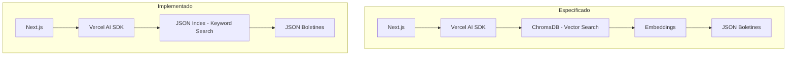

# 🔬 Revisión de Código - Chatbot Legal Municipal

> **Fecha**: 2025-01-01  
> **Revisor**: Senior Engineer  
> **Estado**: Análisis Completado

---

## 📊 Resumen Ejecutivo

El proyecto es un chatbot legal para consultar legislación municipal de Buenos Aires, construido con Next.js 15, React 19, y Vercel AI SDK. Después de una revisión exhaustiva, he identificado **problemas críticos de arquitectura, código muerto, anti-patrones y discrepancias entre la especificación técnica y la implementación**.

### Veredicto General: ⚠️ **Requiere Refactorización Significativa**

---

## 🚨 Problemas Críticos (Prioridad Alta)

### 1. **Discrepancia Arquitectónica: RAG sin ChromaDB**

**Especificación dice:** ChromaDB + embeddings semánticos  
**Implementación actual:** Búsqueda por keywords sobre JSON

```
📄 docs/tech-spec-chatbot-legal.md (líneas 26-29):
    subgraph Vector Search
        F[ChromaDB]
        G[Embeddings Index]
    end
```

```typescript
// 📄 chatbot/src/lib/rag/retriever.ts (líneas 134-173)
// En lugar de embeddings, usa coincidencia de strings:
function calculateMetadataRelevance(entry: IndexEntry, query: string): number {
  const queryLower = query.toLowerCase();
  // ... búsqueda por substring
}
```

**Impacto:** La calidad de búsqueda es muy inferior a búsqueda semántica. El usuario puede preguntar "requisitos para abrir un negocio" y el sistema no encontrará "habilitación comercial" porque no hay comprensión semántica.

**Solución:** 
- Opción A: Implementar ChromaDB como especifica el documento
- Opción B: Actualizar la especificación para reflejar el enfoque actual (y documentar limitaciones)

---

### 2. **Código Muerto: Cliente OpenAI sin uso**

```typescript
// 📄 chatbot/src/lib/rag/retriever.ts (líneas 87-101)
// Cliente OpenAI para embeddings (opcional)
let openaiClient: OpenAI | null = null;

function getOpenAIClient(): OpenAI | null {
  if (!openaiClient) {
    const apiKey = process.env.OPENROUTER_API_KEY;
    if (apiKey) {
      openaiClient = new OpenAI({
        apiKey,
        baseURL: 'https://openrouter.ai/api/v1',
      });
    }
  }
  return openaiClient;
}
```

**Problema:** Esta función `getOpenAIClient()` **nunca se llama** en todo el código. Es código muerto que confunde y sugiere funcionalidad que no existe.

**Impacto:** Confusión para desarrolladores, dependencia innecesaria (`openai` en package.json).

---

### 3. **Dependencias Redundantes**

```json
// 📄 chatbot/package.json (líneas 13-23)
{
  "dependencies": {
    "@ai-sdk/anthropic": "^1.0.0",  // ¿Se usa?
    "@ai-sdk/google": "^1.0.0",      // ¿Se usa?
    "@ai-sdk/openai": "^1.0.0",      // Se usa para OpenRouter
    "@ai-sdk/react": "^1.0.0",       // Se usa
    "openai": "^4.0.0",              // ❌ REDUNDANTE - código muerto
  }
}
```

**Problema:**
- `openai` nunca se usa realmente (el cliente está muerto)
- `@ai-sdk/anthropic` y `@ai-sdk/google` probablemente no se usan
- Solo se usa `@ai-sdk/openai` para conectar a OpenRouter

**Impacto:** Bundle size innecesario, confusión sobre qué proveedores están activos.

---

### 4. **Anti-patrón: `window.location.reload()` para limpiar estado**

```typescript
// 📄 chatbot/src/components/chat/ChatContainer.tsx (líneas 261-270)
<button
  onClick={() => {
    setMessages([]);
    localStorage.removeItem('chat-history');
    window.location.reload(); // ❌ ANTI-PATRÓN
  }}
>
  Limpiar historial y nuevo chat
</button>
```

**Problema:** Recargar toda la página para limpiar estado es un anti-patrón severo en React. Destruye la experiencia de SPA, causa flash de contenido, y es innecesariamente lento.

**Solución:** Usar `setMessages([])` y limpiar `data` del hook `useChat`. Si hay problemas de estado, investigar la causa raíz.

---

### 5. **Anti-patrón: Manipulación directa del DOM para Dark Mode**

```typescript
// 📄 chatbot/src/components/layout/Header.tsx (líneas 14-17)
const toggleDarkMode = () => {
  setIsDarkMode(!isDarkMode);
  document.documentElement.classList.toggle('dark'); // ❌ Manipulación DOM directa
};
```

**Problemas:**
1. Estado local `isDarkMode` no persiste (se pierde al recargar)
2. Manipulación directa del DOM rompe el modelo de React
3. El estado puede desincronizarse entre componentes
4. No hay detección del tema del sistema (`prefers-color-scheme`)

**Solución:** Implementar un ThemeContext o usar `next-themes`.

---

### 6. **Path Resolution Frágil**

```typescript
// 📄 chatbot/src/lib/rag/retriever.ts (línea 114)
const indexPath = path.join(process.cwd(), '..', 'python-cli', 'boletines_index.json');

// 📄 chatbot/src/lib/rag/retriever.ts (línea 216)
const boletinesPath = path.join(process.cwd(), '..', 'python-cli', 'boletines');
```

**Problema:** Asumir que `process.cwd()` siempre es `/chatbot` y que existe `../python-cli` es frágil. Puede fallar en:
- Despliegues (Vercel, Docker)
- Tests
- Diferentes estructuras de proyecto

**Solución:** Usar variables de entorno `DATA_PATH` o configuración centralizada.

---

## ⚠️ Problemas Moderados (Prioridad Media)

### 7. **UI Elementos No Funcionales**

#### Barra de búsqueda decorativa

```typescript
// 📄 chatbot/src/components/layout/Header.tsx (líneas 47-53)
<input
  type="text"
  placeholder="Buscar ordenanzas, decretos..."
  // ❌ Sin onChange, sin onSubmit, sin funcionalidad
/>
```

**Problema:** Un input que no hace nada confunde al usuario.

#### Navegación sin destino

```typescript
// 📄 chatbot/src/components/layout/Sidebar.tsx (líneas 51-54)
children: [
  { icon: Building2, label: 'Ordenanzas' },  // ❌ Sin href
  { icon: Scale, label: 'Decretos' },        // ❌ Sin href
  { icon: FileText, label: 'Boletines' },    // ❌ Sin href
],
```

**Problema:** Items de navegación que no navegan a ningún lado.

**Solución:** Eliminar elementos no funcionales o implementar la funcionalidad.

---

### 8. **Console.log excesivo en producción**

```typescript
// 📄 chatbot/src/app/api/chat/route.ts - múltiples líneas
console.log('[ChatAPI] Nueva petición recibida');
console.log(`[ChatAPI] Body recibido: ${JSON.stringify(body).slice(0, 200)}...`);
console.log(`[ChatAPI] API Key detectada (longitud: ${apiKey.length}...`);
// ... 15+ console.log más
```

**Problema:** 
- Exposición potencial de datos sensibles (API key length)
- Ruido en logs de producción
- Impacto de rendimiento

**Solución:** Implementar logger estructurado con niveles (debug, info, error) y desactivar en producción.

---

### 9. **Extracción frágil de Citations**

```typescript
// 📄 chatbot/src/components/chat/ChatContainer.tsx (líneas 186-190)
sources={Array.isArray(data)
  ? (data as any[])                    // ❌ Type casting a any[]
      .filter(d => d.type === 'sources')
      .pop()?.sources || []
  : []}
```

**Problema:** 
- `as any[]` elimina type safety
- Lógica compleja para extraer datos que deberían venir estructurados
- Si el formato de `data` cambia, rompe silenciosamente

**Solución:** Tipar correctamente `StreamData` y crear helper function.

---

### 10. **Fetch duplicado de stats**

```typescript
// 📄 chatbot/src/components/chat/ChatContainer.tsx (líneas 29-42)
useEffect(() => {
  async function fetchMunicipalities() {
    const response = await fetch('/api/stats'); // Fetch 1
    // ...
  }
}, []);

// 📄 chatbot/src/components/layout/Sidebar.tsx (líneas 67-84)
useEffect(() => {
  async function fetchStats() {
    const response = await fetch('/api/stats'); // Fetch 2 (duplicado)
    // ...
  }
}, []);
```

**Problema:** Dos componentes hacen la misma request al montar.

**Solución:** Usar React Context, SWR, o React Query para compartir datos.

---

## 📝 Problemas Menores (Prioridad Baja)

### 11. **Títulos genéricos en documentos**

Los documentos indexados tienen títulos como:
- "57º de Carlos Tejedor"
- "125º de Carlos Tejedor"

Que no son descriptivos. El título debería incluir el contenido principal.

### 12. **Falta de validación de inputs**

No hay validación de:
- Longitud máxima de mensajes
- Sanitización de input
- Rate limiting

### 13. **Inconsistencia en nomenclatura**

- `municipality` vs `municipio`
- Algunos comentarios en español, código en inglés
- Mezcla de estilos de documentación

---

## 📐 Arquitectura: Estado Actual vs Especificado



### Decisión Necesaria

**¿Qué camino tomar?**

| Opción | Pros | Contras |
|--------|------|---------|
| A: Implementar ChromaDB | Búsqueda semántica real, mejor UX | Más complejidad, requiere servicio adicional |
| B: Mejorar keyword search | Más simple, sin dependencias | Limitada comprensión semántica |
| C: Usar embeddings en API | Balance, sin infraestructura extra | Costo por request a embedding API |

---

## ✅ Plan de Refactorización Propuesto

### Fase 1: Limpieza Crítica (Inmediata)

1. **Eliminar código muerto**
   - Remover `getOpenAIClient()` y función de embeddings no usada
   - Limpiar dependencias no usadas de package.json

2. **Corregir anti-patrones**
   - Reemplazar `window.location.reload()` con reset de estado apropiado
   - Implementar ThemeContext para dark mode

3. **Hacer paths configurables**
   - Crear `DATA_PATH` env var
   - Centralizar configuración

### Fase 2: Mejoras de Calidad (Corto plazo)

4. **Implementar logging estructurado**
   - Crear logger utility con niveles
   - Remover console.logs directos

5. **Tipar correctamente**
   - Eliminar `as any[]` casts
   - Crear interfaces para StreamData

6. **Centralizar fetching de datos**
   - Implementar SWR o React Query
   - Crear hook `useStats()`

### Fase 3: UI/UX (Mediano plazo)

7. **Limpiar UI no funcional**
   - Eliminar o implementar barra de búsqueda
   - Corregir navegación del sidebar

8. **Mejorar persistencia**
   - Dark mode que persista
   - Historial con mejor UX

### Fase 4: Arquitectura (Largo plazo - Decisión requerida)

9. **Decidir estrategia de búsqueda**
   - Evaluar ChromaDB vs embeddings por API vs mejora de keywords
   - Actualizar especificación técnica

---

## 📋 Checklist de Correcciones

- [x] Eliminar código OpenAI muerto en retriever.ts ✅
- [x] Limpiar dependencias package.json ✅
- [x] Reemplazar window.location.reload() ✅
- [x] Implementar ThemeContext ✅
- [x] Crear configuración de paths con env vars ✅
- [x] Logging condicional (NODE_ENV) ✅
- [ ] Tipar StreamData correctamente
- [ ] Crear hook useStats compartido
- [ ] Eliminar/implementar barra búsqueda
- [ ] Corregir navegación sidebar
- [ ] Actualizar especificación técnica para reflejar realidad

---

## 🔄 Cambios Implementados (Fase 1)

### ✅ Completado el 2026-01-01

1. **Eliminado código OpenAI muerto** en [`retriever.ts`](../chatbot/src/lib/rag/retriever.ts)
   - Removida función `getOpenAIClient()` que nunca se usaba
   - Removida dependencia `openai` del package.json

2. **Limpiadas dependencias redundantes** en [`package.json`](../chatbot/package.json)
   - Removido `openai` (no usado)
   - Removido `@ai-sdk/anthropic` (no usado)
   - Removido `@ai-sdk/google` (no usado)
   - **37 paquetes eliminados** del node_modules

3. **Paths configurables** en [`retriever.ts`](../chatbot/src/lib/rag/retriever.ts)
   - Nueva función `getDataBasePath()` que usa `DATA_PATH` env var
   - Fallback inteligente a ruta relativa para desarrollo local

4. **Corregido anti-patrón `window.location.reload()`** en [`ChatContainer.tsx`](../chatbot/src/components/chat/ChatContainer.tsx)
   - Implementada función `handleClearChat()` que resetea estado sin recargar
   - Uso de `chatKey` para reiniciar el hook `useChat` limpiamente

5. **Implementado ThemeContext** para Dark Mode en [`ThemeContext.tsx`](../chatbot/src/contexts/ThemeContext.tsx)
   - Persistencia en localStorage
   - Soporte para `prefers-color-scheme` del sistema
   - Opción 'system' que sigue preferencia del OS
   - Fallback seguro para SSR

6. **Actualizado Header** para usar ThemeContext en [`Header.tsx`](../chatbot/src/components/layout/Header.tsx)
   - Eliminada manipulación directa del DOM
   - Tema persiste entre sesiones

7. **Logging condicional** - Los console.log en retriever.ts solo se ejecutan cuando `NODE_ENV !== 'production'`

8. **Actualizado .env.example** con nueva documentación de variables

### Verificación
- ✅ Build compila sin errores
- ✅ 37 dependencias eliminadas
- ✅ TypeScript sin errores de tipo

---

*Revisión de Código v1.1*
*2026-01-01*
