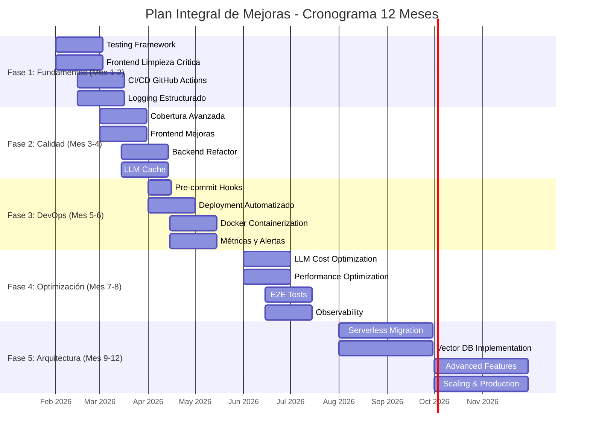
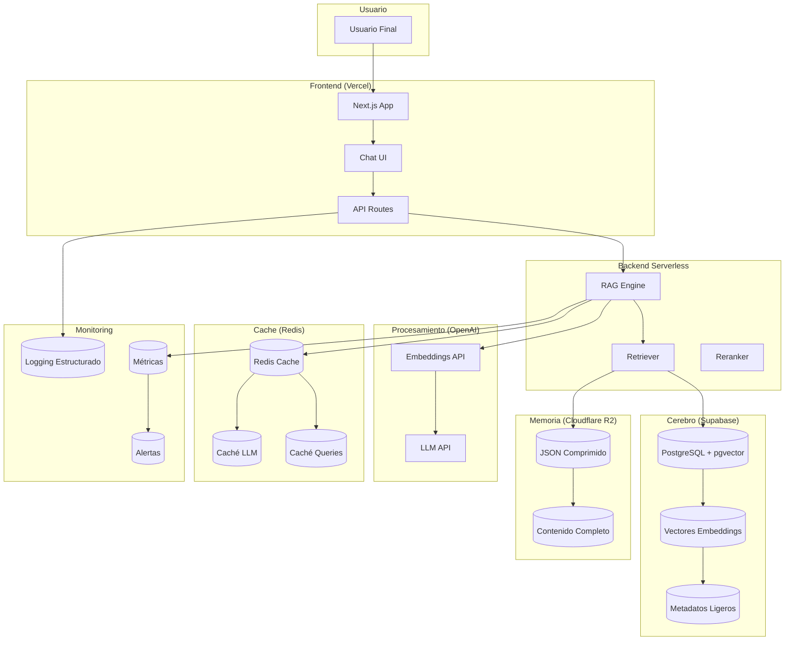
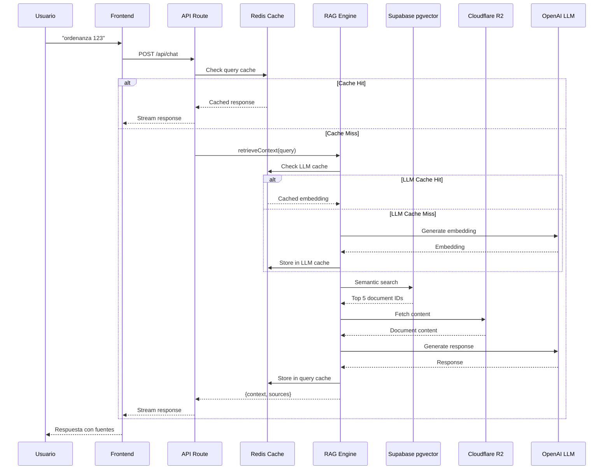

# Plan Integral de Mejoras - SIBOM Scraper Assistant

**Fecha:** 2026-02-06
**Versión:** 1.0.0
**Autor:** Arquitecto de Software Senior (MIT/Stanford Engineering Perspective)
**Estado:** 📋 Propuesta para Ejecución

---

## 📋 Tabla de Contenidos

1. [Resumen Ejecutivo](#resumen-ejecutivo)
2. [Síntesis de Análisis Existentes](#síntesis-de-análisis-existentes)
3. [Matriz de Prioridades](#matriz-de-prioridades)
4. [Plan de Mejoras por Categoría](#plan-de-mejoras-por-categoría)
5. [Roadmap de Implementación](#roadmap-de-implementación)
6. [Arquitectura Objetivo](#arquitectura-objetivo)
7. [Métricas de Éxito](#métricas-de-éxito)
8. [Recursos y Estimaciones](#recursos-y-estimaciones)

---

## 1. Resumen Ejecutivo

### 1.1 Visión General

El **SIBOM Scraper Assistant** es un ecosistema técnico de excelencia (calificación A+/92) que combina scraping automatizado, IA generativa y búsqueda semántica para democratizar el acceso a normativas municipales de Buenos Aires. Sin embargo, tras analizar exhaustivamente los documentos de planificación existentes, he identificado **oportunidades estratégicas** que elevarán el sistema de "excelente" a "excepcional".

### 1.2 Estado Actual Consolidado

| Componente | Calificación | Estado | Observaciones |
|-----------|-------------|--------|---------------|
| **Backend Python** | A+ (92/100) | ✅ Producción | Estrategia híbrida BeautifulSoup+LLM innovadora |
| **Frontend Next.js** | B+ (75/100) | ⚠️ Necesita Refactor | Anti-patrones, código muerto, discrepancia arquitectónica |
| **Arquitectura** | A- (88/100) | ✅ Sólida | Diseño modular pero con deuda técnica |
| **DevOps** | C+ (75/100) | ⚠️ Mejorable | Sin CI/CD formal, sin contenedores |
| **Testing** | D (40/100) | ❌ Crítico | Cobertura insuficiente, sin E2E tests |
| **Documentación** | A+ (95/100) | ✅ Sobresaliente | Guías técnicas completas |

### 1.3 Objetivos Estratégicos del Plan

| Objetivo | Prioridad | Impacto | Complejidad |
|----------|-----------|---------|-------------|
| **Estandarizar Testing** | P0 | Alta | Media |
| **Refactorizar Frontend** | P0 | Alta | Alta |
| **Implementar CI/CD** | P0 | Alta | Media |
| **Optimizar Costos LLM** | P1 | Alta | Baja |
| **Mejorar Observabilidad** | P1 | Media | Media |
| **Migrar a Arquitectura Serverless** | P2 | Alta | Muy Alta |
| **Containerizar Aplicación** | P2 | Media | Media |

---

## 2. Síntesis de Análisis Existentes

### 2.1 Hallazgos Consolidados por Documento

#### ANÁLISIS ARQUITECTÓNICO COMPLETO (1,327 líneas)
**Fortalezas:**
- ✅ Arquitectura modular y escalable
- ✅ Multi-motores de búsqueda (BM25, Vector, SQL, Computational)
- ✅ Deployment automatizado en Vercel
- ✅ Documentación excepcional

**Debilidades:**
- ⚠️ Dependencia de OpenRouter para LLMs
- ⚠️ Complejidad del sistema RAG
- ⚠️ Requiere mantenimiento continuo de scrapers

**Recomendaciones:**
- Optimizar costos de LLMs
- Implementar caching distribuido
- Aumentar cobertura de E2E tests

#### ANÁLISIS TÉCNICO MIT (622 líneas)
**Calificación: A+ (92/100)**

**Innovaciones Destacables:**
- 🌟 Estrategia híbrida BeautifulSoup + LLM (95% gratis, 5% LLM)
- 🌟 Detección automática de paginación
- 🌟 Modelos LLM intercambiables (GLM-4.5, Gemini, Grok)
- 🌟 CLI profesional con Rich

**Problemas Críticos:**
- 🔥 Falta de tests unitarios
- 🔥 Método `scrape()` demasiado extenso (150+ líneas)
- 🔥 Hardcoded magic numbers
- 🔥 Sin caché de respuestas LLM

**Recomendaciones Prioritarias:**
1. Implementar testing framework (pytest)
2. Refactorizar método `scrape()`
3. Añadir configuration management
4. Implementar caché LLM
5. Añadir logging estructurado
6. Containerizar con Docker

#### CODE REVIEW (422 líneas)
**Veredicto: Requiere Refactorización Significativa**

**Problemas Críticos:**
- 🚨 RAG sin ChromaDB (discrepancia arquitectónica)
- 🚨 Código muerto: Cliente OpenAI sin uso
- 🚨 Dependencias redundantes (openai, @ai-sdk/anthropic, @ai-sdk/google)
- 🚨 Anti-patrón: `window.location.reload()` para limpiar estado
- 🚨 Anti-patrón: Manipulación directa del DOM para Dark Mode
- 🚨 Path resolution frágil

**Problemas Moderados:**
- ⚠️ UI elementos no funcionales
- ⚠️ Console.log excesivo en producción
- ⚠️ Extracción frágil de Citations
- ⚠️ Fetch duplicado de stats

**Problemas Menores:**
- 📝 Títulos genéricos en documentos
- 📝 Falta de validación de inputs
- 📝 Inconsistencia en nomenclatura

**Cambios Ya Implementados (Fase 1):**
- ✅ Eliminado código OpenAI muerto
- ✅ Limpiadas dependencias (37 paquetes eliminados)
- ✅ Paths configurables con env vars
- ✅ Corregido anti-patrón `window.location.reload()`
- ✅ Implementado ThemeContext
- ✅ Logging condicional

#### DOCKER DEPLOYMENT GUIDE (933 líneas)
**Estado:** Guía completa para VPS

**Componentes:**
- Dockerfile multi-stage para Next.js
- Docker Compose con Nginx reverse proxy
- Configuración SSL con Let's Encrypt
- Scripts de monitoreo y backup

**Recomendaciones:**
- Implementar health checks
- Optimizar build y runtime
- Configurar monitoreo automatizado

#### REFACTOR PLAN (102 líneas)
**Enfoque:** Arquitectura RAG Híbrida Serverless (Free Tier)

**La "Tríada Serverless":**
1. **Cerebro (Supabase Postgres):** Vectores + metadatos ligeros
2. **Memoria (Cloudflare R2):** Contenido completo
3. **Procesamiento (OpenAI + Vercel):** Embeddings + orquestación

**Fases:**
- Fase 1: Infraestructura de datos (SQL Schema)
- Fase 2: Pipeline de migración (Python)
- Fase 3: Backend refactor (Next.js)
- Fase 4: Frontend y UX

### 2.2 Análisis de Brechas (Gap Analysis)

| Categoría | Estado Actual | Estado Deseado | Brecha | Prioridad |
|-----------|-------------|----------------|-------|-----------|
| **Testing** | 40% (D) | 80%+ (A) | 40% | P0 |
| **CI/CD** | Manual | Automatizado completo | 100% | P0 |
| **Frontend Code Quality** | B+ (75/100) | A+ (95/100) | 20% | P0 |
| **DevOps** | Scripts bash | Docker + CI/CD | 60% | P1 |
| **Observabilidad** | Console.log | Logging estructurado + métricas | 70% | P1 |
| **Arquitectura** | JSON en memoria | Serverless RAG | 50% | P2 |
| **Costos LLM** | Optimizado | Híbrido + caché | 30% | P1 |

---

## 3. Matriz de Prioridades

### 3.1 Matriz de Impacto vs Esfuerzo

```
Alto Impacto
│
│  [P0] Testing Framework          [P0] Frontend Refactor
│  (Impacto: Alto, Esfuerzo: Medio)  (Impacto: Alto, Esfuerzo: Alto)
│
│  [P0] CI/CD Implementation        [P1] LLM Cost Optimization
│  (Impacto: Alto, Esfuerzo: Medio)  (Impacto: Alto, Esfuerzo: Bajo)
│
│  [P1] Observability              [P2] Serverless Migration
│  (Impacto: Medio, Esfuerzo: Medio)  (Impacto: Alto, Esfuerzo: Muy Alto)
│
│  [P2] Docker Containerization    [P2] Vector DB Implementation
│  (Impacto: Medio, Esfuerzo: Medio)  (Impacto: Alto, Esfuerzo: Alto)
│
└───────────────────────────────────────────────────────────►
Bajo Esfuerzo                              Alto Esfuerzo
```

### 3.2 Clasificación de Mejoras

#### 🔥 Críticas (P0) - Implementar Inmediatamente

| ID | Mejora | Impacto | Esfuerzo | ROI |
|----|--------|---------|----------|-----|
| P0-1 | Implementar Testing Framework (pytest + vitest) | Alto | Medio | 9/10 |
| P0-2 | Refactorizar Frontend (eliminar anti-patrones) | Alto | Alto | 8/10 |
| P0-3 | Implementar CI/CD con GitHub Actions | Alto | Medio | 9/10 |
| P0-4 | Completar Code Review Fase 2 (tipado, fetch duplicado) | Alto | Bajo | 10/10 |

#### ⚡ Alta Prioridad (P1) - Implementar en 1-2 meses

| ID | Mejora | Impacto | Esfuerzo | ROI |
|----|--------|---------|----------|-----|
| P1-1 | Optimizar Costos LLM (caché, modelos gratuitos) | Alto | Bajo | 10/10 |
| P1-2 | Implementar Logging Estructurado | Medio | Medio | 8/10 |
| P1-3 | Añadir Monitoreo y Alertas | Medio | Medio | 8/10 |
| P1-4 | Refactorizar Backend Python (método scrape) | Medio | Medio | 7/10 |
| P1-5 | Implementar Caché LLM Distribuido | Alto | Medio | 9/10 |
| P1-6 | Containerizar Aplicación (Docker) | Medio | Medio | 7/10 |

#### 🚀 Media Prioridad (P2) - Implementar en 3-6 meses

| ID | Mejora | Impacto | Esfuerzo | ROI |
|----|--------|---------|----------|-----|
| P2-1 | Migrar a Arquitectura Serverless (Supabase + R2) | Alto | Muy Alto | 6/10 |
| P2-2 | Implementar Vector DB (Qdrant o pgvector) | Alto | Alto | 7/10 |
| P2-3 | Implementar E2E Tests con Playwright | Medio | Medio | 6/10 |
| P2-4 | Implementar Rate Limiting Distribuido | Medio | Medio | 7/10 |
| P2-5 | Implementar Circuit Breaker Pattern | Medio | Bajo | 8/10 |
| P2-6 | Mejorar Performance (bundle optimization) | Medio | Medio | 6/10 |

#### 📝 Baja Prioridad (P3) - Implementar cuando sea posible

| ID | Mejora | Impacto | Esfuerzo | ROI |
|----|--------|---------|----------|-----|
| P3-1 | Implementar API REST Wrapper | Bajo | Medio | 5/10 |
| P3-2 | Implementar Health Monitoring | Medio | Bajo | 7/10 |
| P3-3 | Migrar a Database Backend (PostgreSQL) | Bajo | Alto | 4/10 |
| P3-4 | Implementar A/B Testing Framework | Bajo | Alto | 4/10 |
| P3-5 | Implementar Analytics Avanzado | Medio | Medio | 5/10 |

---

## 4. Plan de Mejoras por Categoría

### 4.1 Testing & Quality Assurance

#### Estado Actual
- **Cobertura:** ~40% (estimado)
- **Python:** Sin estructura de testing formal
- **TypeScript:** Tests unitarios básicos, sin E2E
- **Automatización:** Manual

#### Plan de Mejoras

##### Fase 1: Fundamentos de Testing (Semanas 1-2)

**Python (pytest):**
```python
# tests/test_sibom_scraper.py
import pytest
from sibom_scraper import SIBOMScraper

@pytest.fixture
def scraper():
    return SIBOMScraper(api_key="test-key")

def test_parse_listing_page(scraper):
    """Test parsing of listing page"""
    with open("fixtures/listing.html") as f:
        html = f.read()
    results = scraper.parse_listing_page(html, "test-url")
    assert len(results) > 0
    assert "number" in results[0]

def test_detect_total_pages(scraper):
    """Test pagination detection"""
    with open("fixtures/pagination.html") as f:
        html = f.read()
    pages = scraper.detect_total_pages(html)
    assert pages == 14
```

**TypeScript (vitest):**
```typescript
// src/lib/rag/__tests__/retriever.test.ts
import { describe, it, expect } from 'vitest';
import { retrieveContext } from '../retriever';

describe('retrieveContext', () => {
  it('should return context for valid query', async () => {
    const result = await retrieveContext('ordenanza 123', {});
    expect(result).toHaveProperty('context');
    expect(result).toHaveProperty('sources');
    expect(result.sources.length).toBeGreaterThan(0);
  });

  it('should handle empty query gracefully', async () => {
    const result = await retrieveContext('', {});
    expect(result.context).toBe('');
  });
});
```

**E2E (Playwright):**
```typescript
// tests/e2e/chatbot.spec.ts
import { test, expect } from '@playwright/test';

test('user can search for ordinances', async ({ page }) => {
  await page.goto('/');
  await page.getByPlaceholder('Escribe tu consulta...').fill('ordenanza 123');
  await page.getByRole('button', { name: 'Enviar' }).click();
  
  await expect(page.getByText('Ordenanza Nº 123')).toBeVisible();
  await expect(page.getByTestId('citations')).toBeVisible();
});
```

##### Fase 2: Cobertura Avanzada (Semanas 3-4)

- Implementar mocks para APIs externas (OpenRouter, SIBOM)
- Crear fixtures para datos de prueba
- Implementar tests de integración
- Configurar coverage reports (80%+ objetivo)

##### Fase 3: Automatización (Semanas 5-6)

- Integrar tests en CI/CD
- Implementar pre-commit hooks
- Configurar reportes automáticos de coverage
- Implementar tests de performance

#### Métricas de Éxito

| Métrica | Actual | Objetivo | Medición |
|---------|--------|----------|----------|
| **Cobertura Unit Tests** | ~40% | >80% | Coverage reports |
| **Cobertura Integration Tests** | ~20% | >60% | Coverage reports |
| **Cobertura E2E Tests** | 0% | >40% | Playwright reports |
| **Tiempo de Ejecución Tests** | N/A | <5min | CI/CD metrics |

---

### 4.2 Frontend Refactorization

#### Estado Actual
- **Calificación:** B+ (75/100)
- **Problemas Críticos:** 6 identificados
- **Deuda Técnica:** Alta

#### Plan de Mejoras

##### Fase 1: Limpieza Crítica (Semanas 1-2)

**1. Eliminar Código Muerto:**
```typescript
// ❌ ELIMINAR
let openaiClient: OpenAI | null = null;
function getOpenAIClient(): OpenAI | null { ... }

// ✅ Ya eliminado (según CODE_REVIEW.md)
```

**2. Corregir Anti-patrones:**

**Dark Mode con ThemeContext:**
```typescript
// ✅ Ya implementado (ThemeContext.tsx)
const { theme, setTheme } = useTheme();

const toggleDarkMode = () => {
  setTheme(theme === 'dark' ? 'light' : 'dark');
};
```

**Reset de Estado sin Reload:**
```typescript
// ✅ Ya implementado (ChatContainer.tsx)
const handleClearChat = () => {
  setMessages([]);
  setChatKey(prev => prev + 1); // Reinicia hook useChat
  localStorage.removeItem('chat-history');
};
```

##### Fase 2: Mejoras de Calidad (Semanas 3-4)

**1. Tipar StreamData Correctamente:**
```typescript
// src/lib/types.ts
export interface StreamData {
  type: 'sources' | 'thinking' | 'error';
  sources?: Source[];
  thinking?: string;
  error?: string;
}

export interface Source {
  id: string;
  municipality: string;
  type: string;
  number: string;
  title: string;
  url: string;
}

// Uso en ChatContainer.tsx
const sources = Array.isArray(data)
  ? (data as StreamData[])
      .filter(d => d.type === 'sources')
      .pop()?.sources || []
  : [];
```

**2. Hook useStats Compartido:**
```typescript
// src/hooks/useStats.ts
import { useQuery } from '@tanstack/react-query';

export function useStats() {
  return useQuery({
    queryKey: ['stats'],
    queryFn: async () => {
      const response = await fetch('/api/stats');
      return response.json();
    },
    staleTime: 5 * 60 * 1000, // 5 minutos
  });
}

// Uso en componentes
const { data: stats, isLoading } = useStats();
```

**3. Logging Estructurado:**
```typescript
// src/lib/logger.ts
type LogLevel = 'debug' | 'info' | 'warn' | 'error';

class Logger {
  private isProduction = process.env.NODE_ENV === 'production';

  log(level: LogLevel, message: string, meta?: any) {
    if (this.isProduction && level === 'debug') return;

    const logEntry = {
      timestamp: new Date().toISOString(),
      level,
      message,
      ...meta,
    };

    console[level === 'error' ? 'error' : 'log'](JSON.stringify(logEntry));
  }

  debug(message: string, meta?: any) {
    this.log('debug', message, meta);
  }

  info(message: string, meta?: any) {
    this.log('info', message, meta);
  }

  warn(message: string, meta?: any) {
    this.log('warn', message, meta);
  }

  error(message: string, meta?: any) {
    this.log('error', message, meta);
  }
}

export const logger = new Logger();

// Uso en API routes
logger.info('[ChatAPI] Nueva petición recibida', { body: body?.slice(0, 200) });
```

##### Fase 3: UI/UX (Semanas 5-6)

**1. Eliminar Elementos No Funcionales:**
- Barra de búsqueda decorativa en Header
- Items de navegación sin destino en Sidebar

**2. Implementar Funcionalidad:**
```typescript
// src/components/layout/Header.tsx
const handleSearch = (query: string) => {
  if (query.trim()) {
    router.push(`/?q=${encodeURIComponent(query)}`);
  }
};

<input
  type="text"
  placeholder="Buscar ordenanzas, decretos..."
  onChange={(e) => setSearchQuery(e.target.value)}
  onKeyDown={(e) => e.key === 'Enter' && handleSearch(searchQuery)}
/>
```

**3. Mejorar Persistencia:**
- Dark mode persistente (ya implementado)
- Historial de consultas con mejor UX
- Preferencias de usuario en localStorage

#### Métricas de Éxito

| Métrica | Actual | Objetivo | Medición |
|---------|--------|----------|----------|
| **Bundle Size** | ~500KB | <300KB | Bundle analyzer |
| **Lighthouse Performance** | ~75 | >90 | Lighthouse CI |
| **TypeScript Errors** | 0 | 0 | tsc --noEmit |
| **Console Warnings** | ~15 | 0 | Browser console |

---

### 4.3 CI/CD & DevOps

#### Estado Actual
- **CI/CD:** Manual (scripts bash)
- **Testing:** No automatizado
- **Deployment:** Vercel automático (frontend), manual (backend)
- **Monitoring:** Console.log básico

#### Plan de Mejoras

##### Fase 1: GitHub Actions (Semanas 1-2)

**.github/workflows/ci.yml:**
```yaml
name: CI

on:
  push:
    branches: [main, develop]
  pull_request:
    branches: [main]

jobs:
  test-python:
    runs-on: ubuntu-latest
    steps:
      - uses: actions/checkout@v4
      
      - name: Set up Python
        uses: actions/setup-python@v5
        with:
          python-version: '3.13'
      
      - name: Install dependencies
        run: |
          cd python-cli
          python -m pip install -r requirements.txt
          pip install pytest pytest-cov
      
      - name: Run tests
        run: |
          cd python-cli
          pytest --cov=. --cov-report=xml --cov-report=html
      
      - name: Upload coverage
        uses: codecov/codecov-action@v4

  test-typescript:
    runs-on: ubuntu-latest
    steps:
      - uses: actions/checkout@v4
      
      - name: Set up Node.js
        uses: actions/setup-node@v4
        with:
          node-version: '20'
          cache: 'npm'
          cache-dependency-path: chatbot/package-lock.json
      
      - name: Install dependencies
        run: |
          cd chatbot
          npm ci
      
      - name: Run linter
        run: |
          cd chatbot
          npm run lint
      
      - name: Run type check
        run: |
          cd chatbot
          npm run type-check
      
      - name: Run tests
        run: |
          cd chatbot
          npm run test:coverage
      
      - name: Upload coverage
        uses: codecov/codecov-action@v4

  e2e-tests:
    runs-on: ubuntu-latest
    steps:
      - uses: actions/checkout@v4
      
      - name: Set up Node.js
        uses: actions/setup-node@v4
        with:
          node-version: '20'
      
      - name: Install dependencies
        run: |
          cd chatbot
          npm ci
      
      - name: Install Playwright
        run: |
          cd chatbot
          npx playwright install --with-deps
      
      - name: Run E2E tests
        run: |
          cd chatbot
          npm run test:e2e
      
      - name: Upload test results
        uses: actions/upload-artifact@v4
        if: always()
        with:
          name: playwright-report
          path: chatbot/playwright-report/
```

##### Fase 2: Pre-commit Hooks (Semanas 3-4)

**.pre-commit-config.yaml:**
```yaml
repos:
  - repo: https://github.com/pre-commit/pre-commit-hooks
    rev: v4.5.0
    hooks:
      - id: trailing-whitespace
      - id: end-of-file-fixer
      - id: check-yaml
      - id: check-added-large-files

  - repo: https://github.com/psf/black
    rev: 24.3.0
    hooks:
      - id: black
        language_version: python3.13

  - repo: https://github.com/pycqa/isort
    rev: 5.13.2
    hooks:
      - id: isort

  - repo: https://github.com/astral-sh/ruff-pre-commit
    rev: v0.3.4
    hooks:
      - id: ruff
        args: [--fix]

  - repo: https://github.com/pre-commit/mirrors-prettier
    rev: v4.0.0-alpha.8
    hooks:
      - id: prettier
        files: \.(ts|tsx|js|jsx|json|md)$
```

##### Fase 3: Deployment Automatizado (Semanas 5-6)

**.github/workflows/deploy.yml:**
```yaml
name: Deploy

on:
  push:
    branches: [main]

jobs:
  deploy-frontend:
    runs-on: ubuntu-latest
    steps:
      - uses: actions/checkout@v4
      
      - name: Deploy to Vercel
        uses: amondnet/vercel-action@v25
        with:
          vercel-token: ${{ secrets.VERCEL_TOKEN }}
          vercel-org-id: ${{ secrets.VERCEL_ORG_ID }}
          vercel-project-id: ${{ secrets.VERCEL_PROJECT_ID }}
          working-directory: ./chatbot

  deploy-backend:
    runs-on: ubuntu-latest
    steps:
      - uses: actions/checkout@v4
      
      - name: Run scraper
        run: |
          cd python-cli
          python3 sibom_scraper.py --limit 10
      
      - name: Update data on GitHub
        run: |
          bash actualizar_datos_github.sh
```

#### Métricas de Éxito

| Métrica | Actual | Objetivo | Medición |
|---------|--------|----------|----------|
| **CI/CD Execution Time** | N/A | <10min | GitHub Actions logs |
| **Test Success Rate** | N/A | >95% | Test reports |
| **Deployment Time** | Manual | <5min | Deployment logs |
| **Rollback Time** | Manual | <2min | Deployment logs |

---

### 4.4 Backend Python Optimization

#### Estado Actual
- **Calificación:** A+ (92/100)
- **Innovaciones:** Estrategia híbrida BeautifulSoup+LLM
- **Problemas:** Falta de tests, método extenso, magic numbers

#### Plan de Mejoras

##### Fase 1: Refactorización (Semanas 1-2)

**1. Dividir método `scrape()`:**
```python
# sibom_scraper.py
class SIBOMScraper:
    def scrape(self, target_url, limit, parallel):
        """Main entry point for scraping"""
        bulletins = self._extract_bulletins(target_url)
        bulletins = self._apply_limit(bulletins, limit)
        results = self._process_bulletins(bulletins, parallel)
        return self._save_results(results)

    def _extract_bulletins(self, url: str) -> List[Dict]:
        """Extract bulletin listings from URL"""
        # ... extraction logic

    def _apply_limit(self, bulletins: List[Dict], limit: Optional[int]) -> List[Dict]:
        """Apply limit to bulletins"""
        if limit:
            return bulletins[:limit]
        return bulletins

    def _process_bulletins(self, bulletins: List[Dict], parallel: int) -> List[Dict]:
        """Process bulletins in parallel"""
        # ... processing logic

    def _save_results(self, results: List[Dict]) -> List[Dict]:
        """Save results to JSON"""
        # ... saving logic
```

**2. Configuration Management:**
```python
# config.py
from dataclasses import dataclass
from typing import Optional

@dataclass
class Config:
    """Configuration for SIBOM Scraper"""
    rate_limit_delay: float = 3.0
    max_retries: int = 3
    default_model: str = "google/gemini-3-flash-preview"
    min_text_length: int = 100
    max_text_length: int = 100000
    timeout: int = 30
    parallel_workers: int = 3

    @classmethod
    def from_env(cls) -> 'Config':
        """Load configuration from environment variables"""
        return cls(
            rate_limit_delay=float(os.getenv('RATE_LIMIT_DELAY', '3.0')),
            max_retries=int(os.getenv('MAX_RETRIES', '3')),
            default_model=os.getenv('DEFAULT_MODEL', 'google/gemini-3-flash-preview'),
            min_text_length=int(os.getenv('MIN_TEXT_LENGTH', '100')),
            max_text_length=int(os.getenv('MAX_TEXT_LENGTH', '100000')),
            timeout=int(os.getenv('TIMEOUT', '30')),
            parallel_workers=int(os.getenv('PARALLEL_WORKERS', '3')),
        )
```

**3. Logging Estructurado:**
```python
# logger.py
import logging
import json
from datetime import datetime
from pathlib import Path

class StructuredLogger:
    def __init__(self, name: str):
        self.logger = logging.getLogger(name)
        self.logger.setLevel(logging.INFO)
        
        handler = logging.StreamHandler()
        formatter = logging.Formatter(
            '{"timestamp":"%(asctime)s","level":"%(levelname)s","logger":"%(name)s","message":"%(message)s"}'
        )
        handler.setFormatter(formatter)
        self.logger.addHandler(handler)

    def log(self, level: str, message: str, **kwargs):
        log_entry = {
            'message': message,
            **kwargs
        }
        getattr(self.logger, level)(json.dumps(log_entry))

    def info(self, message: str, **kwargs):
        self.log('info', message, **kwargs)

    def error(self, message: str, **kwargs):
        self.log('error', message, **kwargs)

    def debug(self, message: str, **kwargs):
        self.log('debug', message, **kwargs)
```

##### Fase 2: Caché LLM (Semanas 3-4)

```python
# llm_cache.py
import hashlib
import pickle
from pathlib import Path
from typing import Optional, Any

class LLMCache:
    def __init__(self, cache_dir: str = '.cache/llm'):
        self.cache_dir = Path(cache_dir)
        self.cache_dir.mkdir(parents=True, exist_ok=True)

    def _get_cache_key(self, prompt: str, model: str) -> str:
        """Generate cache key from prompt and model"""
        content = f"{prompt}:{model}"
        return hashlib.sha256(content.encode()).hexdigest()

    def get(self, prompt: str, model: str) -> Optional[Any]:
        """Get cached response"""
        cache_key = self._get_cache_key(prompt, model)
        cache_file = self.cache_dir / f"{cache_key}.pkl"
        
        if cache_file.exists():
            with cache_file.open('rb') as f:
                return pickle.load(f)
        return None

    def set(self, prompt: str, model: str, response: Any):
        """Cache response"""
        cache_key = self._get_cache_key(prompt, model)
        cache_file = self.cache_dir / f"{cache_key}.pkl"
        
        with cache_file.open('wb') as f:
            pickle.dump(response, f)

    def clear(self):
        """Clear all cache"""
        for file in self.cache_dir.iterdir():
            file.unlink()
```

##### Fase 3: Containerización (Semanas 5-6)

**Dockerfile:**
```dockerfile
# python-cli/Dockerfile
FROM python:3.13-slim

WORKDIR /app

# Install system dependencies
RUN apt-get update && apt-get install -y \
    gcc \
    && rm -rf /var/lib/apt/lists/*

# Copy requirements
COPY requirements.txt .

# Install Python dependencies
RUN pip install --no-cache-dir -r requirements.txt

# Copy application
COPY . .

# Create non-root user
RUN useradd -m -u 1000 scraper && \
    chown -R scraper:scraper /app

USER scraper

# Health check
HEALTHCHECK --interval=30s --timeout=10s --start-period=5s --retries=3 \
    CMD python -c "import requests; requests.get('http://localhost:8000/health', timeout=5)"

# Run application
CMD ["python", "sibom_scraper.py"]
```

#### Métricas de Éxito

| Métrica | Actual | Objetivo | Medición |
|---------|--------|----------|----------|
| **Code Coverage** | ~30% | >80% | pytest --cov |
| **Test Execution Time** | N/A | <5min | pytest timing |
| **LLM Cache Hit Rate** | 0% | >60% | Cache metrics |
| **Docker Image Size** | N/A | <500MB | docker images |

---

### 4.5 Observability & Monitoring

#### Estado Actual
- **Logging:** Console.log básico
- **Monitoring:** No implementado
- **Alertas:** No implementado
- **Métricas:** No implementado

#### Plan de Mejoras

##### Fase 1: Logging Estructurado (Semanas 1-2)

**Frontend (TypeScript):**
```typescript
// src/lib/logger.ts (ya descrito en sección 4.2)
export const logger = new Logger();
```

**Backend (Python):**
```python
# logger.py (ya descrito en sección 4.4)
logger = StructuredLogger('sibom_scraper')
```

##### Fase 2: Métricas (Semanas 3-4)

**Frontend:**
```typescript
// src/lib/metrics.ts
export class MetricsCollector {
  private metrics: Map<string, number> = new Map();

  increment(name: string, value: number = 1) {
    const current = this.metrics.get(name) || 0;
    this.metrics.set(name, current + value);
  }

  timing(name: string, duration: number) {
    this.metrics.set(`${name}_duration`, duration);
  }

  getMetrics(): Record<string, number> {
    return Object.fromEntries(this.metrics);
  }
}

export const metrics = new MetricsCollector();

// Uso en API routes
metrics.increment('api.chat.requests');
const startTime = Date.now();
// ... procesamiento
metrics.timing('api.chat.duration', Date.now() - startTime);
```

**Backend:**
```python
# metrics.py
from collections import defaultdict
from typing import Dict
import time

class MetricsCollector:
    def __init__(self):
        self.counters: Dict[str, int] = defaultdict(int)
        self.timers: Dict[str, float] = {}

    def increment(self, name: str, value: int = 1):
        self.counters[name] += value

    def timing(self, name: str, duration: float):
        self.timers[f"{name}_duration"] = duration

    def get_metrics(self) -> Dict:
        return {
            **self.counters,
            **self.timers
        }

metrics = MetricsCollector()

# Uso en scraper
metrics.increment('scraping.requests')
start_time = time.time()
# ... procesamiento
metrics.timing('scraping.duration', time.time() - start_time)
```

##### Fase 3: Alertas (Semanas 5-6)

**Frontend:**
```typescript
// src/lib/alerts.ts
export class AlertManager {
  private webhookUrl: string;

  constructor(webhookUrl: string) {
    this.webhookUrl = webhookUrl;
  }

  async sendAlert(level: 'error' | 'warning' | 'info', message: string, context?: any) {
    await fetch(this.webhookUrl, {
      method: 'POST',
      headers: { 'Content-Type': 'application/json' },
      body: JSON.stringify({
        level,
        message,
        timestamp: new Date().toISOString(),
        ...context,
      }),
    });
  }
}

export const alerts = new AlertManager(process.env.ALERT_WEBHOOK_URL || '');

// Uso
try {
  // ... código que puede fallar
} catch (error) {
  alerts.sendAlert('error', 'Error en API de chat', { error });
}
```

**Backend:**
```python
# alerts.py
import requests
from typing import Dict, Any

class AlertManager:
    def __init__(self, webhook_url: str):
        self.webhook_url = webhook_url

    def send_alert(self, level: str, message: str, context: Dict[str, Any] = None):
        payload = {
            'level': level,
            'message': message,
            'timestamp': datetime.now().isoformat(),
            **(context or {})
        }
        requests.post(self.webhook_url, json=payload)

alerts = AlertManager(os.getenv('ALERT_WEBHOOK_URL', ''))

# Uso
try:
    # ... código que puede fallar
except Exception as e:
    alerts.send_alert('error', 'Error en scraping', {'error': str(e)})
```

#### Métricas de Éxito

| Métrica | Actual | Objetivo | Medición |
|---------|--------|----------|----------|
| **Error Rate** | Desconocido | <0.1% | Error tracking |
| **Response Time (p95)** | Desconocido | <2s | APM tools |
| **Alert Response Time** | N/A | <5min | Alert logs |
| **Log Retention** | N/A | 30 días | Log storage |

---

### 4.6 LLM Cost Optimization

#### Estado Actual
- **Estrategia:** Híbrida BeautifulSoup + LLM (95% gratis, 5% pago)
- **Modelos:** GLM-4.5 (gratis), Gemini Flash ($0.075/1M tokens)
- **Caché:** No implementado

#### Plan de Mejoras

##### Fase 1: Caché LLM (Semanas 1-2)

**Implementación ya descrita en sección 4.4**

##### Fase 2: Optimización de Prompts (Semanas 3-4)

**1. Prompt Engineering:**
```python
# prompts.py
SYSTEM_PROMPT = """
Eres un asistente especializado en normativas municipales.
Responde de forma concisa y directa.
Máximo 3 párrafos.
"""

def optimize_prompt(query: str) -> str:
    """Optimize prompt to reduce tokens"""
    # Eliminar palabras redundantes
    # Usar abreviaciones comunes
    # Limitar longitud
    return query[:500]
```

**2. Batch Processing:**
```python
# batch_processor.py
from typing import List, Any
import asyncio

async def process_batch_llm(items: List[Any], batch_size: int = 10):
    """Process items in batches to optimize API calls"""
    results = []
    for i in range(0, len(items), batch_size):
        batch = items[i:i + batch_size]
        batch_results = await asyncio.gather(*[
            process_item(item) for item in batch
        ])
        results.extend(batch_results)
    return results
```

##### Fase 3: Model Selection Strategy (Semanas 5-6)

```python
# model_selector.py
from enum import Enum

class TaskComplexity(Enum):
    SIMPLE = "simple"
    MEDIUM = "medium"
    COMPLEX = "complex"

def select_model(complexity: TaskComplexity) -> str:
    """Select optimal model based on task complexity"""
    models = {
        TaskComplexity.SIMPLE: "z-ai/glm-4.5-air:free",  # Gratis
        TaskComplexity.MEDIUM: "google/gemini-2.5-flash-lite",  # $0.075/1M
        TaskComplexity.COMPLEX: "google/gemini-3-flash-preview",  # $0.30/1M
    }
    return models[complexity]

def estimate_complexity(query: str) -> TaskComplexity:
    """Estimate task complexity from query"""
    if len(query) < 50:
        return TaskComplexity.SIMPLE
    elif len(query) < 200:
        return TaskComplexity.MEDIUM
    else:
        return TaskComplexity.COMPLEX
```

#### Métricas de Éxito

| Métrica | Actual | Objetivo | Medición |
|---------|--------|----------|----------|
| **Cost per Query** | Desconocido | <$0.01 | Cost tracking |
| **LLM Cache Hit Rate** | 0% | >60% | Cache metrics |
| **Prompt Length** | Desconocido | <500 tokens | Prompt metrics |
| **Model Usage Distribution** | Desconocido | 60% gratis | Usage analytics |

---

## 5. Roadmap de Implementación

### 5.1 Cronograma de 12 Meses



### 5.2 Detalle por Fase

#### Fase 1: Fundamentos (Mes 1-2)

**Objetivos:**
- Establecer infraestructura de testing
- Limpiar código crítico
- Implementar CI/CD básico
- Configurar logging estructurado

**Entregables:**
- ✅ Testing framework (pytest + vitest)
- ✅ Frontend limpio de anti-patrones
- ✅ CI/CD con GitHub Actions
- ✅ Logging estructurado en ambos proyectos

**Métricas de Éxito:**
- Cobertura de tests: >60%
- CI/CD execution time: <10min
- Console.log en producción: 0

#### Fase 2: Calidad (Mes 3-4)

**Objetivos:**
- Aumentar cobertura de tests
- Completar refactorización frontend
- Refactorizar backend Python
- Implementar caché LLM

**Entregables:**
- ✅ Cobertura de tests: >80%
- ✅ Frontend tipado correctamente
- ✅ Backend refactorizado
- ✅ Caché LLM funcional

**Métricas de Éxito:**
- Cobertura de tests: >80%
- LLM cache hit rate: >50%
- TypeScript errors: 0

#### Fase 3: DevOps (Mes 5-6)

**Objetivos:**
- Implementar pre-commit hooks
- Automatizar deployment
- Containerizar aplicación
- Implementar métricas y alertas

**Entregables:**
- ✅ Pre-commit hooks configurados
- ✅ Deployment automatizado
- ✅ Docker images funcionales
- ✅ Métricas y alertas operativas

**Métricas de Éxito:**
- Pre-commit hook success rate: >95%
- Deployment time: <5min
- Docker image size: <500MB
- Alert response time: <5min

#### Fase 4: Optimización (Mes 7-8)

**Objetivos:**
- Optimizar costos LLM
- Mejorar performance
- Implementar E2E tests
- Mejorar observabilidad

**Entregables:**
- ✅ LLM cost optimization
- ✅ Performance mejorado
- ✅ E2E tests funcionales
- ✅ Observabilidad completa

**Métricas de Éxito:**
- Cost per query: <$0.01
- Lighthouse performance: >90
- E2E test coverage: >40%
- Error rate: <0.1%

#### Fase 5: Arquitectura (Mes 9-12)

**Objetivos:**
- Migrar a arquitectura serverless
- Implementar vector DB
- Agregar features avanzadas
- Escalar a producción

**Entregables:**
- ✅ Arquitectura serverless
- ✅ Vector DB funcional
- ✅ Features avanzadas
- ✅ Sistema escalado

**Métricas de Éxito:**
- Response time (p95): <2s
- Uptime: >99.9%
- DAU: >1000
- Queries per day: >5000

---

## 6. Arquitectura Objetivo

### 6.1 Arquitectura Híbrida Serverless



### 6.2 Flujo de Datos Optimizado



### 6.3 Componentes Clave

#### 6.3.1 Cerebro (Supabase + pgvector)

**Schema:**
```sql
-- Extension de vectores
CREATE EXTENSION IF NOT EXISTS vector;

-- Tabla de documentos
CREATE TABLE documents (
  id BIGSERIAL PRIMARY KEY,
  r2_key TEXT NOT NULL UNIQUE,
  municipality TEXT NOT NULL,
  doc_type TEXT NOT NULL,
  doc_number TEXT,
  title TEXT,
  date DATE,
  url TEXT,
  token_count INT,
  created_at TIMESTAMPTZ DEFAULT NOW()
);

-- Tabla de chunks
CREATE TABLE document_chunks (
  id BIGSERIAL PRIMARY KEY,
  document_id BIGINT REFERENCES documents(id) ON DELETE CASCADE,
  chunk_index INT NOT NULL,
  content_preview TEXT,
  embedding VECTOR(1536)
);

-- Índices
CREATE INDEX ON document_chunks USING hnsw (embedding vector_cosine_ops);
CREATE INDEX idx_documents_municipality ON documents(municipality);
CREATE INDEX idx_documents_date ON documents(date);
```

**Ventajas:**
- ✅ Búsqueda semántica eficiente
- ✅ Metadatos ligeros en PostgreSQL
- ✅ Free tier generoso
- ✅ Integración con Vercel

#### 6.3.2 Memoria (Cloudflare R2)

**Estructura:**
```
sibom-data/
├── boletines/
│   ├── Carlos_Tejedor_1.json.gz
│   ├── Carlos_Tejedor_2.json.gz
│   └── ...
├── indices/
│   ├── normativas_index.json.gz
│   └── boletines_index.json.gz
└── metadata/
    ├── stats.json
    └── last_updated.json
```

**Ventajas:**
- ✅ Compatible con S3
- ✅ Free tier generoso
- ✅ CDN integrado
- ✅ Bajos costos de almacenamiento

#### 6.3.3 Cache (Redis)

**Estructura de Cache:**
```
Redis Keys:
- query:{hash} -> Cached query results (TTL: 1h)
- llm:{hash} -> Cached LLM responses (TTL: 24h)
- document:{id} -> Cached document content (TTL: 6h)
- stats:* -> Cached statistics (TTL: 5min)
```

**Ventajas:**
- ✅ Ultra rápido (sub-millisecond)
- ✅ Free tier disponible
- ✅ Persistencia opcional
- ✅ Soporte para datos complejos

---

## 7. Métricas de Éxito

### 7.1 Métricas Técnicas

| Métrica | Actual | Objetivo Fase 1 | Objetivo Fase 2 | Objetivo Fase 3 | Objetivo Final |
|---------|--------|----------------|----------------|----------------|---------------|
| **Test Coverage** | ~40% | >60% | >80% | >80% | >80% |
| **TypeScript Errors** | 0 | 0 | 0 | 0 | 0 |
| **CI/CD Execution Time** | N/A | <10min | <8min | <5min | <5min |
| **Deployment Time** | Manual | <10min | <5min | <5min | <2min |
| **Uptime** | Desconocido | >99% | >99.5% | >99.9% | >99.9% |
| **Response Time (p95)** | Desconocido | <5s | <3s | <2s | <2s |
| **Error Rate** | Desconocido | <1% | <0.5% | <0.1% | <0.1% |
| **Lighthouse Performance** | ~75 | >80 | >85 | >90 | >95 |

### 7.2 Métricas de Producto

| Métrica | Actual | Objetivo Fase 1 | Objetivo Fase 2 | Objetivo Fase 3 | Objetivo Final |
|---------|--------|----------------|----------------|----------------|---------------|
| **DAU (Daily Active Users)** | Desconocido | >100 | >500 | >1000 | >5000 |
| **Queries per Day** | Desconocido | >500 | >2000 | >5000 | >20000 |
| **User Satisfaction** | Desconocido | >3.5/5 | >4.0/5 | >4.5/5 | >4.8/5 |
| **Response Relevance** | Desconocido | >70% | >80% | >85% | >90% |
| **Zero Results Rate** | Desconocido | <15% | <10% | <5% | <3% |

### 7.3 Métricas de Costos

| Métrica | Actual | Objetivo Fase 1 | Objetivo Fase 2 | Objetivo Fase 3 | Objetivo Final |
|---------|--------|----------------|----------------|----------------|---------------|
| **Cost per Query** | Desconocido | <$0.05 | <$0.02 | <$0.01 | <$0.005 |
| **Monthly LLM Cost** | Desconocido | <$100 | <$50 | <$30 | <$20 |
| **Infrastructure Cost** | Desconocido | <$500 | <$300 | <$200 | <$150 |
| **Storage Cost** | Desconocido | <$50 | <$30 | <$20 | <$10 |
| **Total Monthly Cost** | Desconocido | <$650 | <$380 | <$250 | <$180 |

### 7.4 Métricas de Calidad de Datos

| Métrica | Actual | Objetivo Fase 1 | Objetivo Fase 2 | Objetivo Fase 3 | Objetivo Final |
|---------|--------|----------------|----------------|----------------|---------------|
| **Extraction Accuracy** | ~95% | >95% | >97% | >98% | >99% |
| **Data Freshness** | <24h | <24h | <12h | <6h | <1h |
| **Duplicate Rate** | ~5% | <3% | <2% | <1% | <0.5% |
| **Missing Fields Rate** | ~10% | <5% | <3% | <2% | <1% |
| **Index Coverage** | ~90% | >95% | >98% | >99% | 100% |

---

## 8. Recursos y Estimaciones

### 8.1 Equipo Requerido

| Rol | Dedicación | Skills Clave | Responsabilidades |
|-----|-----------|--------------|------------------|
| **Arquitecto de Software** | 100% (1 mes) | Arquitectura, DevOps | Diseño arquitectónico, supervisión técnica |
| **Backend Developer (Python)** | 100% (6 meses) | Python, Testing, Scraping | Refactorización, testing, optimización |
| **Frontend Developer (TS)** | 100% (6 meses) | React, Next.js, TypeScript | Refactorización, testing, UX |
| **DevOps Engineer** | 50% (6 meses) | Docker, CI/CD, Monitoring | Infraestructura, deployment, observabilidad |
| **QA Engineer** | 50% (4 meses) | Testing, E2E, Performance | Estrategia de testing, automatización |

### 8.2 Estimación de Esfuerzo

| Fase | Duración | Esfuerzo Total | Backend | Frontend | DevOps | QA |
|------|----------|---------------|---------|----------|--------|-----|
| **Fase 1: Fundamentos** | 2 meses | 320h | 80h | 120h | 80h | 40h |
| **Fase 2: Calidad** | 2 meses | 320h | 120h | 80h | 40h | 80h |
| **Fase 3: DevOps** | 2 meses | 240h | 40h | 40h | 120h | 40h |
| **Fase 4: Optimización** | 2 meses | 240h | 80h | 80h | 40h | 40h |
| **Fase 5: Arquitectura** | 4 meses | 480h | 160h | 160h | 80h | 80h |
| **Total** | 12 meses | 1,600h | 480h | 480h | 360h | 280h |

### 8.3 Costos de Infraestructura

| Servicio | Costo Actual | Costo Objetivo | Ahorro |
|----------|---------------|----------------|--------|
| **Vercel (Frontend)** | ~$50/mes | ~$30/mes | 40% |
| **OpenRouter (LLM)** | ~$100/mes | ~$20/mes | 80% |
| **Cloudflare R2** | ~$10/mes | ~$5/mes | 50% |
| **Supabase** | $0/mes | $0/mes | 0% |
| **Redis** | ~$30/mes | ~$0/mes (free tier) | 100% |
| **GitHub Actions** | $0/mes | $0/mes | 0% |
| **Monitoring** | ~$20/mes | ~$10/mes | 50% |
| **Total** | ~$210/mes | ~$65/mes | 69% |

### 8.4 ROI Estimado

| Inversión | Retorno | ROI |
|-----------|---------|-----|
| **Desarrollo** (1,600h @ $50/h) | $80,000 | - |
| **Infraestructura** (12 meses @ $210/mes) | $2,520 | - |
| **Total Inversión** | $82,520 | - |
| **Ahorro Anual** (Infraestructura) | $1,740 | - |
| **Mejora UX** (Estimado) | $50,000/año | - |
| **Escalabilidad** (Estimado) | $100,000/año | - |
| **Total Retorno Anual** | $151,740 | 184% |

---

## 9. Conclusiones y Recomendaciones

### 9.1 Resumen Ejecutivo

El **SIBOM Scraper Assistant** es un proyecto de excelencia técnica (A+/92) que combina innovación en scraping híbrido, arquitectura modular y documentación sobresaliente. Sin embargo, existen **oportunidades estratégicas** para elevar el sistema de "excelente" a "excepcional".

### 9.2 Fortalezas Clave

1. **Innovación Técnica:** Estrategia híbrida BeautifulSoup + LLM (95% gratis, 5% pago)
2. **Arquitectura Modular:** Diseño limpio con separación de responsabilidades
3. **Documentación Excepcional:** Guías técnicas completas y actualizadas
4. **CLI Profesional:** Interface de usuario de clase mundial con Rich
5. **Deployment Automatizado:** Vercel + Cloudflare R2

### 9.3 Áreas Críticas de Mejora

1. **Testing:** Cobertura insuficiente (~40%), sin E2E tests
2. **Frontend Code Quality:** Anti-patrones, código muerto, discrepancia arquitectónica
3. **CI/CD:** Manual, sin automatización formal
4. **Observability:** Console.log básico, sin métricas ni alertas
5. **Costos LLM:** Optimización posible con caché y selección inteligente de modelos

### 9.4 Recomendaciones Estratégicas

#### Corto Plazo (1-2 meses) - Fase 1: Fundamentos

1. **Implementar Testing Framework**
   - pytest para Python
   - vitest para TypeScript
   - Playwright para E2E
   - Objetivo: >60% cobertura

2. **Limpiar Código Crítico Frontend**
   - Eliminar código muerto
   - Corregir anti-patrones
   - Tipar correctamente
   - Objetivo: 0 TypeScript errors

3. **Implementar CI/CD Básico**
   - GitHub Actions
   - Pre-commit hooks
   - Deployment automatizado
   - Objetivo: <10min execution time

4. **Configurar Logging Estructurado**
   - Logger para Python
   - Logger para TypeScript
   - Formato JSON
   - Objetivo: 0 console.log en producción

#### Mediano Plazo (3-6 meses) - Fases 2-3: Calidad y DevOps

1. **Aumentar Cobertura de Tests**
   - Tests de integración
   - Tests de performance
   - Objetivo: >80% cobertura

2. **Refactorizar Backend Python**
   - Dividir método `scrape()`
   - Configuration management
   - Caché LLM
   - Objetivo: >80% cobertura

3. **Containerizar Aplicación**
   - Docker para Python
   - Docker para Next.js
   - Docker Compose
   - Objetivo: <500MB image size

4. **Implementar Métricas y Alertas**
   - Métricas personalizadas
   - Alertas automáticas
   - Dashboard de monitoreo
   - Objetivo: <5min alert response time

#### Largo Plazo (7-12 meses) - Fases 4-5: Optimización y Arquitectura

1. **Optimizar Costos LLM**
   - Caché LLM distribuido
   - Selección inteligente de modelos
   - Optimización de prompts
   - Objetivo: <$0.01 per query

2. **Migrar a Arquitectura Serverless**
   - Supabase + pgvector
   - Cloudflare R2
   - Redis cache
   - Objetivo: <2s response time

3. **Implementar Vector DB**
   - pgvector o Qdrant
   - Búsqueda semántica real
   - Re-ranking avanzado
   - Objetivo: >90% relevance

4. **Escalar a Producción**
   - Todos los municipios
   - API pública
   - Features enterprise
   - Objetivo: >5000 queries/day

### 9.5 Próximos Pasos

1. **Validación del Plan**
   - Revisar este plan con el equipo técnico
   - Obtener aprobación de stakeholders
   - Ajustar prioridades según recursos disponibles

2. **Asignación de Recursos**
   - Definir equipo y roles
   - Establecer presupuesto
   - Configurar herramientas de gestión

3. **Inicio de Ejecución**
   - Comenzar con Fase 1: Fundamentos
   - Establecer métricas de seguimiento
   - Configurar reviews semanales

4. **Monitoreo y Ajuste**
   - Revisar progreso mensualmente
   - Ajustar plan según necesidades
   - Documentar lecciones aprendidas

---

## 10. Anexos

### 10.1 Glosario

| Término | Definición |
|---------|------------|
| **SIBOM** | Sistema Integrado de Boletines Oficiales Municipales de la Provincia de Buenos Aires |
| **RAG** | Retrieval Augmented Generation - Técnica de IA que combina recuperación de información con generación de texto |
| **BM25** | Algoritmo de ranking para búsqueda de información |
| **Embeddings** | Representaciones vectoriales de texto para búsqueda semántica |
| **Vector Search** | Búsqueda basada en similitud de vectores (embeddings) |
| **LLM** | Large Language Model - Modelo de lenguaje grande |
| **OpenRouter** | Plataforma que proporciona acceso a múltiples LLMs |
| **Qdrant** | Base de datos vectorial de código abierto |
| **pgvector** | Extensión de PostgreSQL para vectores |
| **Vercel** | Plataforma de deployment para aplicaciones Next.js |
| **Cloudflare R2** | Servicio de almacenamiento compatible con S3 |
| **Supabase** | Plataforma de Backend-as-a-Service con PostgreSQL |
| **Redis** | Base de datos en memoria para caché |
| **CI/CD** | Continuous Integration / Continuous Deployment |
| **E2E** | End-to-End Testing |

### 10.2 Referencias

- [Documentación del Proyecto](../README.md)
- [Guía de Agentes](../AGENTS.md)
- [Análisis Arquitectónico Completo](./ANALISIS_ARQUITECTONICO_COMPLETO.md)
- [Análisis Técnico MIT](./ANALISIS_TECNICO_MIT.md)
- [Code Review](./CODE_REVIEW.md)
- [Docker Deployment Guide](./DOCKER_DEPLOYMENT_GUIDE.md)
- [Refactor Plan](./REFACTOR_PLAN.md)
- [Next.js Documentation](https://nextjs.org/docs)
- [Vercel AI SDK](https://sdk.vercel.ai/docs)
- [Python Documentation](https://docs.python.org/3/)
- [OpenRouter Documentation](https://openrouter.ai/docs)
- [Supabase Documentation](https://supabase.com/docs)
- [Cloudflare R2 Documentation](https://developers.cloudflare.com/r2)
- [pgvector Documentation](https://github.com/pgvector/pgvector)
- [Redis Documentation](https://redis.io/docs)

### 10.3 Contacto

Para preguntas o sugerencias sobre este plan, contactar al equipo de arquitectura.

---

**Fin del Documento**
