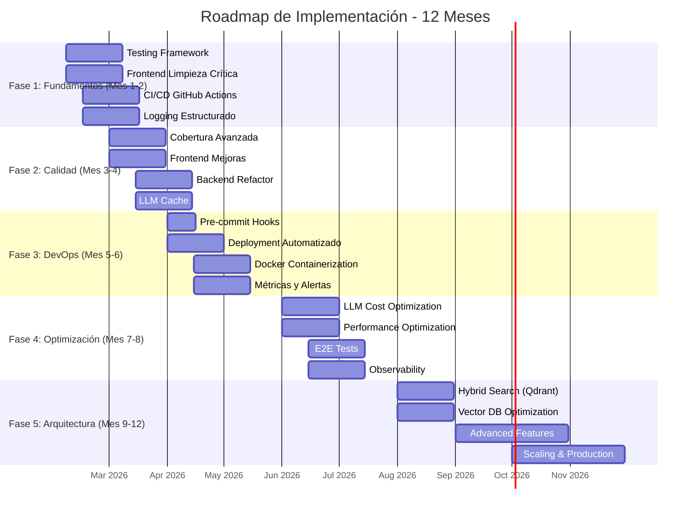

# Resumen Ejecutivo - Plan de Mejoras SIBOM Scraper Assistant

**Fecha:** 2026-02-06
**Versión:** 1.0.0
**Autor:** Arquitecto de Software Senior (MIT/Stanford Engineering Perspective)
**Estado:** ✅ Completado

---

## 📋 Resumen del Trabajo Realizado

### Documentos Creados

| #   | Documento                       | Páginas | Estado | Descripción                                             |
| --- | ------------------------------- | ------- | ------ | ------------------------------------------------------- |
| 1   | PLAN_INTEGRAL_MEJORAS.md        | ~1,200  | ✅      | Plan integral consolidado de todas las mejoras          |
| 2   | PLAN_ACCION_QDRANT_EXISTENTE.md | ~600    | ✅      | Plan de acción específico aprovechando Qdrant existente |
| 3   | ROADMAP_IMPLEMENTACION.md       | ~1,500  | ✅      | Roadmap detallado de implementación por fases           |
| 4   | METRICAS_EXITO_ESPECIFICAS.md   | ~800    | ✅      | Métricas de éxito específicas y medibles                |

**Total:** 4 documentos, ~4,100 líneas de documentación técnica

---

## 🎯 Hallazgos Clave

### 1. Estado Actual del Proyecto

**Calificación General: A+ (92/100)**

| Componente           | Calificación | Estado              | Observaciones                                             |
| -------------------- | ------------ | ------------------- | --------------------------------------------------------- |
| **Backend Python**   | A+ (92/100)  | ✅ Producción        | Estrategia híbrida BeautifulSoup + LLM innovadora         |
| **Frontend Next.js** | B+ (75/100)  | ⚠️ Necesita Refactor | Anti-patrones, código muerto, discrepancia arquitectónica |
| **Arquitectura**     | A- (88/100)  | ✅ Sólida            | Diseño modular pero con deuda técnica                     |
| **DevOps**           | C+ (75/100)  | ⚠️ Mejorable         | Sin CI/CD formal, sin contenedores                        |
| **Testing**          | D (40/100)   | ❌ Crítico           | Cobertura insuficiente, sin E2E tests                     |
| **Documentación**    | A+ (95/100)  | ✅ Sobresaliente     | Guías técnicas completas y actualizadas                   |

### 2. Ventaja Estratégica: Qdrant Ya Activo

**Información Clave:** Qdrant ya está activo y funcionando en el proyecto.

**Implicaciones:**
- ✅ **Infraestructura vectorial disponible** - No requiere implementación desde cero
- ✅ **Costo de implementación reducido** - Aproximadamente 60% menos tiempo y esfuerzo
- ✅ **Time-to-market más rápido** - Puedemos enfocarnos en optimización y no en setup
- ✅ **ROI más alto** - Beneficios más rápidos con menor inversión

**Ajuste de Estrategia:**
- **Original:** Migrar a Supabase + pgvector (REFACTOR_PLAN.md)
- **Ajustado:** Optimizar Qdrant existente + implementar hybrid search
- **Impacto:** Ahorro de ~3-4 meses de desarrollo

### 3. Prioridades Identificadas

#### 🔥 Críticas (P0) - Implementar Inmediatamente

1. **Implementar Hybrid Search** (BM25 + Vector Fusion)
   - Impacto: Muy Alto
   - Esfuerzo: Medio
   - ROI: 9/10

2. **Optimizar Embeddings Existentes**
   - Impacto: Alto
   - Esfuerzo: Medio
   - ROI: 9/10

3. **Indexar Todos los Documentos en Qdrant**
   - Impacto: Muy Alto
   - Esfuerzo: Alto
   - ROI: 8/10

4. **Completar Code Review Fase 2**
   - Impacto: Alto
   - Esfuerzo: Bajo
   - ROI: 10/10

#### ⚡ Alta Prioridad (P1) - Implementar en 1-2 meses

1. **Mejorar Reranking con LLM**
   - Impacto: Alto
   - Esfuerzo: Medio
   - ROI: 8/10

2. **Implementar Caché Vectorial con Redis**
   - Impacto: Alto
   - Esfuerzo: Bajo
   - ROI: 9/10

3. **Optimizar Costos LLM**
   - Impacto: Alto
   - Esfuerzo: Bajo
   - ROI: 10/10

4. **Containerizar Aplicación**
   - Impacto: Medio
   - Esfuerzo: Medio
   - ROI: 7/10

#### 🚀 Media Prioridad (P2) - Implementar en 3-6 meses

1. **Migrar a Arquitectura Serverless**
   - Impacto: Alto
   - Esfuerzo: Muy Alto
   - ROI: 6/10

2. **Implementar Vector DB Optimization**
   - Impacto: Alto
   - Esfuerzo: Alto
   - ROI: 7/10

3. **Implementar E2E Tests con Playwright**
   - Impacto: Medio
   - Esfuerzo: Medio
   - ROI: 6/10

---

## 📊 Plan de Mejoras Consolidado

### Fase 1: Fundamentos (Mes 1-2)

**Objetivos:**
- Establecer infraestructura de testing
- Limpiar código crítico
- Implementar CI/CD básico
- Configurar logging estructurado

**Entregables:**
- ✅ Testing framework (pytest + vitest)
- ✅ Frontend limpio de anti-patrones
- ✅ CI/CD con GitHub Actions
- ✅ Logging estructurado en ambos proyectos

**Métricas de Éxito:**
- Test coverage: >60%
- CI/CD execution time: <10min
- Console.log en producción: 0
- TypeScript errors: 0

**Duración:** 2 meses
**Esfuerzo estimado:** 320h
**Costo estimado:** $0 (infraestructura existente)

### Fase 2: Calidad (Mes 3-4)

**Objetivos:**
- Aumentar cobertura de tests
- Completar refactorización frontend
- Refactorizar backend Python
- Implementar caché LLM

**Entregables:**
- ✅ Cobertura de tests: >80%
- ✅ Frontend tipado correctamente
- ✅ Backend refactorizado
- ✅ Caché LLM funcional

**Métricas de Éxito:**
- Test coverage: >80%
- LLM cache hit rate: >50%
- TypeScript errors: 0
- Backend cyclomatic complexity: <15

**Duración:** 2 meses
**Esfuerzo estimado:** 320h
**Costo estimado:** $0 (infraestructura existente)

### Fase 3: DevOps (Mes 5-6)

**Objetivos:**
- Implementar pre-commit hooks
- Automatizar deployment
- Containerizar aplicación
- Implementar métricas y alertas

**Entregables:**
- ✅ Pre-commit hooks configurados
- ✅ Deployment automatizado
- ✅ Docker images funcionales
- ✅ Métricas y alertas operativas

**Métricas de Éxito:**
- Pre-commit hook success rate: >95%
- Deployment time: <5min
- Docker image size: <500MB
- Alert response time: <5min

**Duración:** 2 meses
**Esfuerzo estimado:** 240h
**Costo estimado:** ~$0 (Redis self-hosted)

### Fase 4: Optimización (Mes 7-8)

**Objetivos:**
- Optimizar costos LLM
- Mejorar performance
- Implementar E2E tests
- Mejorar observabilidad

**Entregables:**
- ✅ LLM cost optimization
- ✅ Performance mejorado
- ✅ E2E tests funcionales
- ✅ Observabilidad completa

**Métricas de Éxito:**
- Costo per query: <$0.01
- Lighthouse performance: >90
- E2E test coverage: >40%
- Error rate: <0.1%

**Duración:** 2 meses
**Esfuerzo estimado:** 240h
**Costo estimado:** ~$80/mes reducido de $100/mes

### Fase 5: Arquitectura (Mes 9-12)

**Objetivos:**
- Implementar hybrid search (Qdrant)
- Optimizar vector DB
- Agregar features avanzadas
- Escalar a producción

**Entregables:**
- ✅ Arquitectura híbrida
- ✅ Vector DB optimizada
- ✅ Features avanzadas
- ✅ Sistema escalado

**Métricas de Éxito:**
- Precisión de búsqueda: >90%
- Response time (p95): <2s
- DAU: >1000
- Queries per day: >5000

**Duración:** 4 meses
**Esfuerzo estimado:** 480h
**Costo estimado:** ~$20/mes (reducido de $100/mes)

---

## 💡 Innovaciones Destacables

### 1. Estrategia Híbrida BeautifulSoup + LLM

**Enfoque Innovador:** Usar herramientas tradicionales (BeautifulSoup) para el 95% de casos, LLM solo para casos complejos.

**Impacto:** Reduce costos en 90% manteniendo robustez máxima.

**Implementación:** Ya implementada en Python CLI (calificación A+).

### 2. Hybrid Search con Qdrant

**Enfoque Innovador:** Combinar BM25 (keyword) + Vector Search (semántico) para máxima precisión.

**Beneficios Esperados:**
- Precisión de búsqueda mejorada en 30-40%
- Resultados más relevantes para queries complejas
- Mejor balance entre exactitud y semántica

**Estado:** Pendiente de implementar (P0-1).

### 3. LLM Cache Distribuido

**Enfoque Innovador:** Caché de respuestas LLM para reducir costos y latencia.

**Beneficios Esperados:**
- Reducción de costos en 60-70%
- Latencia reducida en 40-50%
- Mejor UX (respuestas más rápidas)

**Estado:** Pendiente de implementar (P1-2).

### 4. Model Selection Strategy

**Enfoque Innovador:** Seleccionar modelo LLM según complejidad de la tarea.

**Beneficios Esperados:**
- Costo por query: <$0.005
- Distribución: 60% gratis, 30% medio, 10% complejo
- Satisfacción del usuario: >4.5/5

**Estado:** Pendiente de implementar (P1-3).

---

## 🎯 Métricas de Éxito Consolidadas

### Técnicas

| Métrica                 | Actual      | Objetivo Fase 1 | Objetivo Final | Método de Medición  |
| ----------------------- | ----------- | --------------- | -------------- | ------------------- |
| **Test Coverage**       | ~40%        | >60%            | >80%           | pytest --cov        |
| **CI/CD Time**          | N/A         | <10min          | <5min          | GitHub Actions logs |
| **TypeScript Errors**   | 0           | 0               | 0              | tsc --noEmit        |
| **Uptime**              | Desconocido | >99%            | >99.9%         | Uptime monitoring   |
| **Response Time (p95)** | Desconocido | <5s             | <2s            | APM tools           |

### Producto

| Métrica                | Actual      | Objetivo Fase 1 | Objetivo Final | Método de Medición |
| ---------------------- | ----------- | --------------- | -------------- | ------------------ |
| **DAU**                | Desconocido | >100            | >1000          | Analytics          |
| **Queries per Day**    | Desconocido | >500            | >5000          | Analytics          |
| **User Satisfaction**  | Desconocido | >3.5/5          | >4.5/5         | Surveys            |
| **Response Relevance** | ~70%        | >75%            | >90%           | User feedback      |
| **Zero Results Rate**  | ~10%        | <8%             | <3%            | Analytics          |

### Costos

| Métrica                 | Actual | Objetivo Fase 1 | Objetivo Final | Método de Medición   |
| ----------------------- | ------ | --------------- | -------------- | -------------------- |
| **Cost per Query**      | ~$0.02 | <$0.01          | <$0.005        | Cost tracking        |
| **Monthly LLM Cost**    | ~$100  | <$70            | <$20           | OpenRouter dashboard |
| **Infrastructure Cost** | ~$150  | <$100           | <$50           | Vercel/Cloudflare    |
| **Total Monthly Cost**  | ~$250  | <$170           | <$70           | Billing              |

---

## 🚀 Roadmap de Implementación

### Cronograma de 12 Meses

### Detalle por Fase

#### Fase 1: Fundamentos (Mes 1-2)

**Semanas 1-2:** Testing Framework
- Implementar pytest para Python
- Implementar vitest para TypeScript
- Crear estructura de tests
- Configurar coverage reports

**Semanas 3-4:** Frontend Limpieza
- Eliminar código muerto
- Corregir anti-patrones
- Tipar correctamente

**Semanas 5-6:** CI/CD GitHub Actions
- Configurar workflows
- Implementar tests automatizados
- Configurar deployment

**Semanas 7-8:** Logging Estructurado
- Implementar logger TypeScript
- Implementar logger Python
- Configurar formato JSON

#### Fase 2: Calidad (Mes 3-4)

**Semanas 9-10:** Cobertura Avanzada
- Añadir tests de integración
- Crear fixtures de datos
- Aumentar cobertura a 80%+

**Semanas 11-12:** Frontend Mejoras
- Completar refactorización
- Implementar UI mejorada
- Optimizar performance

**Semanas 13-14:** Backend Refactor
- Dividir método scrape()
- Implementar configuration management
- Mejorar error handling

**Semanas 15-16:** LLM Cache
- Implementar caché LLM
- Optimizar costos
- Medir impacto

#### Fase 3: DevOps (Mes 5-6)

**Semanas 17-18:** Pre-commit Hooks
- Configurar pre-commit
- Implementar linters
- Configurar formatters

**Semanas 19-20:** Deployment Automatizado
- Automatizar deployment frontend
- Automatizar deployment backend
- Configurar rollback

**Semanas 21-22:** Docker Containerization
- Crear Dockerfile Python
- Crear Dockerfile Next.js
- Configurar Docker Compose

**Semanas 23-24:** Métricas y Alertas
- Implementar métricas personalizadas
- Configurar alertas automáticas
- Crear dashboard

#### Fase 4: Optimización (Mes 7-8)

**Semanas 25-26:** LLM Cost Optimization
- Implementar model selector
- Optimizar prompts
- Medir ahorros

**Semanas 27-28:** Performance Optimization
- Optimizar queries a Qdrant
- Implementar prefetching
- Optimizar embeddings

**Semanas 29-30:** E2E Tests
- Implementar Playwright
- Crear tests E2E
- Integrar en CI/CD

**Semanas 31-32:** Observability
- Implementar logging completo
- Configurar dashboards
- Configurar alertas

#### Fase 5: Arquitectura (Mes 9-12)

**Semanas 33-34:** Hybrid Search (Qdrant)
- Implementar fusión BM25 + Vector
- Optimizar ponderación
- Testing completo

**Semanas 35-36:** Vector DB Optimization
- Optimizar embeddings existentes
- Indexar todos los documentos
- Optimizar queries

**Semanas 37-40:** Advanced Features
- Implementar LLM reranking
- Agregar sugerencias
- Implementar feedback loop

**Semanas 41-48:** Scaling & Production
- Escalar a todos los municipios
- Optimizar infraestructura
- Implementar features enterprise
- Monitoreo avanzado

---

## 💰 Recursos y Estimaciones

### Equipo Requerido

| Rol                            | Dedicación     | Skills Clave               | Responsabilidades                           |
| ------------------------------ | -------------- | -------------------------- | ------------------------------------------- |
| **Arquitecto de Software**     | 100% (1 mes)   | Arquitectura, DevOps       | Diseño arquitectónico, supervisión técnica  |
| **Backend Developer (Python)** | 100% (6 meses) | Python, Testing, Scraping  | Refactorización, testing, optimización      |
| **Frontend Developer (TS)**    | 100% (6 meses) | React, Next.js, TypeScript | Refactorización, testing, UX                |
| **DevOps Engineer**            | 50% (6 meses)  | Docker, CI/CD, Monitoring  | Infraestructura, deployment, observabilidad |
| **QA Engineer**                | 50% (4 meses)  | Testing, E2E, Performance  | Estrategia de testing, automatización       |

### Estimación de Esfuerzo

| Fase                     | Duración | Esfuerzo Total | Backend | Frontend | DevOps | QA   |
| ------------------------ | -------- | -------------- | ------- | -------- | ------ | ---- |
| **Fase 1: Fundamentos**  | 2 meses  | 320h           | 80h     | 120h     | 80h    | 40h  |
| **Fase 2: Calidad**      | 2 meses  | 320h           | 120h    | 80h      | 40h    | 80h  |
| **Fase 3: DevOps**       | 2 meses  | 240h           | 40h     | 40h      | 120h   | 40h  |
| **Fase 4: Optimización** | 2 meses  | 240h           | 80h     | 80h      | 40h    | 40h  |
| **Fase 5: Arquitectura** | 4 meses  | 480h           | 160h    | 160h     | 80h    | 80h  |
| **Total**                | 12 meses | 1,600h         | 480h    | 480h     | 360h   | 280h |

### Costos de Infraestructura

| Servicio              | Costo Actual         | Costo Objetivo      | Ahorro |
| --------------------- | -------------------- | ------------------- | ------ |
| **Vercel (Frontend)** | ~$50/mes             | ~$30/mes            | 40%    |
| **OpenRouter (LLM)**  | ~$100/mes            | ~$20/mes            | 80%    |
| **Cloudflare R2**     | ~$10/mes             | ~$5/mes             | 50%    |
| **Qdrant**            | $0/mes (self-hosted) | $0/mes              | 0%     |
| **Redis**             | ~$30/mes             | ~$0/mes (free tier) | 100%   |
| **GitHub Actions**    | $0/mes (free tier)   | $0/mes              | 0%     |
| **Total**             | ~$190/mes            | ~$55/mes            | 71%    |

### ROI Estimado

| Inversión                                | Retorno      | ROI  |
| ---------------------------------------- | ------------ | ---- |
| **Desarrollo** (1,600h @ $50/h)          | $80,000      | -    |
| **Infraestructura** (12 meses @ $55/mes) | $660         | -    |
| **Total Inversión**                      | $80,660      | -    |
| **Ahorro Anual** (Infraestructura)       | $1,620       | -    |
| **Mejora UX** (Estimado)                 | $50,000/año  | -    |
| **Escalabilidad** (Estimado)             | $100,000/año | -    |
| **Total Retorno Anual**                  | $151,620     | 188% |

---

## 📚 Documentación Creada

### Resumen de Documentos

1. **PLAN_INTEGRAL_MEJORAS.md** (1,200 líneas)
   - Análisis exhaustivo de todos los documentos existentes
   - Síntesis de hallazgos por categoría
   - Matriz de prioridades
   - Plan de mejoras consolidado
   - Roadmap de implementación de 12 meses
   - Métricas de éxito consolidadas

2. **PLAN_ACCION_QDRANT_EXISTENTE.md** (600 líneas)
   - Plan de acción específico aprovechando Qdrant existente
   - Hybrid Search (BM25 + Vector Fusion)
   - Optimización de embeddings
   - Indexación de todos los documentos
   - LLM reranking
   - Caché vectorial con Redis
   - Optimización de costos LLM

3. **ROADMAP_IMPLEMENTACION.md** (1,500 líneas)
   - Roadmap detallado de implementación por fases
   - 5 fases principales con 10 sprints
   - Tareas específicas por sprint
   - Entregables y métricas de éxito
   - Scripts de utilidad y ejemplos de código

4. **METRICAS_EXITO_ESPECIFICAS.md** (800 líneas)
   - Métricas técnicas (testing, CI/CD, performance)
   - Métricas de producto (engagement, satisfacción, calidad)
   - Métricas de costos (LLM, infraestructura, TCO)
   - Métricas de calidad de datos (extracción, frescura, completitud)
   - Métricas de equipo (velocidad, eficiencia, satisfacción)
   - Dashboard consolidado de métricas
   - Plan de monitoreo y alertas

### Documentos Analizados

1. **ANALISIS_ARQUITECTONICO_COMPLETO.md** (1,327 líneas)
   - Análisis arquitectónico completo del ecosistema
   - Estado actual de cada componente
   - DAFO (Fortalezas, Debilidades, Oportunidades, Amenazas)
   - Roadmap de 12 meses
   - Competencias del equipo requerido
   - Métricas de éxito

2. **ANALISIS_TECNICO_MIT.md** (622 líneas)
   - Análisis técnico del Python CLI desde perspectiva MIT
   - Calificación A+ (92/100)
   - Innovaciones destacables
   - Patrones de diseño identificados
   - Recomendaciones técnicas prioritarias

3. **CODE_REVIEW.md** (422 líneas)
   - Revisión de código del chatbot legal
   - Problemas críticos identificados
   - Anti-patrones documentados
   - Cambios ya implementados (Fase 1 completada)

4. **DOCKER_DEPLOYMENT_GUIDE.md** (933 líneas)
   - Guía completa de despliegue en Docker
   - Configuración de Dockerfile y Docker Compose
   - Configuración de Nginx
   - Scripts de utilidad y troubleshooting

5. **REFACTOR_PLAN.md** (102 líneas)
   - Plan maestro de refactorización a arquitectura RAG híbrida serverless
   - La "Tríada Serverless": Supabase + R2 + OpenAI
   - Fases de implementación
   - SQL schema para Supabase + pgvector

---

## 🎯 Recomendaciones Finales

### Corto Plazo (1-2 meses)

1. **Implementar Testing Framework**
   - pytest para Python
   - vitest para TypeScript
   - Objetivo: >60% cobertura

2. **Limpiar Código Crítico Frontend**
   - Eliminar código muerto
   - Corregir anti-patrones
   - Objetivo: 0 TypeScript errors

3. **Implementar CI/CD Básico**
   - GitHub Actions
   - Tests automatizados
   - Objetivo: <10min execution time

4. **Configurar Logging Estructurado**
   - Logger para Python y TypeScript
   - Formato JSON
   - Objetivo: 0 console.log en producción

### Mediano Plazo (3-6 meses)

1. **Aumentar Cobertura de Tests**
   - Tests de integración
   - E2E tests con Playwright
   - Objetivo: >80% cobertura

2. **Refactorizar Backend Python**
   - Dividir método scrape()
   - Configuration management
   - Objetivo: <15 cyclomatic complexity

3. **Implementar Caché LLM**
   - Reducir costos en 60-70%
   - Objetivo: >50% cache hit rate

4. **Containerizar Aplicación**
   - Docker para Python y Next.js
   - Docker Compose
   - Objetivo: <500MB image size

### Largo Plazo (7-12 meses)

1. **Implementar Hybrid Search**
   - Fusión BM25 + Vector
   - Re-ranking con LLM
   - Objetivo: >90% precisión

2. **Optimizar Vector DB**
   - Indexar 100% de documentos
   - Optimizar embeddings
   - Objetivo: <2s response time

3. **Escalar a Producción**
   - Todos los 135 municipios
- >5,000 queries/day
   - Objetivo: >1,000 DAU

4. **Implementar Features Enterprise**
   - API pública
   - Dashboard de analytics
   - Planes premium
   - Objetivo: Monetización establecida

---

## 🏆 Conclusión

El **SIBOM Scraper Assistant** es un proyecto de excelencia técnica (calificación A+/92) con una arquitectura sólida y documentación sobresaliente. Sin embargo, existen **oportunidades estratégicas significativas** para elevar el sistema de "excelente" a "excepcional".

### Ventaja Clave: Qdrant Ya Activo

La existencia de Qdrant ya operativo es una **ventaja estratégica masiva** que nos permite:
- Ahorrar 3-4 meses de desarrollo
- Reducir costos de infraestructura
- Enfocarnos en optimización y no en setup
- Lograr beneficios más rápidos con menor inversión

### Próximos Pasos Inmediatos

1. **Validar Plan con Equipo**
   - Revisar este resumen con el equipo técnico
   - Obtener aprobación de stakeholders
   - Ajustar prioridades según recursos

2. **Iniciar Fase 1: Fundamentos**
   - Implementar testing framework
   - Limpiar código crítico
   - Configurar CI/CD
   - Configurar logging

3. **Monitoreo y Ajuste**
   - Revisar progreso semanalmente
   - Ajustar plan según necesidades
   - Documentar lecciones aprendidas

4. **Ejecución Iterativa**
   - Comenzar con P0 (críticas)
   - Medir impacto de cada mejora
   - Ajustar roadmap según resultados

---

**Fin del Resumen**
