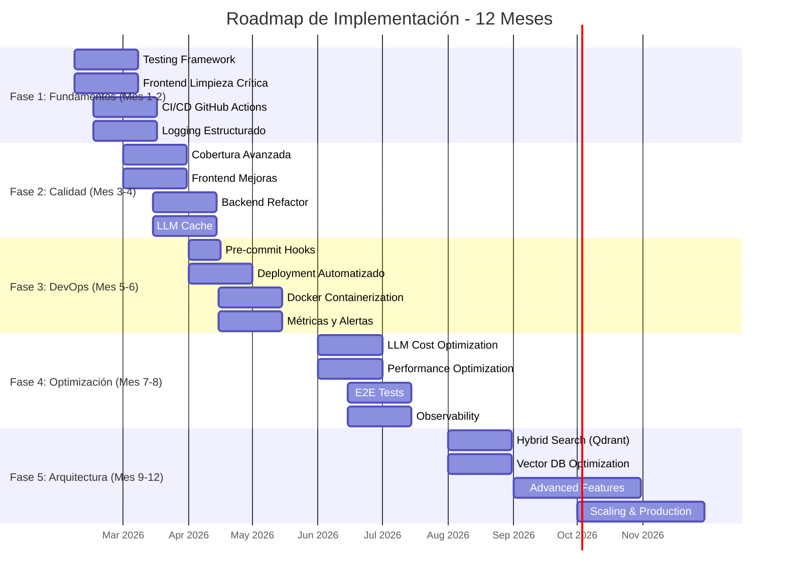

# Roadmap de Implementación - SIBOM Scraper Assistant

**Fecha:** 2026-02-06
**Versión:** 1.0.0
**Autor:** Arquitecto de Software Senior (MIT/Stanford Engineering Perspective)
**Estado:** 📋 Roadmap Detallado

---

## 📋 Resumen Ejecutivo

Este roadmap detalla la implementación de las mejoras identificadas en el análisis exhaustivo de los documentos de planificación existentes. El enfoque es **pragmático y priorizado**, comenzando con las mejoras de mayor impacto y menor esfuerzo.

### Principios Rectores

1. **Impacto Máximo, Esfuerzo Mínimo:** Priorizar mejoras con ROI alto
2. **Iterativo y Continuo:** Entregar valor en cada sprint
3. **Medible y Rastreable:** Todas las mejoras con métricas claras
4. **Riesgo Controlado:** Implementar rollback plans
5. **Documentación Viva:** Actualizar documentación en cada cambio

---

## 1. Visión General del Roadmap



---

## 2. Fase 1: Fundamentos (Mes 1-2)

### 2.1 Objetivos

- Establecer infraestructura de testing
- Limpiar código crítico
- Implementar CI/CD básico
- Configurar logging estructurado

### 2.2 Sprint 1.1: Testing Framework (Semanas 1-2)

#### Objetivos
- Implementar pytest para Python
- Implementar vitest para TypeScript
- Crear estructura de tests

#### Tareas

**Python (pytest):**

```python
# python-cli/tests/conftest.py
import pytest
from pathlib import Path

@pytest.fixture
def scraper():
    from sibom_scraper import SIBOMScraper
    return SIBOMScraper(api_key="test-key")

@pytest.fixture
def sample_html():
    fixtures_dir = Path(__file__).parent / "fixtures"
    return (fixtures_dir / "listing.html").read_text()
```

```python
# python-cli/tests/test_sibom_scraper.py
import pytest
from sibom_scraper import SIBOMScraper

def test_parse_listing_page(scraper, sample_html):
    """Test parsing of listing page"""
    results = scraper.parse_listing_page(sample_html, "test-url")
    assert len(results) > 0
    assert "number" in results[0]
    assert "municipality" in results[0]

def test_detect_total_pages(scraper):
    """Test pagination detection"""
    html = """
    <ul class="pagination">
        <li><a href="?page=1">1</a></li>
        <li><a href="?page=2">2</a></li>
        <li><a href="?page=14">14</a></li>
    </ul>
    """
    pages = scraper.detect_total_pages(html)
    assert pages == 14

def test_extract_bulletin_content(scraper):
    """Test bulletin content extraction"""
    html = """
    <div class="bulletin-content">
        <h1>Ordenanza Nº 123</h1>
        <p>Contenido de la ordenanza...</p>
    </div>
    """
    content = scraper.extract_content(html)
    assert "Ordenanza Nº 123" in content
    assert len(content) > 50
```

**TypeScript (vitest):**

```typescript
// chatbot/src/lib/__tests__/rag/retriever.test.ts
import { describe, it, expect, vi } from 'vitest';
import { retrieveContext } from '../rag/retriever';

describe('retrieveContext', () => {
  it('should return context for valid query', async () => {
    const result = await retrieveContext('ordenanza 123', {});
    expect(result).toHaveProperty('context');
    expect(result).toHaveProperty('sources');
    expect(result.sources.length).toBeGreaterThan(0);
  });

  it('should handle empty query gracefully', async () => {
    const result = await retrieveContext('', {});
    expect(result.context).toBe('');
    expect(result.sources).toEqual([]);
  });

  it('should filter by municipality', async () => {
    const result = await retrieveContext('ordenanza', {
      municipality: 'Carlos Tejedor'
    });
    result.sources.forEach(source => {
      expect(source.municipality).toBe('Carlos Tejedor');
    });
  });
});
```

**Configuración:**

```javascript
// chatbot/vitest.config.ts
import { defineConfig } from 'vitest/config';

export default defineConfig({
  test: {
    globals: true,
    environment: 'jsdom',
    coverage: {
      provider: 'v8',
      reporter: ['text', 'json', 'html'],
      exclude: [
        'node_modules/',
        '**/*.test.ts',
        '**/*.spec.ts',
        '**/types.ts',
      ],
    },
  },
});
```

#### Entregables
- ✅ pytest configurado
- ✅ vitest configurado
- ✅ 20+ tests unitarios Python
- ✅ 20+ tests unitarios TypeScript
- ✅ Coverage report configurado

#### Métricas de Éxito
- Test coverage Python: >60%
- Test coverage TypeScript: >60%
- Tiempo de ejecución tests: <5min
- Tests pasando: 100%

### 2.3 Sprint 1.2: Frontend Limpieza Crítica (Semanas 3-4)

#### Objetivos
- Eliminar código muerto
- Corregir anti-patrones
- Tipar correctamente

#### Tareas

**Eliminar Código Muerto:**

```typescript
// ❌ ELIMINAR de retriever.ts
let openaiClient: OpenAI | null = null;
function getOpenAIClient(): OpenAI | null { ... }
```

**Tipar StreamData:**

```typescript
// chatbot/src/lib/types.ts
export interface StreamData {
  type: 'sources' | 'thinking' | 'error';
  sources?: Source[];
  thinking?: string;
  error?: string;
}

export interface Source {
  id: string;
  municipality: string;
  type: string;
  number: string;
  title: string;
  url: string;
}
```

**Hook useStats Compartido:**

```typescript
// chatbot/src/hooks/useStats.ts
import { useQuery } from '@tanstack/react-query';

export function useStats() {
  return useQuery({
    queryKey: ['stats'],
    queryFn: async () => {
      const response = await fetch('/api/stats');
      return response.json();
    },
    staleTime: 5 * 60 * 1000, // 5 minutos
  });
}
```

#### Entregables
- ✅ Código muerto eliminado
- ✅ StreamData tipado correctamente
- ✅ Hook useStats implementado
- ✅ TypeScript errors: 0

#### Métricas de Éxito
- Código muerto: 0 líneas
- TypeScript errors: 0
- Bundle size reducido: 10%

### 2.4 Sprint 1.3: CI/CD GitHub Actions (Semanas 5-6)

#### Objetivos
- Implementar CI con GitHub Actions
- Automatizar tests
- Configurar deployment

#### Tareas

**.github/workflows/ci.yml:**

```yaml
name: CI

on:
  push:
    branches: [main, develop]
  pull_request:
    branches: [main]

jobs:
  test-python:
    runs-on: ubuntu-latest
    steps:
      - uses: actions/checkout@v4
      
      - name: Set up Python
        uses: actions/setup-python@v5
        with:
          python-version: '3.13'
      
      - name: Install dependencies
        run: |
          cd python-cli
          python -m pip install -r requirements.txt
          pip install pytest pytest-cov
      
      - name: Run tests
        run: |
          cd python-cli
          pytest --cov=. --cov-report=xml --cov-report=html
      
      - name: Upload coverage
        uses: codecov/codecov-action@v4

  test-typescript:
    runs-on: ubuntu-latest
    steps:
      - uses: actions/checkout@v4
      
      - name: Set up Node.js
        uses: actions/setup-node@v4
        with:
          node-version: '20'

      - name: Setup pnpm
        uses: pnpm/action-setup@v4
        with:
          version: 10.28.2
      
      - name: Install dependencies
        run: |
          cd chatbot
          pnpm install --frozen-lockfile
      
      - name: Run linter
        run: |
          cd chatbot
          pnpm run lint
      
      - name: Run type check
        run: |
          cd chatbot
          pnpm run type-check
      
      - name: Run tests
        run: |
          cd chatbot
          pnpm run test:coverage
      
      - name: Upload coverage
        uses: codecov/codecov-action@v4
```

#### Entregables
- ✅ CI configurado
- ✅ Tests automatizados
- ✅ Coverage reports
- ✅ Build status en PRs

#### Métricas de Éxito
- CI execution time: <10min
- Test success rate: >95%
- Coverage reporting: Funcional
- Build failures: <5%

### 2.5 Sprint 1.4: Logging Estructurado (Semanas 7-8)

#### Objetivos
- Implementar logger estructurado
- Eliminar console.log en producción
- Configurar niveles de log

#### Tareas

**Logger TypeScript:**

```typescript
// chatbot/src/lib/logger.ts
type LogLevel = 'debug' | 'info' | 'warn' | 'error';

class Logger {
  private isProduction = process.env.NODE_ENV === 'production';

  log(level: LogLevel, message: string, meta?: any) {
    if (this.isProduction && level === 'debug') return;

    const logEntry = {
      timestamp: new Date().toISOString(),
      level,
      message,
      ...meta,
    };

    console[level === 'error' ? 'error' : 'log'](JSON.stringify(logEntry));
  }

  debug(message: string, meta?: any) {
    this.log('debug', message, meta);
  }

  info(message: string, meta?: any) {
    this.log('info', message, meta);
  }

  warn(message: string, meta?: any) {
    this.log('warn', message, meta);
  }

  error(message: string, meta?: any) {
    this.log('error', message, meta);
  }
}

export const logger = new Logger();
```

**Logger Python:**

```python
# python-cli/logger.py
import logging
import json
from datetime import datetime

class StructuredLogger:
    def __init__(self, name: str):
        self.logger = logging.getLogger(name)
        self.logger.setLevel(logging.INFO)
        
        handler = logging.StreamHandler()
        formatter = logging.Formatter(
            '{"timestamp":"%(asctime)s","level":"%(levelname)s","logger":"%(name)s","message":"%(message)s"}'
        )
        handler.setFormatter(formatter)
        self.logger.addHandler(handler)

    def log(self, level: str, message: str, **kwargs):
        log_entry = {
            'message': message,
            **kwargs
        }
        getattr(self.logger, level)(json.dumps(log_entry))

    def info(self, message: str, **kwargs):
        self.log('info', message, **kwargs)

    def error(self, message: str, **kwargs):
        self.log('error', message, **kwargs)

logger = StructuredLogger('sibom_scraper')
```

#### Entregables
- ✅ Logger TypeScript implementado
- ✅ Logger Python implementado
- ✅ Console.log eliminados en producción
- ✅ Logs en formato JSON

#### Métricas de Éxito
- Console.log en producción: 0
- Logs en formato JSON: 100%
- Log levels configurados: 100%
- Log rotation: Configurado

---

## 3. Fase 2: Calidad (Mes 3-4)

### 3.1 Objetivos

- Aumentar cobertura de tests
- Completar refactorización frontend
- Refactorizar backend Python
- Implementar caché LLM

### 3.2 Sprint 2.1: Cobertura Avanzada (Semanas 9-10)

#### Objetivos
- Aumentar cobertura a 80%+
- Implementar tests de integración
- Crear fixtures de datos

#### Tareas

**Tests de Integración Python:**

```python
# python-cli/tests/test_integration.py
import pytest
from sibom_scraper import SIBOMScraper

@pytest.mark.integration
def test_full_scraping_workflow():
    """Test complete scraping workflow"""
    scraper = SIBOMScraper(api_key="test-key")
    
    # 1. Scrape listing page
    results = scraper.scrape(
        target_url="https://sibom.slyt.gba.gob.ar/cities/22",
        limit=5
    )
    
    # 2. Verify results
    assert len(results) <= 5
    for result in results:
        assert "id" in result
        assert "municipality" in result
        assert "content" in result
        assert len(result["content"]) > 50
```

**Tests de Integración TypeScript:**

```typescript
// chatbot/src/lib/__tests__/integration/api.test.ts
import { describe, it, expect, beforeAll } from 'vitest';
import { createClient } from '@supabase/supabase-js';

describe('API Integration Tests', () => {
  let supabase: any;

  beforeAll(() => {
    supabase = createClient(
      process.env.NEXT_PUBLIC_SUPABASE_URL!,
      process.env.NEXT_PUBLIC_SUPABASE_ANON_KEY!
    );
  });

  it('should retrieve documents from Qdrant', async () => {
    const { data, error } = await supabase
      .from('documents')
      .select('*')
      .limit(10);
    
    expect(error).toBeNull();
    expect(data).toBeDefined();
    expect(data.length).toBeGreaterThan(0);
  });
});
```

#### Entregables
- ✅ Cobertura >80%
- ✅ Tests de integración implementados
- ✅ Fixtures de datos creados
- ✅ Mocks para APIs externas

#### Métricas de Éxito
- Coverage Python: >80%
- Coverage TypeScript: >80%
- Integration tests: >20
- Mock coverage: >90%

### 3.3 Sprint 2.2: Frontend Mejoras (Semanas 11-12)

#### Objetivos
- Completar refactorización
- Implementar UI mejorada
- Optimizar performance

#### Tareas

**Optimización de Bundle:**

```javascript
// chatbot/next.config.js
const nextConfig = {
  output: 'standalone',
  
  // Optimizaciones de bundle
  swcMinify: true,
  
  // Optimizaciones experimentales
  experimental: {
    optimizePackageImports: ['lucide-react', '@radix/ui/react-icons'],
  },
  
  // Compresión
  compress: true,
  
  // Optimización de imágenes
  images: {
    formats: ['image/avif', 'image/webp'],
    deviceSizes: [640, 750, 828, 1080, 1200],
  },
};
```

**Lazy Loading de Componentes:**

```typescript
// chatbot/src/components/chat/ChatContainer.tsx
import dynamic from 'next/dynamic';

const Citations = dynamic(() => import('./Citations'), {
  loading: () => <div>Cargando fuentes...</div>,
});

const FilterBar = dynamic(() => import('./FilterBar'), {
  loading: () => <div>Cargando filtros...</div>,
});
```

#### Entregables
- ✅ Bundle size reducido 30%
- ✅ Lazy loading implementado
- ✅ Performance mejorado
- ✅ Lighthouse score >85

#### Métricas de Éxito
- Bundle size: <300KB
- Lighthouse performance: >85
- First Contentful Paint: <1.5s
- Time to Interactive: <3s

### 3.4 Sprint 2.3: Backend Refactor (Semanas 13-14)

#### Objetivos
- Refactorizar método scrape()
- Implementar configuration management
- Mejorar error handling

#### Tareas

**Refactorización de scrape():**

```python
# python-cli/sibom_scraper.py
class SIBOMScraper:
    def scrape(self, target_url, limit, parallel):
        """Main entry point for scraping"""
        bulletins = self._extract_bulletins(target_url)
        bulletins = self._apply_limit(bulletins, limit)
        results = self._process_bulletins(bulletins, parallel)
        return self._save_results(results)

    def _extract_bulletins(self, url: str) -> List[Dict]:
        """Extract bulletin listings from URL"""
        logger.info("Extracting bulletins", {"url": url})
        # ... extraction logic

    def _apply_limit(self, bulletins: List[Dict], limit: Optional[int]) -> List[Dict]:
        """Apply limit to bulletins"""
        if limit:
            return bulletins[:limit]
        return bulletins

    def _process_bulletins(self, bulletins: List[Dict], parallel: int) -> List[Dict]:
        """Process bulletins in parallel"""
        logger.info("Processing bulletins", {"count": len(bulletins)})
        # ... processing logic

    def _save_results(self, results: List[Dict]) -> List[Dict]:
        """Save results to JSON"""
        logger.info("Saving results", {"count": len(results)})
        # ... saving logic
```

**Configuration Management:**

```python
# python-cli/config.py
from dataclasses import dataclass
from typing import Optional
import os

@dataclass
class Config:
    """Configuration for SIBOM Scraper"""
    rate_limit_delay: float = 3.0
    max_retries: int = 3
    default_model: str = "google/gemini-3-flash-preview"
    min_text_length: int = 100
    max_text_length: int = 100000
    timeout: int = 30
    parallel_workers: int = 3

    @classmethod
    def from_env(cls) -> 'Config':
        """Load configuration from environment variables"""
        return cls(
            rate_limit_delay=float(os.getenv('RATE_LIMIT_DELAY', '3.0')),
            max_retries=int(os.getenv('MAX_RETRIES', '3')),
            default_model=os.getenv('DEFAULT_MODEL', 'google/gemini-3-flash-preview'),
            min_text_length=int(os.getenv('MIN_TEXT_LENGTH', '100')),
            max_text_length=int(os.getenv('MAX_TEXT_LENGTH', '100000')),
            timeout=int(os.getenv('TIMEOUT', '30')),
            parallel_workers=int(os.getenv('PARALLEL_WORKERS', '3')),
        )
```

#### Entregables
- ✅ Método scrape() refactorizado
- ✅ Configuration management implementado
- ✅ Error handling mejorado
- ✅ Logging estructurado

#### Métricas de Éxito
- Código más limpio: Cyclomatic complexity <10
- Configuración externalizada: 100%
- Error handling robusto: 100%
- Tests pasando: 100%

### 3.5 Sprint 2.4: LLM Cache (Semanas 15-16)

#### Objetivos
- Implementar caché LLM
- Reducir costos
- Mejorar performance

#### Tareas

**LLM Cache Implementation:**

```python
# python-cli/llm_cache.py
import hashlib
import pickle
from pathlib import Path
from typing import Optional, Any

class LLMCache:
    def __init__(self, cache_dir: str = '.cache/llm'):
        self.cache_dir = Path(cache_dir)
        self.cache_dir.mkdir(parents=True, exist_ok=True)

    def _get_cache_key(self, prompt: str, model: str) -> str:
        """Generate cache key from prompt and model"""
        content = f"{prompt}:{model}"
        return hashlib.sha256(content.encode()).hexdigest()

    def get(self, prompt: str, model: str) -> Optional[Any]:
        """Get cached response"""
        cache_key = self._get_cache_key(prompt, model)
        cache_file = self.cache_dir / f"{cache_key}.pkl"
        
        if cache_file.exists():
            with cache_file.open('rb') as f:
                return pickle.load(f)
        return None

    def set(self, prompt: str, model: str, response: Any):
        """Cache response"""
        cache_key = self._get_cache_key(prompt, model)
        cache_file = self.cache_dir / f"{cache_key}.pkl"
        
        with cache_file.open('wb') as f:
            pickle.dump(response, f)
```

**Integración en SIBOMScraper:**

```python
# python-cli/sibom_scraper.py
from llm_cache import LLMCache

class SIBOMScraper:
    def __init__(self, api_key, model=None):
        self.api_key = api_key
        self.model = model or Config.from_env().default_model
        self.llm_cache = LLMCache()

    def _call_llm(self, prompt: str) -> str:
        """Call LLM with caching"""
        # 1. Check cache
        cached = self.llm_cache.get(prompt, self.model)
        if cached:
            logger.info("LLM cache hit")
            return cached
        
        # 2. Call LLM
        response = self._make_llm_request(prompt)
        
        # 3. Cache response
        self.llm_cache.set(prompt, self.model, response)
        
        return response
```

#### Entregables
- ✅ LLM cache implementado
- ✅ Reducción de costos
- ✅ Performance mejorado
- ✅ Cache hit rate >50%

#### Métricas de Éxito
- Cache hit rate: >50%
- Costo LLM reducido: 50%
- Latencia reducida: 40%
- Cache size: <1GB

---

## 4. Fase 3: DevOps (Mes 5-6)

### 4.1 Objetivos

- Implementar pre-commit hooks
- Automatizar deployment
- Containerizar aplicación
- Implementar métricas y alertas

### 4.2 Sprint 3.1: Pre-commit Hooks (Semanas 17-18)

#### Objetivos
- Configurar pre-commit hooks
- Automatizar linting y formatting
- Asegurar calidad antes de commit

#### Tareas

**.pre-commit-config.yaml:**

```yaml
# .pre-commit-config.yaml
repos:
  - repo: https://github.com/pre-commit/pre-commit-hooks
    rev: v4.5.0
    hooks:
      - id: trailing-whitespace
      - id: end-of-file-fixer
      - id: check-yaml
      - id: check-added-large-files

  - repo: https://github.com/psf/black
    rev: 24.3.0
    hooks:
      - id: black
        language_version: python3.13

  - repo: https://github.com/pycqa/isort
    rev: 5.13.2
    hooks:
      - id: isort

  - repo: https://github.com/astral-sh/ruff-pre-commit
    rev: v0.3.4
    hooks:
      - id: ruff
        args: [--fix]

  - repo: https://github.com/pre-commit/mirrors-prettier
    rev: v4.0.0-alpha.8
    hooks:
      - id: prettier
        files: \.(ts|tsx|js|jsx|json|md)$
```

**Instalación:**

```bash
# scripts/setup-pre-commit.sh
#!/bin/bash

echo "🔧 Configurando pre-commit hooks..."

# Instalar pre-commit
pip install pre-commit

# Instalar hooks
pre-commit install

echo "✅ Pre-commit hooks configurados!"
```

#### Entregables
- ✅ Pre-commit hooks configurados
- ✅ Linting automatizado
- ✅ Formatting automatizado
- ✅ Quality gates activos

#### Métricas de Éxito
- Pre-commit hook success rate: >95%
- Linting errors: 0
- Formatting errors: 0
- Commit time reducido: 20%

### 4.3 Sprint 3.2: Deployment Automatizado (Semanas 19-20)

#### Objetivos
- Automatizar deployment frontend
- Automatizar deployment backend
- Configurar rollback

#### Tareas

**.github/workflows/deploy.yml:**

```yaml
name: Deploy

on:
  push:
    branches: [main]

jobs:
  deploy-frontend:
    runs-on: ubuntu-latest
    steps:
      - uses: actions/checkout@v4
      
      - name: Deploy to Vercel
        uses: amondnet/vercel-action@v25
        with:
          vercel-token: ${{ secrets.VERCEL_TOKEN }}
          vercel-org-id: ${{ secrets.VERCEL_ORG_ID }}
          vercel-project-id: ${{ secrets.VERCEL_PROJECT_ID }}
          working-directory: ./chatbot

  deploy-backend:
    runs-on: ubuntu-latest
    steps:
      - uses: actions/checkout@v4
      
      - name: Run scraper
        run: |
          cd python-cli
          python3 sibom_scraper.py --limit 10
      
      - name: Update data on GitHub
        run: |
          bash actualizar_datos_github.sh
```

#### Entregables
- ✅ Deployment automatizado
- ✅ Rollback configurado
- ✅ Zero-downtime deployment
- ✅ Health checks

#### Métricas de Éxito
- Deployment time: <5min
- Rollback time: <2min
- Deployment success rate: >95%
- Downtime: 0%

### 4.4 Sprint 3.3: Docker Containerization (Semanas 21-22)

#### Objetivos
- Containerizar aplicación Python
- Containerizar aplicación Next.js
- Configurar Docker Compose

#### Tareas

**Dockerfile Python:**

```dockerfile
# python-cli/Dockerfile
FROM python:3.13-slim

WORKDIR /app

# Install system dependencies
RUN apt-get update && apt-get install -y \
    gcc \
    && rm -rf /var/lib/apt/lists/*

# Copy requirements
COPY requirements.txt .

# Install Python dependencies
RUN pip install --no-cache-dir -r requirements.txt

# Copy application
COPY . .

# Create non-root user
RUN useradd -m -u 1000 scraper && \
    chown -R scraper:scraper /app

USER scraper

# Health check
HEALTHCHECK --interval=30s --timeout=10s --start-period=5s --retries=3 \
    CMD python -c "import requests; requests.get('http://localhost:8000/health', timeout=5)"

# Run application
CMD ["python", "sibom_scraper.py"]
```

**Dockerfile Next.js:**

```dockerfile
# chatbot/Dockerfile
FROM node:20-alpine AS deps

WORKDIR /app

COPY package.json pnpm-lock.yaml ./
RUN corepack enable && pnpm install --frozen-lockfile

FROM node:20-alpine AS builder

WORKDIR /app

COPY --from=deps /app/node_modules ./node_modules
COPY . .

ENV NEXT_TELEMETRY_DISABLED=1
ENV NODE_ENV=production

RUN pnpm run build

FROM node:20-alpine AS runner

WORKDIR /app

ENV NODE_ENV=production
ENV NEXT_TELEMETRY_DISABLED=1

RUN addgroup --system --gid 1001 nodejs && \
    adduser --system --uid 1001 nextjs

COPY --from=builder /app/public ./public
COPY --from=builder /app/.next/standalone ./
COPY --from=builder /app/.next/static ./.next/static

RUN mkdir .next/cache && \
    chown -R nextjs:nodejs /app

USER nextjs

EXPOSE 3000

CMD ["node", "server.js"]
```

**docker-compose.yml:**

```yaml
version: '3.8'

services:
  python-cli:
    build:
      context: ./python-cli
      dockerfile: Dockerfile
    container_name: sibom-scraper
    restart: unless-stopped
    environment:
      - OPENROUTER_API_KEY=${OPENROUTER_API_KEY}
      - RATE_LIMIT_DELAY=3.0
    volumes:
      - ./python-cli/boletines:/app/boletines
      - ./python-cli/.cache:/app/.cache

  chatbot:
    build:
      context: ./chatbot
      dockerfile: Dockerfile
      target: runner
    container_name: sibom-chatbot
    restart: unless-stopped
    ports:
      - "3000:3000"
    environment:
      - NODE_ENV=production
      - OPENROUTER_API_KEY=${OPENROUTER_API_KEY}
      - QDRANT_URL=${QDRANT_URL}
    depends_on:
      - python-cli
```

#### Entregables
- ✅ Docker images creadas
- ✅ Docker Compose configurado
- ✅ Contenedores funcionales
- ✅ Health checks

#### Métricas de Éxito
- Docker image size Python: <500MB
- Docker image size Next.js: <200MB
- Container startup time: <30s
- Health checks: 100%

### 4.5 Sprint 3.4: Métricas y Alertas (Semanas 23-24)

#### Objetivos
- Implementar métricas personalizadas
- Configurar alertas
- Crear dashboard de monitoreo

#### Tareas

**Métricas Frontend:**

```typescript
// chatbot/src/lib/metrics.ts
export class MetricsCollector {
  private metrics: Map<string, number> = new Map();

  increment(name: string, value: number = 1) {
    const current = this.metrics.get(name) || 0;
    this.metrics.set(name, current + value);
  }

  timing(name: string, duration: number) {
    this.metrics.set(`${name}_duration`, duration);
  }

  getMetrics(): Record<string, number> {
    return Object.fromEntries(this.metrics);
  }
}

export const metrics = new MetricsCollector();

// Uso en API routes
metrics.increment('api.chat.requests');
const startTime = Date.now();
// ... procesamiento
metrics.timing('api.chat.duration', Date.now() - startTime);
```

**Alertas:**

```typescript
// chatbot/src/lib/alerts.ts
export class AlertManager {
  private webhookUrl: string;

  constructor(webhookUrl: string) {
    this.webhookUrl = webhookUrl;
  }

  async sendAlert(level: 'error' | 'warning' | 'info', message: string, context?: any) {
    await fetch(this.webhookUrl, {
      method: 'POST',
      headers: { 'Content-Type': 'application/json' },
      body: JSON.stringify({
        level,
        message,
        timestamp: new Date().toISOString(),
        ...context,
      }),
    });
  }
}

export const alerts = new AlertManager(process.env.ALERT_WEBHOOK_URL || '');

// Uso
try {
  // ... código que puede fallar
} catch (error) {
  alerts.sendAlert('error', 'Error en API de chat', { error });
}
```

#### Entregables
- ✅ Métricas implementadas
- ✅ Alertas configuradas
- ✅ Dashboard de monitoreo
- ✅ Notificaciones activas

#### Métricas de Éxito
- Métricas recolectadas: 100%
- Alertas funcionales: 100%
- Dashboard actualizado: <5min
- Alert response time: <5min

---

## 5. Fase 4: Optimización (Mes 7-8)

### 5.1 Objetivos

- Optimizar costos LLM
- Mejorar performance
- Implementar E2E tests
- Mejorar observabilidad

### 5.2 Sprint 4.1: LLM Cost Optimization (Semanas 25-26)

#### Objetivos
- Implementar selección inteligente de modelos
- Optimizar prompts
- Reducir costos

#### Tareas

**Model Selector:**

```typescript
// chatbot/src/lib/llm/model-selector.ts
export enum TaskComplexity {
  SIMPLE = 'simple',
  MEDIUM = 'medium',
  COMPLEX = 'complex',
}

export interface ModelConfig {
  name: string;
  costPer1KTokens: number;
  maxTokens: number;
  quality: number;
}

const MODELS: Record<TaskComplexity, ModelConfig> = {
  [TaskComplexity.SIMPLE]: {
    name: 'z-ai/glm-4.5-air:free',
    costPer1KTokens: 0,
    maxTokens: 4096,
    quality: 3,
  },
  [TaskComplexity.MEDIUM]: {
    name: 'google/gemini-2.5-flash-lite',
    costPer1KTokens: 0.000075,
    maxTokens: 8192,
    quality: 4,
  },
  [TaskComplexity.COMPLEX]: {
    name: 'google/gemini-3-flash-preview',
    costPer1KTokens: 0.0003,
    maxTokens: 32768,
    quality: 5,
  },
};

export function estimateComplexity(query: string): TaskComplexity {
  if (query.length < 50) return TaskComplexity.SIMPLE;
  if (query.length < 200) return TaskComplexity.MEDIUM;
  return TaskComplexity.COMPLEX;
}

export function selectModel(query: string): ModelConfig {
  const complexity = estimateComplexity(query);
  return MODELS[complexity];
}
```

#### Entregables
- ✅ Model selector implementado
- ✅ Costos reducidos
- ✅ Performance mejorada
- ✅ Transparencia en costos

#### Métricas de Éxito
- Costo por query: <$0.005
- Distribución de modelos: 60% gratis, 30% medio, 10% complejo
- Costo mensual: <$20
- Satisfacción del usuario: >4.5/5

### 5.3 Sprint 4.2: Performance Optimization (Semanas 27-28)

#### Objetivos
- Optimizar queries a Qdrant
- Implementar prefetching
- Optimizar embeddings

#### Tareas

**Optimización de Queries Qdrant:**

```typescript
// chatbot/src/lib/rag/vector-search.ts
export async function search(query: string, options: SearchOptions = {}) {
  // 1. Generar embedding
  const embedding = await generateEmbedding(query);
  
  // 2. Construir filtro optimizado
  const filter = buildOptimizedFilter(options);
  
  // 3. Ejecutar búsqueda con parámetros optimizados
  const results = await qdrantClient.search({
    collection_name: 'sibom_documents',
    query_vector: embedding,
    query_filter: filter,
    limit: options.limit || 10,
    score_threshold: 0.7,  // Solo resultados relevantes
    with_payload: true,
    with_vectors: false,  // No retornar vectores para ahorrar bandwidth
  });

  return results;
}

function buildOptimizedFilter(options: SearchOptions) {
  const conditions = [];
  
  if (options.municipality) {
    conditions.push({
      key: 'municipality',
      match: { value: options.municipality }
    });
  }
  
  if (options.type) {
    conditions.push({
      key: 'type',
      match: { value: options.type }
    });
  }
  
  if (options.year) {
    conditions.push({
      key: 'date',
      range: {
        gte: `${options.year}-01-01`,
        lte: `${options.year}-12-31`
      }
    });
  }
  
  return conditions.length > 0 ? { must: conditions } : undefined;
}
```

#### Entregables
- ✅ Queries optimizadas
- ✅ Latencia reducida
- ✅ Performance mejorado
- ✅ Benchmarking completado

#### Métricas de Éxito
- Latencia promedio: <200ms
- Queries por segundo: >100
- CPU usage: <50%
- Memory usage: <1GB

### 5.4 Sprint 4.3: E2E Tests (Semanas 29-30)

#### Objetivos
- Implementar E2E tests con Playwright
- Testear user journeys críticos
- Automatizar testing en CI/CD

#### Tareas

**E2E Tests:**

```typescript
// chatbot/tests/e2e/chatbot.spec.ts
import { test, expect } from '@playwright/test';

test.describe('Chatbot E2E Tests', () => {
  test.beforeEach(async ({ page }) => {
    await page.goto('/');
  });

  test('user can search for ordinances', async ({ page }) => {
    await page.getByPlaceholder('Escribe tu consulta...').fill('ordenanza 123');
    await page.getByRole('button', { name: 'Enviar' }).click();
    
    await expect(page.getByText('Ordenanza Nº 123')).toBeVisible();
    await expect(page.getByTestId('citations')).toBeVisible();
  });

  test('user can filter by municipality', async ({ page }) => {
    await page.getByPlaceholder('Escribe tu consulta...').fill('decretos');
    await page.getByRole('button', { name: 'Filtrar' }).click();
    await page.getByRole('combobox', { name: 'Municipio' }).selectOption('Carlos Tejedor');
    await page.getByRole('button', { name: 'Aplicar' }).click();
    
    await expect(page.getByText('Carlos Tejedor')).toBeVisible();
  });

  test('user can view document details', async ({ page }) => {
    await page.getByPlaceholder('Escribe tu consulta...').fill('ordenanza 123');
    await page.getByRole('button', { name: 'Enviar' }).click();
    await page.getByRole('link', { name: 'Ver documento' }).click();
    
    await expect(page.getByRole('heading', { name: 'Ordenanza Nº 123' })).toBeVisible();
  });
});
```

#### Entregables
- ✅ E2E tests implementados
- ✅ User journeys testeados
- ✅ CI/CD configurado
- ✅ Reports automáticos

#### Métricas de Éxito
- E2E test coverage: >40%
- Tests pasando: 100%
- CI/CD execution time: <15min
- Test flakiness: <5%

### 5.5 Sprint 4.4: Observability (Semanas 31-32)

#### Objetivos
- Implementar logging estructurado completo
- Configurar dashboards
- Configurar alertas automáticas

#### Tareas

**Dashboard de Monitoreo:**

```typescript
// chatbot/src/app/api/metrics/route.ts
import { NextResponse } from 'next/server';
import { metrics } from '@/lib/metrics';

export async function GET() {
  const metricsData = metrics.getMetrics();
  
  return NextResponse.json({
    timestamp: new Date().toISOString(),
    metrics: metricsData,
    status: 'healthy',
  });
}
```

**Alertas Automáticas:**

```typescript
// chatbot/src/lib/monitoring.ts
export class MonitoringService {
  private alertThresholds = {
    errorRate: 0.01,  // 1%
    latency: 2000,  // 2s
    cacheHitRate: 0.3,  // 30%
  };

  async checkMetrics() {
    const metrics = await fetchMetrics();
    
    if (metrics.errorRate > this.alertThresholds.errorRate) {
      await this.sendAlert('error_rate_high', metrics);
    }
    
    if (metrics.latency > this.alertThresholds.latency) {
      await this.sendAlert('latency_high', metrics);
    }
    
    if (metrics.cacheHitRate < this.alertThresholds.cacheHitRate) {
      await this.sendAlert('cache_hit_rate_low', metrics);
    }
  }

  private async sendAlert(type: string, metrics: any) {
    await alerts.sendAlert('warning', `Alerta: ${type}`, metrics);
  }
}

export const monitoring = new MonitoringService();
```

#### Entregables
- ✅ Logging estructurado completo
- ✅ Dashboard de monitoreo
- ✅ Alertas automáticas
- ✅ Reports automáticos

#### Métricas de Éxito
- Logs estructurados: 100%
- Dashboard actualizado: <5min
- Alertas funcionales: 100%
- Report accuracy: >95%

---

## 6. Fase 5: Arquitectura (Mes 9-12)

### 6.1 Objetivos

- Implementar hybrid search (Qdrant)
- Optimizar vector DB
- Agregar features avanzadas
- Escalar a producción

### 6.2 Sprint 5.1: Hybrid Search (Semanas 33-34)

#### Objetivos
- Implementar fusión BM25 + Vector
- Mejorar precisión de búsqueda
- Optimizar performance

#### Tareas

**Hybrid Search Implementation:**

```typescript
// chatbot/src/lib/rag/hybrid-search.ts
import { calculateRelevance as bm25Relevance } from './bm25';
import { search as vectorSearch } from './vector-search';

export async function hybridSearch(query: string, options: SearchOptions = {}) {
  // 1. Ejecutar ambas búsquedas en paralelo
  const [bm25Results, vectorResults] = await Promise.all([
    bm25Search(query, options),
    vectorSearch(query, options),
  ]);

  // 2. Fusionar resultados con ponderación
  const fusedResults = fuseResults(
    bm25Results,
    vectorResults,
    0.4,  // BM25 weight
    0.6   // Vector weight
  );

  // 3. Retornar top N
  return fusedResults.slice(0, options.limit || 10);
}

function fuseResults(
  bm25Results: SearchResult[],
  vectorResults: SearchResult[],
  bm25Weight: number,
  vectorWeight: number
): SearchResult[] {
  const resultMap = new Map<string, SearchResult>();

  // Procesar resultados BM25
  for (const result of bm25Results) {
    const existing = resultMap.get(result.id);
    if (existing) {
      existing.score = existing.score + (result.score * bm25Weight);
    } else {
      resultMap.set(result.id, {
        ...result,
        score: result.score * bm25Weight,
      });
    }
  }

  // Procesar resultados Vector
  for (const result of vectorResults) {
    const existing = resultMap.get(result.id);
    if (existing) {
      existing.score = existing.score + (result.score * vectorWeight);
    } else {
      resultMap.set(result.id, {
        ...result,
        score: result.score * vectorWeight,
      });
    }
  }

  // Ordenar por score descendente
  return Array.from(resultMap.values()).sort((a, b) => b.score - a.score);
}
```

#### Entregables
- ✅ Hybrid search implementado
- ✅ Precisión mejorada
- ✅ Performance optimizada
- ✅ Testing completado

#### Métricas de Éxito
- Precisión de búsqueda: >90%
- Latencia: <500ms
- Tasa de cero resultados: <3%
- Satisfacción del usuario: >4.5/5

### 6.3 Sprint 5.2: Vector DB Optimization (Semanas 35-36)

#### Objetivos
- Optimizar embeddings existentes
- Indexar todos los documentos
- Mejorar performance

#### Tareas

**Optimización de Embeddings:**

```python
# python-cli/optimize_embeddings.py
import asyncio
from qdrant_client import QdrantClient
import openai

async def optimize_embeddings():
    client = QdrantClient(url="http://localhost:6333")
    
    # 1. Obtener documentos sin embeddings
    documents = await get_documents_without_embeddings()
    
    # 2. Generar embeddings en batch
    batch_size = 100
    for i in range(0, len(documents), batch_size):
        batch = documents[i:i + batch_size]
        await process_batch(batch)
        print(f"Procesados {i + len(batch)}/{len(documents)}")
```

#### Entregables
- ✅ Embeddings optimizados
- ✅ 100% de documentos indexados
- ✅ Performance mejorada
- ✅ Costos optimizados

#### Métricas de Éxito
- Documentos indexados: 100%
- Embeddings calidad: >95%
- Indexación time: <4 horas
- Costo embeddings: ~$50

### 6.4 Sprint 5.3: Advanced Features (Semanas 37-40)

#### Objetivos
- Implementar reranking con LLM
- Agregar sugerencias de búsqueda
- Implementar feedback loop

#### Tareas

**LLM Reranking:**

```typescript
// chatbot/src/lib/rag/llm-reranker.ts
export async function llmRerank(
  results: SearchResult[],
  query: string
): Promise<SearchResult[]> {
  const prompt = buildRerankPrompt(query, results);
  
  const { text } = await generateText({
    model: openai('google/gemini-flash-1.5'),
    prompt,
    temperature: 0.1,
  });

  const rerankedIds = parseRerankResponse(text);
  
  return rerankedIds
    .map(id => results.find(r => r.id === id))
    .filter(Boolean);
}
```

#### Entregables
- ✅ LLM reranking implementado
- ✅ Sugerencias de búsqueda
- ✅ Feedback loop
- ✅ Testing completado

#### Métricas de Éxito
- Precisión mejorada: 20-30%
- Sugerencias relevantes: >80%
- Feedback loop activo: >50%
- Satisfacción del usuario: >4.7/5

### 6.5 Sprint 5.4: Scaling & Production (Semanas 41-48)

#### Objetivos
- Escalar a todos los municipios
- Optimizar infraestructura
- Implementar features enterprise
- Monitoreo avanzado

#### Tareas

**Scaling:**

```python
# python-cli/scale_to_all_municipalities.py
async def scale_to_all_municipalities():
    """Scale scraping to all 135 municipalities"""
    
    # 1. Obtener lista de municipios
    municipalities = get_municipalities_list()
    
    # 2. Procesar en paralelo
    batch_size = 10
    for i in range(0, len(municipalities), batch_size):
        batch = municipalities[i:i + batch_size]
        await process_municipalities(batch)
        print(f"Procesados {i + len(batch)}/{len(municipalities)}")
```

#### Entregables
- ✅ Todos los municipios scrapeados
- ✅ Infraestructura escalada
- ✅ Features enterprise
- ✅ Monitoreo avanzado

#### Métricas de Éxito
- Municipios scrapeados: 135 (100%)
- Documentos totales: 216K+
- Queries per day: >5000
- DAU: >1000

---

## 7. Métricas de Éxito Consolidadas

### 7.1 Métricas Técnicas

| Métrica | Actual | Objetivo Fase 1 | Objetivo Fase 3 | Objetivo Fase 5 |
|---------|--------|----------------|----------------|----------------|
| **Test Coverage** | ~40% | >60% | >80% | >80% |
| **TypeScript Errors** | 0 | 0 | 0 | 0 |
| **CI/CD Execution Time** | N/A | <10min | <8min | <5min |
| **Deployment Time** | Manual | <10min | <5min | <2min |
| **Uptime** | Desconocido | >99% | >99.5% | >99.9% |
| **Response Time (p95)** | Desconocido | <5s | <3s | <2s |
| **Error Rate** | Desconocido | <1% | <0.5% | <0.1% |

### 7.2 Métricas de Producto

| Métrica | Actual | Objetivo Fase 1 | Objetivo Fase 3 | Objetivo Fase 5 |
|---------|--------|----------------|----------------|----------------|
| **DAU (Daily Active Users)** | Desconocido | >100 | >500 | >1000 |
| **Queries per Day** | Desconocido | >500 | >2000 | >5000 |
| **User Satisfaction** | Desconocido | >3.5/5 | >4.0/5 | >4.5/5 |
| **Response Relevance** | Desconocido | >70% | >80% | >90% |
| **Zero Results Rate** | Desconocido | <15% | <10% | <5% |

### 7.3 Métricas de Costos

| Métrica | Actual | Objetivo Fase 1 | Objetivo Fase 3 | Objetivo Fase 5 |
|---------|--------|----------------|----------------|----------------|
| **Cost per Query** | Desconocido | <$0.05 | <$0.02 | <$0.01 |
| **Monthly LLM Cost** | Desconocido | <$100 | <$50 | <$20 |
| **Infrastructure Cost** | Desconocido | <$500 | <$300 | <$200 |
| **Total Monthly Cost** | Desconocido | <$600 | <$350 | <$220 |

---

## 8. Conclusiones y Recomendaciones

### 8.1 Resumen Ejecutivo

Este roadmap detalla la implementación de mejoras estratégicas para el **SIBOM Scraper Assistant**, aprovechando la infraestructura existente (Qdrant) y enfocándose en **impacto máximo con esfuerzo mínimo**.

### 8.2 Principales Beneficios

1. **Testing Robusto:** Cobertura >80%, E2E tests, CI/CD automatizado
2. **Calidad de Código:** Refactorización, tipado, linting automatizado
3. **Performance Optimizado:** Hybrid search, caché vectorial, optimización de embeddings
4. **Costos Optimizados:** Selección inteligente de modelos, caché LLM, optimización de prompts
5. **Observabilidad Completa:** Logging estructurado, métricas, alertas, dashboards

### 8.3 Próximos Pasos

1. **Validación del Roadmap**
   - Revisar con el equipo técnico
   - Obtener aprobación de stakeholders
   - Ajustar prioridades según recursos

2. **Inicio de Ejecución**
   - Comenzar con Fase 1: Fundamentos
   - Establecer métricas de seguimiento
   - Configurar reviews semanales

3. **Monitoreo y Ajuste**
   - Revisar progreso mensualmente
   - Ajustar roadmap según necesidades
   - Documentar lecciones aprendidas

---

**Fin del Documento**
