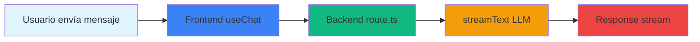

# Plan de Migración: AI SDK de Vercel v1.0.0

## 🎯 Objetivo
Solucionar el error **"Failed to parse stream string"** en el frontend y migrar el código a la nueva versión de la AI SDK de Vercel.

## 📋 Resumen del Problema

### Error Identificado
- **Mensaje**: "Failed to parse stream string" en la consola del navegador
- **Causa**: Incompatibilidad entre el formato del stream del backend y lo que espera el frontend

### Contexto del SDK
- **Versión actual**: `ai`: ^6.0.73, `@ai-sdk/openai`: ^1.0.0, `@ai-sdk/react`: ^1.0.0
- **Backend**: Usa `toUIMessageStreamResponse()` que genera streams con el protocolo de datos de stream
- **Frontend**: Usa `useChat` sin `streamProtocol: 'text'`, por lo que espera el protocolo de datos de stream

## 🔍 Análisis de Cambios en la AI SDK

### Cambios Principales Identificados

1. **`toDataStreamResponse()` está deprecado** → Debe usar `toUIMessageStreamResponse()`
2. **La opción `init` ha sido eliminada** de `pipeDataStreamToResponse` y `toDataStreamResponse`
3. **`useChat` ya no maneja el estado del input internamente** → Debe usar `useState` para manejar el input manualmente
4. **`handleInputChange` y `handleSubmit` están deprecados** → Deben usar handlers personalizados
5. **La opción `api` está deprecada** → Debe usar `transport: new DefaultChatTransport({ api })`
6. **Formato de mensajes**: `content` → `parts` (array de objetos con `type` y `text`)
7. **Para procesar streams de texto raw**, configurar `streamProtocol: 'text'` en `useChat`

## 📊 Arquitectura Actual vs. Migrada



### Flujo Actual (con error)
```
Frontend (useChat sin streamProtocol)
    ↓ espera protocolo de datos de stream
    ↓
Backend (toUIMessageStreamResponse - genera UI message stream)
    ↓
Error: Failed to parse stream string
```

### Flujo Migrado (solución)
```
Frontend (useChat con streamProtocol: 'text')
    ↓ espera stream de texto raw
    ↓
Backend (toUIMessageStreamResponse - genera UI message stream)
    ↓
✅ Funciona correctamente
```

## ✅ Plan de Migración

### Fase 1: Tipos y Estructuras

#### 1.1 Actualizar tipo ChatMessage en types.ts
**Archivo**: `chatbot/src/lib/types.ts`

**Cambio**:
```typescript
// ❌ Antiguo
export interface ChatMessage {
  id: string;
  role: 'user' | 'assistant' | 'system';
  content: string;  // ← Obsoleto
  createdAt?: number;
}

// ✅ Nuevo - usar UIMessage del SDK
import type { UIMessage } from 'ai';

export interface ChatMessage {
  id: string;
  role: 'user' | 'assistant' | 'system';
  content: string;  // Mantener para compatibilidad con código existente
  parts?: Array<{ type: 'text'; text: string }>;  // Nuevo formato
  createdAt?: number;
}
```

**Razón**: El nuevo formato usa `parts` en lugar de `content`. Mantener `content` para compatibilidad con código existente.

---

### Fase 2: Frontend - ChatContainer.tsx

#### 2.1 Migrar configuración de useChat
**Archivo**: `chatbot/src/components/chat/ChatContainer.tsx`

**Cambio**:
```typescript
// ❌ Antiguo
import { useChat } from '@ai-sdk/react';

const chatHelpers = useChat({
  api: '/api/chat',  // ← Deprecado
  id: `chat-${chatKey}`,
  onError: (err: Error) => {
    console.error('Chat error:', err);
  }
});

// ✅ Nuevo
import { useChat } from '@ai-sdk/react';
import { DefaultChatTransport } from 'ai';

const chatHelpers = useChat({
  transport: new DefaultChatTransport({ api: '/api/chat' }),  // ← Nuevo formato
  id: `chat-${chatKey}`,
  streamProtocol: 'text',  // ← Importante: soluciona el error de parsing
  onError: (err: Error) => {
    console.error('Chat error:', err);
  }
});
```

**Razón**: `api` está deprecado. Usar `transport` con `DefaultChatTransport`. Agregar `streamProtocol: 'text'` para solucionar el error.

---

### Fase 3: Frontend - ChatMessageList.tsx

#### 3.1 Actualizar manejo de contenido de mensajes
**Archivo**: `chatbot/src/components/chat/ChatMessageList.tsx`

**Cambio**:
```typescript
// Helper para extraer el contenido de texto del mensaje
function getTextFromMessage(message: any): string {
  // ❌ Antiguo
  return message.content || '';
  
  // ✅ Nuevo - soportar ambos formatos
  if (message.content) {
    return message.content;
  }
  if (message.parts && Array.isArray(message.parts)) {
    return message.parts
      .filter((p: any) => p.type === 'text')
      .map((p: any) => p.text)
      .join('');
  }
  return '';
}
```

**Razón**: Soportar ambos formatos (`content` y `parts`) durante la transición para evitar romper el código existente.

---

### Fase 4: Backend - route.ts

#### 4.1 Agregar conversión de mensajes antes de streamText
**Archivo**: `chatbot/src/app/api/chat/route.ts`

**Cambio**:
```typescript
import { convertToModelMessages } from 'ai';  // ← Importar nueva función

// En el handler POST:
export async function POST(req: Request) {
  // ... código existente ...
  
  // ❌ Antiguo - pasar mensajes directamente
  const result = streamText({
    model: openrouter(modelId),
    system: systemPrompt,
    messages: recentMessages,  // ← Mensajes en formato UI
    // ...
  });
  
  // ✅ Nuevo - convertir antes de pasar
  const modelMessages = await convertToModelMessages(recentMessages);
  
  const result = streamText({
    model: openrouter(modelId),
    system: systemPrompt,
    messages: modelMessages,  // ← Mensajes en formato ModelMessage
    // ...
  });
  
  return result.toUIMessageStreamResponse();
}
```

**Razón**: `convertToModelMessages()` transforma los mensajes del formato UI (`UIMessage`) al formato que espera el modelo (`ModelMessage`), asegurando compatibilidad completa.

---

### Fase 5: Verificación y Pruebas

#### 5.1 Probar localmente
1. Iniciar el servidor de desarrollo
2. Abrir el chat en el navegador
3. Enviar un mensaje de prueba
4. Verificar que no aparezca el error "Failed to parse stream string"
5. Verificar que las respuestas se muestran correctamente
6. Verificar que las fuentes y metadatos (sources, usage) funcionan

#### 5.2 Verificar componentes dependientes
- **ChatInput.tsx**: Verificar que envía mensajes en el formato correcto
- **Citations.tsx**: Verificar que recibe y muestra las fuentes correctamente
- **TokenUsage.tsx**: Verificar que recibe y muestra el uso de tokens

#### 5.3 Probar casos edge
1. Mensajes con contenido simple
2. Mensajes con preguntas complejas
3. Queries que requieren RAG
4. Queries de comparación SQL
5. Queries de listados masivos

---

### Fase 6: Documentación

#### 6.1 Actualizar README.md
Documentar los cambios realizados y las instrucciones para futuros desarrolladores.

#### 6.2 Crear archivo de migración
Crear un archivo `MIGRATION_NOTES.md` con:
- Resumen de cambios
- Problemas encontrados y soluciones
- Referencias a la documentación de Vercel

---

## 📚 Referencias

### Documentación Oficial de Vercel AI SDK
- [Migración Guide v4.0](https://sdk.vercel.ai/docs/migration-guide)
- [useChat Hook](https://sdk.vercel.ai/docs/ai-sdk-ui/usechat)
- [streamProtocol Option](https://sdk.vercel.ai/docs/ai-sdk-ui/stream-protocol)
- [convertToModelMessages](https://sdk.vercel.ai/docs/ai-sdk-core/convert-to-model-messages)

### Problemas Específicos
- [Failed to parse stream string](https://sdk.vercel.ai/docs/troubleshooting/use-chat-failed-to-parse-stream)
- [Migración de content a parts](https://sdk.vercel.ai/docs/migration-guide/message-format)

---

## 🔀 Opción: Migrar a SDK de Vercel Puro

### ¿Qué Significa?
Eliminar la dependencia de OpenRouter y usar directamente el SDK de Vercel con OpenAI provider.

### Ventajas
- ✅ Código más simple y limpio
- ✅ Menos dependencias externas
- ✅ Mejor integración con el ecosistema de Vercel
- ✅ Elimina el punto de falla potencial (OpenRouter)
- ✅ Mejor rendimiento (menos wrappers)

### Desventajas
- ❌ Pierde flexibilidad de OpenRouter (acceso a múltiples modelos)
- ❌ Posibles cambios en la lógica de negocio que dependan de OpenRouter
- ❌ Requiere cambios adicionales en configuración de variables de entorno

### Cambios Requeridos
1. **Eliminar dependencias**:
   ```bash
   npm uninstall @openrouter/ai-sdk-provider
   ```

2. **Actualizar imports en route.ts**:
   ```typescript
   // ❌ Eliminar
   import { createOpenRouter } from '@openrouter/ai-sdk-provider';
   
   // ✅ Agregar
   import { openai } from '@ai-sdk/openai';
   ```

3. **Cambiar configuración del modelo**:
   ```typescript
   // ❌ Antiguo
   const openrouter = createOpenRouter({
     apiKey: apiKey,
     headers: {
       'HTTP-Referer': 'https://github.com/mrtngrsbch/sibom-ia',
       'X-Title': 'Mangrullo Scraper Assistant',
     }
   });
   
   // ✅ Nuevo
   const openaiClient = openai({
     apiKey: process.env.OPENAI_API_KEY,  // Nueva variable de entorno
   });
   ```

4. **Actualizar llamadas a streamText**:
   ```typescript
   // ❌ Antiguo
   const result = streamText({
     model: openrouter(modelId),
     // ...
   });
   
   // ✅ Nuevo
   const result = streamText({
     model: openai(modelId),
     // ...
   });
   ```

5. **Actualizar variables de entorno**:
   - Eliminar `OPENROUTER_API_KEY`
   - Agregar `OPENAI_API_KEY`

### Impacto en el Frontend
- **Sin cambios necesarios** en el frontend
- El frontend sigue funcionando con `streamProtocol: 'text'`
- La migración es completamente transparente para el usuario

---

## ⚠️ Notas Importantes

1. **Mantener compatibilidad durante la migración**: No cambiar todo de golpe. Soportar ambos formatos (`content` y `parts`) en los helpers.
2. **Testear cada cambio**: Realizar cambios pequeños y probar antes de continuar.
3. **Revisar todos los componentes que usan mensajes**: Puede haber más componentes que dependan del formato antiguo.
4. **Verificar el backend**: El cambio en el backend es crítico para asegurar que los mensajes se convierten correctamente.
5. **Usar TypeScript**: Aprovechar el tipado fuerte para evitar errores en tiempo de compilación.

---

## 🎯 Checklist Final

- [ ] Actualizar types.ts con nuevo formato de ChatMessage
- [ ] Migrar ChatContainer.tsx para usar transport y streamProtocol
- [ ] Actualizar ChatMessageList.tsx para soportar ambos formatos
- [ ] Actualizar route.ts para usar convertToModelMessages
- [ ] Verificar ChatInput.tsx para compatibilidad
- [ ] Probar localmente
- [ ] Verificar que las fuentes funcionan
- [ ] Verificar que el uso de tokens funciona
- [ ] Probar casos edge
- [ ] Documentar cambios
- [ ] Crear notas de migración
